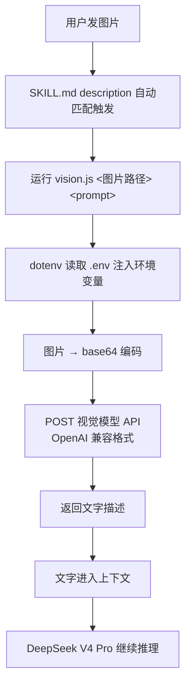
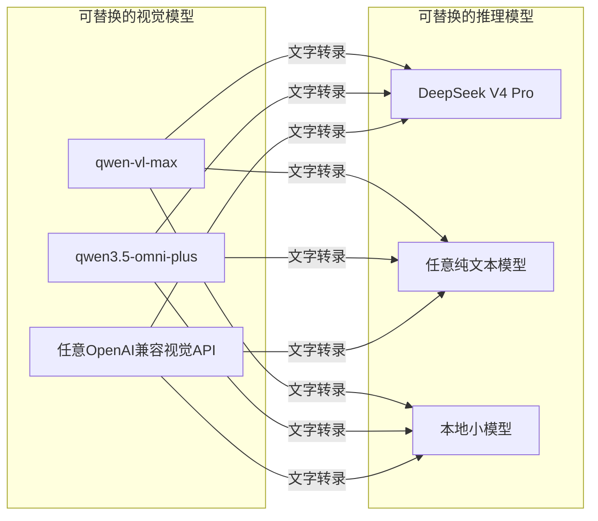

# 01 视觉转录架构

> 对应事实：F-006~F-012、F-024~F-027
> 核验状态：✅ 仓库与模型均核实

## 核心思路

> 文本模型看不见图，那就找一个看得见的——先把图片发给一个支持视觉的模型，让它把图片内容转录成文字描述，再把这段文字交回给文本模型继续推理。

对文本模型来说，它只是多收到了一段上下文，但实际效果就等于"看图"了。

这是一种经典的**能力代理（capability proxy）**模式：用一个外部工具弥补主模型的能力缺口，对主模型透明。

## 完整链路

关键分工：

| 角色 | 执行者 | 职责 |
|------|--------|------|
| 触发 | SKILL.md description | Claude 根据上下文自动匹配 |
| 编排 | vision.js（Node.js） | 读图、编码、调API、回传 |
| 看图 | 视觉模型（qwen-vl-max） | 图片→文字转录 |
| 推理 | 文本模型（DeepSeek V4 Pro） | 基于文字描述继续分析 |

> 真正"看图"的是视觉模型，DeepSeek 拿到的是文字转录结果。认得准不准、快不快、花多少钱，都取决于前面这个视觉模型。

## 视觉模型选型

博文使用阿里云百炼的两个模型：

| 模型 | 模态 | 快照 | 输入价格（参考） | 适用 |
|------|------|------|------------------|------|
| qwen-vl-max | Text/Image/Video → Text | qwen-vl-max-2025-08-13 | 输入 1.6 元/百万 token | 纯看图，性价比高 |
| qwen3.5-omni-plus | Text/Image/Video/Audio → Text/Audio | qwen3.5-omni-plus-2026-03-15 | 输入 7 元/百万 token | 全模态，看图大材小用 |

> ⚠️ **成本提示**：qwen3.5-omni-plus 看图成本约为 qwen-vl-max 的 **4 倍**，纯图片识别场景建议用 qwen-vl-max。博文未提示此差异。

**API 接入**：

- 端点：`https://dashscope.aliyuncs.com/compatible-mode/v1`（百炼 OpenAI 兼容接口）
- 认证：`DASHSCOPE_API_KEY`（百炼控制台申请）
- 免费额度：新用户每模型 100 万 Token，开通后 180 天内有效

由于走 OpenAI 兼容格式，vision.js 也可以换成任何兼容 OpenAI 视觉接口的模型服务（只需改 .env 的 BASE_URL 和 MODEL）。

## 架构的可迁移性

这个模式不限于 DeepSeek + qwen 的组合：

同类思路也出现在其他场景：

| 能力缺口 | 代理方案 |
|----------|----------|
| 文本模型不能看图 | vision-skill 转录（本项目） |
| 模型不能联网 | 搜索工具返回文本 |
| 模型不能执行代码 | sandbox 执行返回结果 |
| 模型不能访问私有数据 | RAG 检索返回文本片段 |

共同模式：**外部工具将非文本世界"翻译"成文本上下文**。
