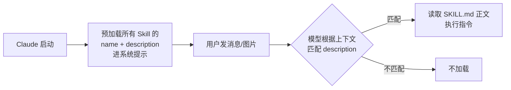

# 02 Claude Code Skill 自动触发机制

> 对应事实：F-013~F-017
> 核验状态：✅ Anthropic 官方 Agent Skills 标准确认

## Skill 是什么

claude-vision-skill 是一个标准的 **Claude Code Skill**。Skill 是 Anthropic 于 2025-10-16 公布的 Agent Skills 开放标准：把可复用的能力打包成一个目录，模型在需要时**自动**调用，无需用户手动敲命令。

## 存放位置

| 级别 | 路径 | 作用范围 |
|------|------|----------|
| 用户级（全局） | `~/.claude/skills/<skill-name>/` | 当前用户所有项目 |
| 项目级 | `<project>/.claude/skills/<skill-name>/` | 仅该项目 |

博文采用用户级安装（`~/.claude/skills/claude-vision-skill/`），配置一次全局可用。

## 自动触发原理

Skill 是 **model-invoked（模型调用）** 而非 user-invoked：



关键点：

1. 启动时只有 name 和 description 进入上下文（节省 token）
2. 模型根据请求内容**自行判断**是否需要某个 Skill
3. 决定使用后才读取 SKILL.md 完整指令
4. 无需斜杠命令、无需手动触发

> 装好之后什么都不用做，在 Claude Code 会话里直接发图片就行——本地路径、粘贴截图、图片 URL 都支持。

## SKILL.md 规范

每个 Skill 的核心是 `SKILL.md`，必须以 YAML frontmatter 开头：

```yaml
---
name: claude-vision-skill          # ≤64 字符
description: 做什么 + 何时用        # ≤1024 字符，触发匹配的关键
---

# 具体指令（模型决定使用后读取）
```

description 写得好不好直接决定触发准确率——需要说明"这个 Skill 做什么"以及"什么情况下该用它"。

## ⚠️ 本项目的两个安装坑（核验确认）

### 坑1：硬编码的他人路径

仓库 SKILL.md 中写死了作者同事的机器路径，共 **3 处**（本地路径 / `--url` / `--clipboard` 三种场景）：

```
/Users/wwu/.codex/skills/claude-vision-skill/vision.js
```

- 这是 macOS 路径 + Codex 目录（非 `~/.claude/skills/`）
- 最近提交者为 waynewu411，非仓库作者 asuojun 本人
- **必须替换为本机绝对路径**，否则触发后找不到脚本

### 坑2：dotenv 静默失败

vision.js 加载 .env 的代码包在 try/catch 里：

```js
try { require("dotenv").config(); } catch {}
```

后果：

- 没装 dotenv → **不会报任何错**
- .env 完全不生效
- API Key 静默退回代码里的默认值 `sk-xxx`
- 请求失败时现象诡异，难以定位

**必须执行**：

```bash
cd ~/.claude/skills/claude-vision-skill
npm install dotenv
```

博文称这是"最容易踩的坑"。

## 仓库的两种安装方式

核验发现仓库 README 实际主推两种场景：

| 方式 | 做法 | 适合 |
|------|------|------|
| 场景A（README主推） | vision.js 拷到**项目根目录** + 合并 CLAUDE.md | 单项目使用 |
| 场景B（博文采用） | 放 `~/.claude/skills/` 全局安装 | 所有项目通用 |

两者都可行；博文的全局方式更符合"配置一次全局可用"的定位。

## 相关知识包

- [anthropics-skills](../../anthropics-skills/index.md) — Anthropic 官方 Skills 生态
- [book-to-skill](../../book-to-skill/index.md) — 书籍转 Skill 的方法论
