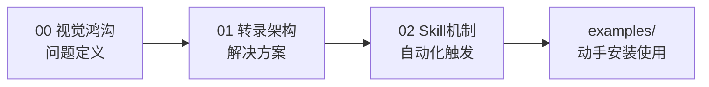

# 概念学习路径

本知识包包含 3 篇概念文档，从问题定义到架构原理再到 Skill 机制。

## 学习路径

| 顺序 | 文档 | 核心内容 | 预计阅读 |
|------|------|----------|----------|
| 1 | [00 纯文本模型的视觉鸿沟](00-problem-vision-gap.md) | [Unsupported Image] 现象、DeepSeek 视觉支持现状 | 5 min |
| 2 | [01 视觉转录架构](01-transcription-architecture.md) | 中转原理、完整链路、模型选型与成本 | 7 min |
| 3 | [02 Skill 自动触发机制](02-skill-mechanism.md) | SKILL.md frontmatter、model-invoked 机制 | 5 min |

## 路径图



阅读完概念层后，进入 [examples/](../examples/index.md) 动手实践。

```{toctree}
:hidden:

00-problem-vision-gap
01-transcription-architecture
02-skill-mechanism
```
