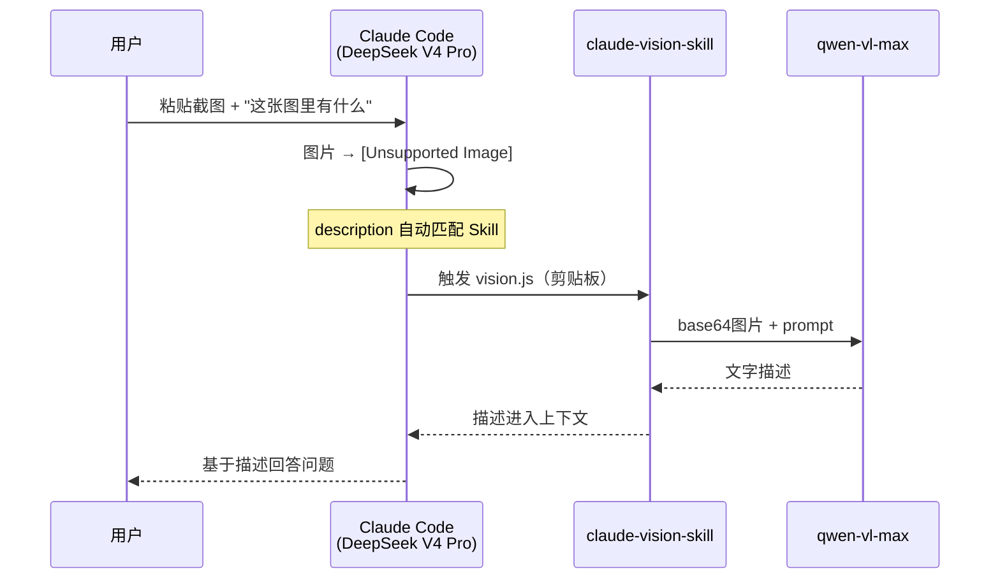

# 示例 01：三场景实战与回退逻辑

> 对应事实：F-028~F-034
> 前置：已完成 [安装配置](00-install-and-config.md)

## 场景一：自动触发（推荐）

装好后什么都不用做，在 Claude Code 会话里**直接发图片**即可：

- 提供本地图片路径
- 粘贴/拖入截图
- 给一个图片 URL

SKILL.md 的 description 自动匹配 → 运行 vision.js → 视觉模型转录 → 文字描述进入上下文 → DeepSeek V4 Pro 接着分析。

### 博文案例：mall-swarm 架构图

作者将 mall-swarm 微服务电商项目的架构图复制粘贴到 Claude Code，问"这张图片里有什么"。原本只能看到 [Unsupported Image] 的 DeepSeek V4 Pro，借助 Skill 成功认出了架构图内容并进行分析。

（mall-swarm 为作者 macrozheng 的开源微服务商城项目，Spring Cloud Alibaba 技术栈，11k+ star。）

## 场景二：手动命令

需要精确控制时可手动调用 vision.js。三种输入方式：

### 本地图片

```bash
node ~/.claude/skills/claude-vision-skill/vision.js "C:/path/to/image.png" "请描述这张图片"
```

### 网络图片（--url）

```bash
node ~/.claude/skills/claude-vision-skill/vision.js --url "https://example.com/image.png" "请描述这张图片"
```

### 剪贴板（--clipboard）

```bash
node ~/.claude/skills/claude-vision-skill/vision.js --clipboard "请描述这张图片"
```

> Windows 下剪贴板读取使用仓库附带的 `clipboard.ps1`（macOS 对应 `clipboard.swift`）。

prompt 部分可自定义，例如：

```bash
node vision.js "arch.png" "列出图中所有微服务模块及其依赖关系"
node vision.js --clipboard "这张报错截图的错误原因是什么"
```

## 场景三：回退逻辑（Fallback）

vision.js 内置了方便的回退机制：

| 输入情况 | 行为 |
|----------|------|
| 给了本地路径但文件不存在 | 自动回退读**剪贴板** |
| 完全没给路径和 URL | 自动尝试**剪贴板** |
| 加 `--no-fallback` 参数 | 关闭回退，直接报错 |

示例：

```bash
# 截图在剪贴板中，即使误给了路径也能回退成功
node vision.js "not-exist.png" "描述图片"
# → 文件不存在，自动读剪贴板

# 严格模式：路径不对就报错（便于排查）
node vision.js "not-exist.png" "描述图片" --no-fallback
# → 直接报错退出
```

这个设计契合"截图后直接问"的高频工作流——复制截图后无需保存文件，直接走剪贴板。

## 典型工作流



## 效果与边界

**适合**：

- 报错截图排查、架构图理解、UI 稿还原、白板/文档照片整理
- 任何"图片→文字→推理"链路

**注意**：

- 识别准确度取决于视觉模型（qwen-vl-max 对中文图表、架构图表现良好）
- 每次识图消耗视觉模型 token（qwen-vl-max 输入 1.6 元/百万 token，日常截图成本极低）
- 百炼免费额度每模型 100 万 Token、180 天内有效
- 若已换用 DeepSeek 官方视觉模型 deepseek-v4-flash-vision-exp，可评估是否仍需中转（见 [概念00](../concepts/00-problem-vision-gap.md) 的方案对比）
