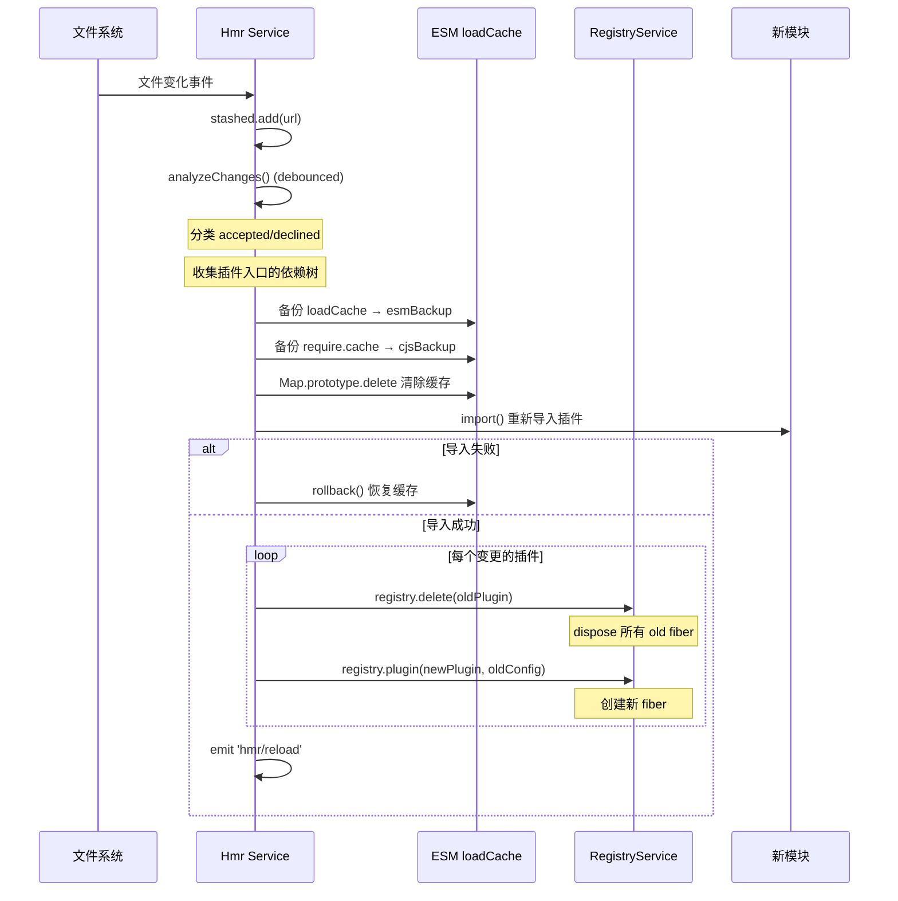
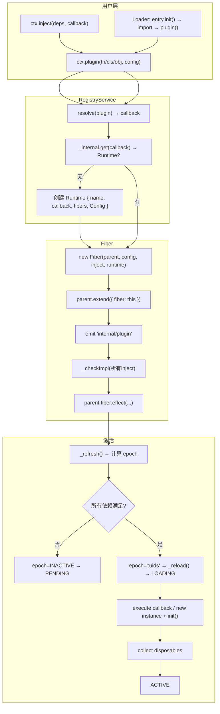

# 插件模块系统

Cordis 的插件系统是其"元框架"定位的核心体现。插件是 Cordis 应用的基本组成单元——所有功能（包括框架内置服务）都以插件形式存在。Cordis 支持三种插件形态（函数、类、对象），通过 Loader 服务实现 ESM 模块的动态加载，通过 EntryTree 管理配置驱动的插件树，通过 Group 实现插件组合，并通过 HMR 服务实现热模块替换。

## 设计原理

Cordis 插件系统的设计目标是实现**时空可组合性**（Spatiotemporal Composability）：

1. **时间维度**：插件可以在运行时动态安装、卸载、重载、热更新，无需重启进程。
2. **空间维度**：插件通过 Context 的原型链继承和 isolate 机制实现层次化组合，不同分支的插件互不干扰。
3. **配置驱动**：Loader 将 YAML/JSON 配置文件映射为插件树（EntryTree），配置变更自动触发插件的增删改。
4. **统一抽象**：无论是内置服务、NPM 包、本地文件还是配置分组，都遵循同一 Plugin 契约。

## Plugin 三形态

registry.ts:L63-L100

Cordis 插件有三种等价的定义形式，都实现了 `Plugin.Base` 接口：

```typescript
export type Plugin<T = any> = Plugin.Function<T> | Plugin.Constructor<T> | Plugin.Object<T>

export namespace Plugin {
  export interface Base<T = any> {
    name?: string                          // 插件名称
    Config?: StandardSchemaV1<any, T>      // 配置 Schema（@standard-schema）
    inject?: Inject                        // 依赖声明
    provide?: string | string[]            // 提供的服务名
    intercept?: Dict<boolean>              // 配置拦截声明
  }

  export interface Function<T> extends Base<T> {
    (ctx: Context, config: T): any         // 函数式：直接调用
  }

  export interface Constructor<T> extends Base<T> {
    new (ctx: Context, config: T): any     // 类式：new 实例化
  }

  export interface Object<T> extends Base<T> {
    apply(ctx: Context, config: T): any    // 对象式：调用 apply 方法
  }
}
```

### 形态一：函数式插件

最简单的插件形式，接收 Context 和配置，返回 Effect（清理函数）：

```typescript
// 函数式插件
const myPlugin = (ctx: Context, config: MyConfig) => {
  ctx.logger.info('plugin loaded')
  ctx.on('message', callback)

  // 返回清理函数
  return () => {
    ctx.logger.info('plugin unloaded')
  }
}
myPlugin.name = 'my-plugin'
myPlugin.Config = z.object({ ... })
myPlugin.inject = ['database']

ctx.plugin(myPlugin, { ... })
```

函数式插件的执行逻辑（Fiber 构造函数中）：

```typescript
// fiber.ts:L157-L159
} else {
  return runtime.callback(this.ctx, this.config)
}
```

### 形态二：类式插件

类式插件支持完整的生命周期钩子和 `@Inject` 方法装饰器：

```typescript
@Inject('database')
class MyPlugin extends Service {
  static inject = ['timer']
  static Config = z.object({ ... })

  constructor(ctx: Context, config: MyConfig) {
    super(ctx, 'myPlugin')
    // 构造函数中 this.ctx.database 和 this.ctx.timer 不一定可用！
  }

  async [Service.init]() {
    // 此时所有 inject 依赖已满足
    const conn = await this.ctx.database.connect()
    this.ctx.logger.info('connected')

    return () => {
      conn.close()
    }
  }

  @Inject('logger')
  log(message: string) {
    // @Inject 方法装饰器：调用时确保 logger 可用
    this.ctx.logger.info(message)
  }
}

ctx.plugin(MyPlugin, { ... })
```

类式插件的执行逻辑：

```typescript
// fiber.ts:L150-L156
if (isConstructor(runtime.callback)) {
  const instance = new runtime.callback(this.ctx, this.config)
  for (const hook of instance?.[symbols.initHooks] ?? []) {
    hook()  // 执行 @Inject 方法装饰器注册的初始化钩子
  }
  return instance?.[symbols.init]?.()  // 调用生命周期钩子
}
```

执行顺序：
1. `new` 实例化（构造函数执行，此时依赖可能未就绪）
2. 执行 `initHooks`（@Inject 方法装饰器注册的回调）
3. 调用 `[Service.init]()` 生命周期方法
4. 返回值作为 Effect 处理

### 形态三：对象式插件

对象式插件通过 `apply` 方法定义入口，是函数式插件的超集：

```typescript
const myPlugin = {
  name: 'my-plugin',
  Config: z.object({ ... }),
  inject: ['database'],
  apply(ctx: Context, config: MyConfig) {
    ctx.logger.info('plugin loaded')
    return () => ctx.logger.info('plugin unloaded')
  }
}

ctx.plugin(myPlugin, { ... })
```

对象式插件的解析：

```typescript
// registry.ts:L7-L9
function isApplicable(object: Plugin) {
  return object && typeof object === 'object' && typeof object.apply === 'function'
}

// registry.ts:L144-L149
resolve(plugin: Plugin): Function | undefined {
  try {
    if (typeof plugin === 'function') return plugin
    if (isApplicable(plugin)) return plugin.apply
  } catch {}
}
```

### inject() — 依赖注入简写

registry.ts:L189-L191

```typescript
inject(inject: Inject, callback: Plugin.Function<void>) {
  return this.plugin({ inject, apply: callback, name: callback.name })
}
```

`ctx.inject()` 是对象式插件的语法糖，用于声明依赖后立即执行回调：

```typescript
ctx.inject(['database', 'timer'], (ctx) => {
  // database 和 timer 均可用时才执行
  ctx.database.query(...)
})
```

## Loader 模块加载器

loader/index.ts:L47-L164

Loader 是一个 Service（name='loader'），负责从文件系统动态加载 ESM 插件模块。它继承 EntryTree，管理配置驱动的插件树。

```typescript
export class Loader extends EntryTree {
  public internal = ModuleLoader.fromInternal()
  public builtins: Dict<any> = Object.create(null)
  public name = 'loader'

  constructor(ctx: Context, public config: Loader.Config = {}) {
    super(ctx)
    // ...
    ctx.reflect.provide('loader', this, this[Service.check])
    ctx.plugin(isolate)
  }
}
```

### Node.js ESM Loader 内部 API

loader/internal.ts

Loader 通过 `ModuleLoader.fromInternal()` 获取 Node.js 内部 ESM 加载器（需要 `--expose-internals` 标志），兼容两个版本：

- **v1（Node 22/23）**：直接使用 `this.internal.import(specifier, parentURL, attrs)`
- **v2（Node 24+）**：使用 `this.internal.resolveSync(parentURL, { specifier, attributes })` + 新 API

这使得 Loader 可以访问 Node.js 的 `loadCache`（模块缓存 Map），为 HMR 热更新提供了基础。

### cordis: 协议

loader/config/tree.ts:L103-L106

```typescript
import(name: string, getOuterStack?) {
  if (name.startsWith('cordis:')) {
    return this.ctx.loader.builtins[name.slice(7)]
  }
  // ... 正常 ESM import
}
```

Loader 定义了 `cordis:` 内置模块协议：`import('cordis:xxx')` 从 `loader.builtins` 字典中获取模块，不经过文件系统。这允许框架注入内置模块。

### unwrapExports — 模块导出处理

loader/index.ts:L156-L163

```typescript
unwrapExports(exports: any) {
  if (isNullable(exports)) return exports
  exports = exports.default ?? exports
  if (!exports.__esModule) return exports
  return exports.default ?? exports
}
```

ESM 模块的 default 导出处理：优先取 `.default`，如果是 `__esModule`（esbuild 的 interop 标记）则再取 `.default`。

## EntryTree 配置树

loader/config/tree.ts:L6-L123

EntryTree 是 Loader 的核心抽象，管理一棵以 `:` 分隔的层级 ID 配置树。

```typescript
export abstract class EntryTree {
  static readonly sep = ':'
  public ctx: Context
  public root: EntryGroup
  public store: Dict<Entry> = Object.create(null)
  // ...
}
```

### 层级 ID 体系

Entry 使用以 `:` 为分隔符的层级 ID（如 `parent:child:grandchild`），支持嵌套的插件分组：

```
root
├── group:database     (Group 分组)
│   ├── mysql          (Entry: mysql 插件)
│   └── redis          (Entry: redis 插件)
├── server             (Entry: HTTP 服务器)
└── plugins            (Entry: 插件配置文件 include)
    └── chat           (Entry: 聊天插件)
```

### Entry 配置条目

loader/config/entry.ts:L34-L172

```typescript
export interface EntryOptions {
  id: string           // 唯一 ID
  name: string         // 插件名（模块路径或 NPM 包名）
  config?: any         // 插件配置
  group?: boolean | null    // 是否为分组
  disabled?: boolean | null // 是否禁用
  inject?: Inject | null    // Entry 级别的依赖注入
}

export class Entry {
  static readonly key = Symbol.for('cordis.entry')
  public ctx: Context
  public fiber?: Fiber
  public parent!: EntryGroup
  public options = {} as EntryOptions
  public subgroup?: EntryGroup
  public subtree?: EntryTree
}
```

Entry 的初始化流程：

```typescript
private async _init() {
  // 1. 动态 import 模块
  exports = await this.parent.tree.import(this.options.name, this.getOuterStack)
  // 2. 处理 default/__esModule 导出
  const plugin = this.loader.unwrapExports(exports)
  // 3. patch context（isolate 配置等）
  this._patchContext([])
  // 4. 注册插件，创建 Fiber
  this.fiber = this.ctx.registry.plugin(plugin, this._resolveConfig(plugin), this.getOuterStack)
}
```

### EntryGroup 分组

loader/config/group.ts:L5-L71

```typescript
export class EntryGroup {
  static readonly key = Symbol.for('cordis.group')
  public data: EntryOptions[] = []

  async create(options) { ... }
  unlink(options) { ... }
  remove(id, isDispose?) { ... }
  async update(config: EntryOptions[]) { ... }  // 配置 diff 与增量更新
  stop() { ... }
}
```

EntryGroup 管理一组 Entry 的配置数组，支持增量更新（create/update/remove）。

### Group 插件（Bundle 组合）

loader/config/group.ts:L73-L88

```typescript
export class Group extends EntryGroup {
  static readonly [EntryGroup.key] = true

  constructor(public ctx: Context, public config: EntryOptions[]) {
    super(ctx, ctx.fiber.entry!.parent.tree)
    ctx.on('internal/update', (config) => {
      this.update(config)  // 响应 internal/update 事件
    })
  }

  async* [Service.init]() {
    yield () => this.stop()
    await this.update(this.config)
  }
}
```

Group 本身就是一个插件——它是一个 EntryGroup，通过 `internal/update` 事件响应配置变化，实现插件的组合（Bundle）。一个 Group 插件的 config 是 `EntryOptions[]`，每个条目作为子插件注册。

使用示例：

```typescript
// 定义一个 Bundle
const databaseBundle = Group
databaseBundle.Config = z.array(z.object({
  id: z.string(),
  name: z.string(),
  config: z.any(),
}))

// 使用
ctx.plugin(databaseBundle, [
  { id: 'mysql', name: '@cordisjs/mysql', config: { host: 'localhost' } },
  { id: 'redis', name: '@cordisjs/redis', config: { host: 'localhost' } },
])
```

### Realm 隔离机制

loader/config/isolate.ts

Loader 通过 Realm 机制实现配置驱动的服务隔离：

- **LocalRealm**：`#entryId` 后缀，每个 Entry 完全独立的服务实例
- **GlobalRealm**：`@label` 后缀，相同 label 的 Entry 共享同一服务实例

在 `loader/patch-context` 事件中生成 isolate map 并触发服务重新绑定。

## HMR 热模块替换

hmr/index.ts

HMR 是一个 Service（name='hmr'），通过 `@Inject('loader')` 和 `@Inject('timer')` 注入依赖，使用 chokidar 监听文件变化，实现不重启进程的插件热重载。

```typescript
@Inject('loader')
@Inject('timer')
class Hmr extends Service {
  private watcher!: FSWatcher
  private externals!: Set<string>   // 框架自身代码（全进程退出）
  private accepted!: Set<string>   // 需要热重载的文件
  private declined!: Set<string>   // 不热重载的文件
  private stashed = new Set<string>()
}
```

### 三种文件变更类型

hmr/index.ts:L127-L152

```typescript
this.watcher.on('change', async (path) => {
  const url = pathToFileURL(filename).href

  // 1. 框架自身代码变化 → 全进程退出
  if (this.externals.has(url)) return loader.exit()

  // 2. ESM loadCache 中的模块 → 部分热重载
  if (loader.internal!.loadCache.has(url)) {
    this.stashed.add(url)
    return partialReload()
  }

  // 3. Loader 配置文件（如 cordis.yml）→ include.refresh()
  for (const entry of this.ctx.loader.entries()) {
    if (entry.subtree?.filename === filename) {
      await entry.subtree.refresh()
      return
    }
  }

  // 其他文件变化 → hmr/change 事件
  this.ctx.emit('hmr/change', url)
})
```

### 部分热重载流程

hmr/index.ts:L229-L378



关键步骤：
1. **analyzeChanges()**：从 stashed 文件出发，沿 ESM 依赖图（linked 属性）向上/向下传播，标记 accepted（需要重载）和 declined（不需要重载）
2. **缓存备份**：备份 ESM loadCache 和 CJS require.cache
3. **清除缓存**：使用 `Map.prototype.delete.call(loadCache, url)` 确保 Node 22/24 兼容
4. **重新导入**：动态 import() 获取新模块
5. **替换插件**：`registry.delete(oldPlugin)` → `registry.plugin(newPlugin, oldConfig)`
6. **失败回滚**：恢复缓存并重新注册旧插件

### 错误处理与回滚

```typescript
const rollback = () => {
  for (const filename in esmBackup) {
    Map.prototype.set.call(this.internal.loadCache, filename, esmBackup[filename])
  }
  for (const filepath in cjsBackup) {
    require.cache[filepath] = cjsBackup[filepath]
  }
}

try {
  // 重新导入...
} catch (e) {
  handleError(this.ctx, e)
  return rollback()  // 导入失败，恢复缓存
}
```

## 插件注册流程总览



## 类型签名汇总

```typescript
// Plugin 三形态
type Plugin<T = any> = Plugin.Function<T> | Plugin.Constructor<T> | Plugin.Object<T>

// Plugin 可选属性
interface Plugin.Base<T> {
  name?: string
  Config?: StandardSchemaV1<any, T>
  inject?: Inject
  provide?: string | string[]
  intercept?: Dict<boolean>
}

// RegistryService.plugin() 返回值
type PluginResult = Fiber & PromiseLike<Fiber>

// EntryOptions
interface EntryOptions {
  id: string
  name: string
  config?: any
  group?: boolean | null
  disabled?: boolean | null
  inject?: Inject | null
}

// Loader 事件
interface Events {
  'exit'(signal: NodeJS.Signals): Promise<void>
  'loader/config-update'(): void
  'loader/entry-init'(entry: Entry): void
  'loader/partial-dispose'(entry: Entry, legacy: Partial<EntryOptions>, active: boolean): void
  'loader/patch-context'(entry: Entry, next: () => void): void
  'hmr/change'(url: string): void
  'hmr/reload'(reloads: Map<Plugin, Reload>): void
}
```

## 源码引用

| 文件 | 内容 |
|------|------|
| registry.ts | Plugin 三形态类型定义、RegistryService.plugin/inject/resolve |
| fiber.ts | Fiber 构造函数中函数/类插件的执行分支、[Service.init] 钩子调用 |
| service.ts | Service 基类、类式插件的基类 |
| loader/index.ts | Loader 主类、unwrapExports、internal/update 处理 |
| loader/config/tree.ts | EntryTree 抽象类、层级 ID、import/cordis: 协议 |
| loader/config/entry.ts | Entry 配置条目、动态 import、fiber 创建 |
| loader/config/group.ts | EntryGroup 管理、Group 插件（Bundle 组合） |
| loader/config/isolate.ts | LocalRealm/GlobalRealm 隔离机制 |
| loader/internal.ts | Node.js ESM ModuleLoader 封装 |
| hmr/index.ts | Hmr Service、chokidar 监听、analyzeChanges、partialReload、缓存备份/回滚 |
