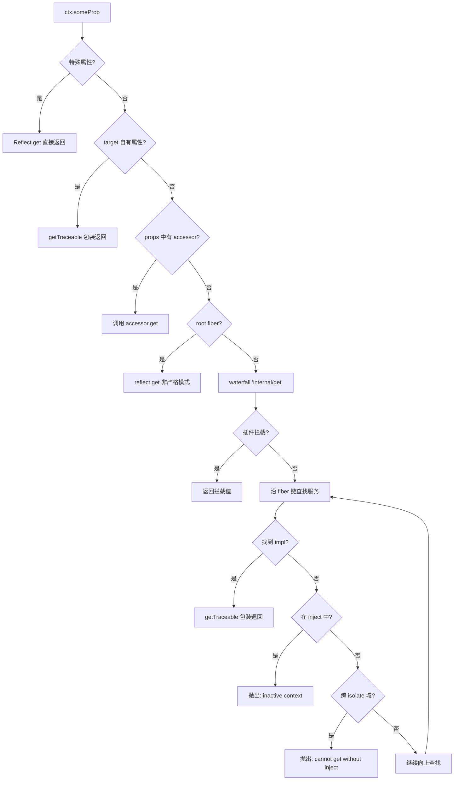

# Reflect 元数据系统

ReflectService 是 Cordis 的元编程核心，承担了三个关键职责：**Context 的 Proxy handler**（拦截所有属性访问）、**服务注册表**（provide/accessor/mixin 声明机制）、**Traceable 对象追踪**（确保跨插件调用时 ctx 正确传播）。它是 Context Proxy 的实际引擎——所有通过 Context 的属性 get/set/has 操作都由 ReflectService.handler 处理。

## 设计原理

传统 DI 容器通过显式 API（如 `container.get('serviceName')`）获取服务，这导致代码与容器耦合且缺乏类型安全。Cordis 的 Reflect 系统通过 ES6 Proxy 实现了**透明的属性拦截**：

1. **透明访问**：`ctx.database` 自动触发服务查找，无需显式调用 `ctx.get('database')`
2. **声明式扩展**：服务通过 `provide()` 声明、计算属性通过 `accessor()` 声明、方法通过 `mixin()` 混入
3. **追踪代理**：通过 Tracker 配置，服务对象自动包装为 traceable proxy，确保方法调用时 `this.ctx` 指向正确的 Context
4. **Shadow 机制**：服务方法中访问 `this.ctx` 时自动创建 shadow context，保证服务看到的是注册时的 ctx 而非调用方 ctx

## ReflectService.handler — Proxy 拦截器

reflect.ts:L62-L133

`ReflectService.handler` 是 Context Proxy 的核心，拦截 get、set、has 三种操作。

### 特殊属性过滤

```typescript
const RESERVED_WORDS = ['prototype', 'then']

function isSpecialProperty(prop: string | symbol): prop is symbol {
  return typeof prop === 'symbol'           // symbol 属性直接透传
    || RESERVED_WORDS.includes(prop)         // 保留字（prototype、then）
    || parseInt(prop).toString() === prop    // 数字字符串（数组索引）
    || prop.startsWith('_')                  // 下划线开头的内部属性
}
```

以下属性不走服务查找逻辑，直接通过原生 Reflect 访问：
- Symbol 属性（包括 Context.effect/filter/isolate/intercept 等内部 symbol）
- `prototype`、`then`（避免 Promise 检测误触发）
- 数字字符串 `"0"`, `"1"` 等
- 下划线开头的私有属性 `_hooks`、`_disposables` 等

### get 拦截器

```typescript
get: (target, prop, ctx: Context) => {
  if (isSpecialProperty(prop)) {
    return Reflect.get(target, prop, ctx)
  }
  if (Reflect.has(target, prop)) {
    return getTraceable(ctx, Reflect.get(target, prop, ctx))
  }

  const error = new Error(`cannot get property "${prop}" without inject`)

  try {
    const def = target.reflect.props[prop]
    if (def?.type === 'accessor') {
      // 1. accessor 计算属性
      return def.get.call(ctx, ctx[symbols.receiver], error)
    }

    if (!ctx.fiber.runtime) return ctx.reflect.get(prop, false)
    // 2. waterfall 模式派发 internal/get 事件，允许插件拦截
    return ctx.events.waterfall('internal/get', ctx, prop, error, () => {
      // 3. 默认行为：沿 fiber 链向上查找服务实现
      const key = target[symbols.isolate][prop]
      let fiber = (ctx[symbols.shadow] as Context ?? ctx).fiber
      while (true) {
        const impl = fiber.store?.[prop]
        if (impl) return getTraceable(ctx, impl.value)
        if (prop in fiber.inject) {
          error.message = `cannot get required service "${prop}" in inactive context`
          throw error
        }
        if (!fiber.runtime) throw error
        if (fiber.parent[symbols.isolate][prop] !== key) throw error
        fiber = fiber.parent.fiber
      }
    })
  } catch (e: any) {
    throw e === error ? enhanceError(e) : e
  }
}
```

get 查找顺序：



沿 fiber 链查找服务的逻辑是 Cordis 依赖注入的核心：从当前 fiber 开始，沿 `parent.fiber` 向上遍历，在每个 fiber 的 store 中查找服务实现。如果遇到 isolate 域变化或到达 root fiber 仍未找到，则抛出错误。

### set 拦截器

```typescript
set: (target, prop, value, ctx: Context) => {
  if (isSpecialProperty(prop)) {
    return Reflect.set(target, prop, value, ctx)
  }

  const error = new Error(`cannot set property "${prop}" without provide`)
  const def = target.reflect.props[prop]
  if (!def) {
    if (!ctx.fiber.runtime) return Reflect.set(target, prop, value, ctx)
    throw enhanceError(error)
  }

  try {
    if (def.type === 'accessor') {
      if (!def.set) return false
      return def.set.call(ctx, value, ctx[symbols.receiver], error)
    }

    return ctx.events.waterfall('internal/set', ctx, prop, value, error, () => {
      return ctx.reflect.set(prop, value, error)
    })
  } catch (e: any) {
    throw e === error ? enhanceError(e) : e
  }
}
```

set 规则：
- 特殊属性直接设置
- root fiber（runtime=null）可以直接设置未声明属性
- 插件 fiber 设置未声明属性抛错
- accessor 属性调用定义的 setter
- 服务属性通过 waterfall `internal/set` 事件可被拦截，最终调用 `reflect.set()`

### has 拦截器

```typescript
has: (target, prop) => {
  if (isSpecialProperty(prop)) {
    return Reflect.has(target, prop)
  }
  if (Reflect.has(target, prop)) return true
  return !!target.reflect.props[prop]
}
```

`prop in ctx` 对所有已声明的 service 和 accessor 返回 true。

## 服务声明：provide()

reflect.ts:L175-L203

`provide()` 在当前 fiber 上注册一个服务提供者，是 Service 构造函数的底层机制。

```typescript
provide(name: string, value?: any, check?: () => boolean) {
  return this.ctx.fiber.effect(() => {
    // 1. 声明属性类型为 service
    if (!this.props[name]) {
      this.props[name] ??= { type: 'service' }
    } else if (this.props[name].type !== 'service') {
      throw new Error(`property "${name}" is already declared as ${this.props[name].type}`)
    }
    this.props[name] = { type: 'service' }

    // 2. 在 root isolate map 中创建 symbol
    this.ctx.root[symbols.isolate][name] ??= Symbol(name)
    const key = this.ctx[symbols.isolate][name]

    // 3. 创建 Impl 并存入 store
    const impl: Impl = { name, value, fiber: this.ctx.fiber, check }
    if (this.store[key]) {
      throw new Error(`service "${name}" has been registered at <${this.store[key].fiber.name}>`)
    }
    this.store[key] = impl
    this.ctx.fiber.store![name] = impl

    // 4. fiber 已激活则立即通知
    if (this.ctx.fiber.state === FiberState.ACTIVE) {
      this.notify([name])
    }

    // 5. 返回 dispose 函数
    return async () => {
      delete this.store[key]
      const fibers = this.notify([name])
      await Promise.allSettled(fibers.map(fiber => fiber.await()))
      delete this.ctx.fiber.store![name]
    }
  }, `ctx.provide(${JSON.stringify(name)})`)
}
```

关键设计：
- provide 返回一个 effect（dispose 函数），fiber 销毁时自动注销服务
- 同一 isolate 域内同名服务只能注册一次（重复注册抛错）
- 服务注册后通过 `notify()` 通知所有依赖该服务的 fiber 刷新
- 服务注销后同样通知依赖 fiber，触发它们进入 PENDING 状态

### Impl 结构

```typescript
export interface Impl {
  name: string          // 服务名
  fiber: Fiber          // 提供该服务的 Fiber
  value?: any           // 服务实例
  check?: () => boolean // 可用性检查函数
}
```

### store 存储结构

`reflect.store` 以 **isolate symbol** 为键（而非字符串名），实现了同一服务名在不同 isolate 域中的独立存储：

```typescript
// root isolate map: { database: Symbol('database') }
// ctx.isolate('database') 后: { database: Symbol('database')_1 }

store = {
  [Symbol('database')]: { name: 'database', fiber: rootFiber, value: dbService, check: ... },
  [Symbol('database')_1]: { name: 'database', fiber: pluginFiber, value: isolatedDb, check: ... },
}
```

### props 属性声明表

`reflect.props` 记录所有通过 `provide()` 或 `accessor()` 声明的属性：

```typescript
export type Property = Property.Service | Property.Accessor

export namespace Property {
  export interface Service { type: 'service' }
  export interface Accessor {
    type: 'accessor'
    get: (this: Context, receiver: any, error: Error) => any
    set?: (this: Context, value: any, receiver: any, error: Error) => boolean
  }
}
```

## 计算属性：accessor()

reflect.ts:L229-L237

```typescript
accessor(name: string, options: Omit<Property.Accessor, 'type'>) {
  return this.ctx.fiber.effect(() => {
    if (name in this.props) {
      throw new Error(`property "${name}" is already declared as ${this.props[name].type}`)
    }
    this.props[name] = { type: 'accessor', ...options }
    return () => delete this.props[name]
  }, `ctx.accessor(${JSON.stringify(name)})`)
}
```

accessor 声明一个计算属性，定义自定义的 getter/setter：

```typescript
// 声明一个计算属性
ctx.accessor('currentTime', {
  get() { return Date.now() }
})

// 访问
console.log(ctx.currentTime)  // 调用 getter
```

mixin 内部就是通过 accessor 实现的。

## 方法混入：mixin()

reflect.ts:L239-L265

`mixin()` 将服务的方法/属性混合到 Context 上，是 Cordis 实现"ctx.plugin() 直接调用"等便捷 API 的底层机制。

```typescript
mixin(source: any, mixins: string[] | Dict<string>) {
  const self = this
  return this.ctx.fiber.effect(function* () {
    const entries = Array.isArray(mixins)
      ? mixins.map(key => [key, key])
      : Object.entries(mixins)
    const getTarget = (ctx: Context, error: Error) => {
      return ctx[source]  // 获取服务实例
    }
    for (const [key, value] of entries) {
      // 为每个混合的属性创建 accessor
      yield self.accessor(value, {
        get(receiver, error) {
          const service = getTarget(this, error)
          if (isNullable(service)) return service
          // withProps 将 receiver 和 service 合并，确保 this 同时有 ctx 和 service 属性
          const mixin = receiver ? withProps(receiver, service) : service
          const v = Reflect.get(service, key, mixin)
          if (typeof v !== 'function') return v
          return v.bind(mixin ?? service)  // 函数自动 bind 到 mixin
        },
        set(value, receiver, error) {
          const service = getTarget(this, error)
          const mixin = receiver ? withProps(receiver, service) : service
          return Reflect.set(service, key, value, mixin)
        },
      })
    }
  }, `ctx.mixin(${JSON.stringify(source)})`)
}
```

mixin 的精妙之处在于 `withProps`：当调用 `ctx.plugin(myPlugin)` 时，getter 获取 `ctx.registry.plugin` 方法，并通过 `withProps(receiver, service)` 将 receiver（即 ctx 本身）和 service（registry）合并为一个 proxy。这样 `plugin()` 执行时 `this` 既能访问 context 的属性（如 `this.fiber`、`this.emit`），也能访问 service 的内部属性。

### 内置 mixin

ReflectService 构造函数中 mixin 了 4 个内置服务的核心方法：

```typescript
// reflect.ts:L144-L148
this.mixin('reflect', ['get', 'set', 'provide', 'accessor', 'mixin'])
this.mixin('fiber', ['runtime', 'effect'])
this.mixin('registry', ['inject', 'plugin'])
this.mixin('events', ['on', 'once', 'parallel', 'emit', 'serial', 'bail', 'waterfall'])
```

## 服务变更通知：notify()

reflect.ts:L205-L227

```typescript
notify(names: string[], filter = (ctx: Context, name: string) =>
    ctx[symbols.isolate][name] === this.ctx[symbols.isolate][name]) {
  const fibers: Fiber[] = []
  for (const runtime of this.ctx.registry.values()) {
    for (const fiber of runtime.fibers) {
      let hasUpdate = false
      for (const name of names) {
        if (!(name in fiber.inject)) continue      // 不依赖该服务
        if (!filter(fiber.ctx, name)) continue     // filter 不匹配（isolate 不同）
        hasUpdate = true
        fiber._checkImpl(name)                     // 重新检查实现
      }
      if (!hasUpdate) continue
      fiber._refresh()                             // 重新计算 epoch
      fibers.push(fiber)
    }
  }
  // 触发 internal/service 事件
  for (const name of names) {
    const self: Context = Object.create(this.ctx)
    self[symbols.filter] = (target: Context) => filter(target, name)
    this.ctx.events.emit(self, 'internal/service', name, this._getImpl(name, false)?.value)
  }
  return fibers
}
```

notify 遍历所有 runtime 的所有 fiber，对注入了指定服务的 fiber 调用 `_checkImpl` 更新实现引用并 `_refresh` 重新计算 epoch，从而实现服务上线/下线时的自动激活/等待。

## Traceable 对象追踪

Traceable 是 Cordis 的核心元编程机制，确保服务方法调用时 `this.ctx` 指向正确的 Context 实例。

### Tracker 接口

utils.ts:L41-L45

```typescript
export interface Tracker {
  associate?: string   // 关联服务名前缀（service.prop 委托）
  property?: string    // 注入的 ctx 属性名（通常为 'ctx'）
  noShadow?: boolean   // 是否禁止 shadow 包装
}
```

### createTraceable()

utils.ts:L157-L212

```typescript
function createTraceable(ctx: Context, value: any, tracker: Tracker) {
  const caller = (ctx[symbols.shadow] as Context | undefined) ?? ctx
  if (ctx[symbols.shadow]) {
    ctx = Object.getPrototypeOf(ctx)
  }
  const proxy = new Proxy(value, {
    get: (target, prop, receiver) => {
      if (prop === symbols.original) return target       // 原始对象
      if (prop === symbols.caller) return caller         // 调用方 ctx
      if (prop === tracker.property) return ctx          // 返回正确的 ctx
      if (typeof prop === 'symbol') {
        return Reflect.get(target, prop, receiver)
      }
      // associate 委托：database.query → ctx.database.query
      if (tracker.associate && ctx.reflect.props[`${tracker.associate}.${prop}`]) {
        return Reflect.get(ctx, `${tracker.associate}.${prop}`, withProp(ctx, symbols.receiver, receiver))
      }
      let shadow: any, innerValue: any
      const desc = getPropertyDescriptor(target, prop)
      if (desc && 'value' in desc) {
        innerValue = desc.value
      } else {
        shadow = createShadow(ctx, target, tracker.property, receiver)
        innerValue = Reflect.get(target, prop, shadow)
      }
      // 递归 traceable
      const innerTracker = innerValue?.[symbols.tracker]
      if (innerTracker) {
        return createTraceable(ctx, innerValue, innerTracker)
      } else if (!tracker.noShadow && typeof innerValue === 'function') {
        shadow ??= createShadow(ctx, target, tracker.property, receiver)
        return createShadowMethod(ctx, innerValue, receiver, shadow)
      } else {
        return innerValue
      }
    },
    // ... set 和 apply 拦截器
  })
  return proxy
}
```

Traceable proxy 的 get 拦截器做了以下事情：
1. `symbols.original` → 返回原始对象
2. `symbols.caller` → 返回调用方 ctx（处理 shadow）
3. `tracker.property`（通常是 `'ctx'`）→ 返回正确的 ctx（而非调用方的 ctx）
4. `tracker.associate` 属性委托 → 如 `db.query` 委托为 `ctx.database.query`
5. 访问属性值时创建 shadow context
6. 属性值带有 tracker 时递归创建 traceable
7. 方法值自动包装为 shadow method（apply 时自动切换 thisArg 为 shadow）

### getTraceable()

utils.ts:L110-L118

```typescript
export function getTraceable<T>(ctx: Context, value: T): T {
  if (!isObject(value)) return value
  if (Object.hasOwn(value, symbols.shadow)) {
    return Object.getPrototypeOf(value)  // 已 shadow 的对象返回原型（去 shadow）
  }
  const tracker = value[symbols.tracker]
  if (!tracker) return value             // 无 tracker，直接返回
  return createTraceable(ctx, value, tracker)
}
```

### Shadow Context

Shadow 机制解决了一个关键问题：服务方法中 `this.ctx` 应指向服务注册时的 Context，而不是调用方的 Context。

utils.ts:L141-L155

```typescript
function createShadow(ctx: Context, target: any, property: string | undefined, receiver: any) {
  if (!property) return receiver
  const origin = getPropertyDescriptor(target, property)?.value
  if (!origin) return receiver
  return withProp(receiver, property, ctx.extend({ [symbols.shadow]: origin }))
}
```

当从服务方法访问 `this.ctx` 时，traceable proxy 创建一个 shadow context，将服务的原始 ctx（origin）作为 shadow 原型链上的值。这确保：
- `this.ctx` 返回的是服务注册时的 ctx（正确的 isolate 域）
- 通过 `this.ctx.otherService` 访问其他服务时遵循正确的可见性规则

### reflect.bind() — 回调绑定

reflect.ts:L271-L280

```typescript
bind<T extends Function>(callback: T) {
  return new Proxy(callback, {
    apply: (target, thisArg, args) => {
      return Reflect.apply(target, this.trace(thisArg), args.map(arg => this.trace(arg)))
    },
    construct: (target, args, newTarget) => {
      return Reflect.construct(target, args.map(arg => this.trace(arg)), newTarget)
    },
  })
}
```

`bind()` 将回调包装为 Proxy，apply/construct 时自动将 thisArg 和所有参数通过 `trace()` 包装为 traceable 对象。这确保事件监听器等回调中，传入的对象（如 session、event 等）能正确传播 ctx。

## Callable Service

utils.ts:L219-L226

```typescript
export function createCallable(name: string, proto: {}, tracker: Tracker) {
  const self = function (...args: any[]) {
    const proxy = createTraceable(self['ctx'], self, tracker)
    return Reflect.apply(proxy, this, args)
  }
  defineProperty(self, 'name', name)
  return Object.setPrototypeOf(self, proto)
}
```

Callable Service 通过 `joinPrototype` 将服务原型与 Function.prototype 合并，创建一个既是函数又拥有类方法的对象。LoggerService 就是典型例子：`logger('name')` 调用函数部分，`logger.info()` 调用原型方法。

### joinPrototype — 原型链合并

utils.ts:L88-L95

```typescript
export function joinPrototype(proto1: {}, proto2: {}) {
  if (proto1 === Object.prototype) return proto2
  const result = Object.create(joinPrototype(Object.getPrototypeOf(proto1), proto2))
  for (const key of Reflect.ownKeys(proto1)) {
    Object.defineProperty(result, key, Object.getOwnPropertyDescriptor(proto1, key)!)
  }
  return result
}
```

递归合并两个原型链，使 callable 对象同时具有服务类方法和 Function.prototype 方法（apply/call/bind 等）。

## withProps — Proxy 合并

utils.ts:L120-L132

```typescript
export function withProps(target: any, props?: {}) {
  if (!props) return target
  return new Proxy(target, {
    get: (target, prop, receiver) => {
      if (prop in props && prop !== 'constructor') return Reflect.get(props, prop, receiver)
      return Reflect.get(target, prop, receiver)
    },
    set: (target, prop, value, receiver) => {
      if (prop in props && prop !== 'constructor') return Reflect.set(props, prop, value, receiver)
      return Reflect.set(target, prop, value, receiver)
    },
  })
}
```

`withProps` 创建一个透明代理，优先从 props 对象获取属性，其余委托给 target。mixin 中使用它将 receiver（ctx）和 service 合并，使得方法中的 `this` 同时具有两边的属性。

## 错误增强

reflect.ts:L20-L25

```typescript
function enhanceError(error: Error) {
  const lines = error.stack!.split('\n')
  lines.splice(0, 2, `Error: ${error.message}`)
  // 清理内部栈帧，显示用户友好的错误信息
  error.stack = lines.join('\n')
  return error
}
```

属性访问错误（如"cannot get property without inject"）经过 enhanceError 清理后，堆栈从用户代码处开始，不暴露 Reflect 内部栈帧。

## Symbols 总览

utils.ts:L47-L71

Reflect 系统使用 17 个全局 Symbol（`Symbol.for('cordis.xxx')`）：

| 类别 | Symbol | 用途 |
|------|--------|------|
| 内部 | `shadow` | Shadow context 标记 |
| 内部 | `caller` | Traceable 调用方 ctx |
| 内部 | `receiver` | Proxy receiver |
| 内部 | `original` | Traceable 原始目标 |
| 内部 | `metadata` | 装饰器元数据存储 |
| 内部 | `initHooks` | @Inject 方法初始化钩子 |
| 内部 | `checkProto` | Inject 原型链继承标记 |
| 上下文 | `effect` | Effect 元信息 |
| 上下文 | `filter` | 事件/服务过滤函数 |
| 上下文 | `isolate` | 服务隔离 map |
| 上下文 | `intercept` | 配置拦截 map |
| 服务 | `init` | 服务初始化钩子 |
| 服务 | `check` | 服务可用性检查 |
| 服务 | `config` | 服务配置类型 |
| 服务 | `invoke` | 可调用服务签名 |
| 服务 | `extend` | 服务扩展方法 |
| 服务 | `tracker` | Traceable 行为配置 |
| 服务 | `resolveConfig` | 配置解析方法 |

## 类型签名汇总

```typescript
class ReflectService {
  static handler: ProxyHandler<Context>
  readonly ctx: Context
  store: Dict<Impl, symbol>
  props: Dict<Property>

  // 服务操作
  provide(name: string, value?: any, check?: () => boolean): () => void
  get(name: string, strict?: boolean): any
  set(name: string, value: any, error?: Error): boolean
  _getImpl(name: string, strict?: boolean): Impl | undefined

  // 属性声明
  accessor(name: string, options: Omit<Property.Accessor, 'type'>): () => void
  mixin(source: any, mixins: string[] | Dict<string>): void

  // 通知与追踪
  notify(names: string[], filter?: (ctx: Context, name: string) => boolean): Fiber[]
  trace<T>(value: T): T
  bind<T extends Function>(callback: T): T
}

// Property 类型
type Property = { type: 'service' } | { type: 'accessor'; get: Function; set?: Function }

// Impl 结构
interface Impl {
  name: string
  fiber: Fiber
  value?: any
  check?: () => boolean
}

// Tracker 配置
interface Tracker {
  associate?: string
  property?: string
  noShadow?: boolean
}
```

## 源码引用

| 文件 | 内容 |
|------|------|
| reflect.ts | ReflectService 完整实现、handler Proxy、provide/accessor/mixin/notify/bind |
| utils.ts | createTraceable/createShadow/createCallable、withProps、joinPrototype、Tracker 接口、symbols 定义 |
| context.ts | Context 构造函数中创建 Proxy 使用 ReflectService.handler |
| service.ts | Service 构造函数调用 reflect.provide、createCallable 创建可调用服务 |
| events.ts | EventsService 中 reflect.bind 包装监听器 |
