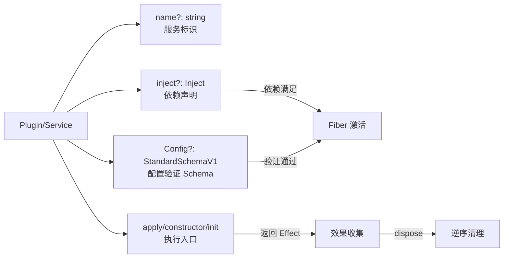

# Service 注册表

Service 是 Cordis 插件系统的核心抽象。所有框架内置能力（Events、Logger、Reflect、Registry）和扩展功能（Timer、HMR、Loader）都以 Service 形式存在。Service 通过 **抽象基类 + 声明合并 + 装饰器** 实现了类型安全的依赖注入，服务之间通过 name 标识，通过 isolate 域实现隔离，通过 intercept 实现配置覆盖。

## 设计原理

Cordis 的 Service 系统借鉴了多个 DI 框架的思想，但有自己独特的设计：

1. **声明式类型扩展**：通过 TypeScript 的 module augmentation，服务在声明时即扩展 Context 接口，使得 `ctx.database`、`ctx.timer` 等属性访问获得完整类型推导，无需泛型参数。
2. **三阶段契约**：每个 Service 遵循 `name（标识）→ inject（依赖声明）→ Config（配置Schema）→ [Service.init]()（初始化入口）` 的标准契约。
3. **可调用服务**：通过 `[symbols.invoke]` symbol，Service 实例可以既是对象又是函数（如 `logger()` 和 `logger.info()` 同时可用）。
4. **原型链继承的依赖声明**：`@Inject` 装饰器在 class 上使用时，通过原型链继承 inject 属性，支持子类继承父类的依赖声明。

## Service<T> 抽象基类

service.ts:L5-L80

```typescript
export abstract class Service<out T = never> {
  static readonly init: unique symbol = symbols.init
  static readonly check: unique symbol = symbols.check
  static readonly config: unique symbol = symbols.config
  static readonly invoke: unique symbol = symbols.invoke
  static readonly extend: unique symbol = symbols.extend
  static readonly tracker: unique symbol = symbols.tracker
  static readonly resolveConfig: unique symbol = symbols.resolveConfig

  declare [symbols.config]: T
  public name!: string

  constructor(protected ctx: Context, name: string) {
    name ??= this.constructor['provide'] as string
    // ...
    self.ctx.reflect.provide(name, self, this[symbols.check])
    return self
  }
}
```

### 7 个静态 Symbol 属性

| Symbol | 注册名 | 用途 |
|--------|--------|------|
| `Service.init` | `cordis.init` | 服务初始化生命周期钩子，实例化后调用 |
| `Service.check` | `cordis.check` | 服务可用性检查函数，返回 false 表示服务不可用 |
| `Service.config` | `cordis.config` | 服务配置类型标记，泛型 T 的运行时锚点 |
| `Service.invoke` | `cordis.invoke` | 可调用服务的调用签名，定义后服务变为 callable |
| `Service.extend` | `cordis.extend` | 创建服务扩展副本的方法 |
| `Service.tracker` | `cordis.tracker` | Traceable 行为配置（associate/property/noShadow） |
| `Service.resolveConfig` | `cordis.resolveConfig` | 配置解析方法，沿 intercept 原型链合并配置 |

### 构造函数流程

service.ts:L18-L35

```typescript
constructor(protected ctx: Context, name: string) {
  name ??= this.constructor['provide'] as string

  let self = this
  const tracker: Tracker = {
    associate: name,
    property: 'ctx',
  }
  // 如果定义了 invoke symbol，创建 callable 服务
  if (self[symbols.invoke]) {
    self = createCallable(name, joinPrototype(Object.getPrototypeOf(this), Function.prototype), tracker)
  }
  self.ctx = ctx
  self.name = name
  defineProperty(self, symbols.tracker, tracker)

  // 注册到 ReflectService
  self.ctx.reflect.provide(name, self, this[symbols.check])
  return self
}
```

构造流程：
1. 确定服务名称：优先使用参数 `name`，否则取构造函数的静态 `provide` 属性
2. 配置 Tracker：`associate` 设为服务名，`property` 设为 `'ctx'`（使得 traceable proxy 能注入正确的 ctx）
3. 如果定义了 `[symbols.invoke]`，通过 `createCallable` 将服务变为可调用对象
4. 设置 ctx 和 name 属性
5. 调用 `ctx.reflect.provide()` 将自身注册为服务提供者
6. 返回 self（可能是 callable proxy 而非原始 this）

### Callable Service（可调用服务）

`createCallable` 函数创建一个函数，其原型链包含服务的原型，使得服务实例既是可调用的函数，又拥有类的所有方法：

utils.ts:L219-L226

```typescript
export function createCallable(name: string, proto: {}, tracker: Tracker) {
  const self = function (...args: any[]) {
    const proxy = createTraceable(self['ctx'], self, tracker)
    return Reflect.apply(proxy, this, args)
  }
  defineProperty(self, 'name', name)
  return Object.setPrototypeOf(self, proto)
}
```

LoggerService 就是典型的 callable service：`logger('myPlugin')` 返回 Logger 实例，同时 `logger.info()` 也可直接调用。

### Isolate 域过滤

service.ts:L37-L39

```typescript
protected [symbols.filter](ctx: Context) {
  return ctx[symbols.isolate][this.name] === this.ctx[symbols.isolate][this.name]
}
```

Service 的默认过滤器确保只有同一 isolate 域内的 context 能看到该服务。当服务实例作为事件派发的 thisArg 时，EventsService 的 `_resolve()` 方法使用此 filter 过滤监听器。

### 配置解析

service.ts:L51-L67

```typescript
[symbols.resolveConfig](base?: T, head?: T): T {
  let intercept = this.ctx[Context.intercept]
  const configs: any[] = []
  while (this.name in intercept) {
    if (Object.hasOwn(intercept, this.name)) {
      configs.unshift(intercept[this.name])
    }
    intercept = Object.getPrototypeOf(intercept)
  }
  if (base) configs.unshift(base)
  if (head) configs.push(head)
  if (this['Config']?.merge) {
    return this['Config'].merge(...configs)
  } else {
    return Object.assign({}, ...configs)
  }
}
```

配置合并逻辑：
1. 沿 intercept 原型链向上遍历，收集所有同名配置
2. base 配置（服务自身默认配置）放在最前
3. head 配置（最新传入的配置）放在最后
4. 如果 Config 定义了静态 merge 方法，使用 merge 合并；否则用 `Object.assign` 浅合并

### 服务扩展

service.ts:L41-L49

```typescript
protected [symbols.extend](props?: any) {
  let self: any
  if (this[Service.invoke]) {
    self = createCallable(this.name, this, this[symbols.tracker])
  } else {
    self = Object.create(this)
  }
  return Object.assign(self, props)
}
```

`[symbols.extend]` 创建服务的扩展副本，用于 shadow context 等场景。callable 服务创建新的 callable 实例，普通服务通过 `Object.create(this)` 创建原型继承的副本。

### 自定义 instanceof

service.ts:L69-L79

```typescript
static [Symbol.hasInstance](instance: any) {
  if (!instance) return false
  let constructor = instance.constructor
  while (constructor) {
    // constructor may be a proxy
    constructor = constructor.prototype?.constructor
    if (constructor === this) return true
    constructor &&= Object.getPrototypeOf(constructor)
  }
  return false
}
```

由于 Service 构造函数可能返回 Proxy（callable service），普通的 `instanceof` 检查会失败。自定义 `Symbol.hasInstance` 通过遍历原型链上的 constructor 来正确处理 Proxy 场景。

## @Inject 装饰器

registry.ts:L17-L40

`@Inject` 是 Cordis 唯一的装饰器，支持两种目标：**class（类装饰器）** 和 **class method（方法装饰器）**。

```typescript
export function Inject<K extends InjectKey>(name: K, config?) {
  return function (value: any, decorator: ClassDecoratorContext | ClassMethodDecoratorContext) {
    if (decorator.kind === 'class') {
      // 类装饰器：将依赖添加到静态 inject 属性
      if (!Object.hasOwn(value, 'inject')) {
        defineProperty(value, 'inject', Object.create(Object.getPrototypeOf(value).inject ?? null))
        defineProperty(value.inject, symbols.checkProto, true)
      }
      value.inject[name] = config
    } else if (decorator.kind === 'method') {
      // 方法装饰器：通过 initHooks 在实例化后注册
      const inject = (value[symbols.metadata] ??= {}).inject ??= Object.create(null)
      inject[name] = config
      decorator.addInitializer(function () {
        const property = this[symbols.tracker]?.property
        ;(this[symbols.initHooks] ??= []).push(() => {
          (this.ctx as Context).inject(inject, (ctx) => {
            return value.call(property ? withProps(this, { [property]: ctx }) : this)
          })
        })
      })
    } else {
      throw new Error('@Inject() can only be used on class or class methods')
    }
  }
}
```

### 类装饰器模式

当 `@Inject` 用于 class 时，依赖被添加到类的**静态 inject 属性**，支持原型链继承：

```typescript
@Inject('database')
class MyPlugin extends Service {
  constructor(ctx: Context) {
    super(ctx, 'myPlugin')
  }
  // 此时 this.ctx.database 已自动注入（通过 Fiber 的依赖检查）
}
```

关键实现细节：
- 使用 `Object.create(Object.getPrototypeOf(value).inject ?? null)` 创建新的 inject 对象，继承父类的 inject
- 设置 `checkProto` 标记，表示该 inject 对象有原型链，`Inject.resolve` 需要沿原型链合并

### 方法装饰器模式

当 `@Inject` 用于 class method 时，依赖通过 `initHooks` 在实例化后注册，支持在特定方法上按需注入：

```typescript
class MyService extends Service {
  @Inject('database')
  async queryData() {
    // 此方法执行时，ctx.database 一定可用
    return this.ctx.database.query(...)
  }
}
```

实现细节：
- 在 metadata 中记录该方法的 inject 依赖
- 通过 `addInitializer` 在实例创建时注册 initHook
- initHook 执行时调用 `ctx.inject(inject, callback)` 创建子 fiber
- callback 中通过 `withProps` 将正确的 ctx 注入到方法调用中

### Inject 类型与解析

registry.ts:L11-L61

```typescript
export type Inject<M = Dict> = (keyof M)[] | { [K in keyof M]?: M[K] }
```

Inject 支持两种简写形式：

```typescript
// 数组形式：只声明依赖，不传递配置
inject: ['database', 'timer']

// 对象形式：声明依赖并传递配置
inject: {
  database: { host: 'localhost' },
  timer: null  // null 表示无配置
}
```

`Inject.resolve()` 静态方法将任意 Inject 规范化为对象格式：

```typescript
export namespace Inject {
  export function resolve(inject: Inject | null | undefined, result: Dict = Object.create(null)) {
    if (!inject) return result
    if (Array.isArray(inject)) {
      for (const name of inject) {
        result[name] = null
      }
    } else if (Reflect.has(inject, symbols.checkProto)) {
      // 有 checkProto 标记，需要沿原型链继承
      Object.assign(result, resolve(Object.getPrototypeOf(inject)))
      for (const name of Object.keys(inject)) {
        result[name] = inject[name] ?? null
      }
    } else {
      for (const name of Object.keys(inject)) {
        result[name] = inject[name] ?? null
      }
    }
    return result
  }
}
```

## RegistryService 插件注册表

registry.ts:L125-L214

RegistryService 管理所有已注册的插件，维护一个 `Map<Function, Plugin.Runtime>` 存储运行时信息。

```typescript
export class RegistryService {
  private _counter = 0
  private _internal = new Map<Function, Plugin.Runtime>()

  constructor(public ctx: Context) {
    defineProperty(this, symbols.tracker, {
      property: 'ctx',
      noShadow: true,
    })
  }

  get counter() { return ++this._counter }  // 自增生成 uid
  get size() { return this._internal.size }
}
```

### Plugin.Runtime 结构

```typescript
export namespace Plugin {
  export interface Runtime {
    name?: string                          // 插件名称
    fibers: DisposableList<Fiber>          // 该插件的所有活跃 fiber 实例
    callback: globalThis.Function          // 解析后的回调函数
    Config?: StandardSchemaV1              // 配置 Schema
  }
}
```

### 插件注册：plugin()

registry.ts:L193-L213

```typescript
plugin(plugin: Plugin, config?: any, getOuterStack = buildOuterStack()) {
  const callback = this.resolve(plugin)
  if (!callback) throw new Error('invalid plugin, expect function or object with an "apply" method')
  this.ctx.fiber.assertActive()

  let runtime = this._internal.get(callback)
  if (!runtime) {
    let name = plugin.name
    if (name === 'apply') name = undefined
    runtime = { name, callback, fibers: new DisposableList(), Config: plugin.Config }
    this._internal.set(callback, runtime)
  }

  const fiber = new Fiber(this.ctx, config, Inject.resolve(plugin.inject), runtime, getOuterStack)
  const wrapped = Object.create(fiber) as Fiber & PromiseLike<Fiber>
  wrapped.then = (onFulfilled, onRejected) => {
    return fiber.await().then(onFulfilled, onRejected)
  }
  return wrapped
}
```

注册流程：
1. **解析插件**：`resolve(plugin)` 将 Function/Constructor/Object 统一为 callback 函数
2. **获取或创建 Runtime**：同一插件（相同 callback）共享 Runtime
3. **创建 Fiber**：每个 `plugin()` 调用创建新的 Fiber 实例
4. **包装返回值**：返回 `Fiber & PromiseLike<Fiber>`，可以 await 等待插件激活

### inject() — 依赖注入简写

registry.ts:L189-L191

```typescript
inject(inject: Inject, callback: Plugin.Function<void>) {
  return this.plugin({ inject, apply: callback, name: callback.name })
}
```

`ctx.inject()` 是 `ctx.plugin()` 的语法糖，用于声明依赖后执行回调：

```typescript
ctx.inject(['database', 'timer'], (ctx) => {
  // database 和 timer 可用时执行
  ctx.database.query(...)
  ctx.timer.setInterval(...)
})
```

### Map 风格 API

registry.ts:L152-L187

```typescript
get(plugin: Plugin) {
  const key = this.resolve(plugin)
  return key && this._internal.get(key)
}

has(plugin: Plugin) {
  const key = this.resolve(plugin)
  return !!key && this._internal.has(key)
}

delete(plugin: Plugin) {
  const key = this.resolve(plugin)
  const runtime = key && this._internal.get(key)
  if (!runtime) return
  this._internal.delete(key)
  for (const fiber of runtime.fibers) {
    fiber.dispose()  // 删除插件时 dispose 所有 fiber
  }
  return runtime
}

keys() { return this._internal.keys() }
values() { return this._internal.values() }
entries() { return this._internal.entries() }
forEach(callback) { return this._internal.forEach(callback) }
```

## 声明合并与类型扩展

Cordis 通过 TypeScript 的 module augmentation 实现服务类型的自动扩展。每个服务在自己的模块中声明对 Context 接口的扩展：

```typescript
// 以 TimerService 为例（packages/timer/src/index.ts）
declare module 'cordis' {
  interface Context extends Pick<TimerService, 'interval' | 'timeout' | 'throttle' | 'debounce'> {
    timer: TimerService
  }
}
```

这使得：
- `ctx.timer` 获得 `TimerService` 类型
- `ctx.timeout()`、`ctx.interval()` 等 mixin 方法获得正确类型
- 服务之间的依赖注入 `@Inject('timer')` 能正确推导类型

### InjectKey 类型

```typescript
export type InjectKey = keyof {
  [K in keyof Context & string as Context[K] extends { [symbols.config]: any } ? K : never]: any
}
```

`InjectKey` 是一个条件类型，只提取那些值类型带有 `[symbols.config]` 属性的键名（即 Service 类型的属性），确保 `@Inject()` 只能注入已注册的服务。

## 服务契约：name + inject + Config + apply

每个 Cordis 插件/服务遵循统一的契约：



| 契约项 | 类型 | 说明 |
|--------|------|------|
| `name` | `string` | 服务名称，用于依赖查找和错误信息。类式插件取 constructor.name 或静态 provide |
| `inject` | `Inject` | 依赖声明，数组或对象形式。支持 `@Inject()` 装饰器 |
| `Config` | `StandardSchemaV1` | 配置验证 Schema（支持 Zod、Valibot 等标准 Schema 库） |
| `Config.merge` | `static Function` | 可选的自定义配置合并方法 |
| `provide` | `string \| string[]` | 声明该插件提供的服务名（用于 Service 子类） |
| `intercept` | `Dict<boolean>` | 声明对哪些服务的配置拦截 |
| 入口函数 | 多种 | 函数式: `(ctx, config) => Effect`；类式: `constructor(ctx, config)` + `[Service.init]()`；对象式: `{ apply(ctx, config) }` |

### 标准服务实现示例

```typescript
import { Context, Service } from 'cordis'

declare module 'cordis' {
  interface Context {
    database: DatabaseService
  }
}

interface DatabaseConfig {
  host: string
  port: number
}

class DatabaseService extends Service {
  static inject = ['timer']  // 声明依赖
  static Config: StandardSchemaV1<DatabaseConfig> = z.object({
    host: z.string().default('localhost'),
    port: z.number().default(5432),
  })

  constructor(ctx: Context, public config: DatabaseConfig) {
    super(ctx, 'database')
    // 此时 ctx.timer 已可用（因为声明了 inject: ['timer']）
  }

  async [Service.init]() {
    // 初始化连接
    const conn = await this.connect()
    this.ctx.logger.info('database connected')

    // 返回 cleanup 函数（Effect）
    return () => {
      conn.close()
      this.ctx.logger.info('database disconnected')
    }
  }

  query(sql: string) {
    // ...
  }
}

// 使用
const ctx = new Context()
ctx.plugin(DatabaseService, { host: 'db.example.com', port: 5432 })
// 之后 ctx.database.query(...) 可用
```

## ReflectService 的服务存储

服务实际注册在 `ReflectService.store` 中，以 isolate symbol 为键：

reflect.ts:L175-L203

```typescript
provide(name: string, value?: any, check?: () => boolean) {
  return this.ctx.fiber.effect(() => {
    this.props[name] ??= { type: 'service' }
    if (this.props[name].type !== 'service') {
      throw new Error(`property "${name}" is already declared as ${this.props[name].type}`)
    }
    this.props[name] = { type: 'service' }

    // 在 root isolate map 中创建 symbol
    this.ctx.root[symbols.isolate][name] ??= Symbol(name)
    const key = this.ctx[symbols.isolate][name]
    const impl: Impl = { name, value, fiber: this.ctx.fiber, check }
    if (this.store[key]) {
      throw new Error(`service "${name}" has been registered at <${this.store[key].fiber.name}>`)
    }
    this.store[key] = impl
    this.ctx.fiber.store![name] = impl
    if (this.ctx.fiber.state === FiberState.ACTIVE) {
      this.notify([name])
    }
    return async () => {
      delete this.store[key]
      const fibers = this.notify([name])
      await Promise.allSettled(fibers.map(fiber => fiber.await()))
      delete this.ctx.fiber.store![name]
    }
  }, `ctx.provide(${JSON.stringify(name)})`)
}
```

关键设计：
- 服务注册是一个 **effect**，返回的 dispose 函数负责注销
- 同一 isolate 域内同一服务名只能注册一次（否则抛错）
- 注册后调用 `notify()` 通知所有依赖该服务的 fiber 刷新
- 注销时也会通知依赖 fiber，触发它们进入 PENDING 状态

### Impl 结构

```typescript
export interface Impl {
  name: string       // 服务名
  fiber: Fiber       // 提供该服务的 Fiber
  value?: any        // 服务实例
  check?: () => boolean  // 可用性检查函数
}
```

### 服务变更通知

reflect.ts:L205-L227

```typescript
notify(names: string[], filter?) {
  const fibers: Fiber[] = []
  for (const runtime of this.ctx.registry.values()) {
    for (const fiber of runtime.fibers) {
      let hasUpdate = false
      for (const name of names) {
        if (!(name in fiber.inject)) continue
        if (!filter(fiber.ctx, name)) continue
        hasUpdate = true
        fiber._checkImpl(name)       // 重新检查实现
      }
      if (!hasUpdate) continue
      fiber._refresh()               // 重新计算 epoch
      fibers.push(fiber)
    }
  }
  // 触发 internal/service 事件
  for (const name of names) {
    const self: Context = Object.create(this.ctx)
    self[symbols.filter] = (target: Context) => filter(target, name)
    this.ctx.events.emit(self, 'internal/service', name, this._getImpl(name, false)?.value)
  }
  return fibers
}
```

notify 遍历所有 runtime 的所有 fiber，检查注入了指定服务的 fiber，调用 `_checkImpl` 更新实现引用并 `_refresh` 重新计算状态。

## 类型签名汇总

```typescript
// Service 基类
abstract class Service<out T = never> {
  static readonly init: unique symbol
  static readonly check: unique symbol
  static readonly config: unique symbol
  static readonly invoke: unique symbol
  static readonly extend: unique symbol
  static readonly tracker: unique symbol
  static readonly resolveConfig: unique symbol

  readonly name: string
  protected readonly ctx: Context

  constructor(ctx: Context, name?: string)
  protected [symbols.filter](ctx: Context): boolean
  protected [symbols.extend](props?: any): any
  [symbols.resolveConfig](base?, head?): T
  static [Symbol.hasInstance](instance: any): boolean
}

// @Inject 装饰器
function Inject<K extends InjectKey>(name: K, config?): ClassDecorator & MethodDecorator

// Inject 类型
type Inject<M = Dict> = (keyof M)[] | { [K in keyof M]?: M[K] }

// RegistryService
class RegistryService {
  readonly ctx: Context
  readonly counter: number
  readonly size: number
  plugin(plugin: Plugin, config?): Fiber & PromiseLike<Fiber>
  inject(deps: Inject, callback: Plugin.Function): Fiber & PromiseLike<Fiber>
  get(plugin: Plugin): Plugin.Runtime | undefined
  has(plugin: Plugin): boolean
  delete(plugin: Plugin): Plugin.Runtime | undefined
  keys(): IterableIterator<Function>
  values(): IterableIterator<Plugin.Runtime>
  entries(): IterableIterator<[Function, Plugin.Runtime]>
  forEach(callback: (value: Plugin.Runtime, key: Function) => void): void
}

// Plugin 三形态
type Plugin<T = any> = Plugin.Function<T> | Plugin.Constructor<T> | Plugin.Object<T>
namespace Plugin {
  interface Function<T> { (ctx: Context, config: T): any; name?: string; Config?: StandardSchemaV1; inject?: Inject; provide?: string | string[]; intercept?: Dict<boolean> }
  interface Constructor<T> { new (ctx: Context, config: T): any; name?: string; Config?: StandardSchemaV1; inject?: Inject; provide?: string | string[]; intercept?: Dict<boolean> }
  interface Object<T> { apply(ctx: Context, config: T): any; name?: string; Config?: StandardSchemaV1; inject?: Inject; provide?: string | string[]; intercept?: Dict<boolean> }
  interface Runtime { name?: string; fibers: DisposableList<Fiber>; callback: Function; Config?: StandardSchemaV1 }
}
```

## 源码引用

| 文件 | 内容 |
|------|------|
| service.ts | Service<T> 抽象基类、7 个 symbol、filter/resolveConfig/extend/instanceof |
| registry.ts | @Inject 装饰器、Inject.resolve、RegistryService、Plugin 类型定义 |
| reflect.ts | ReflectService.provide/notify/store、服务注册与通知 |
| fiber.ts | Fiber 构造函数中的依赖检查、_checkImpl/_refresh、类式插件实例化 |
| utils.ts | createCallable（可调用服务）、joinPrototype（原型合并）、Tracker 接口 |
