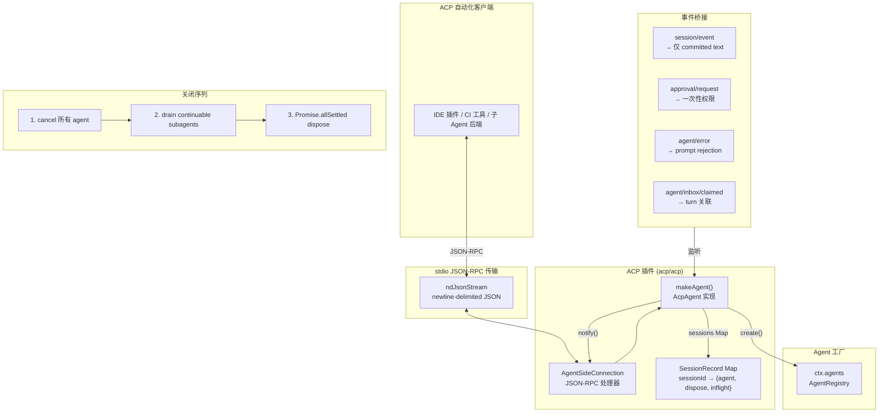

# ACP Agent 通信协议

ACP（Agent Client Protocol）是 deepseek-harness 面向**自动化客户端**的专用协议桥。`@deepseek-ai/dsh-acp` 插件通过 stdio 上的 JSON-RPC 暴露 ACP 服务端，让编程客户端（IDE 插件、CI/CD 工具、子 Agent 后端）能够创建 Agent 会话、发送 prompt、接收提交后的 assistant 文本、取消请求和处理一次性权限决策。与面向人类交互的 Web 客户端不同，ACP 只暴露自动化需要的最小接口，不传输原始 chunks、reasoning、工具调用等呈现层数据。

## 设计原理

1. **自动化专用**：ACP 是为程序客户端设计的协议，不承担人类交互职责。UI 呈现、reasoning 展示、工具调用可视化等功能保留在 Web 客户端模块中。
2. **提交后文本过滤**：`session/event` 监听仅转发 committed assistant text，image 块渲染为文本占位符，reasoning、raw chunks、tools 不出现在自动化线路上。
3. **一次性权限决策**：审批请求提供 `allow-once`/`reject-once` 一次性选项，不推断持久授权。
4. **结构化关闭**：`quiesce` 函数先取消所有 agent、drain 可续子 Agent、再 Promise.allSettled dispose 所有 session。
5. **协议隔离**：ACP 直接使用 `@agentclientprotocol/sdk` 的类型定义，通过 `AgentSideConnection` 处理 JSON-RPC 线路协议。

## 架构总览



## 插件定义

```typescript
// packages/acp/acp/src/index.ts
export const name = 'acp'
export const inject = ['agents']  // ACP 创建和拥有 agent

export interface AcpConfig {
  provider?: string   // 创建的 agent 使用的 provider 路由
  model?: string      // 创建的 agent 使用的模型名
  stream?: Stream     // 运行时传输覆盖（测试用）；生产环境使用 stdio
}

export const Config: Schema<AcpConfig> = Schema.object({
  provider: Schema.string(),
  model: Schema.string(),
})
```

## AcpAgent 协议实现

`makeAgent` 返回实现 ACP 协议五个核心方法的对象：

```typescript
// packages/acp/acp/src/index.ts
const makeAgent = (connection: AgentSideConnection): AcpAgent => {
  conn = connection
  return {
    // 1. initialize: 返回协议版本和能力声明
    initialize(_params: InitializeRequest): Promise<InitializeResponse> {
      return Promise.resolve({
        protocolVersion: PROTOCOL_VERSION,
        agentInfo: { name: 'deepseek-harness-acp', version: '0.0.1' },
        agentCapabilities: {
          promptCapabilities: { image: false, audio: false, embeddedContext: false },
        },
        authMethods: [],
      })
    },

    // 2. authenticate: 当前无认证
    authenticate(_params: AuthenticateRequest): Promise<void> {
      return Promise.resolve()
    },

    // 3. newSession: 创建新的 agent+session 对
    async newSession(params: NewSessionRequest): Promise<NewSessionResponse> { ... },

    // 4. prompt: 发送用户 prompt 并等待 turn 结束
    async prompt(params: PromptRequest): Promise<PromptResponse> { ... },

    // 5. cancel: 取消进行中的 prompt
    cancel(params: CancelNotification): Promise<void> { ... },
  }
}
```

### Session 创建

`newSession` 通过 `AgentRegistry.create()` 创建 agent，在 sessions Map 中维护 `SessionRecord`：

```typescript
// packages/acp/acp/src/index.ts
interface SessionRecord {
  agent: Agent
  dispose: () => Promise<void>
  inflight: {
    resolve: (reason: StopReason) => void
    reject: (error: Error) => void
    messageId: string
    turn: number | undefined
    endReason: TurnEndReason | undefined
  } | undefined
}

async newSession(params: NewSessionRequest): Promise<NewSessionResponse> {
  assertOpen()
  validateSessionParams(params)
  const sessionId = SessionId(randomUUID())
  const handle = await agents.create({
    sessionId,
    meta: { cwd: params.cwd },
    agentOptions: agentOptions(config),
  })
  sessions.set(sessionId, {
    agent: handle.agent,
    dispose: () => handle.dispose(),
    inflight: undefined,
  })
  return { sessionId }
}
```

**参数验证**（`validateSessionParams`）：
- `cwd` 必须是绝对路径
- `additionalDirectories` 不支持（拒绝）
- `mcpServers` 不支持（拒绝）

### Prompt 处理

`prompt` 方法是 ACP 的核心交互入口，将 ACP prompt 转为 Harness user message，通过 `agent.followup()` 入队，等待 agent idle 后返回 stop reason：

```typescript
// packages/acp/acp/src/index.ts
async prompt(params: PromptRequest): Promise<PromptResponse> {
  assertOpen()
  const record = requireSession(SessionId(params.sessionId))
  if (record.inflight !== undefined) {
    throw invalidParams('a prompt is already in flight for this session')
  }
  if (promptHasUnsupportedContent(params.prompt)) {
    throw invalidParams('only text and resource_link prompt content is supported')
  }
  const text = acpPromptToText(params.prompt)
  if (text.trim().length === 0) throw invalidParams('empty prompt')

  // 验证 agent 仍然存活
  if (ctx.agents.get(record.agent.id) !== record.agent) {
    throw internalError('prompt was not queued: the agent was disposed outside the bridge')
  }

  const message = createUserMessage({ content: [{ type: 'text', text }], source: { kind: 'user' } })
  const stopReason = await new Promise<StopReason>((resolve, reject) => {
    const inflight = { resolve, reject, messageId: message.id, turn: undefined, endReason: undefined }
    record.inflight = inflight
    try {
      record.agent.followup(message)
    } catch (error: unknown) {
      record.inflight = undefined
      throw internalError(`prompt was not queued: ${error instanceof Error ? error.message : String(error)}`)
    }
    // 等待 agent 完全 idle（非仅 turn/end）
    void record.agent.whenIdle().then(() => {
      if (record.inflight !== inflight) return
      record.inflight = undefined
      const end = inflight.endReason
      if (end === undefined) {
        inflight.resolve('cancelled')
      } else {
        inflight.resolve(end.kind === 'max-tokens' ? 'end_turn' : turnEndToStopReason(end))
      }
    })
  })
  return { stopReason }
}
```

**关键设计**：
- prompt 等待 `agent.whenIdle()` 而非单个 `turn/end`，因为模型可能在一次 prompt 后执行多轮工具调用。
- `max-tokens` 被映射为 `end_turn`（非错误），因为这是正常的输出截断而非失败。
- 同一 session 同时只能有一个 inflight prompt，重复请求返回 invalid params 错误。
- 入队前先设置 inflight slot 再调用 `followup()`，防止同步 turn 绕过关联。

## 事件桥接

### 会话事件→文本通知

ACP 仅向自动化客户端转发**已提交的 assistant 文本**，过滤掉所有呈现层数据：

```typescript
// packages/acp/acp/src/index.ts
ctx.on('session/event', (session, event: SessionEvent) => {
  const record = sessions.get(session.header.id)
  if (record === undefined || record.agent.session !== session) return
  try {
    if (event.type === 'assistant/message') {
      for (const block of event.data.message.content) {
        if (block.type === 'text' && block.text.length > 0) {
          notify({
            sessionId: record.agent.session.id,
            update: { sessionUpdate: 'agent_message_chunk', content: { type: 'text', text: block.text } },
          })
        } else if (block.type === 'image') {
          // image 块渲染为文本占位符
          notify({
            sessionId: record.agent.session.id,
            update: {
              sessionUpdate: 'agent_message_chunk',
              content: { type: 'text', text: `[image attachment ${block.attachment.attachmentId}]` },
            },
          })
        }
        // reasoning、tool-call、tool-result 等块不转发
      }
    }
  } finally {
    // 关联 turn/end 到 inflight prompt
    const inflight = record.inflight
    if (inflight !== undefined && event.type === 'turn/end' && inflight.turn === event.data.turn) {
      if (event.data.reason.kind === 'error') {
        record.inflight = undefined
        inflight.reject(internalError(`turn failed: ${event.data.reason.error.message}`))
      } else {
        inflight.endReason = event.data.reason
      }
    }
  }
})
```

**不转发的数据**：
- Raw stream chunks（增量数据）
- Reasoning/thinking 块
- Tool call 和 tool result 块
- Plan、title、retry marker 等元数据

### 权限请求→一次性决策

ACP 客户端通过 `approval/request` 瀑布事件提供一次性权限决策，不做持久授权推断：

```typescript
// packages/acp/acp/src/index.ts
ctx.on('approval/request', (request, next) => {
  const record = ownedRecord(request.agent)
  if (record === undefined || request.callId === undefined) return next()
  return conn.requestPermission({
    sessionId: record.agent.session.id,
    toolCall: { toolCallId: request.callId },
    options: [
      { optionId: 'allow-once', name: 'Allow once', kind: 'allow_once' },
      { optionId: 'reject-once', name: 'Reject', kind: 'reject_once' },
    ],
  }).then(({ outcome }) => {
    if (outcome.outcome === 'cancelled') return 'cancelled'
    return outcome.optionId === 'allow-once' ? 'allowed-once' : 'rejected'
  })
})
```

权限选项只有两个：`allow-once`（允许一次）和 `reject-once`（拒绝一次）。客户端的 `cancelled` 响应映射为 `cancelled` 决策。这种设计确保 ACP 协议不会意外授予持久权限。

### 错误→Prompt 拒绝

Agent 错误通过 `agent/error` 事件关联到 inflight prompt 并 reject：

```typescript
ctx.on('agent/error', ({ agent, turn, error }) => {
  const record = ownedRecord(agent)
  const inflight = record?.inflight
  if (record === undefined || inflight === undefined || inflight.turn === turn) return
  record.inflight = undefined
  inflight.reject(internalError(`turn failed: ${errorChain(error)}`))
})
```

`errorChain` 函数渲染完整的错误 cause 链（包括 AggregateError 成员），为客户端提供详细的诊断信息。

## 优雅关闭（Quiesce）

ACP 的关闭序列是 deepseek-harness 中最精细的 teardown 实现之一：

```typescript
// packages/acp/acp/src/index.ts
const quiesce = (): Promise<void> => {
  if (quiescing !== undefined) return quiescing
  closed = true
  const records = [...sessions.values()]
  sessions.clear()

  // 阶段1: 立即停止所有 agent 的工作
  for (const record of records) {
    record.agent.cancel({ kind: 'user' })
    settlePrompt(record, 'cancelled')
  }

  quiescing = (async () => {
    // 阶段2: 先 drain 可续子 Agent（child-first）
    // 这些子 Agent 可能在 turn 之外继续运行
    const subagents = ctx.get('subagents') as ContinuableDrain | undefined
    if (subagents !== undefined) {
      try {
        await subagents.drainContinuableDescendants(records.map(record => record.agent))
      } catch (error: unknown) {
        logger.warn(`acp: continuable subagent teardown failed: ${String(error)}`)
      }
    }
    // 阶段3: 并行 dispose 所有 session，收集失败
    const disposals = await Promise.allSettled(records.map(record => record.dispose()))
    const failures: unknown[] = []
    for (const result of disposals) {
      if (result.status === 'rejected') failures.push(result.reason)
    }
    if (failures.length > 0) {
      const detail = failures.map(f => errorChain(f)).join('; ')
      throw new AggregateError(failures, `ACP agent teardown failed for ${failures.length} session(s): ${detail}`)
    }
  })()
  return quiescing
}
```

关闭三阶段：
1. **Cancel**：立即对所有 agent 调用 `cancel({ kind: 'user' })`，settle 所有 inflight prompt 为 `cancelled`。
2. **Drain subagents**：通过结构类型读取 `ctx.get('subagents')`（不硬依赖 subagent 包），child-first 销毁可续子 Agent 后代。
3. **Dispose sessions**：`Promise.allSettled` 并行释放所有 session，聚合失败为 AggregateError。

`ContinuableDrain` 接口采用结构类型（鸭子类型），使得 ACP 包不需要依赖 subagent 包：

```typescript
interface ContinuableDrain {
  drainContinuableDescendants(parents: readonly Agent[]): Promise<void>
}
```

## SDK 协议对比

ACP 与 SDK JSON-RPC 协议（`sdk-jsonrpc-server`）是两个独立的自动化协议：

| 特性 | ACP（acp/acp） | SDK JSON-RPC（sdk/server） |
|------|---------------|---------------------------|
| 协议标准 | Agent Client Protocol（第三方标准） | Harness 自有协议 |
| 传输 | stdio JSON-RPC（ndjson） | stdio JSON-RPC（ndjson） |
| 消息流 | committed text chunks | 完整 SessionEvent 流 |
| 权限 | 一次性 allow-once/reject-once | 无内置权限 |
| 子 Agent | drain continuable descendants | sessionParents 树映射 |
| 客户端 | @agentclientprotocol/sdk | @deepseek-ai/dsh-sdk-client |
| 客户端语言 | 多语言（ACP 标准） | TS + Python |

## 源码链接

| 文件 | 核心内容 |
|------|---------|
| packages/acp/acp/src/index.ts | ACP 插件完整实现（makeAgent、事件桥接、quiesce、参数验证） |
| packages/acp/acp/src/codec.ts | ACP prompt 编解码、stop reason 映射、内容类型检测 |
| packages/sdk/protocol/src/types.ts | SDK 协议类型（InitializeParams、SessionPromptParams、4 种通知） |
| packages/sdk/server/src/index.ts | SDK JSON-RPC 服务端插件（shutdown→flush→dispose→exit 阶梯） |
