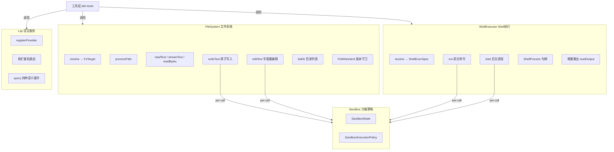

# 文件系统与Shell工具

## 概述

文件系统（`ctx.fs`）、Shell执行器（`ctx.shell`）和语言服务协议（`ctx.lsp`）是 deepseek-harness 为 Agent 提供操作执行环境的三大核心能力抽象。它们遵循统一的设计模式：

- **抽象 Service 基类**：定义稳定接口，具体后端（本地文件系统、沙箱文件系统、远程文件系统；POSIX shell、PowerShell；各种 LSP server）通过子类化实现
- **不透明标识（Opaque Identity）**：文件目标（`FsTargetKey`）、版本令牌（`FsVersion`）、Provider ID（`LspProviderId`）均为 Branded 类型，消费者不得解析其内部结构
- **原子操作**：写/编辑操作保证原子性（要么全部成功，要么文件保持原状）
- **类型化错误**：所有失败都携带机器可路由的错误码，上层（工具层、UI层、重试逻辑）可据此分支判断



## 设计原理

### 1. FileSystem：后端无关的文件操作抽象

`FileSystem` 是抽象 Cordis Service（`ctx.fs`），定义了文件操作的完整接口。它不关心底层是本地磁盘、Docker 容器内文件系统、还是远程工作区文件系统。

核心设计特点：

#### 不透明目标标识

```typescript
// packages/fs/fs/src/types.ts
/** 不透明目标键 —— 消费者不得解析或假设其为本地路径 */
export type FsTargetKey = Branded<'FsTargetKey'>

/** 不透明文件版本令牌 —— 新鲜度守卫 */
export type FsVersion = Branded<'FsVersion'>

export interface FsTarget {
  targetKey: FsTargetKey     // 后端内部使用的稳定标识
  displayPath: string        // 面向模型/UI的展示路径
}
```

所有文件操作都以 `FsTarget` 为参数（而非裸路径字符串），通过 `resolve(path, opts?)` 将用户/模型提供的路径解析为稳定目标。同一文件通过不同别名（符号链接、相对路径）访问，`resolve` 必须返回相同的 `targetKey`。

```typescript
// packages/fs/fs/src/index.ts
export abstract class FileSystem extends Service {
  /** 将路径解析为稳定目标（可能涉及I/O，如远程后端需round-trip） */
  abstract resolve(path: string, opts?: { cwd?: string; signal?: AbortSignal }): Promise<FsTarget>

  /** 返回子进程可打开的规范绝对路径（与targetKey分离） */
  abstract processPath(target: FsTarget): string

  /** 返回规范 file: URI（后端负责编码，宿主平台可能不同于执行平台） */
  abstract fileUrl(target: FsTarget): string

  /** 测试规范包含关系，不暴露targetKey内部结构 */
  abstract contains(parent: FsTarget, child: FsTarget): boolean
}
```

#### 读取：文本优先、二进制有界

读取操作分三档，后端负责 UTF-8 解码和二进制拒绝：

```typescript
abstract readText(target: FsTarget, signal?: AbortSignal): Promise<string>
abstract streamText(target: FsTarget, signal?: AbortSignal): Promise<AsyncIterable<string>>
abstract readBytes(target: FsTarget, signal: AbortSignal | undefined, maxBytes: number): Promise<Uint8Array>
```

- `readText`：读取整个常规 UTF-8 文本文件为单个字符串，后端负责二进制拒绝
- `streamText`：大文件流式读取，后端负责跨 chunk UTF-8 解码
- `readBytes`：原始字节读取，**必须**指定 `maxBytes` 上限，超过则返回 `FS_TOO_LARGE` 而非截断结果

关键不变量：后端永远不能缓冲无界文件。

```typescript
abstract stat(target: FsTarget, signal?: AbortSignal): Promise<FsInfo | undefined>
abstract lstat(path: string, opts?: { cwd?: string }, signal?: AbortSignal): Promise<FsPathInfo | undefined>
abstract listDir(target: FsTarget, signal?: AbortSignal): Promise<FsDirEntry[]>
```

- `stat` 返回目标元数据（类型、大小、版本令牌），不返回内容；不存在返回 `undefined`
- `lstat` 是路径级别的探测（不跟随符号链接），可报告 `symlink` 类型，让消费者在 resolve 之前拒绝不可信路径
- `listDir` 按稳定名称顺序返回直接子节点，附带元数据和已解析的子目标，但**永远不读取文件内容**

#### 原子写入与版本守卫

写入操作保证原子性——发布前文件保持不变：

```typescript
// packages/fs/fs/src/types.ts
/** 守卫写入意图 */
export type FsWriteIntent =
  | { kind: 'createIfAbsent' }                     // 仅创建：文件已存在则拒绝 FS_NOT_OBSERVED
  | { kind: 'replaceIfVersion'; version: FsVersion } // 版本替换：版本不匹配则拒绝 FS_STALE_VERSION

export interface FsWriteOutcome {
  operation: 'create' | 'update'   // 创建还是替换
  version: FsVersion               // 写入后的新版本
  before: string | null            // 写入前内容（LF标准化），null表示新建/二进制/超界
  after: string                    // 写入后内容（LF标准化，共享diff基准）
}
```

`writeText` 支持可选的乐观锁（optimistic locking）：
- 无 intent：无条件创建或覆盖
- `createIfAbsent`：仅当文件不存在时创建
- `replaceIfVersion`：仅当文件版本与预期匹配时替换（防止"读-改-写"竞态）

```typescript
abstract writeText(
  target: FsTarget,
  content: string,
  expected?: FsWriteIntent,
  signal?: AbortSignal,
  sandboxPolicy?: SandboxExecutionPolicy,
): Promise<FsWriteOutcome>
```

返回值携带写入前后的内容（LF 标准化），供工具层计算上下文 diff 并附加到 `tool/result` 元数据中。

#### 字面量编辑

`editText` 实现原子化的字面量查找-替换编辑，不依赖正则或 AST：

```typescript
export interface FsEditRequest {
  oldString: string       // 要替换的字面量文本（非空，行尾标准化后精确匹配）
  newString: string       // 替换文本（空字符串表示删除）
  replaceAll: boolean     // 是否替换所有匹配（false则要求恰好一个匹配）
}

export interface FsEditOutcome {
  version: FsVersion
  before: string          // 编辑前完整内容（LF标准化）
  after: string           // 编辑后完整内容
}
```

版本守卫在字面量匹配**之前**检查，确保过期内容报告 `FS_STALE_VERSION` 而非 `FS_EDIT_NOT_FOUND` 或 `FS_AMBIGUOUS_EDIT`。

```typescript
abstract editText(
  target: FsTarget,
  edit: FsEditRequest,
  expected?: { version: FsVersion },
  signal?: AbortSignal,
  sandboxPolicy?: SandboxExecutionPolicy,
): Promise<FsEditOutcome>
```

#### Waterfall 事件：写入意图决策

`fs/write-intent` 和 `fs/edit-intent` 是 waterfall 事件，允许策略插件（如观察缓存、权限策略）拦截写入决策：

```typescript
// packages/fs/fs/src/index.ts
declare module '@deepseek-ai/cordis' {
  interface Events {
    /** 单槽决策：第一个返回intent的监听器拥有决策权，而非与peer组合 */
    'fs/write-intent'(
      target: FsTarget, actor: object | undefined,
      next: () => FsWriteIntent | undefined | Promise<FsWriteIntent | undefined>
    ): Promise<FsWriteIntent | undefined>

    'fs/edit-intent'(
      target: FsTarget, actor: object | undefined,
      next: () => { version: FsVersion } | undefined | Promise<{ version: FsVersion } | undefined>
    ): Promise<{ version: FsVersion } | undefined>

    /** 记录权威观测（存在/不存在），同步记录器 */
    'fs/observed'(target: FsTarget, observation: FsObservation, actor: object | undefined): void
  }
}
```

#### 错误码体系

```typescript
// packages/fs/fs/src/types.ts
export type FsErrorCode =
  | 'FS_NOT_FOUND'           // 目标不存在
  | 'FS_NOT_DIRECTORY'       // 期望目录但不是
  | 'FS_NOT_TEXT'            // 非UTF-8文本文件
  | 'FS_NOT_REGULAR_FILE'    // 非常规文件
  | 'FS_TOO_LARGE'           // 超过字节上限
  | 'FS_PERMISSION_DENIED'   // 权限不足
  | 'FS_SANDBOX_DENIED'      // 沙箱策略拒绝
  | 'FS_IO_ERROR'            // I/O错误
  | 'FS_STALE_VERSION'       // 版本守卫不匹配
  | 'FS_NOT_OBSERVED'        // createIfAbsent冲突
  | 'FS_AMBIGUOUS_EDIT'      // editText匹配多个位置
  | 'FS_EDIT_NOT_FOUND'      // editText未找到匹配
  | 'FS_ABORTED'             // 操作被中止
```

所有错误都通过 `FsError` 类抛出，继承自 `HarnessError`，携带稳定的 `code` 字段。

### 2. ShellExecutor：命令执行抽象

`ShellExecutor` 是抽象 Cordis Service（`ctx.shell`），统一了前台命令执行和后台进程管理的语义。

```typescript
// packages/shell/shell/src/index.ts
export abstract class ShellExecutor extends Service {
  /** 后端默认沙箱模式（undefined表示不隔离） */
  get sandboxMode(): SandboxMode | undefined { return undefined }

  /** 应用实现拥有的默认值和上限，返回完全解析的执行规格 */
  abstract resolve(request: ShellExecRequest): ShellExecSpec

  /** 前台执行：非零退出、超时杀死、中止杀死都以结果返回而非reject */
  abstract run(spec: ShellExecSpec): Promise<ShellRunResult>

  /** 后台启动：立即返回进程句柄，无超时 */
  abstract start(spec: ShellExecSpec): ShellProcess
}
```

关键语义约定：
- **不抛异常原则**：`run()` 仅在基础设施故障时 reject。非零退出码、超时杀死、中止杀死都通过 `ShellRunResult` 字段表达
- **后台无超时**：`start()` 返回的 `ShellProcess` 不受执行器超时约束
- **增量输出**：`readOutput()` 是消费式读取，连续调用不重复输出
- **组合拆卸清理**：所属组合（subprocess service）dispose 时，仍在运行的后台进程被杀死并等待 `done`

#### 请求与规格分离

```typescript
// packages/shell/shell/src/types.ts
/** 调用者面向的请求（可选字段由 resolve 填充） */
export interface ShellExecRequest {
  command: string
  workdir?: string
  timeoutMs?: number
  stdoutMaxBytes?: number     // stdout捕获预算（模型工具不暴露）
  signal?: AbortSignal
  stdin?: string              // 写入stdin的内容
  env?: Record<string, string>  // 普通环境变量
  dshEnv?: DshEnvironment     // 托管的DSH_*变量（最后合并，不可被env覆盖）
  sandboxPolicy?: SandboxExecutionPolicy
}

/** resolve() 后的完全规格 */
export interface ShellExecSpec {
  command: string
  workdir: string             // 已填充默认
  timeoutMs: number           // 已填充/封顶
  stdoutMaxBytes: number      // 已解析
  signal?: AbortSignal
  stdin?: string
  env?: Record<string, string>
  dshEnv?: DshEnvironment
  sandboxPolicy: SandboxExecutionPolicy | undefined
}
```

环境变量管理采用分层策略：
1. 执行器清空环境中的 `DSH_*` 变量（防止从宿主进程继承过期值）
2. 合并请求中的 `env`（普通变量）
3. 最后合并 `dshEnv`（托管变量，永远不被普通 env 覆盖）

#### 前台执行结果

```typescript
export interface ShellRunResult {
  exitCode: number | null    // 退出码；被信号杀死时为null
  signal: NodeJS.Signals | null  // 终止信号
  timedOut: boolean          // 执行器超时是第一原因（与aborted互斥）
  aborted: boolean           // 调用者AbortSignal是第一原因（与timedOut互斥）
  timeoutMs: number          // 实际应用的超时
  stdout: CollectedOutput
  stderr: CollectedOutput
  sandbox?: ShellSandboxInfo
}
```

第一原因分类（timedOut vs aborted）通过融合的 deadline 实现：执行器超时和调用者取消共享同一个截止期限机制，只有第一个触发的原因被记录，不会同时标记两个。

#### 后台进程句柄

```typescript
export interface ShellProcess {
  status: ShellProcessStatus       // 'running' | 'completed' | 'killed'
  exitCode: number | null
  signal: NodeJS.Signals | null
  readonly done: Promise<void>     // 进程关闭时resolve（永远不reject）
  sandbox?: ShellSandboxInfo

  /** 消费式增量读取；连续调用不重复输出 */
  readOutput(): ShellProcessRead

  /** 杀死进程组；已完成返回false；幂等 */
  kill(): boolean
}

export interface ShellProcessRead {
  delta: string           // 自上次读取以来的新输出（stderr在标记段中）
  lossy: boolean          // 是否有截断丢失
  stdoutSpillPath?: string  // stdout截断时的完整溢出文件路径
  stderrSpillPath?: string  // stderr截断时的完整溢出文件路径
}
```

#### 沙箱信息

```typescript
export interface ShellSandboxInfo {
  mode: SandboxMode              // 实际运行模式
  denied: boolean                // 沙箱是否拒绝了文件操作
  enforcement?: SandboxEnforcement  // 执行完整度
  runnerFailed?: boolean         // 沙箱runner是否在命令运行前失败
}
```

沙箱事实独立于进程退出状态报告，让调用者区分命令失败、策略拒绝和runner故障。

### 3. LSP：语言服务协议抽象

`Lsp` Service（`ctx.lsp`）提供语言服务器（如 TypeScript Language Server、Python LSP）的注册和查询能力。它刻意**不暴露**通用 JSON-RPC 逃生口，只开放四种语义操作。

#### 四种封闭语义操作

```typescript
// packages/lsp/lsp/src/types.ts
export type LspOperation = 'goToDefinition' | 'findReferences' | 'goToImplementation' | 'hover'
```

这是一个封闭联合类型——添加操作需要编译期强制修改 seam、provider 和工具层。 deliberately 不暴露 symbols、call hierarchy 等需要不同 schema 的操作。

#### Provider 注册：原子性全有或全无

```typescript
// packages/lsp/lsp/src/index.ts
export class Lsp extends Service implements LspService {
  private readonly providerIds = new Set<LspProviderId>()
  private readonly routes = new Map<string, Route>()

  registerProvider(provider: LspProvider): () => void {
    // 1. 验证所有内容 BEFORE 任何变更
    const id = provider.id
    if (id.trim() === '') throw new LspError('...', 'LSP_INVALID_PROVIDER')
    if (this.providerIds.has(id)) throw new LspError('...', 'LSP_CONFLICT')

    // 2. 规范化扩展名，检测provider内部重复
    const pending = new Map<string, Route>()
    for (const [rawExt, languageId] of Object.entries(provider.extensionToLanguage)) {
      const ext = normalizeExtension(rawExt)
      // ... 验证 EXTENSION_PATTERN、非空 languageId、无内部重复
      pending.set(ext, { provider, languageId })
    }

    // 3. 检测跨provider扩展名冲突
    for (const ext of pending.keys()) {
      if (this.routes.has(ext)) throw new LspError('...', 'LSP_CONFLICT')
    }

    // 4. 所有检查通过：在一个effect中原子地保留id和所有扩展名
    const dispose = this.ctx.effect(function* (this: Lsp) {
      this.providerIds.add(id)
      for (const [ext, route] of pending) this.routes.set(ext, route)
      yield () => {
        this.providerIds.delete(id)
        for (const ext of pending.keys()) this.routes.delete(ext)
      }
    }.bind(this), 'lsp.registerProvider()')
    return () => void dispose()
  }
}
```

注册遵循**全有或全无**原则：任何验证失败（空ID、重复ID、无扩展名、无效扩展名、空languageId、内部扩展名重复、跨provider扩展名冲突）都在任何状态变更之前抛出，disposer 一次性释放所有保留。

```typescript
export interface LspProvider {
  readonly id: LspProviderId                                    // 稳定标识
  readonly extensionToLanguage: Readonly<Record<string, string>> // 小写点前缀扩展名 → 语言ID
  query(request: LspProviderQuery, signal?: AbortSignal): Promise<LspQueryResult>
}
```

#### 按文件扩展名路由

查询选择完全基于文件的最终扩展名（小写、点前缀），不依赖注册顺序：

```typescript
// packages/lsp/lsp/src/index.ts
export function finalExtension(filePath: string): string {
  const lastSlash = Math.max(filePath.lastIndexOf('/'), filePath.lastIndexOf('\\'))
  const base = lastSlash >= 0 ? filePath.slice(lastSlash + 1) : filePath
  const dot = base.lastIndexOf('.')
  if (dot <= 0) return ''  // 无扩展名或点文件（如.bashrc）
  return base.slice(dot).toLowerCase()
}
// 示例: Foo.TS → .ts, foo.d.ts → .ts, .bashrc → ''
```

```typescript
async query(request: LspQueryRequest, signal?: AbortSignal): Promise<LspQueryResult> {
  const route = this.routes.get(finalExtension(request.filePath))
  if (route === undefined) {
    throw new LspError(`no LSP provider handles "${request.filePath}"`, 'LSP_UNAVAILABLE')
  }
  return route.provider.query({ ...request, languageId: route.languageId }, signal)
}
```

#### 归一化请求与结果

```typescript
export interface LspQueryRequest {
  readonly operation: LspOperation
  readonly filePath: string       // 源文件（相对workspaceRoot或绝对）
  readonly position: LspPosition  // 零基UTF-16光标位置
  readonly workspaceRoot: string  // 工作区根目录（必需，无默认值）
}

export interface LspPosition {
  readonly line: number           // 零基行号
  readonly character: number      // 零基UTF-16码单元偏移
}

export type LspQueryResult =
  | { readonly kind: 'locations'; readonly locations: readonly LspLocation[]; readonly resolvedWorkspaceUri: string }
  | { readonly kind: 'hover'; readonly hover: LspHover | null }

export interface LspLocation {
  readonly uri: string            // 目标文档URI
  readonly range: LspRange        // 目标范围
}
```

- 导航操作（goToDefinition/findReferences/goToImplementation）归一化为 `locations`
- hover 操作归一化为 `hover` 内容或 `null`
- 结果携带 `resolvedWorkspaceUri`，调用者使用它来相对化 URI（而非自行解析可能有符号链接的进程路径）
- 位置/范围使用零基 UTF-16 坐标（匹配 LSP 有线协议）；面向模型的工具负责转换为一基光标约定

### 4. Sandbox 沙箱策略

FileSystem 和 ShellExecutor 都支持 per-call 沙箱策略，由 `@deepseek-ai/dsh-sandbox` 包定义：

- `sandboxMode` 属性：后端声明默认隔离模式；基础本地后端返回 `undefined`（不隔离）
- `sandboxPolicy` 参数：每次调用可指定覆盖模式，沙箱后端据此围栏操作，非沙箱后端忽略此参数
- `FS_SANDBOX_DENIED`：沙箱拒绝文件操作时的错误码
- `ShellSandboxInfo`：命令执行后报告沙箱事实（模式、是否拒绝、执行完整度、runner故障）

这种设计允许部署时组合不同的沙箱后端（如 `dsh-fs-sandbox`）而不改变上层工具代码。

### 5. 设置命名空间

Shell 定义了 `SHELL_SETTINGS_NAMESPACE`，由能力 seam 本身拥有（而非具体执行器实现）：

```typescript
export const SHELL_SETTINGS_NAMESPACE = settingsNamespace('shell')
```

这确保了跨平台场景（如 win32 层替换 POSIX 行为 pwsh 行为）下，设置文档在平台间保持可解析性——宿主只组合一个 `ctx.shell` 提供者，不会重复注册命名空间。

## 类型签名速查

```typescript
// === FileSystem ===
abstract class FileSystem extends Service {
  get sandboxMode(): SandboxMode | undefined
  abstract resolve(path: string, opts?: { cwd?: string; signal?: AbortSignal }): Promise<FsTarget>
  abstract processPath(target: FsTarget): string
  abstract fileUrl(target: FsTarget): string
  abstract contains(parent: FsTarget, child: FsTarget): boolean
  abstract stat(target: FsTarget, signal?: AbortSignal): Promise<FsInfo | undefined>
  abstract lstat(path: string, opts?: { cwd?: string }, signal?: AbortSignal): Promise<FsPathInfo | undefined>
  abstract readText(target: FsTarget, signal?: AbortSignal): Promise<string>
  abstract streamText(target: FsTarget, signal?: AbortSignal): Promise<AsyncIterable<string>>
  abstract readBytes(target: FsTarget, signal: AbortSignal | undefined, maxBytes: number): Promise<Uint8Array>
  abstract listDir(target: FsTarget, signal?: AbortSignal): Promise<FsDirEntry[]>
  abstract writeText(target, content, expected?, signal?, sandboxPolicy?): Promise<FsWriteOutcome>
  abstract editText(target, edit, expected?, signal?, sandboxPolicy?): Promise<FsEditOutcome>
}

interface FsTarget { targetKey: FsTargetKey; displayPath: string }
interface FsInfo { version: FsVersion; type: 'file' | 'directory' | 'other'; size?: number }
interface FsPathInfo { version: FsVersion; type: 'file' | 'directory' | 'symlink' | 'other'; size?: number }
type FsWriteIntent = { kind: 'createIfAbsent' } | { kind: 'replaceIfVersion'; version: FsVersion }

// === ShellExecutor ===
abstract class ShellExecutor extends Service {
  get sandboxMode(): SandboxMode | undefined
  abstract resolve(request: ShellExecRequest): ShellExecSpec
  abstract run(spec: ShellExecSpec): Promise<ShellRunResult>
  abstract start(spec: ShellExecSpec): ShellProcess
}

interface ShellRunResult {
  exitCode: number | null; signal: NodeJS.Signals | null
  timedOut: boolean; aborted: boolean; timeoutMs: number
  stdout: CollectedOutput; stderr: CollectedOutput
  sandbox?: ShellSandboxInfo
}
interface ShellProcess {
  status: ShellProcessStatus; exitCode: number | null; signal: NodeJS.Signals | null
  readonly done: Promise<void>; sandbox?: ShellSandboxInfo
  readOutput(): ShellProcessRead; kill(): boolean
}

// === Lsp ===
class Lsp extends Service implements LspService {
  registerProvider(provider: LspProvider): () => void
  query(request: LspQueryRequest, signal?: AbortSignal): Promise<LspQueryResult>
}

type LspOperation = 'goToDefinition' | 'findReferences' | 'goToImplementation' | 'hover'
type LspQueryResult =
  | { kind: 'locations'; locations: readonly LspLocation[]; resolvedWorkspaceUri: string }
  | { kind: 'hover'; hover: LspHover | null }
```

## 源码链接

- FileSystem 抽象服务：index.ts
- FS 类型与错误码：types.ts
- ShellExecutor 抽象服务：index.ts
- Shell 类型定义：types.ts
- Shell 输出渲染与退出码解析：render.ts
- LSP 服务实现：index.ts
- LSP 类型定义：types.ts
- LSP Provider ID 品牌类型：brand.ts
