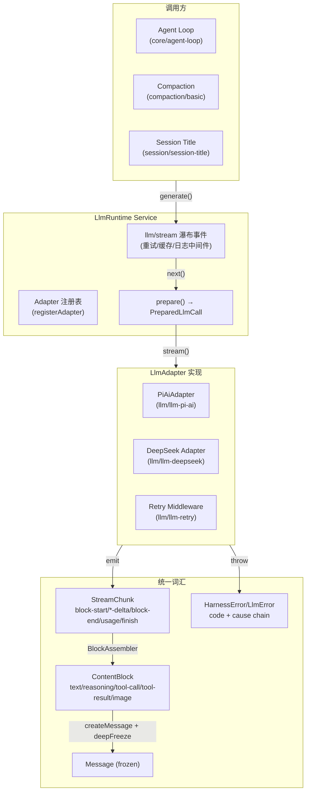

# LLM 抽象层

LLM 抽象层（`@deepseek-ai/dsh-llm`）是 deepseek-harness 的核心能力缝之一，定义了与大语言模型交互的**提供者无关（provider-neutral）**统一接口。它通过 `LlmAdapter` 抽象类屏蔽不同模型提供商（DeepSeek、PI-AI、OpenAI 兼容端点等）的 API 差异，通过 `ContentBlock`/`StreamChunk` 类型系统统一消息和流式传输词汇，通过 `BlockAssembler` 增量组装流式响应为完整消息，并提供结构化错误分类和可配置重试策略。

## 设计原理

LLM 抽象层的设计遵循以下原则：

1. **适配器模式**：每个 Provider 通过继承 `LlmAdapter` 实现 `stream()` 方法，将 Provider 原生 SSE/WebSocket 流转为统一的 `StreamChunk` 序列。
2. **瀑布拦截**：`llm/stream` 瀑布事件允许中间件（重试、缓存、日志、指标）透明地拦截和包装模型调用，无需修改适配器代码。
3. **流式优先**：所有模型调用都是流式的，非流式需求通过消费完整流来实现。`BlockAssembler` 是唯一的块组装算法，保证 replay 保真度。
4. **不可变消息**：所有 `Message` 创建后立即深度冻结（`deepFreeze`），Agent Loop 构建的请求被进程级 `WeakSet` 标记，防止意外修改。
5. **机器可路由错误**：`HarnessError.code` 提供稳定的错误码字符串，重试策略、UI 提示和日志根据 code 而非 message 文本做决策。

## 架构总览



## 核心类型系统

### ContentBlock：统一内容块

`ContentBlock` 是消息内容的最小单元，使用判别联合类型（discriminated union）通过 `type` 字段区分五种块类型，并通过 `ContentBlockMap` 接口支持插件扩展：

```typescript
// packages/llm/llm/src/types.ts
export interface TextBlock {
  type: 'text'
  text: string
}

export interface ReasoningBlock {
  type: 'reasoning'
  text: string
}

export interface ImageBlock {
  type: 'image'
  attachment: ImageAttachmentRef
}

export interface ToolCallBlock {
  type: 'tool-call'
  id: CallId
  name: string
  arguments: string  // 模型产出的原始 JSON 字符串
}

export interface ToolResultBlock {
  type: 'tool-result'
  toolCallId: CallId
  content: ContentBlock[]  // 递归嵌套
  isError?: boolean
}

export interface ContentBlockMap {
  'text': TextBlock
  'reasoning': ReasoningBlock
  'image': ImageBlock
  'tool-call': ToolCallBlock
  'tool-result': ToolResultBlock
}

export type ContentBlock = ContentBlockMap[ContentBlockType]
```

设计要点：
- `reasoning` 块（思维链/思考过程）与 `text` 块（可见文本）严格分离，UI 层可选择性展示。
- `tool-call.arguments` 保持为原始 JSON 字符串而非解析后的对象，避免双转义问题和信息丢失。
- `tool-result.content` 是 `ContentBlock[]`，支持工具返回文本、图片或嵌套的工具结果。
- `image` 块通过 `ImageAttachmentRef` 引用附件服务管理的不可变字节，不直接嵌入二进制数据。

### StreamChunk：流式传输单元

`StreamChunk` 是适配器流式输出的原始协议，采用带索引的增量协议：

```typescript
// packages/llm/llm/src/types.ts
export type StreamChunk =
  | { type: 'block-start'; index: number; blockType: ContentBlockType }
  | { type: 'text-delta'; index: number; text: string }
  | { type: 'reasoning-delta'; index: number; text: string }
  | { type: 'tool-call-delta'; index: number; id: CallId; name?: string; argumentsDelta: string }
  | { type: 'block-end'; index: number; block: ContentBlock }
  | { type: 'usage'; usage: TokenUsage }
  | { type: 'finish'; reason: FinishReason; replayState?: unknown }
```

6 种 chunk 类型按流顺序出现：
1. **block-start**：标记一个新内容块的开始，`index` 用于关联同一快的 delta。
2. **text-delta / reasoning-delta**：文本/推理内容增量。
3. **tool-call-delta**：工具调用增量（id、名称、参数片段）。
4. **block-end**：携带组装完成的完整块，关闭该索引。
5. **usage**：Token 用量统计（在 finish 前到达）。
6. **finish**：结束原因和适配器私有的 replay 状态。

### Message：不可变消息

```typescript
// packages/llm/llm/src/message.ts
export interface Message {
  id: string  // UUID
  role: 'system' | 'user' | 'assistant'
  content: ContentBlock[]
  source: MessageSource  // 消息来源追溯
}

export interface UserMessage extends Message { role: 'user' }
export interface AssistantMessage extends Message { role: 'assistant'; provenance: AssistantProvenance }
export interface ToolResultMessage extends Message { role: 'user' /* 工具结果作为 user 角色发送 */ }

export type MessageSource =
  | { kind: 'user' }
  | { kind: 'plugin'; plugin: string }
  | ModelMessageSource   // kind: 'model', provider, model, replayState
  | ToolMessageSource    // kind: 'tool', callId
  | SkillInvocationSource // kind: 'skill-invocation', name
```

所有消息通过工厂函数创建后立即冻结：

```typescript
// packages/llm/llm/src/message.ts
export function createMessage<T extends Message>(input: Omit<T, 'id'> & { id?: string }): T {
  const message = { id: input.id ?? randomUUID(), ...input } as T
  return freezeMessage(message)
}

export function freezeMessage<T extends Message>(message: T): T {
  const cloned = structuredClone(message)
  return deepFreeze(cloned)
}
```

### GenerateOptions：完整请求

```typescript
// packages/llm/llm/src/types.ts
export interface GenerateOptions {
  provider: string           // 已注册的 provider 路由
  model: string
  reasoningEffort?: ReasoningEffortId
  messages: Message[]        // 有序对话消息
  system?: string            // 系统提示词
  tools?: ToolSchema[]       // 工具 Schema（JSON Schema）
  temperature?: number
  maxTokens?: number
  stop?: string[]            // 停止序列
  signal?: AbortSignal
  sessionId?: Branded<'SessionId'>
  purpose?: 'compaction' | 'session-title'  // 辅助调用分类
}
```

## LlmRuntime：LLM 运行时服务

`LlmRuntime` 是挂载在 `ctx.llm` 上的 Cordis Service，负责适配器注册、调用准备和流式分发。

### 适配器注册

适配器通过 `registerAdapter(providers, adapter)` 注册一个或多个 provider 路由。注册是原子性的——所有路由验证通过后才生效，任何冲突（重复 provider、无效元数据）都保持注册表不变：

```typescript
// packages/llm/llm/src/index.ts
export abstract class LlmAdapter {
  // 提供 provider 显示元数据（默认 id === provider）
  providerInfo(provider: string): LlmProviderInfo {
    return { id: provider, name: provider }
  }
  // 提供该 provider 的重试策略（默认 undefined → 全局默认）
  providerRetryPolicy(provider: string): ResolvedRetryPolicy | undefined {
    return undefined
  }
  // 列出可发现的模型（advisory，非强制）
  listModels(provider: string): Promise<readonly LlmModelInfo[]> {
    return Promise.resolve([])
  }
  // 解析精确模型的元数据（context window、maxTokens、reasoning efforts）
  resolveModel(provider: string, model: string, signal?: AbortSignal): Promise<LlmResolvedModelInfo> {
    return Promise.resolve({ provider, id: model, name: model })
  }
  // 唯一必须实现的方法：流式输出 StreamChunk
  abstract stream(options: GenerateOptions): AsyncIterable<StreamChunk>
}

// LlmRuntime 注册 API
registerAdapter(providers: string[], adapter: LlmAdapter): AdapterRegistrationHandle
```

返回的 `AdapterRegistrationHandle` 是一个可调用的 disposer，同时带有 `replace(providers)` 方法支持热替换路由——PI-AI 适配器利用此功能实现配置热更新时的无缝切换。

### 瀑布事件 llm/stream

`llm/stream` 是 deepseek-harness 中最重要的瀑布事件，它包装了每次模型调用：

```typescript
// packages/llm/llm/src/index.ts
'llm/stream'(
  this: LlmRuntime,
  options: GenerateOptions,
  next: () => AsyncIterable<StreamChunk>
): AsyncIterable<StreamChunk>
```

瀑布模式允许中间件：
- **短路**：不调用 `next()`，直接 yield 自己的 chunks（如缓存命中、replay）。
- **前置**：在调用 `next()` 前修改 options（注意：Agent Loop 构建的请求是冻结的）。
- **包装**：消费 `next()` 的输出并 yield 转换后的 chunks（如重试、日志、指标）。
- **后置**：在流结束后执行副作用（如 token 计量、持久化）。

进程级 `WeakSet<GenerateOptions>` 标记 Agent Loop 组装的请求，通过 `markAgentLoopRequest`/`isAgentLoopRequest` 识别。这类请求被深度冻结，中间件只能读取不能修改——因为其内容是会话日志的纯函数（可重构性保证）。

## BlockAssembler：增量流式块组装器

`BlockAssembler` 是唯一的规范块组装算法，被 Agent Loop 用于在记录原始 chunks 的同时构建完整的 assistant 消息。

```typescript
// packages/llm/llm/src/assembler.ts
export class BlockAssembler {
  private partials = new Map<number, PartialBlock>()
  private order: number[] = []
  private _usage: TokenUsage | undefined
  private _finish: FinishReason | undefined
  private _replayState: unknown = undefined

  push(chunk: StreamChunk): void {
    switch (chunk.type) {
      case 'block-start':
        if (!this.partials.has(chunk.index)) {
          this.order.push(chunk.index)
          this.partials.set(chunk.index, { blockType: chunk.blockType, text: '', toolCallArguments: '' })
        }
        return
      case 'text-delta':
      case 'reasoning-delta': {
        const partial = this.ensure(chunk.index, chunk.type === 'text-delta' ? 'text' : 'reasoning')
        if (partial.block) return  // 已被 block-end 关闭，忽略迟到 delta
        partial.text += chunk.text
        return
      }
      case 'tool-call-delta': {
        const partial = this.ensure(chunk.index, 'tool-call')
        if (partial.block) return
        partial.toolCallId = chunk.id
        if (chunk.name) partial.toolCallName = chunk.name
        partial.toolCallArguments += chunk.argumentsDelta
        return
      }
      case 'block-end': {
        const partial = this.ensure(chunk.index, chunk.block.type)
        if (partial.block) return  // 首次关闭获胜
        partial.block = chunk.block
        return
      }
      case 'usage':
        this._usage = chunk.usage
        return
      case 'finish':
        this._finish = chunk.reason
        this._replayState = chunk.replayState
        return
    }
  }

  blocks(): ContentBlock[] {
    const blocks = this.order.map(index => this.assemble(this.mustGet(index), index))
    // max-tokens 截断时过滤掉 tool-call block（无法安全执行）
    return this.finish.kind === 'max-tokens'
      ? blocks.filter(block => block.type !== 'tool-call')
      : blocks
  }

  message(source?: MessageSource): Message {
    return createMessage({ role: 'assistant', content: this.blocks(), source })
  }

  get usage(): TokenUsage | undefined { return this._usage }
  get finish(): FinishReason { return this._finish ?? { kind: 'stop' } }
  get replayState(): unknown { return this._replayState }
}
```

关键设计：
- **容忍 delta-only 协议**：即使适配器不发送 `block-start`/`block-end`，`ensure()` 方法会自动创建 partial，delta 到达即可组装。
- **迟到 delta 防护**：block-end 到达后，同一 index 的后续 delta 被忽略，防止行为不端的适配器破坏已完成的块。
- **max-tokens 安全过滤**：当 finish reason 是 `max-tokens` 时，不完整的 tool-call 块被过滤掉——因为被截断的 JSON 参数无法安全执行。
- **首次关闭获胜**：block-end 的重入被忽略，保证流式输出与最终组装块一致。

## 错误处理体系

### HarnessError：机器可路由错误基类

```typescript
// packages/llm/llm/src/error.ts
export class HarnessError extends Error {
  readonly code: string  // 稳定的机器可路由错误码
  constructor(message: string, code: string, options?: ErrorOptions) { ... }
}

// 错误码常量
export const CONTEXT_WINDOW_EXCEEDED_CODE = 'CONTEXT_WINDOW_EXCEEDED'
export const QUOTA_EXCEEDED_CODE = 'QUOTA'
export const EMPTY_RESPONSE_CODE = 'EMPTY_RESPONSE'
export const INVALID_CREDENTIAL_CODE = 'INVALID_CREDENTIAL'
```

### LlmError：LLM 特化错误

```typescript
// packages/llm/llm/src/index.ts
export interface LlmErrorOptions extends ErrorOptions {
  status?: number                    // HTTP 状态码
  providerRetryAfterMs?: number      // Provider 请求的延迟（毫秒）
  requestId?: ProviderRequestId      // Provider 请求 ID（诊断用）
}

export class LlmError extends HarnessError {
  readonly failure: LlmFailure  // 冻结的可序列化错误事实
  constructor(message: string, code: string, options?: LlmErrorOptions) { ... }
}
```

`LlmError` 包含一个冻结的 `failure: LlmFailure` 对象，持有可序列化的错误事实（message、code、status、retryAfter、requestId），用于日志、UI 展示和重试决策。

### 错误分类函数

适配器通过正则匹配 Provider 的错误文本，将其分类为标准错误码：

```typescript
// packages/llm/llm/src/error.ts
export function isContextWindowExceededError(detail: { code?: string; message?: string }): boolean {
  // 正则匹配 "context length", "context window", "prompt is too long" 等
}
export function isQuotaExceededError(detail: { code?: string; message?: string }): boolean {
  // 正则匹配 "quota", "billing", "insufficient" 等
}

// packages/llm/llm/src/error.ts
export function errorChain(value: unknown): string {
  // 渲染 Error 的完整 cause 链和 AggregateError 成员（处理循环引用）
}
```

## 重试策略

重试策略通过 `RetryPolicyConfig` 配置，支持 normal 和 always 两种模式：

```typescript
// packages/llm/llm/src/retry-policy.ts
export const DEFAULT_MAX_RETRIES = 2
export const DEFAULT_INITIAL_DELAY_MS = 500
export const DEFAULT_MAX_DELAY_MS = 10_000
export const DEFAULT_JITTER_RATIO = 0.1

// 默认可重试错误码
const DEFAULT_RETRYABLE_CODES = new Set([
  'EMPTY_RESPONSE', 'RATE_LIMIT', 'SERVER', 'TIMEOUT', 'TRANSPORT'
])

export interface BackoffConfig {
  initialDelayMs: number
  maxDelayMs: number
  jitterRatio: number
}

export type RetryPolicyConfig =
  | { mode: 'normal'; maxRetries?: number; backoff?: BackoffConfig; retryableCodes?: readonly string[] }
  | { mode: 'always'; backoff?: BackoffConfig }  // 所有错误都重试（测试用）
```

`resolveRetryPolicy(config, path)` 函数验证配置、填充默认值，返回不可变的已解析策略对象。重试中间件（`llm/llm-retry`）通过 `llm/stream` 瀑布实现自动重试，指数退避 + jitter。

## Provider 适配器实现：PI-AI

PI-AI 适配器展示了如何实现一个完整的 Provider 插件：

```typescript
// packages/llm/llm-pi-ai/src/index.ts
export const name = 'llm-pi-ai'
export const inject = ['llm']

export async function apply(ctx: Context, config: Config): Promise<void> {
  // memoized profiles + 热更新支持
  // API Key 通过 ctx.get('credentials') 或环境变量解析
  // 通过 installSettingsSection 实现配置热更新
  // 注册 PiAiAdapter 实例到 ctx.llm
}
```

适配器的核心是 `toStreamChunks` async generator，将 PI-AI 的 SSE 事件映射为 Harness `StreamChunk`：

```typescript
// packages/llm/llm-pi-ai/src/stream.ts
export async function* toStreamChunks(
  events: AsyncIterable<AssistantMessageEvent>,
  contextWindow: number,
): AsyncGenerator<StreamChunk> {
  // 将 text/thinking/toolcall 的 start/delta/end 事件映射为
  // block-start → *-delta → block-end 序列
  // 处理 usage 映射、stop reason 映射、错误分类
}

export function mapStopReason(message, contextWindow): FinishReason {
  // context overflow → { kind: 'error', failure: { code: 'CONTEXT_WINDOW_EXCEEDED' } }
  // length → { kind: 'max-tokens' }
  // toolUse → { kind: 'tool-calls' }
  // end_turn → { kind: 'stop' }
}
```

## LlmCallConfig：调用配置

```typescript
// packages/llm/llm/src/call-config.ts
export interface LlmCallConfig {
  provider: string
  model: string
  reasoningEffort?: ReasoningEffortId
  temperature?: number
  maxTokens?: number
  stop?: string[]
}

export function callConfigEquals(a: LlmCallConfig, b: LlmCallConfig): boolean {
  // 字段级比较：stop 列表逐元素比较
}

export function deepFreeze<T>(value: T): T {
  // 迭代式深度冻结（跳过 AbortSignal 和循环引用）
}
```

## 源码链接

| 文件 | 核心内容 |
|------|---------|
| packages/llm/llm/src/index.ts | `LlmRuntime` Service、`LlmAdapter` 抽象类、`LlmError`、`llm/stream` 瀑布 |
| packages/llm/llm/src/types.ts | `ContentBlock`、`StreamChunk`、`GenerateOptions`、`TokenUsage`、`FinishReason` |
| packages/llm/llm/src/assembler.ts | `BlockAssembler` 增量组装器 |
| packages/llm/llm/src/message.ts | `Message`/`UserMessage`/`AssistantMessage`/`ToolResultMessage`、消息工厂 |
| packages/llm/llm/src/error.ts | `HarnessError`、错误码常量、`errorChain`、错误分类函数 |
| packages/llm/llm/src/call-config.ts | `LlmCallConfig`、`callConfigEquals`、`deepFreeze`、Agent Loop 请求标记 |
| packages/llm/llm/src/retry-policy.ts | 重试策略类型、默认常量、`resolveRetryPolicy` |
| packages/llm/llm-pi-ai/src/index.ts | PI-AI 适配器插件（注册、热更新、API Key 解析） |
| packages/llm/llm-pi-ai/src/stream.ts | SSE→StreamChunk 转换、错误分类、stop reason/usage 映射 |
| packages/llm/llm-pi-ai/src/config.ts | `PiAiProviderProfile`（20+ 字段）、Config schema、`resolveProfiles` |
