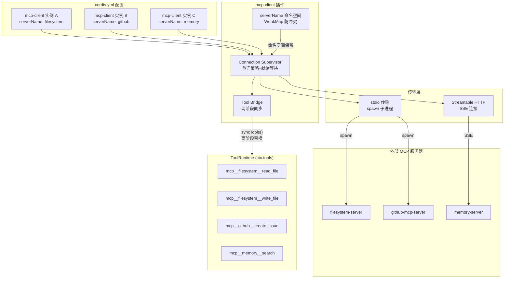

# MCP 协议集成

MCP（Model Context Protocol）是 deepseek-harness 接入外部工具生态的核心协议桥。`@deepseek-ai/dsh-mcp-client` 插件实现了 MCP 客户端，通过 stdio 子进程或 Streamable HTTP（SSE）连接到外部 MCP 服务器，将服务器暴露的工具动态注册到 `ctx.tools` 上，并在连接断开时自动重连和重新同步工具列表。

## 设计原理

1. **插件化连接**：每个 MCP 服务器连接是一个独立的 mcp-client 插件实例，在 `cordis.yml` 中声明。多服务器通过加载多个实例实现。
2. **命名空间隔离**：所有 MCP 工具以 `mcp__<serverName>__<rawName>` 格式注册，避免不同服务器间的工具名冲突。
3. **两阶段同步**：先完整获取工具列表（fetch），再原子替换（swap），保证模型看到的工具集要么是完整的上一代，要么是完整的新一代。
4. **信任边界**：MCP 服务器是外部进程，所有返回数据经过防御性校验——缺失字段、类型错误、不支持的内容类型都有降级处理。
5. **生命周期绑定**：连接、工具注册、重连循环全部通过 `ctx.effect()` 绑定到 Fiber 生命周期，插件 dispose 时自动清理。

## 架构总览



## 插件配置

mcp-client 插件支持两种传输方式，通过判别联合类型 `Config` 区分：

```typescript
// packages/mcp/mcp-client/src/index.ts
export const name = 'mcp-client'
export const inject = ['tools']

// stdio 传输配置
export interface StdioConfig {
  transport: 'stdio'
  serverName: string                    // 命名空间标识，正则 [A-Za-z0-9_-]{1,32}
  command: string                       // 可执行文件路径
  args: string[]                        // 命令行参数（不经过 shell 插值）
  env: Record<string, string>           // 额外环境变量
  cwd: string                           // 工作目录
  toolCallTimeoutMs: number             // 单次工具调用超时（默认 60s）
  failOnStartupError: boolean           // 初始连接失败是否拒绝 Fiber
  reconnect?: ReconnectConfig           // 自动重连策略
}

// Streamable HTTP 传输配置
export interface StreamableHttpConfig {
  transport: 'streamable-http'
  serverName: string
  url: string                           // MCP 端点 URL
  headers: Record<string, string>       // 额外 HTTP 头
  toolCallTimeoutMs: number
  failOnStartupError: boolean
  reconnect?: ReconnectConfig
}

export type Config = StdioConfig | StreamableHttpConfig
```

**cordis.yml 示例**：

```yaml
plugins:
  - name: '@deepseek-ai/dsh-mcp-client'
    config:
      transport: stdio
      serverName: filesystem
      command: npx
      args: ['-y', '@modelcontextprotocol/server-filesystem', '/home/user/project']
      env: {}
      cwd: ''
      toolCallTimeoutMs: 60000
      failOnStartupError: true
```

## 命名空间管理

每个 mcp-client 实例必须声明唯一的 `serverName`，通过进程级 `WeakMap<Context, Set<string>>` 跟踪活跃的命名空间，防止同一 Context 中重复：

```typescript
// packages/mcp/mcp-client/src/index.ts
const SERVER_NAME_PATTERN = /^[A-Za-z0-9_-]{1,32}$/
const activeServerNames = new WeakMap<Context, Set<string>>()

// 在 apply() 中保留命名空间
ctx.effect(() => {
  let names = activeServerNames.get(ctx.root)
  if (!names) {
    names = new Set()
    activeServerNames.set(ctx.root, names)
  }
  if (names.has(config.serverName)) {
    throw new Error(
      `mcp-client: serverName "${config.serverName}" is already in use by another mcp-client instance`
    )
  }
  names.add(config.serverName)
  return () => void names.delete(config.serverName)
}, 'mcp-client.serverName')
```

使用 `ctx.root` 作为 key 而非全局 Map，确保同一进程中多个独立 Cordis 应用（如测试场景）不会互相干扰。

### 工具名映射

MCP 服务器的原始工具名（`rawName`）通过确定性纯函数映射为模型可见的公共名：

```typescript
// packages/mcp/mcp-client/src/tools.ts
export function publicToolName(serverName: string, rawName: string): string {
  const joined = `mcp__${serverName}__${rawName}`
  const normalized = joined.replace(INVALID_NAME_CHARS, '_')
  // 若无字符替换且长度 ≤ 64，直接返回
  if (normalized === joined && normalized.length <= MAX_PUBLIC_NAME_LENGTH) return normalized
  // 有损归一化时追加 SHA-256 哈希前 12 位，确保不同身份不会折叠为同名
  const hash = createHash('sha256').update(`${serverName}\0${rawName}`).digest('hex').slice(0, HASH_LENGTH)
  return `${normalized.slice(0, MAX_PUBLIC_NAME_LENGTH - HASH_LENGTH - 1)}_${hash}`
}
```

DeepSeek 函数名约束为最多 64 字符、仅允许 `[A-Za-z0-9_-]`。当 rawName 包含非法字符或超长时，追加 12 位 SHA-256 哈希保证唯一性。公共名永远不会被解析回 rawName——执行器闭包中直接持有 rawName。

## 工具桥接与两阶段同步

工具同步是 mcp-client 的核心机制，采用**先获取后替换**的两阶段模式：

```typescript
// packages/mcp/mcp-client/src/tools.ts
export async function syncTools(
  client: Client,
  ctx: Context,
  opts: ToolBridgeOptions,
  previous: ToolDisposers,
): Promise<ToolDisposers> {
  // Phase 1: Fetch — 分页拉取完整工具列表，构建新一代 ToolDefinition
  const definitions = new Map<string, ToolDefinition>()
  let cursor: string | undefined
  do {
    const response = await listToolsUncached(client, cursor)
    for (const tool of response.tools) {
      const publicName = publicToolName(opts.serverName, tool.name)
      if (definitions.has(publicName)) {
        throw new Error(`mcp-client(${opts.serverName}): server listed tool "${tool.name}" more than once`)
      }
      definitions.set(publicName, {
        name: publicName,
        description: tool.description ?? '',
        parameters: tool.inputSchema,
        output: createOutput(tool.name, supportedOutputSchema(tool.outputSchema)),
        execute: createExecutor(client, tool.name, tool.execution?.taskSupport === 'required', opts),
      })
    }
    cursor = response.nextCursor
  } while (cursor)

  // Phase 2: Swap — 先释放旧一代，再注册新一代
  for (const dispose of previous.values()) dispose()
  const disposers: ToolDisposers = new Map()
  try {
    for (const [publicName, definition] of definitions) {
      disposers.set(publicName, ctx.tools.register(definition))
    }
  } catch (error) {
    // 注册冲突时回滚：释放已注册的部分，确保模型看到全有或全无
    for (const dispose of disposers.values()) dispose()
    ctx.logger.error(`mcp-client(${opts.serverName}): tool registration failed: ${String(error)}`)
    if (opts.registrationFailure === 'throw') throw error
    return new Map()
  }
  return disposers
}
```

**关键设计**：
- Fetch 阶段不触碰注册表，任何错误（网络、重复工具名、Schema 不兼容）保持旧一代完好。
- Swap 阶段是同步的——先 dispose 旧的，再注册新的，无中间状态。
- 注册冲突（如外部注册占用了 `mcp__<serverName>__` 前缀）回滚到零工具，防止模型看到不完整的工具集。
- 初始同步时 `failOnStartupError: true` 将冲突传播为 Fiber 拒绝，运行时重连则仅记录日志。

## 工具执行

MCP 工具执行器通过闭包捕获 rawName，调用时使用 `tools/call` 方法发送原始名称：

```typescript
// packages/mcp/mcp-client/src/tools.ts
function createExecutor(
  client: Client,
  rawName: string,
  taskRequired: boolean,
  opts: ToolBridgeOptions,
): ToolDefinition['execute'] {
  return async (args: unknown, exec: ToolExecution) => {
    if (taskRequired) {
      throw new Error(`Tool "${rawName}" requires task-based execution, which this bridge does not support`)
    }
    // 防御性处理：模型可能输出非对象参数
    const argsObj = (typeof args === 'object' && args !== null ? args : {}) as Record<string, unknown>
    const result = await callToolUncached(client, rawName, argsObj, exec, opts)

    // 结果提取与文本渲染
    if (!Array.isArray(result.content)) {
      const rendered = 'toolResult' in result ? JSON.stringify(result.toolResult) : '(no output)'
      if (result.isError === true) throw new Error(rendered)
      return { content: [{ type: 'text', text: rendered }] }
    }

    const content = result.content as unknown as JsonValue[]
    const text = extractText(content, rawName)

    if (result.isError === true) throw new Error(text)

    return {
      content,
      ...result.structuredContent !== undefined
        ? { structuredContent: result.structuredContent as JsonValue }
        : {},
    }
  }
}
```

**信任边界处理**（`extractText` 函数）：
- `text` 块：拼接文本内容
- `image`/`audio` 块：替换为占位符 `[image: mime/type, content discarded]`
- `resource`/`resource_link` 块：替换为 `[resource: content discarded]`
- 未知类型：替换为 `[unsupported content type: type]`
- 非对象/数组值：替换为 `[unsupported content type: unknown]`

所有 MCP 声明为 required 的字段（`type`、`text`、`mimeType`）都做了存在性检查，因为数据来自外部进程。

## 连接管理与重连

mcp-client 使用 `startConnection` 创建连接监督器，负责：
1. 建立初始连接（stdio 子进程或 HTTP SSE）
2. 初始工具同步
3. 连接断开时按重连策略自动重连
4. 重连成功后重新同步工具列表
5. Fiber dispose 时停止重连、等待进行中工作结束、注销当前工具

重连策略默认值：

```typescript
// packages/mcp/mcp-client/src/connection.ts
const RECONNECT_DEFAULTS = {
  enabled: true,
  initialDelayMs: 1000,
  maxDelayMs: 30000,
  maxAttempts: Number.MAX_SAFE_INTEGER,
}
```

插件激活在初始连接和工具同步完成前阻塞——`await connection.ready`。如果 `failOnStartupError` 为 true，初始失败直接 reject Fiber；否则记录错误并进入重连循环。

## McpResult 类型

MCP 工具的返回值类型 `McpResult` 保留了 MCP 协议的内容块和结构化内容：

```typescript
// packages/mcp/mcp-client/src/tools.ts
export type McpResult<Structured extends JsonValue = JsonValue> = {
  content: JsonValue[]              // MCP 内容块数组（text/image/resource 等）
  structuredContent?: Structured    // 可选的结构化输出（outputSchema 支持）
}
```

当 MCP 服务器声明了 `outputSchema` 且通过 `assertSupportedJsonSchema` 验证时，`structuredContent` 字段会包含结构化结果，供 Code Mode 等使用结构化数据的场景消费。

## 源码链接

| 文件 | 核心内容 |
|------|---------|
| packages/mcp/mcp-client/src/index.ts | 插件定义（name/inject/Config）、命名空间管理、连接启动、activate 阻塞 |
| packages/mcp/mcp-client/src/tools.ts | `publicToolName()`、`syncTools()` 两阶段同步、`createExecutor()`、`extractText()`、`McpResult` |
| packages/mcp/mcp-client/src/connection.ts | 连接监督器、重连策略、`startConnection()`、`ReconnectConfig` |
