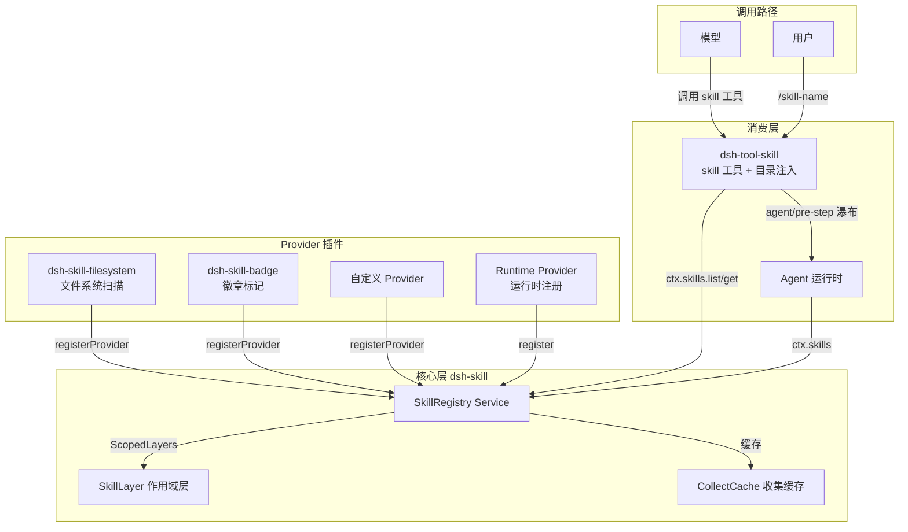
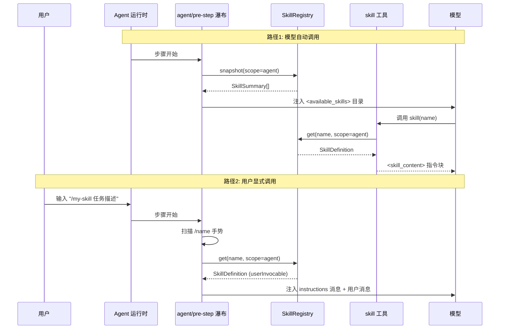

# Skill 技能系统

## 概述

Skill 技能系统是 deepseek-harness 中用于管理可复用任务指令集的核心基础设施。每个 Skill 是一个携带名称、描述、使用场景说明和 Markdown 指令正文的独立能力单元，模型可以通过 `skill` 工具按需加载其完整指令，用户也可以通过 `/skill-name` 斜杠命令显式调用。

系统采用**分层 Provider 注册表 + 作用域隔离层**架构，核心包 `@deepseek-ai/dsh-skill` 定义了 `SkillRegistry` Service 作为技能能力接缝的服务定义角色，具体的技能来源（文件系统目录、打包内置、运行时动态注册等）由独立的 Provider 插件提供，如 `@deepseek-ai/dsh-skill-filesystem`（文件系统扫描）、`@deepseek-ai/dsh-skill-badge`（徽章标记）。核心注册表仅负责合并多 Provider 目录、按名称解析获胜技能、向消费者暴露摘要和完整定义。

技能调用遵循**双路径模型**：
- **模型调用路径**：`tool-skill` 插件注册 `skill` 工具，模型在匹配到技能描述时调用该工具加载完整 `<skill_content>` 指令块
- **用户显式调用路径**：用户输入 `/skill-name` 斜杠命令，经 `agent/pre-step` 瀑布事件拦截后注入为 `instructions` 形式的上下文消息

## 设计原理

### 1. 分层 Provider 与注册表合并

`SkillRegistry` 不直接拥有技能来源，而是通过 `registerProvider()` 接受 `SkillProvider` 接口实现。每个 Provider 负责一个技能来源（如文件系统目录扫描、远程注册表、内置打包），实现 `list()` 发现候选技能和 `get()` 加载完整定义两个方法。注册表将所有 Provider 的候选合并，按**层叠优先级**决定同名技能的获胜者。

```typescript
export interface SkillProvider {
  readonly name: string
  readonly list: (options: SkillLookupOptions) =>
    Promise<readonly SkillCandidate[] | SkillProviderObservation>
  readonly get: (candidate: SkillCandidate, options: SkillLookupOptions) =>
    Promise<SkillDefinition | undefined>
}
```

Provider 可以返回完整数组（表示发现完成，结果可缓存）或 `{ candidates, complete: false }` 观察对象（表示发现未完成，结果不可缓存但可用）。这种设计允许远程 Provider 在认证或初始化尚未完成时先返回部分可用候选，避免阻塞整个目录。

### 2. 作用域层叠（Scoped Layers）

注册表利用 `@deepseek-ai/dsh-scope` 的 `ScopedLayers<SkillLayer>` 实现**作用域隔离**。每个 Cordis Context 的作用域（Scope）对应一个 `SkillLayer`，其中包含该层注册的 Provider 和运行时技能：

- **全局层（Global Layer）**：宿主配置和仓库插件注册的 Provider/技能
- **作用域层（Scope Layer）**：Agent 预设的常驻组合挂载的插件注册的技能，仅对该作用域可见

读取时，全局层最先合并，然后按作用域链从最远祖先到最近作用域依次叠加，**最近层的同名条目直接覆盖远层**，仅在同一层内才使用 `rank` 值决定优先级。这与工具注册表的遮蔽规则一致。

```typescript
class SkillLayer implements ScopeLayer {
  readonly providers: NamedEntries<RegisteredProvider>
  readonly runtime = new Map<string, SkillDefinition>()
  isEmpty(): boolean { ... }
}
```

### 3. 运行时技能注册

除了 Provider 模式，注册表还支持 `register()` 直接注册运行时技能。运行时技能使用 `rank: 250`（`RUNTIME_RANK`），优先级高于打包内置技能（`BUNDLED_SKILL_RANK = 600`，rank 值越低越优先），低于项目级技能。同一层内同名运行时技能采用"先到先得"策略，重复注册会记录警告并返回空处置器。

```typescript
export type SkillRegistration = Omit<SkillDefinition, 'invocation' | 'provider'> & {
  readonly invocation?: SkillInvocationPolicy
  readonly provider?: string
}
```

### 4. 调用策略分离

每个技能携带 `SkillInvocationPolicy`，独立控制两条调用路径的可见性：

```typescript
export interface SkillInvocationPolicy {
  readonly modelInvocable: boolean   // 是否对模型可见（出现在目录和skill工具中）
  readonly userInvocable: boolean    // 是否对用户斜杠命令可见
}
```

这使得某些技能可以仅通过用户显式命令触发（如高风险操作确认指令），或仅对模型自动决策可用而不在用户命令面板中显示。

### 5. 目录快照与增量缓存

注册表维护**收集缓存**（collectCache），以 `{cwd, scopes, revision}` 为键缓存合并后的候选映射。当 Provider 通过 `control.invalidate()` 使缓存失效、或新 Provider 注册/注销时，`revision` 递增并清空缓存。`collect()` 方法实现了**乐观重试**：如果在收集过程中 revision 发生变化（并发修改），最多重试 `MAX_COLLECT_ATTEMPTS = 2` 次，超过则返回不可缓存的结果。

```typescript
private async collect(options: SkillViewOptions): Promise<CollectResult> {
  let attempt = 1
  while (true) {
    const revision = this.revision
    const key = this.collectCacheKey(options.cwd, scopeChainOf(options.scope), revision)
    const cached = this.collectCache.get(key)
    if (cached !== undefined) return { entries: cached, cacheable: true }
    const result = await this.collectFresh(options)
    if (revision !== this.revision) {
      if (attempt < MAX_COLLECT_ATTEMPTS) { attempt += 1; continue }
      return { entries: result.entries, cacheable: false }
    }
    if (result.cacheable) { /* cache it */ }
    return result
  }
}
```

### 6. 规范化技能内容渲染

技能正文加载后通过 `renderSkillContent()` 渲染为统一的 `<skill_content>` XML 块，包含资源提示（`<skill_resources>`）和指令正文（`<skill_instructions>`），确保模型无论通过 `skill` 工具还是用户斜杠命令路径看到的格式完全一致：

```typescript
export function renderSkillContent(skill: Pick<SkillDefinition,
  'name' | 'provider' | 'resourceBase' | 'content'>): string {
  return [
    `<skill_content name="${escapeAttr(skill.name)}">`,
    '<skill_resources>', ...renderResourceHint(skill), '</skill_resources>',
    '',
    '<skill_instructions>', skill.content, '</skill_instructions>',
    '</skill_content>',
  ].join('\n')
}
```

资源基址（`SkillResourceBase`）支持三种形式：目录路径（directory）、URL（url）和不透明描述（opaque），告知模型如何解析技能正文中引用的相对路径。

## 架构图



### 双路径调用流程



## 核心类型与接口

### SkillName 验证

技能名称必须符合 kebab-case 格式：`/^[a-z0-9]+(?:-[a-z0-9]+)*$/`，由 `isSkillName()` 函数验证。

### SkillSummary（调用无关摘要）

`list()` 返回的轻量级摘要，不含完整正文：

```typescript
export interface SkillSummary {
  readonly name: string                          // kebab-case 标识符
  readonly description: string                   // 简短路由描述
  readonly whenToUse?: string                    // 额外路由指引
  readonly invocation: SkillInvocationPolicy     // 解析后的调用策略
  readonly source: SkillSource                   // 来源标签
  readonly provider: string                      // 所属 Provider 名称
  readonly resourceBase?: SkillResourceBase      // 资源基址
}
```

### SkillCandidate（Provider 目录条目）

Provider 在 `list()` 中返回的候选条目，携带优先级和不透明定位器：

```typescript
export interface SkillCandidate extends SkillSummary {
  readonly rank: number          // 数值越小优先级越高
  readonly locator: unknown      // Provider 私有的定位句柄，传回 get()
  readonly path?: string         // 绝对文件路径（如适用）
  readonly metadata?: Readonly<Record<string, unknown>>  // 解析的 frontmatter 元数据
}
```

### SkillDefinition（完整技能定义）

`get()` 返回的完整定义，包含 Markdown 正文：

```typescript
export interface SkillDefinition extends SkillSummary {
  readonly content: string       // Markdown 指令正文（已去除 Provider 特定元数据）
  readonly path?: string         // 磁盘来源路径
  readonly metadata?: Readonly<Record<string, unknown>>
}
```

### SkillProviderControl（注册生命周期控制）

Provider 注册时获得的控制对象，包含中止信号和缓存失效能力：

```typescript
export interface SkillProviderControl {
  readonly signal: AbortSignal   // 注册失败或注销时中止
  readonly invalidate: () => void // 通知目录已变更，使缓存失效
}
```

### SkillCatalogSnapshot（目录快照）

`snapshot()` 返回的观察结果，包含完成度标记：

```typescript
export interface SkillCatalogSnapshot {
  readonly skills: SkillSummary[]
  readonly complete: boolean     // 是否所有 Provider 都在稳定版本内完成发现
}
```

## tool-skill 插件：模型侧技能加载器

`@deepseek-ai/dsh-tool-skill` 包是技能系统面向模型的集成层，承担三个核心职责：

### 1. 注册 `skill` 工具

定义一个名为 `skill` 的工具，接受 `name` 参数，调用 `ctx.skills.get()` 加载技能定义并渲染为 `<skill_content>` 格式：

```typescript
const skillTool = defineTool({
  name: 'skill',
  description: 'Load the full instructions for an available skill...',
  parameters: {
    name: { type: 'string', required: true, description: 'The exact skill name...' },
  },
  output: {
    schema: { /* name, provider, resourceBase, content */ },
    render: (_args, value) => [{ type: 'text', text: renderSkillContent(value) }],
  },
  async execute(args, exec) {
    const lookup = { cwd: exec.agent?.session.header.cwd, signal: exec.signal, scope: exec.agent }
    const summary = (await ctx.skills.list(lookup)).find(skill => skill.name === args.name)
    if (!summary || !isModelInvocable(summary)) {
      throw new Error(`skill "${args.name}" is unknown or not available`)
    }
    const skill = await ctx.skills.get(args.name, lookup)
    // ...验证并返回
    return { name: skill.name, provider: skill.provider, resourceBase: {...}, content: skill.content }
  },
})
```

注意查找时 `scope: exec.agent`——Agent 本身就是作用域键，确保查找解析为该 Agent 组合所见的分层注册表。

### 2. 用户斜杠命令拦截

通过 `agent/pre-step` 瀑布事件，扫描用户消息中的 `/name` 空白边界 token（正则 `/(^|\s)\/([a-z0-9]+(?:-[a-z0-9]+)*)(?=\s|$)/g`），将匹配的用户可调用技能正文注入为 `instructions` 形式的上下文消息。此路径是 `modelInvocable: false` 技能的唯一入口。

```typescript
ctx.on('agent/pre-step', async ({ agent, messages, signal }, next): Promise<PreStepDecision> => {
  const decision = await next()
  const names = invokedSkillNames(messages)
  for (const name of names) {
    const skill = await ctx.skills.get(name, { cwd, signal, scope: agent })
    if (skill && isUserInvocable(skill)) {
      injections.push(createUserMessage({
        content: [{ type: 'text', text: renderSkillContent(skill) }],
        source: { kind: 'skill-invocation', name, form: 'instructions' },
      }))
    }
  }
  return injections.length > 0
    ? { kind: 'enter', messages: [...decision.messages, ...injections] }
    : decision
})
```

注入的消息携带 `source: { kind: 'skill-invocation', form: 'instructions' }`，通过 `MessageSourceMap` 声明合并注册到 `@deepseek-ai/dsh-llm`，使得转录消费者可以从元数据识别注入来源，而非重新解析模型面文本。

### 3. 会话技能目录发布

第二个 `agent/pre-step` 监听器负责在会话中发布和更新 `<available_skills>` 目录消息。目录消息携带 `source: { kind: 'skill-catalog', form: 'catalog', entries }`，通过 SHA-256 摘要（对 `[name, description]` 对的 JSON 规范形式计算）判断是否需要重新发布：

- 首次发布：当存在 `modelInvocable` 技能时，注入包含完整列表的 `<available_skills>` 系统提醒
- 增量更新：当摘要变化时，替换旧目录消息为"目录已变更"更新消息
- 撤回：当工具被作用域遮蔽或技能全部移除时，删除目录消息

目录注入的位置确定性由注册顺序保证——斜杠命令监听器先注册（瀑布中先执行），目录监听器后注册（后执行），因此目录消息位于注入消息之前，而用户斜杠命令注入的指令位于最后（最靠近模型回答），符合"模型必须最后遵循的材料"原则。

## skill-filesystem Provider

`@deepseek-ai/dsh-skill-filesystem` 提供基于文件系统的技能发现能力，扫描指定目录下的 Markdown 文件作为技能来源，支持文件监视（watcher）实时更新。当文件变更时调用 `control.invalidate()` 通知注册表刷新缓存。

## skill-badge Provider

`@deepseek-ai/dsh-skill-badge` 提供徽章标记能力，为技能添加视觉标记（如徽章图片），用于在 UI 中标识技能的来源或认证状态。

## 事件系统

注册表通过 Cordis Events 声明合并暴露 `skills/change` 事件：

```typescript
declare module '@deepseek-ai/cordis' {
  interface Events {
    'skills/change'(): void
  }
}
```

当 Provider 注册/注销、运行时技能变更或 Provider 主动失效时触发此事件。消费者（如 UI 技能面板）应重新拉取目录。监听器失败被隔离（try/catch 包裹），不会阻塞注册表变更。

## 安全与隔离

1. **内容转义**：`escapeAttr()` 和 `escapeText()` 函数对技能名称和正文中的 `&`、`<`、`>`、`"` 进行 XML 转义，防止 Provider 提供的文本意外闭合或打开框架标签
2. **"runtime" 名称保留**：`registerProvider()` 禁止使用 `"runtime"` 作为 Provider 名称，该名称保留给注册表内置的运行时 Provider
3. **取消传播**：所有 Provider 操作和加载操作都接受 `AbortSignal`，并通过 `waitWithAbort()` 竞态包装确保不合作的 Provider 不能挂起调用者
4. **作用域隔离**：通过 `ScopedLayers` 确保 Agent 预设中的技能注册不会泄漏到全局，实现组合的隔离性
5. **定义校验**：`validateDefinition()` 对从 Provider 加载的定义进行严格类型校验，确保恶意或错误的 Provider 不能返回不合法的数据

## 源码索引

| 文件 | 职责 |
|------|------|
| skill/src/index.ts | SkillRegistry 核心实现、Provider 接口、类型定义、内容渲染 |
| tool-skill/src/index.ts | skill 工具定义、用户斜杠命令拦截、会话目录发布 |
| skill-filesystem/src/index.ts | 文件系统 Provider、目录扫描、文件监视 |
| skill-badge/src/index.ts | 徽章标记 Provider |
