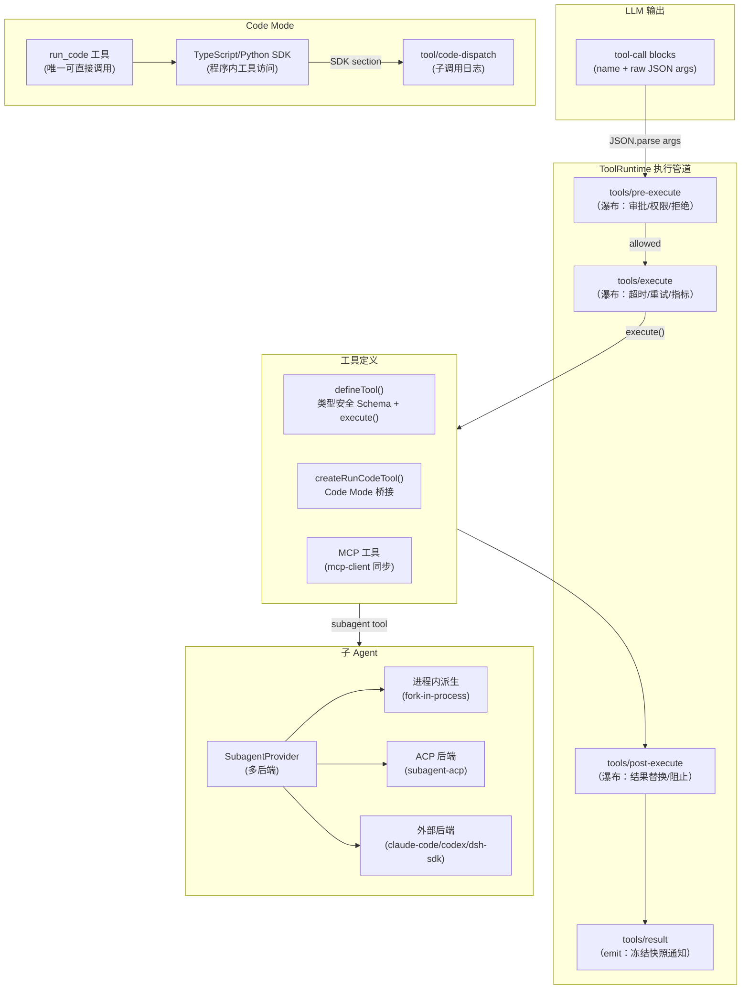

# 工具系统与子 Agent

工具系统（`@deepseek-ai/dsh-tools`）是 deepseek-harness 中模型与外部能力交互的核心通道，提供类型安全的工具定义（`defineTool`）、四级瀑布式执行管道、参数校验、呈现层投影和 Code Mode 代码执行桥接。子 Agent 系统（`@deepseek-ai/dsh-subagent`）建立在工具系统之上，允许 Agent 派生专门的子 Agent 执行委托任务，支持进程内派生、ACP/SDK 跨进程派生、Claude Code/Codex 外部后端等多种实现。

## 工具系统设计原理

1. **类型安全的 Schema DSL**：`defineTool` 使用 TypeScript 类型推断从 Schema Spec 自动推断参数类型，16 层递归深度后回退为 `JsonValue`。
2. **瀑布式执行管道**：`pre-execute → execute → post-execute → result` 四级瀑布，允许审批、超时、重试、指标、结果替换等切面。
3. **不可变执行上下文**：`ToolExecution` 对象在管道中被深度冻结，工具体只能通过 `exec.signal` 响应取消。
4. **模型可见性控制**：`ToolSchema`（发送给模型的 JSON Schema）只包含 name/description/parameters，timeout/presentation 等元数据不出现在模型上下文中。
5. **Code Mode 隔离**：在 code 模式下，模型只能直接调用 `run_code` 工具，所有其他工具必须通过程序内 SDK 访问，防止模型绕过代码执行环境直接操作宿主。

## 工具架构总览



## defineTool：类型安全工具定义

`defineTool` 是工具定义的核心 API，它接收一个 Schema Spec 和执行函数，自动推断参数类型：

```typescript
// packages/core/tools/src/schema.ts
export interface ValueSchemaAnnotations {
  description?: string
  title?: string
  default?: JsonValue
  examples?: JsonValue
}

export interface StringValueSchemaSpec extends ValueSchemaAnnotations {
  type: 'string'
  enum?: readonly string[]
  const?: string
}

export interface ObjectValueSchemaSpec extends ValueSchemaAnnotations {
  type: 'object'
  properties?: ParameterSchemaSpec
  additionalProperties: boolean  // 必填，防止意外开放
}

export type ValueSchemaSpec =
  | StringValueSchemaSpec | NumberValueSchemaSpec | IntegerValueSchemaSpec
  | BooleanValueSchemaSpec | NullValueSchemaSpec | ArrayValueSchemaSpec
  | ObjectValueSchemaSpec | JsonValueSchemaSpec | OneOfValueSchemaSpec

export type ParameterSchemaSpec = {
  [key: string]: ParameterPropertySpec  // implicit open object root
}

// 类型推断：16 层递归深度
export type InferValue<S> = InferValueAt<S, []>
export type InferArgs<S> = InferProperties<S, []>
```

Schema 编译器采用迭代式任务队列（非递归），避免深层嵌套导致的栈溢出，并检测循环引用：

```typescript
// packages/core/tools/src/schema.ts —— 迭代式编译
function runSchemaCompiler(initial: CompileTask): void {
  const seen = new Set<object>()
  const tasks: CompileTask[] = [initial]
  for (let task = tasks.pop(); task !== undefined; task = tasks.pop()) {
    // 处理 value/property-map/property 等任务类型
    // seen 集合检测循环引用
  }
}
```

## ToolDefinition：注册到运行时的工具

每个注册到 ToolRuntime 的工具遵循 `ToolDefinition` 接口：

```typescript
// packages/core/tools/src/index.ts
export interface ToolDefinition extends ToolSchema {
  readonly output: ToolOutputDefinition    // 规范输出声明
  execute(args: unknown, exec: ToolRunContext): Promise<unknown>
  finalizeContent?(exec: Readonly<ToolExecution>, result: Readonly<ToolExecutionResult>): ContentBlock[] | undefined
  timeoutMs?: number                       // 协作式超时预算
  isConcurrencySafe?(args: unknown): boolean  // 是否可并行执行
  presentCall?(args: unknown): ToolCallView | undefined
  presentResult?(args: unknown, result: ToolResult): ToolResultView | undefined
}

export interface ToolOutputDefinition {
  readonly schema: JsonSchemaNode          // 输出 JSON Schema
  render(args: unknown, value: JsonValue): ContentBlock[]  // 投影为模型可见内容
  presentationMeta?(args: unknown, value: JsonValue): JsonValue
}

export interface ToolResult {
  content: ContentBlock[]
  isError: boolean
  meta?: JsonValue
}
```

`ToolSchema`（发送给模型的精简版本）只包含 name/description/parameters，timeout、presentCall 等运行时元数据不会暴露给模型。

## 四级瀑布执行管道

ToolRuntime 通过 Cordis 瀑布事件实现 AOP 风格的执行管道：

```typescript
// packages/core/tools/src/index.ts —— 四级瀑布事件声明
interface Events {
  // 1. 前置决策：允许/拒绝/询问用户
  'tools/pre-execute'(
    this: Scoped<ToolRuntime>, exec: ToolExecution,
    next: () => Promise<PreToolDecision>
  ): Promise<PreToolDecision>

  // 2. 执行包装：超时、重试、指标采集
  'tools/execute'(
    this: Scoped<ToolRuntime>, exec: ToolDispatchExecution,
    next: () => Promise<ToolExecutionResult>
  ): Promise<ToolExecutionResult>

  // 3. 后置处理：接受/替换/阻止结果
  'tools/post-execute'(
    this: Scoped<ToolRuntime>, exec: ToolExecution,
    result: Readonly<ToolExecutionResult>,
    next: () => Promise<PostToolDecision>
  ): Promise<PostToolDecision>

  // 4. 最终通知：冻结快照，观察者模式
  'tools/result'(
    this: Scoped<ToolRuntime>, exec: Readonly<ToolExecution>,
    result: Readonly<ToolExecutionResult>
  ): undefined
}
```

**执行流程**：
1. **pre-execute**：审批服务（`dsh-user-approval`）在此拦截，返回 `allow`/`deny`/`ask`。缺少审批支持时 `ask` 映射为拒绝。
2. **execute**：超时策略（`dsh-timeout-policy`）、重试策略、并发控制在此包装。Wrapper 只能替换 `exec.signal`，不能改变调用身份。
3. **post-execute**：结果被接受、替换或阻止。抛出的工具也以 error 形式到达此瀑布。
4. **result**：`tools/result` 是普通 emit 事件，传递深度冻结的执行对象和结果快照，监听器失败被隔离。

所有瀑布都支持 **Agent 作用域过滤**（`Scoped<ToolRuntime>`）：Agent 级监听器只接收该 Agent 作用域内的工具调用。

### 执行身份与取消

```typescript
// packages/core/tools/src/index.ts
export interface ToolExecutionInput {
  readonly callId: CallId
  readonly rootCallId?: CallId       // 根调用 ID（嵌套时传播）
  readonly name: string
  readonly arguments: unknown        // lossless JSON 快照
  readonly agent?: Agent
  readonly parent?: ToolExecutionToken  // 父执行 token（Code Mode 子调用）
  readonly signal: AbortSignal       // 调用方取消信号
}

export interface ToolExecution extends ToolExecutionInput {
  readonly rootCallId: CallId        // 解析后的根调用 ID
  readonly token: ToolExecutionToken  // 注册部分配的不透明 token
}
```

Registry 在 around-dispatch 瀑布中融合所有 signal 替换，确保 wrapper 不能分离调用方取消：`ToolDispatchExecution.signal` 是 wrapper 可见的信号，但 Registry 在调用 body 前重新融合原始调用方 signal。

## Code Mode

Code Mode 是 deepseek-harness 的核心安全机制——在 `mode: 'code'` 下，模型只能直接调用 `run_code` 一个工具，所有其他工具必须通过程序内 SDK 访问。

```typescript
// packages/core/tools/src/code-mode.ts
export const RUN_CODE_NAME = 'run_code'

const CODE_ONLY_INSTRUCTION =
  `\`${RUN_CODE_NAME}\` is the only tool you can call directly — a tool call naming any other tool fails. ` +
  'Reach every tool the SDK declares below from inside the program.'

// SDK 渲染器映射：TypeScript 和 Python
const SDK_RENDERERS: Record<string, (schemas: ToolSdkSchema[]) => string> = {
  typescript: renderToolsSdk,
  python: renderToolsSdkPy,
} satisfies Record<CodeSdkLanguage, (schemas: ToolSdkSchema[]) => string>
```

Code Mode 的工作方式：
1. 系统提示词中插入 `CODE_ONLY_INSTRUCTION` 和 SDK section（类型签名+文档）。
2. 模型产出 `run_code` 调用，传入 TypeScript 或 Python 源码。
3. Code Runtime（`dsh-code-runtime`）在沙箱中执行程序。
4. 程序通过 SDK 调用工具（`sdk.readFile()`、`sdk.exec()` 等）。
5. 每个 SDK 子调用产生 `tool/code-dispatch` 事件（携带父执行 token），可通过 `tools/code-dispatch-log` 瀑布裁剪日志内容（如溢出策略的预览+定位符）。
6. 程序返回后，结果投影为 ContentBlock 作为 `run_code` 的输出。

```typescript
// Code Mode 子调用日志事件
interface CodeDispatchLog {
  readonly exec: ToolExecution        // 外层 run_code 执行
  readonly agent?: Agent
  readonly subCallId: CallId          // <parent>:code:<n>
  readonly name: string               // 子工具名
  readonly isError: boolean
  readonly content: ContentBlock[]    // 子调用结果内容
}
```

## 子 Agent 系统

子 Agent 系统通过 `SubagentProvider` 接口支持多种后端实现，允许 Agent 将任务委托给专门的子 Agent。

### SubagentProvider 接口

```typescript
// packages/subagent/subagent/src/types.ts
export interface SubagentCapabilities {
  readonly outputSchema: boolean      // 支持结构化输出 Schema
  readonly depthLimit: boolean        // 支持委托深度限制
  readonly toolFilter: boolean        // 支持工具过滤
  readonly persona: boolean           // 支持子 Agent 人格
}

export interface SubagentStartRequest {
  readonly label?: string
  readonly prompt: ContentBlock[]
  readonly parent: Agent              // 发起方 Agent
  readonly signal: AbortSignal
  readonly agentOptions?: AgentOptions
  readonly outputSchema?: ObjectJsonSchema
  readonly maxDepth?: number          // 委托深度上限
  readonly toolFilter?: ToolRestriction
  readonly persona?: string
}
```

### 子 Agent 后端

deepseek-harness 提供多种 SubagentProvider 实现：

| 后端包 | 类型 | 说明 |
|--------|------|------|
| `subagent-fork-in-process` | 进程内 | 在同一进程中 fork 新 Agent（共享 Context，通过作用域隔离） |
| `subagent-spawn-in-process` | 进程内 | 同上但通过 spawn 语义创建 |
| `subagent-in-process-driver` | 进程内 | 带 preset 继承的进程内驱动 |
| `subagent-acp` | 跨进程 | 通过 ACP 协议连接外部 Agent 进程 |
| `subagent-dsh-sdk` | 跨进程 | 通过 SDK JSON-RPC 协议连接 dsh runtime 子进程 |
| `subagent-claude-code` | 外部 | 连接 Claude Code CLI 后端 |
| `subagent-codex` | 外部 | 连接 OpenAI Codex CLI 后端 |

### 子 Agent 生命周期事件

```typescript
// packages/sdk/protocol/src/types.ts
export interface SubagentStartedNotification {
  parentSessionId: string
  childSessionId: string
}

export interface SubagentFinishedNotification {
  provider: string
  agentId: string
  parentSessionId: string
  childSessionId: string
  status: SdkRunStatus       // 'ok' | 'error'
  stopReason: SubagentStopReason
  lastAssistantMessage?: ContentBlock[]
}
```

### 可续子 Agent（Continuable Subagent）

部分子 Agent 支持 continuation——在 turn 结束后继续运行（如后台任务）。ACP 关闭时通过结构类型调用 `drainContinuableDescendants`：

```typescript
// packages/acp/acp/src/index.ts
interface ContinuableDrain {
  drainContinuableDescendants(parents: readonly Agent[]): Promise<void>
}
```

此接口采用鸭子类型而非硬依赖，使得 ACP 包不需要 import subagent 包。

### 委托深度控制

子 Agent 创建时自动继承父 Agent 的 `delegationDepth`，每级递减，达到上限时拒绝继续委托，防止无限递归：

```typescript
// CreateAgentOptions.meta.delegationDepth
// 子 Agent 的 depth = parent.depth - 1
// depth = 0 时不允许继续创建子 Agent
```

### 工具过滤与人格

进程内子 Agent 支持 `toolFilter`（通过 scoped `tools.restrict()` 实现）和 `persona`（通过 scoped persona section 覆盖宿主人格），这两个能力需要 SubagentProvider 声明 `toolFilter: true` 和 `persona: true` capability，否则启动时拒绝。

## 源码链接

| 文件 | 核心内容 |
|------|---------|
| packages/core/tools/src/index.ts | `ToolRuntime` Service、四级瀑布事件、`ToolDefinition`、执行管道 |
| packages/core/tools/src/schema.ts | `defineTool`、`ValueSchemaSpec`、`ParameterSchemaSpec`、类型推断、迭代式 Schema 编译器 |
| packages/core/tools/src/code-mode.ts | `createRunCodeTool`、`RUN_CODE_NAME`、SDK section 渲染、Code Mode 指令 |
| packages/core/tools/src/types.ts | `CodeDispatchStartEventData`、`CodeDispatchEventData`、code-dispatch 事件 |
| packages/subagent/subagent/src/types.ts | `SubagentStartRequest`、`SubagentCapabilities`、`SubagentRunInfo/EndInfo` |
| packages/subagent/subagent/src/index.ts | Subagent 服务注册与生命周期管理 |
| packages/mcp/mcp-client/src/tools.ts | MCP 工具桥接（执行器、结果提取、输出 Schema） |
