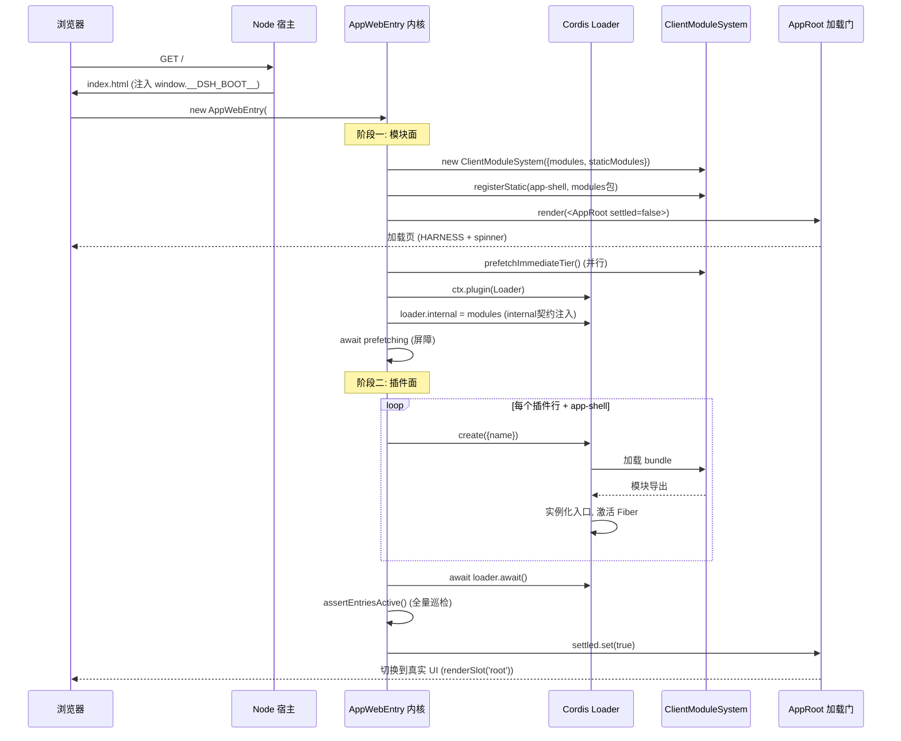
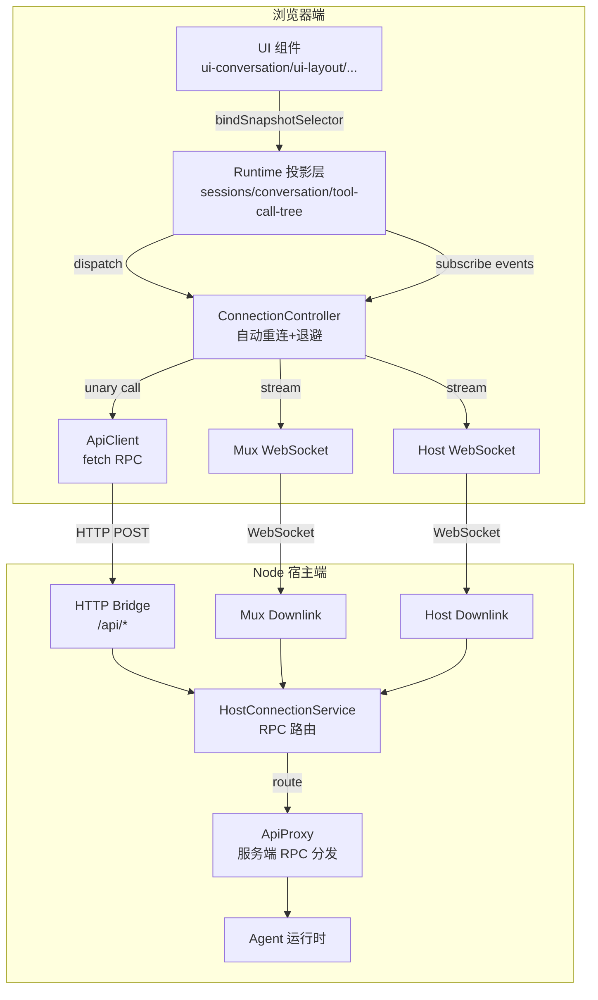

# Web 客户端架构

## 概述

deepseek-harness 的 Web 客户端是一个基于 React + Cordis 插件架构的渐进式 Web 应用，负责在浏览器中提供 Agent 交互界面、会话管理、工具调用可视化和实时通信能力。整个客户端系统采用**微内核+插件**设计：核心外壳（Shell）仅包含引导启动逻辑、模块加载器和加载页 UI，所有功能（会话管理、聊天界面、附件、命令面板、布局等）均通过独立的插件包动态加载。

客户端的包组织按职责分层：

| 包名 | 职责 |
|------|------|
| `@deepseek-ai/dsh-client-web` | Web 外壳内核（引导、模块表、加载状态、AppShell 组装） |
| `@deepseek-ai/dsh-client-modules` | 模块系统（Node 端清单生成 + 浏览器端模块加载） |
| `@deepseek-ai/dsh-client-connection` | 连接层（HTTP API 桥接 + 双工 WebSocket 通信） |
| `@deepseek-ai/dsh-client-runtime` | 运行时状态管理（会话投影、工作区、工具调用树、子Agent 谱系） |
| `@deepseek-ai/dsh-client-hmr` | 热模块替换（开发模式） |
| `@deepseek-ai/dsh-client-locale` | 国际化（语言切换、设置存储） |
| `@deepseek-ai/dsh-client-schema-form` | Schema 表单渲染 |
| `@deepseek-ai/dsh-client-ui-*` | UI 组件包（布局、对话、附件、命令、目标栏、任务列表等） |

## 设计原理

### 1. 外壳自足原则（Shell Self-Sufficiency）

Web 外壳的核心设计原则是：**加载页必须在插件失败时仍能正常工作**。`AppWebEntry` 内核在启动过程中不 value-import 任何插件包，因为加载页的使命恰恰是在插件加载失败时提供有意义的错误报告（"fail loud"）。如果加载页依赖了正在加载的插件系统，就会出现"报错页面自身崩溃"的悖论。

因此，内核自带一套极简的信号/存储实现（`createSignal`、`createLoaderStatusStore`），不依赖运行时包的 snapshot-store 机制：

```typescript
// loader-status.ts — 内核自带的可观察信号
export interface KernelValueSignal<T> extends KernelSignal<T> {
  set: (next: T) => void
}

export function createSignal<T>(init: T): KernelValueSignal<T> {
  let value = init
  const listeners = new Set<() => void>()
  return {
    getSnapshot: () => value,
    subscribe: (fn) => { listeners.add(fn); return () => { listeners.delete(fn) } },
    set: (next) => { value = next; for (const fn of [...listeners]) fn() },
  }
}
```

这套实现兼容 React `useSyncExternalStore` 契约，使 `AppRoot` 能在零插件依赖下响应式渲染加载状态。

### 2. 两阶段引导流程

`AppWebEntry.run()` 执行精确编排的两阶段启动：

**阶段一（模块面）：** 解析 `window.__DSH_BOOT__` 引导清单 → 构建模块系统 → 渲染加载页 → 并行预取 `immediately` 层级包 + 挂载 Cordis Loader（注入 `internal` 模块契约，防止浏览器环境下裸 `import()` 回退）→ 等待预取屏障。

**阶段二（插件面）：** 注册 modules 包自身入口 → 为每个插件行创建 Loader 入口 → 等待 `loader.await()` → 执行 Fiber 全量巡检（所有入口必须 ACTIVE）→ 翻转 settled 信号切换到真实 UI。

```typescript
async run(): Promise<void> {
  // 阶段一: 解析清单 + 构建模块系统 + 渲染加载页
  this.manifest = parseBootManifest((globalThis as DshWindow).__DSH_BOOT__)
  this.modules = new ClientModuleSystem({
    modules: this.manifest.modules, staticModules: getStaticModules(), ...this.seams,
  })
  this.modules.registerStatic(APP_SHELL_ID, AppShell)
  this.modules.registerStatic(MODULES_ID, ModulesClient)

  this.root = createRoot(this.el)
  this.root.render(<AppRoot settled={...} status={...} error={...} renderApp={...} />)

  const prefetching = this.prefetchImmediateTier()
  this.ctx = new Context()

  // 阶段二: 插件引导
  try {
    await this.runPluginBoot(prefetching)
    this.settled.set(true)  // 一次性切换到真实 UI
  } catch (reason) {
    this.error.set(...)     // 停留在加载页，显示错误
  }
}
```

关键设计决策：
- **`internal` 契约先于入口注入**：Loader 的 `internal` 属性在任何入口创建前就设置为模块系统实例，确保 `tree.import()` 永远不会回退到裸 `dynamic import()`（浏览器环境下必然失败）
- **预取屏障**：`immediately` 标记的包必须在入口创建前完成预取，因为包实现化（materialization）会运行跨包的同步 `require` 边（如 `locale → runtime/client`），需要所有立即层工厂已注册
- **预取失败不阻断**：单个包预取失败静默解决（`catch(() => {})`），后续 import 路径会重新加载并大声报错，防止一个坏包导致整站白屏

### 3. 静态模块表与平台单例

为了避免多个插件 bundle 各自打包 React/Cordis 等基础库导致多实例问题，外壳维护一张**冻结模块表**（frozen module table），通过 `PLATFORM_MODULES` 常量作为唯一真值来源：

```typescript
// platform.ts — 平台共享模块清单（tsdown externals 投影的唯一来源）
export const PLATFORM_MODULES = [
  'react', 'react/jsx-runtime', 'react-dom', 'react-dom/client', '@deepseek-ai/cordis',
  '@deepseek-ai/dsh-client-ui-slots',
  '@deepseek-ai/dsh-client-web-react',
  '@deepseek-ai/dsh-client-ui-primitives',
  '@deepseek-ai/dsh-client-ui-attachment',
  '@deepseek-ai/dsh-client-schema-form',
] as const
```

`seed.ts` 中的 `getStaticModules()` 将这些模块的实际导出对象组装为 `Record<string, unknown>`，传入 `ClientModuleSystem`，所有插件 bundle 的 `require()` 调用对这些模块名直接返回表单例，确保 React Context、Cordis 上下文等全局单例的一致性。

### 4. 引导清单（Boot Manifest）

Node 端 `ClientModuleRegistry` 负责扫描 Cordis Loader 的所有入口，识别声明了 `dsh.client: { platform: 'web' }` 的包，为每个包生成 `WebBootEntry`（包含 id、URL、内容哈希 rev、inject 依赖边、immediately 标记），并组装为 `WebBootGraph`：

```typescript
interface WebBootEntry {
  id: string                          // 包名（图行 id = 入口名）
  url: string                         // /plugins/<id>/client.js?rev=<hash>
  rev: string                         // 内容 SHA-1 短哈希（缓存破坏）
  inject?: string[]                   // Cordis inject 依赖边
  immediately?: boolean               // 是否预取
}

interface WebBootGraph {
  rev: string                         // 图整体哈希
  entries: WebBootEntry[]
}
```

图通过 `injectBootManifest()` 注入到 `index.html` 的 `<head>` 中作为 `window.__DSH_BOOT__`，JSON 中的 `<` 被转义为 `\u003c` 防止插件控制的字符串跳出 script 元素。

每个包的客户端 bundle 通过 `/plugins/<id>/client.js?rev=<hash>` 路由提供，rev 作为查询参数实现缓存破坏。HMR 模式下 `rebuilt()` 方法重新计算哈希并通知图变更。

### 5. Fiber 状态巡检（Fail-Loud Sweep）

`loader.await()` 解析后，`assertEntriesActive()` 对所有入口执行全量巡检：

- **无 Fiber**：import 失败，记录"import failed"
- **Fiber PENDING**：所需服务未到达（Cordis inject 等待无超时，此巡检是故障兜底），列出缺失服务名
- **Fiber FAILED**：apply() 抛出异常
- **Fiber ACTIVE**：正常

任何非 ACTIVE 入口都会抛出聚合错误，`run()` 捕获后在加载页展示失败报告，**绝不渲染部分 UI**（fail loud, no partial UI）：

```typescript
private assertEntriesActive(): void {
  const failures: string[] = []
  for (const entry of ctx.loader.entries()) {
    if (entry.fiber === undefined) {
      failures.push(`${name}: import failed (see console for the import error)`)
      continue
    }
    const state = STATE_LABELS[entry.fiber.state]
    if (state === 'active') continue
    if (state === 'pending') {
      const missing = Object.keys(entry.fiber.inject)
        .filter(service => ctx.get(service) === undefined)
      failures.push(`${name}: pending (waiting for: ${missing.join(', ')})`)
    } else {
      failures.push(`${name}: ${state}`)
    }
  }
  if (failures.length > 0) throw new Error(`web boot: ${failures.length} entries did not activate\n${failures.join('\n')}`)
}
```

### 6. AppRoot 加载门

`AppRoot` 组件是一个引导门（boot gate），根据 `settled` 信号在加载页和真实 UI 间切换：

- **未 settled**：显示加载页——HARNESS logo + 旋转器 + "Loading plugins…"；若有错误或失败入口，显示"Failed to load plugins"红色面板，列出失败的入口 ID 和错误消息
- **已 settled**：调用 `renderApp()` 渲染真实 UI 树

加载页使用 CSS Modules（`AppRoot.module.css`）进行样式隔离，零外部 UI 依赖。

### 7. AppShell 组装插件

`app-shell` 是外壳唯一自有的插件（伪入口 ID `@deepseek-ai/dsh-client-app-shell`），不存在对应的 npm 包。它在 inject 集合（`['slots', 'sessions', 'layout']`）满足后激活，执行两个关键操作：

1. **安装 Slot 渲染器**：`ctx.slots.install(createSlotRenderer())` 将 React Slot 渲染器安装到 slots 服务
2. **提供 renderApp**：通过 `ctx.reflect.provide('appShell', ...)` 暴露组装后的 UI 工厂，延迟构建 `buildRenderApp()` 闭包确保身份稳定

```typescript
// app-shell.ts
export const inject = ['slots', 'sessions', 'layout']

export function apply(ctx: Context): void {
  ctx.slots.install(createSlotRenderer())
  let renderApp: (() => ReactNode) | undefined
  ctx.reflect.provide('appShell', {
    renderApp: (): ReactNode => {
      renderApp ??= buildRenderApp({ ctx })
      return renderApp()
    },
  })
}
```

`buildRenderApp()` 创建真实 UI 树——整个应用只调用一次 `ctx.slots.renderSlot('root', {})`，`ui-layout` 插件注册 `AppFrame` 到 `root` Slot 并在内部渲染子 Slot 列：

```typescript
// app.tsx
export function buildRenderApp(deps: AssemblyDeps): () => ReactNode {
  const { ctx } = deps
  const sessions = ctx.get('sessions')
  const useSessions = bindSnapshotSelector(sessions.list)
  const SessionDocumentTitle = () => {
    const title = useSessions(state => {
      const id = state.current
      return id === undefined ? undefined : state.byId[id]?.title
    })
    return <DocumentTitle {...title === undefined ? {} : { title }} />
  }
  return () => (
    <>
      <SessionDocumentTitle />
      {ctx.slots.renderSlot('root', {})}
    </>
  )
}
```

### 8. 连接层：HTTP + 双工 WebSocket

`@deepseek-ai/dsh-client-connection` 提供浏览器与宿主之间的通信层，采用**HTTP API + 双 WebSocket 流**架构：

- **HTTP API**（`/api/*`）：Unary RPC 调用，通过 fetch 发送 JSON 请求
- **Mux WebSocket**（`/api/events/mux`）：多路复用事件流，承载会话事件、工具调用更新等
- **Host WebSocket**（`/api/events/host`）：宿主状态事件流

`ConnectionController` 负责连接生命周期管理，实现自动重连与指数退避：

```typescript
export class ConnectionController {
  private generation = 0    // 连接代数（每次重连递增）
  private attempt = 0       // 连续失败尝试次数

  start(): void {
    if (this.running) return
    this.running = true
    void this.loop()
  }

  private async loop(): Promise<void> {
    while (this.running) {
      const gen = ++this.generation
      const ac = new AbortController()
      // 同时打开两个 WebSocket 流
      const failed = new Promise<void>(resolve => {
        void this.pumpStream(this.api.events.mux({}, ac.signal, muxOpened), sinks.onMuxEnvelope, resolve)
        void this.pumpStream(this.api.events.host({}, ac.signal, hostOpened), sinks.onHostEnvelope, resolve)
      })
      try {
        // 严格就绪握手：describe + streamsOpen + 超时保护
        const [description] = await Promise.all([
          this.api.host.describe({}),
          Promise.race([streamsOpen, sleep(this.config.streamOpenTimeoutMs, timeout.signal)]),
        ])
        this.attempt = 0
        this.emitState('connected')
        this.sinks.onConnected?.(description.value)
      } catch { /* 传输失败 */ }

      await failed  // 等待任一stream断开
      this.emitState('reconnecting')
      this.attempt += 1
      await sleep(this.backoffDelay(this.attempt), idle.signal)  // 指数退避
    }
  }
}
```

**信任边界**：`api-request-trust` 实现 DNS 重绑定防护——非 loopback 请求必须匹配 `trustedHosts` 配置中的 Host 头。`PRIVILEGED_METHODS` 集合中的方法（设置读写、凭证管理、目录选择、LLM 模型发现等）即使在可信主机部署下也仅允许 loopback 访问，因为它们涉及宿主桌面操作、配置变更和秘密存储。

### 9. 运行时状态投影

`@deepseek-ai/dsh-client-runtime` 提供浏览器端的状态管理层，核心职责包括：

- **会话管理**：`SessionsService` 管理多会话列表、当前会话切换、会话事件投影
- **对话投影**：从 Wire 事件流构建本地对话状态（消息列表、部分流式消息、失败展示）
- **工具调用树**：`ToolCallTree` 追踪嵌套工具调用的层级关系
- **子Agent 谱系**：`SubagentLineage` 追踪子 Agent 的父子关系和委派深度
- **工作区管理**：`WorkspacesService` 管理工作区路径和打开状态
- **队列镜像**：`QueueMirror` 镜像服务端执行队列状态到 UI
- **转向计时**：`AssistantTiming` 追踪助手响应延迟指标
- **投影存储**：`ProjectionStore` 提供基于快照的响应式状态存储，兼容 `useSyncExternalStore`

运行时通过 Connection 层接收服务端事件，增量更新本地投影存储，UI 组件通过 `bindSnapshotSelector` 订阅状态切片。

### 10. Slot 组合式 UI

UI 架构基于 **Slot 模式**（`@deepseek-ai/dsh-client-ui-slots`）：各 UI 插件向命名 Slot 注册 React 组件，`ui-layout` 的 `AppFrame` 提供三栏布局骨架（左栏/中栏/右栏），每个栏位是一个 Slot，其他插件将面板组件注册到对应 Slot。

主要 Slot 包括：
- `root`：根 Slot，AppFrame 注册于此
- 对话区相关 Slot（消息列表、输入框、队列停靠栏）
- 目标栏（GoalBar）Slot
- 附件栏 Slot
- 命令面板 Slot
- 目录选择器 Slot

这种设计使 UI 布局完全由插件组合决定，外壳不硬编码任何界面结构。

## 架构图

### 引导流程



### 运行时通信架构



### 分层依赖

```mermaid
graph TB
    subgraph "外壳层 (Shell)"
        BOOT[boot.tsx<br/>AppWebEntry]
        APP_ROOT[AppRoot.tsx<br/>加载门]
        SEED[seed.ts<br/>静态模块表]
        PLATFORM[platform.ts<br/>平台模块清单]
        SHELL[app-shell.ts<br/>组装插件]
        STATUS[loader-status.ts<br/>内核信号]
    end

    subgraph "基础设施层 (Infrastructure)"
        MODS[client-modules<br/>模块系统+清单]
        CONN[client-connection<br/>连接层+信任边界]
        HMR[client-hmr<br/>热替换]
    end

    subgraph "运行时层 (Runtime)"
        RUNT[client-runtime<br/>会话/对话/工作区/投影]
        LOC[client-locale<br/>国际化]
        SCHEMA[client-schema-form<br/>Schema表单]
    end

    subgraph "UI 层 (UI Plugins)"
        LAYOUT[ui-layout<br/>AppFrame三栏]
        CHAT[ui-conversation<br/>聊天视图/输入框]
        ATTACH[ui-attachment<br/>附件/图片灯箱]
        CMD[ui-commands<br/>命令面板]
        GOAL[ui-goal<br/>目标栏]
        JOBS[ui-jobs<br/>任务列表]
        DELIV[ui-deliverables<br/>产出文件]
        PRESET[ui-agent-preset<br/>Agent预设选择]
        DIR_PICK[ui-directory-picker<br/>目录选择器]
        TRIG[ui-input-trigger<br/>@/#触发菜单]
    end

    BOOT --> APP_ROOT
    BOOT --> SEED
    BOOT --> PLATFORM
    BOOT --> STATUS
    BOOT --> SHELL
    SHEEL --> RUNT

    BOOT --> MODS
    BOOT --> CONN
    CONN --> RUNT
    MODS --> HMR

    RUNT --> CHAT
    LAYOUT --> CHAT
    CHAT --> ATTACH
    CHAT --> TRIG
    LAYOUT --> CMD
    LAYOUT --> GOAL
    LAYOUT --> JOBS
    LAYOUT --> DELIV
    LAYOUT --> PRESET
    LAYOUT --> DIR_PICK
    RUNT --> LOC
    RUNT --> SCHEMA
```

## 核心类型与接口

### AppWebEntry（引导内核）

```typescript
export class AppWebEntry {
  private readonly el: HTMLElement
  private readonly status: LoaderStatusStore
  private readonly settled: KernelValueSignal<boolean>
  private readonly error: KernelValueSignal<string | undefined>
  private ctx!: Context
  private modules!: ClientModuleSystem
  private manifest!: BootManifest
  private root: Root | undefined

  constructor(el: HTMLElement, seams?: BootSeams)
  async run(): Promise<void>     // 执行两阶段引导
  dispose(): void                // 卸载外壳
}
```

### BootManifest（引导清单）

```typescript
interface BootManifest {
  modules: BootModuleRow[]       // 平台模块行（静态表）
  plugins: BootPluginRow[]       // 插件行
}

interface BootPluginRow {
  id: string                     // 包名/入口名
  url: string                    // bundle URL（含 rev 查询参数）
  rev: string                    // 内容哈希（缓存破坏）
  inject?: string[]              // Cordis inject 依赖
  immediately?: boolean          // 是否在阶段一预取
}
```

### ConnectionController（连接控制器）

```typescript
export class ConnectionController {
  constructor(api: IApiClient, sinks?: ConnectionSinks, config?: ConnectionConfig)
  start(): void                  // 幂等启动连接循环
  stop(): void                   // 停止并中止当前代

  // 退避参数
  private backoffDelay(attempt: number): number  // 指数退避+抖动
}

interface ConnectionSinks {
  onMuxEnvelope?: (envelope: RpcRequest<MuxFrame>) => void
  onHostEnvelope?: (envelope: RpcRequest<HostFrame>) => void
  onConnected?: (description: HostDescription) => void
  onStateChange?: (state: 'connected' | 'reconnecting') => void
}
```

### AppRootProps（加载门属性）

```typescript
export interface AppRootProps {
  settled: KernelSignal<boolean>              // 引导完成信号
  status: KernelSignal<LoaderStatus>          // 每个入口的 Fiber 状态投影
  error: KernelSignal<string | undefined>     // 引导失败报告
  renderApp: () => ReactNode                  // 真实 UI 工厂
}
```

### AppShellService（组装服务）

```typescript
export interface AppShellService {
  renderApp: () => ReactNode   // 构建（一次）并渲染真实 UI 树
}
```

### Fiber 状态镜像

由于 Cordis 的 `FiberState` 是 const enum（无运行时对象），外壳在 `loader-status.ts` 中维护一份值镜像：

```typescript
export const FIBER_STATE = {
  PENDING: 0 as FiberState.PENDING,
  LOADING: 1 as FiberState.LOADING,
  ACTIVE: 2 as FiberState.ACTIVE,
  FAILED: 3 as FiberState.FAILED,
  DISPOSED: 4 as FiberState.DISPOSED,
  UNLOADING: 5 as FiberState.UNLOADING,
} as const

export const STATE_LABELS: Record<FiberState, LoaderEntryState> = {
  [FIBER_STATE.PENDING]: 'pending',
  [FIBER_STATE.LOADING]: 'loading',
  [FIBER_STATE.ACTIVE]: 'active',
  [FIBER_STATE.FAILED]: 'failed',
  [FIBER_STATE.DISPOSED]: 'disposed',
  [FIBER_STATE.UNLOADING]: 'unloading',
}
```

内核通过订阅 `internal/status` 事件投影每个入口的 Fiber 状态到 `LoaderStatusStore`，AppRoot 据此渲染加载/失败指示。

## 模块系统详解

### ClientModuleSystem（浏览器端）

浏览器端的 `ClientModuleSystem` 实现了类似模块联邦的能力：
- **静态注册**：`registerStatic(id, exports)` 注册外壳内置模块（platform modules + app-shell + modules 包自身）
- **预取**：`prefetch(id)` 通过 `<script>` 标签或动态 import 预加载 bundle，仅注册工厂不执行
- **加载**：Cordis Loader 通过 `internal` 契约调用 `tree.import()` 时，系统查找已注册工厂或触发网络加载
- **外部解析**：所有 `PLATFORM_MODULES` 中列出的模块名解析到静态表单例

### ClientModuleRegistry（Node 端）

Node 端的 `ClientModuleRegistry` 作为 Cordis Service，负责：
1. **增量扫描**：订阅 `internal/plugin` 事件，微任务批量 flush 时扫描脏入口，识别 `dsh.client.platform === 'web'` 的包
2. **元数据缓存**：`pkgMeta` Map 缓存包解析结果（包含 client bundle 路径、inject 边、immediately 标记），永不过期
3. **图组合**：`compose()` 将所有 WebPluginRecord 组装为 `WebBootGraph`，SHA-1 哈希作为图 rev
4. **Bundle 服务**：注册 `/plugins/<id>/client.js` 路由提供客户端 bundle，附带 source map 支持
5. **索引注入**：`tapIndex` 将引导清单注入 HTML
6. **HMR 支持**：`rebuilt(id)` 方法供 HMR 监视器在 bundle 变更时重新哈希并通知图更新

```typescript
// 扫描触发：内部/plugin事件 + 微任务批处理
ctx.on('internal/plugin', (fiber) => {
  const entryName = fiber.entry?.options.name
  if (entryName === undefined) return
  this.dirty.add(entryName)
  if (this.flushQueued) return
  this.flushQueued = true
  queueMicrotask(() => {
    this.flushQueued = false
    this.flush((err) => { ctx.logger.warn(err) })
  })
})
```

## 源码索引

| 文件 | 职责 |
|------|------|
| client/web/src/boot.tsx | AppWebEntry 引导内核（两阶段启动、Fiber 巡检） |
| client/web/src/AppRoot.tsx | 加载门组件（加载页/失败页/真实UI切换） |
| client/web/src/app-shell.ts | AppShell 组装插件（Slot 渲染器安装、renderApp 暴露） |
| client/web/src/app.tsx | buildRenderApp 真实UI树组装 |
| client/web/src/loader-status.ts | 内核信号/存储实现、FiberState 镜像 |
| client/web/src/seed.ts | 静态模块表组装 |
| client/web/src/platform.ts | PLATFORM_MODULES 常量 |
| client/modules/src/index.ts | Node端 ClientModuleRegistry（增量扫描、图组合、bundle路由、HMR） |
| client/modules/src/client/index.ts | 浏览器端模块系统注册插件 |
| client/connection/src/index.ts | Node端连接服务（HTTP桥接、WebSocket下行、信任边界） |
| client/connection/src/client/connection.ts | 浏览器端 ConnectionController（自动重连、指数退避） |
| client/runtime/src/index.ts | 运行时状态管理入口 |
