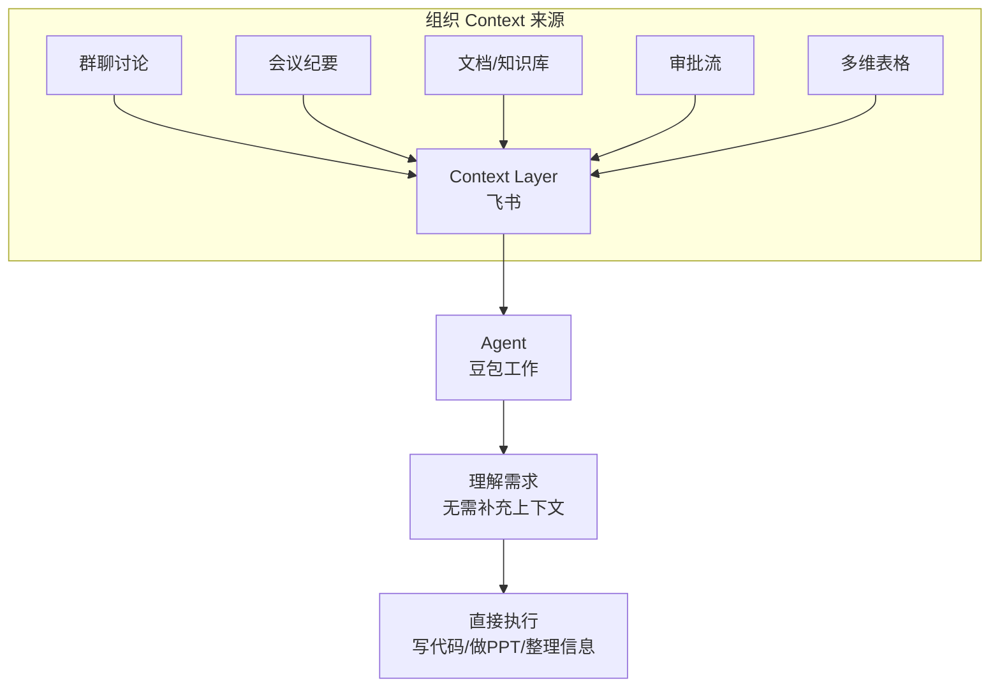
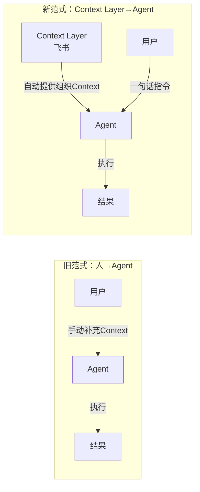

# 01 Context Layer 核心论点

> 对应事实：F-021~F-035（作者观点，以 📝 标注）
> 本文档记录博文作者的核心战略分析，非客观事实陈述

## 核心命题

> **"有 Context 的 Agent 才有壁垒可言。"** 📝

博文作者提出的核心命题是：**飞书是 Agent 的 Context Layer（上下文层）**。

### 什么是 Context Layer

作者的逻辑链条：

1. 每天产生的想法、判断和需求不是凭空出现的，它们都有痕迹（老板群里提想法、开会讨论需求）
2. 这些痕迹基本都在飞书的群聊、会议、文档、审批流里
3. Agent 直接访问这些 Context，就不需要用户反复"补充背景"
4. 因此飞书成为 Agent 的 Context Layer

## 个人效率 vs 组织效率

博文最核心的分析框架是区分**个人效率**和**组织效率**：

| 维度 | 个人效率工具 | 组织级 Agent |
|------|-------------|-------------|
| 代表产品 | Codex、Claude Code | Claude Tag、豆包工作（飞书入口） |
| 解决问题 | 个人任务执行 | 团队协作流程 |
| Context来源 | 用户手动提供/代码仓库 | 组织沉淀的信息（自动获取） |
| 效率提升 | 局部效率 | 整体组织效率 |
| 壁垒 | 模型能力 | 组织Context |

### "AI Coding 效率提升10倍但吞吐只提升30%"的论点

> ⚠️ **勘误**：博文称"字节、腾讯、阿里研发负责人都提到AI Coding让开发效率提升十倍以上，但团队需求吞吐只提升30%左右"。经核验，**该数据归因失实**（❌），无权威来源支持。

虽然具体数据失实，但作者试图表达的**论点方向**有行业案例佐证：

| 来源 | 个人效率 | 组织效率 | 说明 |
|------|----------|----------|------|
| 腾讯内部 | 编码时间缩短40% | 需求交付提升18.8% | 非10倍/30% |
| 快手万人团队 | 个人编码效率提升20-40% | 组织需求交付周期"几乎没变" | 最接近论点的案例 |
| 阿里Qoder | 30-50%效率提升 | — | 非10倍 |
| 字节Trae | CRUD场景+340%（约3.4倍） | — | 非10倍 |

> 论点本身（个人效率提升不等于组织效率提升）有参考价值，但博文引用的具体数据不应作为事实使用。详见 [verification.md](../references/verification.md)。

### 为什么个人 ≠ 组织

📝 作者的分析：

- Coding 只是整个工作流程中的**一个环节**
- Agent 作为个人效率工具，提升的只是**局部效率**
- 只有当 Agent **彻底融入团队工作流程**，才可能提升整个组织效率
- 需求讨论→评审→开发→测试→交付，Coding 之外的环节同样需要 Agent

## "Agent 为什么不能成为肚子里的蛔虫"

📝 作者提出一个反问：既然每天产生的想法和需求都有痕迹（在飞书里），为什么 Agent 不能自动获取这些 Context，而需要用户反复补充？

这一问题指向 Agent 设计的范式转变：

- **旧范式**：人不断给 AI 补充上下文（项目逻辑、业务目标、背景信息）
- **新范式**：Agent 原生存在于 Context Layer 中，自动获取组织上下文，人只需给一句话指令

## 使用 AI 最大的成本变成了补充 Context

📝 作者观察到，随着 Agent 能力提升和工具链成熟，使用 AI 最大的成本之一反而变成了**不断给它补充 Context**：

- 写代码前要解释项目架构和业务背景
- 做PPT前要提供资料和设计规范
- 分析数据前要说明数据来源和业务逻辑

> "没有充分的上下文，Agent 在干活时，就只能瞎猜。" 📝

这一观察与 Claude Code 产品负责人 Cat Wu 的观点呼应（详见 [02-claude-tag-cat-wu.md](02-claude-tag-cat-wu.md)）。

## 金句

> - "有 Context 的 Agent 才有壁垒可言。"
> - "飞书有点像是 Agent 的 Context Layer。"
> - "个人 Agent 提升的是个人效率，企业 Agent 改变的是组织的协作方式。"
> - "没有充分的上下文，Agent 在干活时，就只能瞎猜。"
