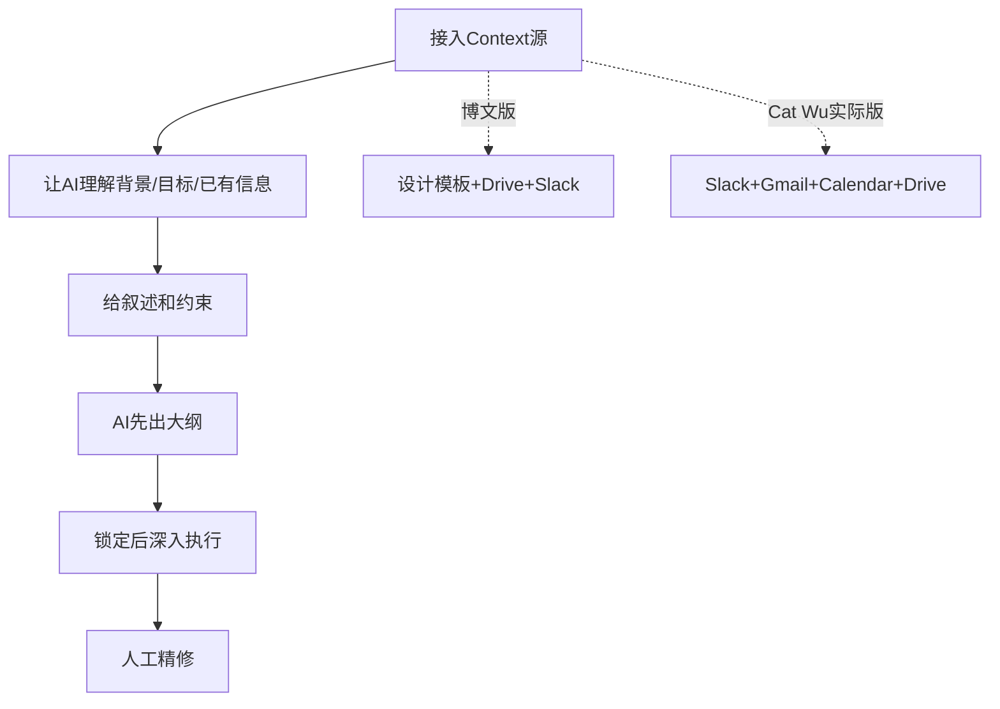

# 02 Claude Tag 与 Cat Wu

> 对应事实：F-007~F-012、F-039
> 核验状态：Claude Tag ✅ / Cat Wu身份 ✅ / 引语细节 ⚠️

## Claude Tag：Slack 中的团队 AI 成员

### 产品事实

Claude Tag 是 Anthropic 于 **2026-06-23** 正式发布的产品，将 Claude 作为团队级 AI 成员放入 Slack。

| 属性 | 说明 |
|------|------|
| 发布日期 | 2026-06-23 |
| 发布方 | Anthropic |
| 载体 | Slack（2026-08-03起取代原有Claude app） |
| 定位 | "Claude joins as a team member" |
| 官方表述 | "the beginning of an evolution of Claude Code" |
| 使用方式 | 授予频道访问权限，任何人可@Claude委派任务 |

Anthropic 内部产品团队 **65% 的代码**由内部版 Claude Tag 生成，已扩展到工程之外的产品指标、支持工单等场景。

### 与豆包工作的对比

博文作者认为 Claude Tag 和豆包工作（飞书入口）逻辑一致：

| 维度 | Claude Tag | 豆包工作（飞书入口） |
|------|-----------|---------------------|
| 宿主平台 | Slack | 飞书 |
| Agent 形态 | 频道级共享成员 | 飞书原生Agent |
| Context来源 | Slack频道历史/文件/讨论 | 群聊/会议/文档/审批流 |
| 核心理念 | Agent融入协作环境 | Agent长在飞书中 |
| 目标 | 从个人CLI走向团队协作 | 从ChatBot走向企业Agent |

两者都代表了 Agent 从"个人效率工具"走向"组织级基础设施"的趋势。

### OpenClaw 对比

博文提到"不需要像 OpenClaw 那样拉一个 Agent 进群"。OpenClaw 是真实存在的开源 AI Agent 平台（前身为 Moltbot/Clawdbot），支持将 Agent 接入 Telegram/WhatsApp/Slack/Discord/飞书等群聊，使用方式为将 bot 添加到群组后 @它。

| 模式 | 代表 | Agent 与 Context 关系 |
|------|------|----------------------|
| **外部Bot模式** | OpenClaw | Agent是外部访客，需拉入群，对组织历史无原生访问 |
| **原生成员模式** | Claude Tag / 豆包工作 | Agent是平台原生成员，天然存在于协作环境中 |

开源对比表将 OpenClaw 列为"per-user"模式，而 Claude Tag 为"channel-scoped shared agent"，印证了博文试图表达的差异。

## Cat Wu 的上下文观

### 身份确认 ✅

Cat Wu 确认为 Anthropic 的 **Head of Product for Claude Code and Cowork**，2024年8月加入。身份在 Ars Technica 专访（2026-05-15）和 Lenny's Podcast 中得到确认。

### 博文转述 ⚠️

博文称 Cat Wu 在访谈中表达了以下观点：

1. "模型能力当然重要，但想让 AI 真正发挥价值，关键是它能不能看到足够多真实的工作上下文"
2. 她用 Claude 做大会PPT时，不会简单丢一句Prompt，而是先接入：公司设计模板、Google Drive资料、Slack讨论记录
3. 让AI先理解项目背景、目标和已有信息，之后才能生成符合需求的内容

### 核验差异 ⚠️

| 博文表述 | 核验结果 |
|----------|----------|
| "关键是上下文而非模型能力" | Cat Wu确实讨论了harness/context重要性，但此明确对比式论断未见于访谈原文 |
| "公司设计模板" | ❌ 未在任何来源中找到此细节 |
| "Google Drive资料" | ✅ 确认（Drive是四个数据源之一） |
| "Slack讨论记录" | ✅ 确认（Slack是四个数据源之一） |
| 未提及Gmail和Calendar | ⚠️ 实际工作流还连接了Gmail和Calendar |

经核验，Cat Wu 在 Lenny 播客中描述的实际 "async deck workflow" 是：

1. 连接 **Slack、Gmail、Calendar、Drive** 四个数据源（非"设计模板+Drive+Slack"三项）
2. 给 Cowork 叙述和约束条件
3. 让其先出大纲
4. 锁定大纲后运行数小时
5. 最后人工精修

> **结论**：Cat Wu 强调 Context 重要性的方向正确，但博文对具体工作流进行了重新组合或补充，"公司设计模板"这一细节无出处。引语应视为博文作者的**观点转述**，而非 Cat Wu 的直接引语。

## Context-First 工作流

无论引语细节如何，博文和 Cat Wu 的访谈共同指向一个方法论：

这与博文的核心论点一致：**Context 是 Agent 发挥价值的前提**，而非可选的补充。
