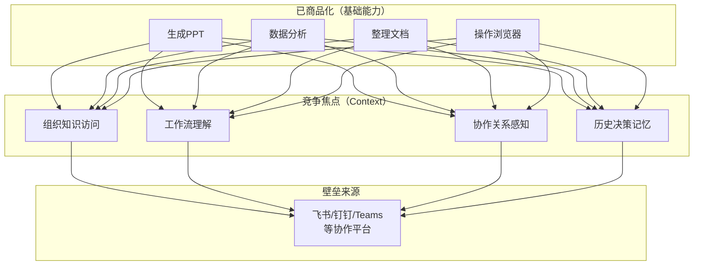
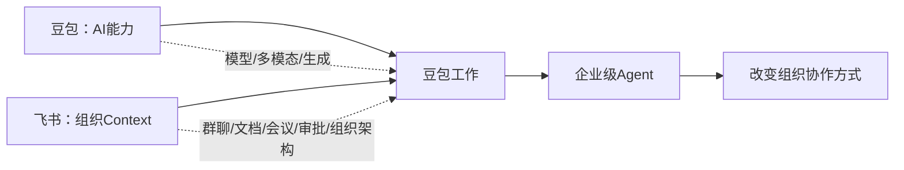

# 03 企业 Agent 与未来竞争

> 对应事实：F-031~F-038（作者观点，以 📝 标注）
> 本文档记录博文作者对行业趋势的判断和预测

## Context 竞争论

📝 博文作者提出一个关键判断：

> "无论是哪个 Agent，大家在基础能力上其实已经做得非常好了。生成PPT、做数据分析、整理文档、操作浏览器这些能力，现在基本已经不是什么问题。接下来真正重要的竞争，一定会是 Context 的竞争。"

### 能力分层

作者认为，当基础 AI 能力趋于同质化，**谁掌握了组织 Context，谁就拥有 Agent 的壁垒**。这解释了为什么：

- 字节坚决合并豆包和飞书
- Anthropic 推出 Claude Tag 进入 Slack
- 各家 Agent 产品都在寻求与协作平台的深度集成

## Coding Context vs 白领工作 Context

📝 作者解释了为什么 Coding Agent 先成熟，而办公 Agent 刚刚开始：

| 维度 | Coding 场景 | 白领工作场景 |
|------|------------|-------------|
| Context规整度 | 高（代码有结构化语法） | 低（自然语言、非结构化） |
| Context存放位置 | 代码仓库/GitHub/本地文件 | 群聊/知识库/会议/文档/邮件 |
| Context获取方式 | 连接GitHub即可 | 需深度集成协作平台 |
| Agent成熟度 | 高（Codex/Claude Code等） | 早期（豆包工作/Claude Tag等） |
| 评价标准 | 代码能否运行/测试通过 | 产出是否符合业务需求 |

> "对于一个Coding任务来说，大部分关键上下文其实都在代码仓库里。但对于更广泛的白领工作场景，上下文根本没有Coding那样规整。" 📝

这一分析解释了为什么 Coding Agent 能在 2024-2025 年快速成熟，而办公 Agent 到 2026 年才开始爆发——**办公 Context 的获取难度远高于 Coding Context**。

## 字节合并豆包和飞书的逻辑

📝 作者认为，理解了 Context Layer 的概念，就能"100%理解为什么字节要合并豆包和飞书"：

逻辑链条：

1. 办公 Agent 本质不是个人工具，而是**服务组织的 Agent**
2. 它需要理解企业里的**知识、流程和协作关系**
3. 这些 Context 恰恰都沉淀在**飞书**这样的企业协作平台中
4. 没有飞书的豆包只是 ChatBot，有了飞书的豆包工作才是企业 Agent
5. 因此豆包和飞书必须合并

### 作者对字节速度的评价 📝

- 作者自称创业者，认为字节的 AI 反应速度"让创业者觉得窒息"
- 佩服字节大组织能快速切换方向、整合产品
- 把"快速行动，错了就改"贴到公司墙上
- 认为去年豆包稳坐国内 ChatBot 头把交椅，"就像当年微信在移动互联网时代确立入口地位"

## 企业 Agent 的演进方向

综合博文论点，企业 Agent 的演进路径可概括为：

| 阶段 | Agent 形态 | Context 来源 | 价值 |
|------|-----------|-------------|------|
| 1.0 ChatBot | 对话框 | 用户手动输入 | 个人问答 |
| 2.0 Coding Agent | IDE/CLI | 代码仓库 | 个人编码效率 |
| 3.0 个人助手 | 独立应用 | 用户手动提供 | 个人任务执行 |
| **4.0 企业Agent** | **协作平台原生** | **组织Context自动获取** | **组织效率提升** |

豆包工作（飞书入口）和 Claude Tag（Slack入口）代表了 4.0 阶段的早期形态。

## 金句

> - "接下来真正重要的竞争，一定会是 Context 的竞争。"
> - "办公 Agent 本质上不是一个个人工具，而是一个服务组织的 Agent。"
> - "豆包工作的后劲，才刚刚开始。"
> - "快速行动，错了就改。"

## 待观察问题

1. 豆包工作能否真正"理解"飞书中的非结构化Context（群聊讨论、会议纪要），还是仅做检索摘要？
2. 飞书之外的企业（用钉钉/Teams/企微）如何获得同等Context能力？
3. Context 竞争是否会导致平台锁定（vendor lock-in）？
4. 组织Context的访问权限和隐私安全如何平衡？
5. 3个月后（stale_after: 2026-11-30）产品功能和行业格局有何变化？
