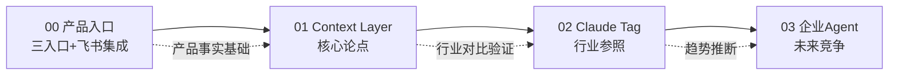

# 概念学习路径

本知识包包含 4 篇概念文档，从产品事实到战略论点逐层递进。

## 学习路径

| 顺序 | 文档 | 核心内容 | 预计阅读 |
|------|------|----------|----------|
| 1 | [00 产品入口与飞书集成](00-product-entry-points.md) | 豆包工作三入口、30天免费、飞书原生Agent体验、移动端语音 | 5 min |
| 2 | [01 Context Layer核心论点](01-context-layer-thesis.md) | 飞书作为组织上下文层、个人vs组织效率、真实工作流案例 | 8 min |
| 3 | [02 Claude Tag与Cat Wu](02-claude-tag-cat-wu.md) | Claude Tag产品参照、Cat Wu上下文观、引语勘误 | 6 min |
| 4 | [03 企业Agent与未来竞争](03-enterprise-agent-future.md) | Context竞争论、Coding vs白领Context、合并逻辑 | 6 min |

## 路径图



## 阅读建议

- **快速了解论点**：直接读 01（Context Layer核心论点）
- **产品经理/创业者**：01 → 03（论点+竞争格局）
- **AI Agent开发者**：00 → 02（产品形态+行业参照）
- **核验导向读者**：先读 [../references/verification.md](../references/verification.md)

```{toctree}
:hidden:

00-product-entry-points
01-context-layer-thesis
02-claude-tag-cat-wu
03-enterprise-agent-future
```
