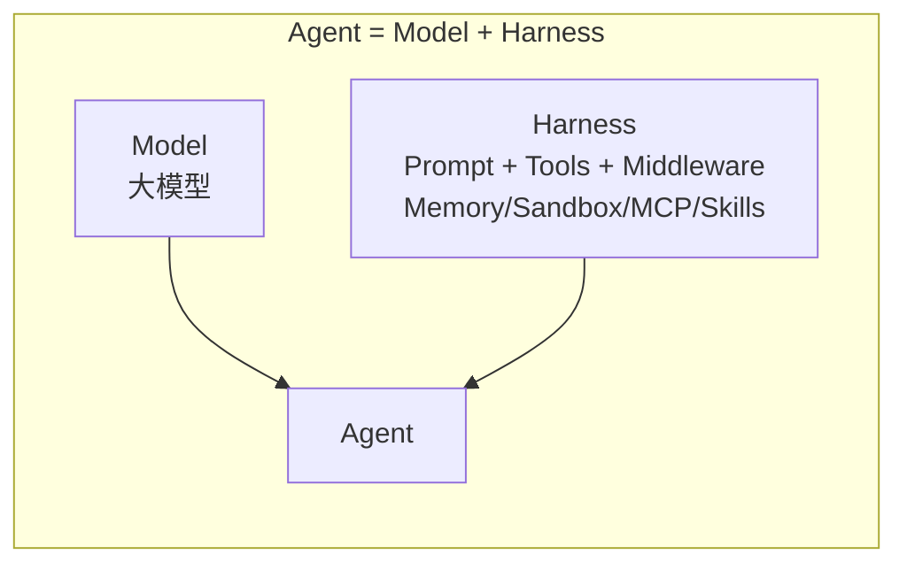

# 00 Agent 上半场：能力商品化

> 对应事实：F-002~F-008、F-014
> 核验状态：OpenAI SDK ✅ / LangChain公式 ✅

## 从自建 Harness 到标准化 Harness

博文将 Agent 的发展分为上半场和下半场。上半场的核心特征是 **Agent 工程能力的快速标准化**。

### 过去：团队自建 Agent Harness

自 OpenClaw 以来，构建一个 Agent 需要团队自行搭建大量基础设施：

| 组件 | 作用 |
|------|------|
| Memory | 对话记忆/长期记忆 |
| Skills | 渐进式能力披露 |
| MCP | 工具调用协议 |
| 工具调用 | Function calling |
| Sandbox | 安全执行环境 |
| Computer Use | 桌面/浏览器操作 |
| 长任务执行 | 异步任务/后台运行 |

### 现在：模型厂商和开源框架直接提供

> "过去需要一个团队自行搭建的 Agent Harness，如今越来越多地被模型厂商和开源框架直接提供。"

**OpenAI Agents SDK（2026-04-15 更新）** ✅

OpenAI 在 2026 年 4 月 15 日发布博文《The next evolution of the Agents SDK》，将以下能力纳入一套标准化的"模型原生 Harness（model-native harness）"：

- 原生沙箱执行（sandbox）
- 可配置内存（configurable memory）
- MCP 工具调用
- Skills 渐进式披露
- AGENTS.md 自定义指令
- shell 工具执行代码
- apply_patch 文件编辑

**LangChain：Agent = Model + Harness** ✅

LangChain 在 2026 年 3 月 10 日的官方博客《The Anatomy of an Agent Harness》中以 **"TLDR: Agent = Model + Harness"** 开篇，并将此公式纳入官方文档：

> "A harness is everything around that loop: the prompt, the tools, and any middleware that shapes the model's behavior."

## 功能列表不再是壁垒

📝 博文的核心判断：能力商品化改变了 Agent 产品的竞争逻辑——

1. **功能跟进时间缩短**：一个功能出现后，其他产品快速跟进
2. **Harness 可复用**：一个 Harness 被验证后，可能很快成为行业基础设施
3. **能力快速增长**：能读的文件越来越长，能跑的任务越来越多
4. **差异化缩小**：各家产品功能清单越来越像

> "靠功能列表建壁垒的路走到了头。"

这一判断为博文的后续论点奠定基础：既然能力不再是壁垒，竞争必须转向别处——即博文所论的"组织生产力"（详见 [01-context-bottleneck.md](01-context-bottleneck.md)）。

## 上半场 vs 下半场

| 维度 | 上半场 | 下半场 |
|------|--------|--------|
| 竞争焦点 | Agent 更能干 | 真正提升组织生产力 |
| 壁垒来源 | 模型能力/功能列表 | 组织 Context/安全治理 |
| Harness | 团队自建 | 标准化/商品化 |
| 价值衡量 | 个人任务完成度 | 组织效率提升 |
| 代表事件 | OpenAI SDK/LangChain公式 | 豆包工作+飞书账号级集成 |

> "上半场比的是谁的 Agent 更能干，下半场比的是谁能真正提升组织生产力。" 📝

## 相关知识包

- [doubao-work](../doubao-work/index.md) — 豆包工作功能实测
- [doubao-work-context-layer](../doubao-work-context-layer/index.md) — Context Layer 战略分析
- [openai-codex](../openai-codex/index.md) — OpenAI Codex Agent 源码解读
