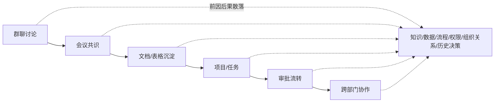

# 01 Context 瓶颈与企业落地落差

> 对应事实：F-009~F-014
> 核验状态：Deloitte数据 ✅ 官方PDF精确命中

## 企业 AI 落地的"落差"

博文引用 Deloitte 2026 年全球调查数据，揭示了一个关键反差：**Agent 能力快速增长，但企业将 AI 转化为组织生产力的速度没有同步跟上。**

### Deloitte 数据 ✅

| 指标 | 数据 | 核验 |
|------|------|------|
| 调查范围 | 全球 24 国、3235 名企业高管 | ✅ 精确命中 |
| AI 工具覆盖率 | 从不到 40% 涨到约 60%（一年内增长 50%） | ✅ 精确命中 |
| 深度改造企业 | **34%**（用 AI 深度改造产品/核心流程/商业模式） | ✅ 精确命中 |
| 表层应用企业 | **37%**（仅表层使用，对业务流程几乎无改变） | ✅ 精确命中 |
| 中间档（补充） | 30%（围绕 AI 重新设计关键流程） | 博文未单独列出 |

> **数据来源**：Deloitte《State of AI in the Enterprise — The untapped edge》，2026年1月发布（调查执行于2025年8-9月）。
>
> **细微说明**：博文将"核心流程"并入 34% 的深度改造描述。严格来说 34% 对应的是"deeply transform their businesses"，另有 30% 是单独的"redesigning key processes"中间档。34% 与 37% 两个关键数字准确。

### 落差的具象化

📝 博文将这一宏观落差落到员工的具体场景：

> 一个员工希望让 Agent "复盘一个项目"或"看看项目为什么延期"。尽管大模型足够擅长总结和推理，但真正的阻碍发生在 AI 开始工作**之前**——

| 需要的 Context | 存在于哪里 | Agent 能直接获取吗？ |
|---------------|-----------|---------------------|
| 客户刚改了什么需求 | 群聊/邮件 | ❌ |
| 上周会议形成了什么结论 | 会议纪要 | ❌ |
| 最新方案是哪一版 | 文档/版本管理 | ❌ |
| 谁在负责推进 | 项目管理/组织架构 | ❌ |
| 流程卡在哪个审批 | 审批流 | ❌ |

> "员工得先翻群聊、找会议纪要、下载表格和文档，把散落在不同地方的信息整理出来，再重新向 AI 解释一遍。"

**金句**：

> "Agent 看似在替人工作，人却要先替 Agent 准备工作。" 📝

## 企业工作的非线性特征

📝 博文分析了为什么企业 Context 比 Coding Context 更难获取：

企业工作不是孤立任务，而是一条**跨系统、跨部门、跨时间**的信息流：

- 一个需求从群聊讨论开始
- 进入会议形成共识
- 沉淀到文档和表格
- 进入项目和任务
- 通过审批在不同部门间流转
- 前因后果散落在知识、数据、流程、权限、组织关系和历史决策中

## 能力 vs 上下文

📝 博文提出关键区分：

| 维度 | 能力（Capability） | 上下文（Context） |
|------|-------------------|-------------------|
| 回答的问题 | Agent 会不会干活？ | Agent 能不能干好活？ |
| 当前状态 | 已不是瓶颈 | **才是瓶颈** |
| 获取方式 | 模型训练/SDK/Harness | 组织信息集成/权限继承 |
| 商品化程度 | 高（趋于同质化） | 低（依赖平台深度集成） |

> "能力决定 Agent 会不会干活，上下文决定 Agent 能不能干好活。如今，前者已经不是瓶颈，后者才是。" 📝

这一分析直接引出博文的核心方案——豆包工作与飞书的账号级集成（详见 [02-feishu-integration-loop.md](02-feishu-integration-loop.md)）。
