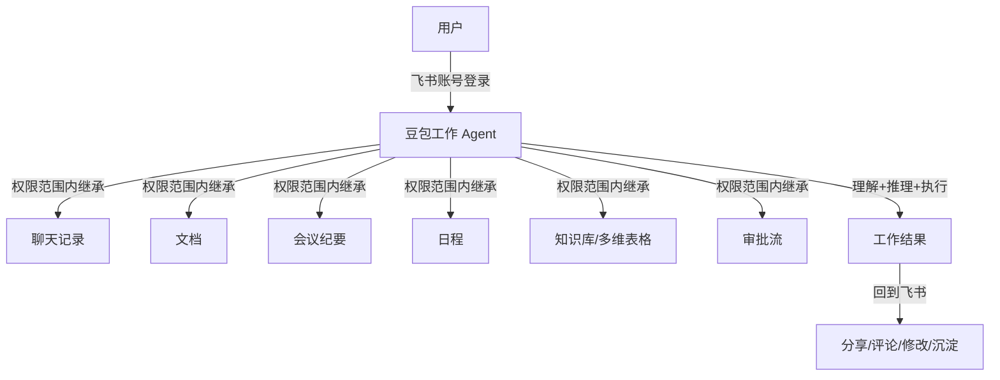
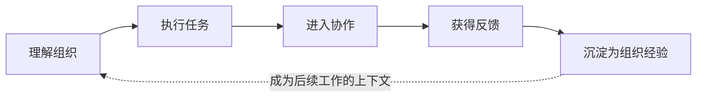

# 02 飞书集成与组织闭环

> 对应事实：F-015~F-026
> 核验状态：账号级集成 ✅ 飞书官方帮助中心确认

## 账号级集成：Agent 继承工作上下文

豆包工作解决 Context 瓶颈的核心方案是与飞书做**账号级别集成**。

### 工作原理 ✅

飞书官方帮助中心确认：

> "豆包工作还与飞书深度打通，让 Agent 基于企业上下文更准确地完成工作。豆包工作在调用企业内部知识时，仅会基于提问者在飞书上有权限访问的消息、云文档、知识库等内容，不会超出已有权限。"

关键特征：

1. **无需信息搬运**：Agent 直接在工作发生的地方寻找信息
2. **权限继承**：Agent 只能在当前员工权限范围内获取数据
3. **关系理解**：能理解信息间的关联（谁在什么时候做了什么）
4. **继续行动**：不仅找到信息，还能基于理解继续推进任务

### 使用场景 📝

博文描述的典型场景：

> 问豆包工作一句"x月x日还能不能上线"，Agent 就能沿着飞书里留下的轨迹，自行寻找信息并拉出进度与风险。

进一步追溯能力：
- GPU 扩容申请：谁、什么时候提出、批/不批的影响
- 资源申请：审批状态、阻塞节点
- 版本上线：时间线、依赖关系、风险点

> "员工不用再花半小时给 AI 补背景。Agent 开始像一个从头参与过这个项目的同事那样工作——自己找信息、自己理清前因后果，再给出判断。"

## 飞书作为 AI 原生组织操作系统

📝 博文认为飞书在 Agent 时代的特殊地位来自三个层面：

### 1. 组织信息统一

多数企业数据是散的——Agent 完成跨系统工作需逐个连接、搬运数据，还要处理不同系统间的身份和权限。**每多一个系统，就多一层摩擦。**

飞书天然将以下功能放在同一套组织身份、权限和协作体系里：

| 飞书模块 | 对应 Context |
|----------|-------------|
| 即时消息（IM） | 群聊讨论、决策记录 |
| 云文档 | 方案、规范、知识沉淀 |
| 知识库 | 组织记忆、最佳实践 |
| 会议/妙记 | 讨论结论、行动项（可搜索可引用） |
| 多维表格 | 业务数据、进度跟踪 |
| 项目管理 | 任务、里程碑、负责人 |
| 审批 | 流程状态、决策记录 |

### 2. AI 基础设施准备

飞书过去几年持续为 AI 调用做基础设施适配：

- 会议沉淀为可搜索、可引用的**妙记**
- 文档、知识库、群消息和多维表格都已针对 AI 调用做过适配
- 数据不是堆在那里，而是已经被整理成 **Agent 能理解、能使用的形态**

### 3. 开发者生态

📝 博文称飞书被开发者"顺理成章地圈定为 Agent 的核心执行与协作入口"，在"龙虾"（AI Agent）浪潮下成为最被看好的协同平台。

## 从工具到员工：组织闭环

📝 博文提出的核心框架是 Agent 工作的完整闭环：

### 闭环 vs 开环

| 维度 | 开环（个人AI工具） | 闭环（组织Agent） |
|------|-------------------|-------------------|
| 产物去向 | 停留在个人对话框 | 回到飞书被分享/评论/修改 |
| 知识沉淀 | 下次还得重新解释 | 成熟方法沉淀为组织共享技能 |
| 效率持续性 | 下一次工作时效率提升消失 | Agent做得越多，企业资产越多 |
| 角色定位 | 工具 | 数字员工 |

博文用一个对比说明闭环的重要性：

> "一个 AI 生成的报告，如果停留在个人对话框里，同事看不到、改不了、下次还得重新解释背景——这一次的效率提升，在下一次工作时就消失了。"

而连接飞书后：
- 生成内容回到飞书 → 被同事分享、评论和修改
- 成熟工作方法 → 沉淀为组织共享技能 → 下次直接调用
- Agent 产出 → 转化为企业资产 → 反过来成为后续工作可调用的上下文

**金句**：

> "能干活的是工具，知道公司在发生什么、能自己把事推下去、把结果留给团队的，才算员工。" 📝
