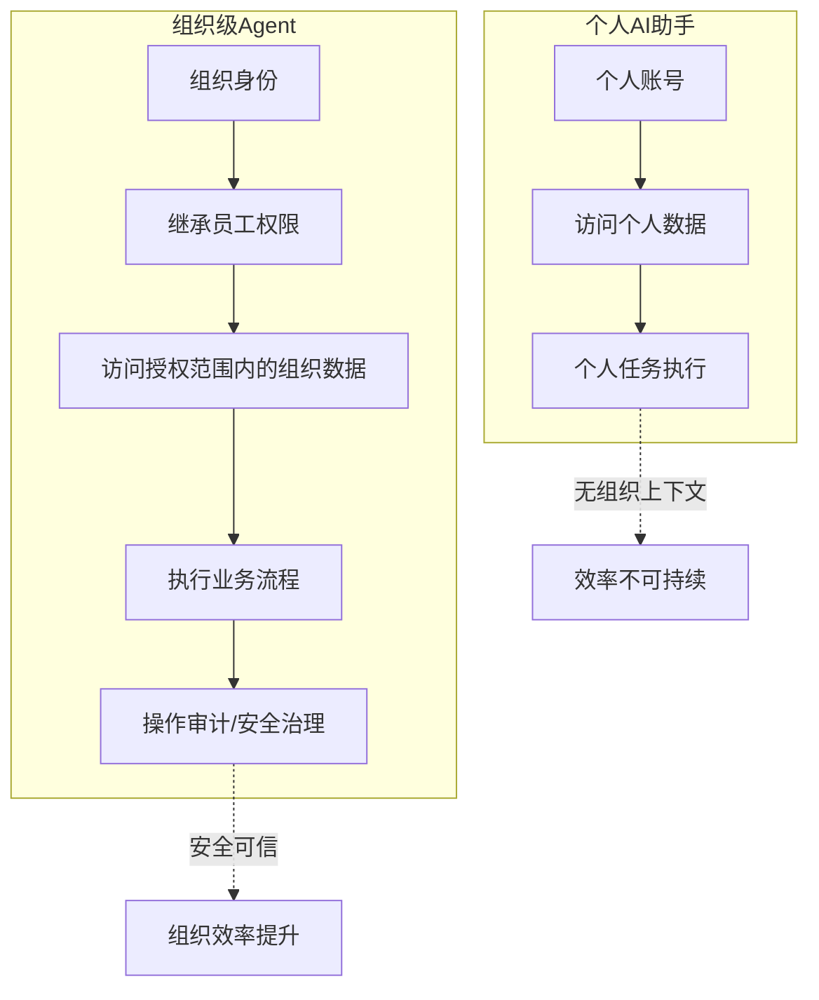

# 03 组织生产力 ROI 与安全治理

> 对应事实：F-027~F-040
> 核验状态：BCG数据 ✅ / 信通院认证 ⚠️

## ROI 转向：从个人提效到组织效率

博文认为，Agent 进入组织后，企业衡量 AI 价值的标准会发生根本转变。

### BCG 数据 ✅

| 指标 | 数据 | 核验 |
|------|------|------|
| 报告 | BCG《AI at Work: Strategy Matters More Than Tools》 | ✅ 2026-06-03发布 |
| 调查规模 | 11,749名受访者、14个市场（第四年度调查） | 补充事实 |
| 关键数据 | **42%**经常使用AI的一线员工每周至少省 **8小时**（一个完整工作日） | ✅ 精确命中 |
| BCG结论 | "大多数企业还没搞清楚怎么把省下的时间转化为组织价值" | ✅ 语义一致 |

BCG 原文：

> "Among frontline employees, 42% who are regular AI users report saving eight hours a week—the equivalent of a full workday. But most organizations haven't figured out how to convert the time into value."

### 个人快了 ≠ 团队快了

📝 博文的核心分析：企业真正大量的效率损耗不在任务内部，而在**任务与任务、人与人之间**：

| 隐性成本动作 | 说明 |
|-------------|------|
| 找资料 | 散落多个系统，搜索定位 |
| 问进度 | 需要找人确认状态 |
| 同步信息 | 跨团队信息对齐 |
| 确认负责人 | 谁在推进、谁能决策 |
| 跨部门沟通 | 部门墙、流程摩擦 |
| 等待审批 | 流程阻塞、响应延迟 |

> "这些动作单独看都不复杂，却构成了组织日常运行中最大的隐性成本。"

**PPT 类比**：

> "AI 把制作一份 PPT 从两小时压到半小时，但如果这份 PPT 之后的评审、修改、跟进还是照旧，组织层面的效率并没变。"

因此 Agent 的价值不在替人做完一份材料，而在接手材料之后的那一串**衔接动作**——去查、去问、去同步、去推进。这要求 Agent 真正进入组织业务现场：客户资料、经营数据、会议内容、审批流程。

## 权限：组织级 Agent 的分界线

Agent 进入组织业务现场，权限成为不可回避的前提。

### 权限继承 ✅

豆包工作沿用飞书已有的身份和权限体系：

| 原则 | 说明 |
|------|------|
| 权限对等 | 员工无权查看的客户信息，Agent同样不能获得 |
| 操作对等 | 员工无权执行的操作，AI也不能绕开 |
| 范围限定 | Agent只能在当前员工权限范围内获取数据和操作工具 |

### 全链路安全防护 ✅

豆包工作打造的安全体系覆盖：

| 环节 | 措施 |
|------|------|
| 设备接入 | 设备认证与管理 |
| 权限设置 | 基于飞书RBAC体系 |
| 额度管控 | 使用量限制与审计 |
| 数据加密 | 传输与存储加密 |
| 操作审计 | 全链路可追溯 |

### 信通院双项认证 ⚠️

博文称豆包工作"已成为国内首批通过中国信通院'办公智能体能力'与'云端基准测试'双项认证的办公智能体"。

核验结果：

| 认证项目 | 真实性 | 豆包工作入选证据 |
|----------|--------|-----------------|
| 办公智能体能力评估 | ✅ 真实存在（2026-08-06公布首批，千问办公为"国内首个"） | ⚠️ 仅企业自述 |
| 云上Agent基准度量模型 | ✅ 真实存在（2026-07-28/29可信云大会公布首批） | ⚠️ 仅企业自述 |

> **⚠️ 注意**：两项认证项目确实存在，但搜索未发现信通院（caict.ac.cn）官方渠道发布的、明确将"豆包工作"列入首批通过名单的公告。"首批通过"目前仅见于豆包工作8月25日自家发布稿及转载媒体。"云端基准测试"是"云上Agent基准度量模型"的简称转述。建议引用时标注"据豆包工作官方发布"。

### 权限作为分界线 📝

> "过去企业软件管的是人能做什么；Agent 进来之后，还要管 AI 能替人做什么——'权限'，正在成为组织级 Agent 与个人 AI 助手之间的一条重要分界线。"

## 下半场竞争格局

📝 博文总结的上下半场对比：

| 维度 | 上半场 | 下半场 |
|------|--------|--------|
| 竞争焦点 | 个人AI能力 | 组织级Agent |
| 比拼内容 | 模型更聪明/生成质量更高/任务更多 | 安全进入组织/理解工作/参与流程/结果复用 |
| 差异趋势 | 正在趋同 | 组织基础设施集成度决定差距 |
| 价值衡量 | 个人少工作多少分钟 | 减少组织沟通/协作/流程成本 |
| 壁垒来源 | 模型能力 | 组织Context+安全治理 |

> "豆包工作真正值得关注的，不是又多了一个能做 PPT 的 Agent，而是字节把全力押注的 Agent 与最 AI-Native 的组织基础设施焊在了一起。"

**金句**：

> "Agent 的竞争，也从个人生产力，走向组织生产力。"

## 与第九篇的呼应

本篇（36氪专业媒体分析）与第九篇（AI产品阿颖个人博主）从不同角度得出相似结论：

| 论点 | 第九篇（个人博主） | 第十篇（36氪） |
|------|-------------------|---------------|
| 核心概念 | Context Layer | 组织生产力 |
| 个人vs组织 | 个人效率≠组织效率 | 个人快了≠团队快了 |
| 数据支撑 | 无（个人体验+失实数据❌） | Deloitte+BCG双报告✅ |
| 安全/权限 | 未涉及 | 专章讨论，信通院认证⚠️ |
| 闭环概念 | 未明确提出 | 理解→执行→协作→沉淀 |
