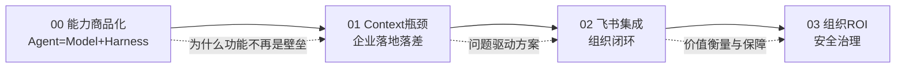

# 概念学习路径

本知识包包含 4 篇概念文档，按"问题→方案→价值"逻辑递进。

## 学习路径

| 顺序 | 文档 | 核心内容 | 预计阅读 |
|------|------|----------|----------|
| 1 | [00 Agent上半场：能力商品化](00-agent-half-time.md) | Harness标准化、Agent=Model+Harness、功能壁垒消解 | 6 min |
| 2 | [01 Context瓶颈与企业落差](01-context-bottleneck.md) | Deloitte 34%/37%数据、人替Agent准备工作、企业信息散落 | 7 min |
| 3 | [02 飞书集成与组织闭环](02-feishu-integration-loop.md) | 账号级集成、AI原生组织OS、理解→执行→协作→沉淀 | 8 min |
| 4 | [03 组织ROI与安全治理](03-org-productivity-security.md) | BCG 42%/8h、任务间隐性成本、权限继承、信通院认证 | 7 min |

## 路径图



## 阅读建议

- **快速理解核心论点**：00 → 01（问题定义）
- **产品/技术视角**：00 → 02（Harness商品化→飞书集成方案）
- **企业决策者视角**：01 → 03（落地落差→ROI与安全）
- **核验导向读者**：先读 [../references/verification.md](../references/verification.md)

```{toctree}
:hidden:

00-agent-half-time
01-context-bottleneck
02-feishu-integration-loop
03-org-productivity-security
```
