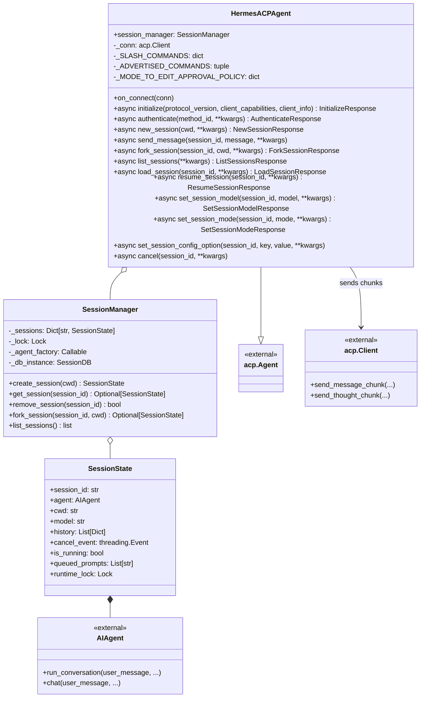
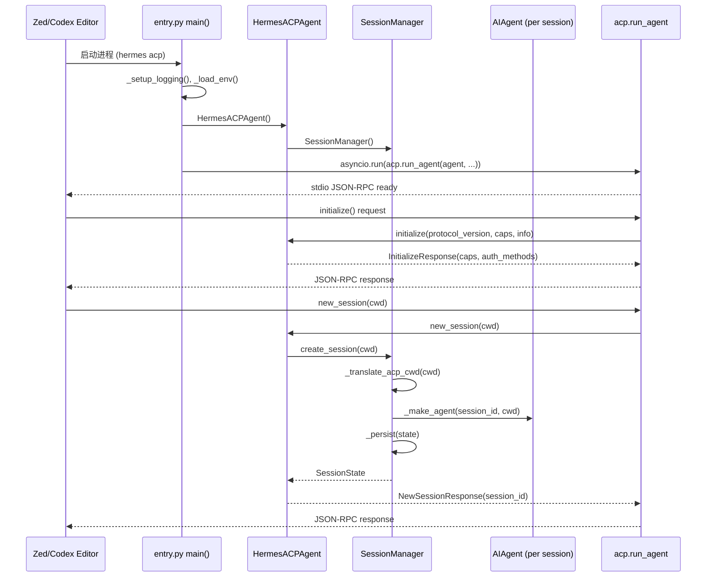
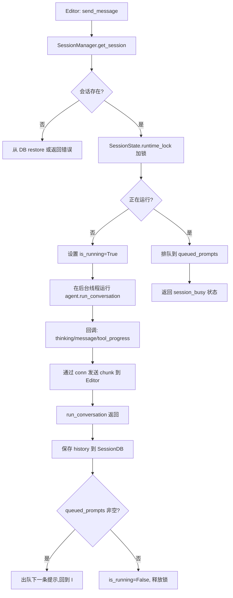

# ACP 适配器 (Agent Client Protocol Adapter)

## 概述

ACP（Agent Client Protocol）适配器使 hermes-agent 能够作为 **Agent 服务器** 运行，通过标准 JSON-RPC 协议向 ACP 客户端（如 Zed 编辑器、Codex CLI 等）提供 AI Agent 能力。客户端通过 stdio 启动 hermes-agent 进程，双方在 stdout/stdin 上进行 JSON-RPC 2.0 通信。

核心入口是 acp_adapter/server.py 中的 **`HermesACPAgent`** 类（L566），它继承自 `acp.Agent`，实现了 ACP 协议的所有必需方法。会话管理由 acp_adapter/session.py 中的 **`SessionManager`** 负责，每个 ACP 会话映射到一个独立的 `AIAgent` 实例。

### 协议能力

`HermesACPAgent.initialize()` 声明了以下能力：

```python
# acp_adapter/server.py L1158-L1171
return InitializeResponse(
    protocol_version=acp.PROTOCOL_VERSION,
    agent_info=Implementation(name="hermes-agent", version=HERMES_VERSION),
    agent_capabilities=AgentCapabilities(
        load_session=True,                      # 加载历史会话
        prompt_capabilities=PromptCapabilities(image=True),  # 图像输入
        session_capabilities=SessionCapabilities(
            fork=SessionForkCapabilities(),     # 分叉会话
            list=SessionListCapabilities(),     # 列出会话
            resume=SessionResumeCapabilities(), # 恢复会话
        ),
    ),
    auth_methods=auth_methods,
)
```

### 解决的核心问题

1. **编辑器集成**：Zed 等编辑器通过 stdio 启动 hermes-agent，在编辑器内直接获得 Agent 能力
2. **多会话并发**：支持同时运行多个会话（多个编辑器窗口/项目）
3. **会话持久化**：会话保存到共享 SessionDB，进程重启后可恢复
4. **工具桥接**：将 hermes-agent 的工具系统（包括 MCP 工具）暴露给 ACP 客户端
5. **编辑审批**：支持 ask/accept_edits/dont_ask 三种编辑审批策略
6. **流式输出**：通过 AgentMessageChunk/AgentThoughtChunk 实时推送思考和消息增量

## 核心设计原理

### 1. stdio 传输协议

ACP 使用 stdio 作为传输层：
- **stdout**：保留给 JSON-RPC 帧（`acp.run_agent()` 管理）
- **stderr**：所有日志、状态输出重定向到 stderr（通过 `_acp_stderr_print`）
- **stdin**：接收客户端的 JSON-RPC 请求

这要求 hermes-agent 内部所有 `print()` 调用在 ACP 模式下必须走 stderr，否则会破坏 JSON-RPC 帧。

```python
# acp_adapter/session.py L101-L109
def _acp_stderr_print(*args, **kwargs) -> None:
    """ACP reserves stdout for JSON-RPC frames, so any incidental
    CLI/status output from AIAgent must be redirected away from stdout."""
    kwargs = dict(kwargs)
    kwargs.setdefault("file", sys.stderr)
    print(*args, **kwargs)
```

### 2. SessionManager 会话管理

```python
# acp_adapter/session.py L175-L240
class SessionManager:
    """Thread-safe manager for ACP sessions backed by Hermes AIAgent instances."""

    def __init__(self, agent_factory=None, db=None):
        self._sessions: Dict[str, SessionState] = {}
        self._lock = Lock()
        self._agent_factory = agent_factory
        self._db_instance = db  # lazy-init to ~/.hermes/state.db

    def create_session(self, cwd: str = ".") -> SessionState:
        cwd = _translate_acp_cwd(cwd)  # WSL 路径翻译
        session_id = str(uuid.uuid4())
        agent = self._make_agent(session_id=session_id, cwd=cwd)
        state = SessionState(
            session_id=session_id, agent=agent, cwd=cwd,
            cancel_event=threading.Event(),
        )
        with self._lock:
            self._sessions[session_id] = state
        self._persist(state)  # 持久化到 SessionDB
        return state
```

关键设计：
- **内存 + 持久化双存储**：活跃会话在内存中快速访问，同时持久化到 SessionDB 以便重启恢复
- **自动恢复**：`get_session()` 在内存中找不到时自动从数据库 `_restore()`
- **WSL 路径翻译**：`_translate_acp_cwd()` 处理 Windows 编辑器通过 WSL 运行 hermes 时的路径转换
- **线程安全**：所有会话操作通过 `Lock` 保护

### 3. 工作目录绑定

每个会话绑定到编辑器的工作目录（cwd）：

```python
def _register_task_cwd(task_id: str, cwd: str) -> None:
    """Bind a task/session id to the editor's working directory for tools."""
```

工具执行时通过 `task_id` 查找对应的 cwd，确保文件操作、命令执行在正确的项目目录中进行。

### 4. 编辑审批策略

```python
# acp_adapter/server.py L623-L635
_EDIT_APPROVAL_POLICY_CONFIG_ID = "edit_approval_policy"
_EDIT_APPROVAL_POLICY_DEFAULT = "ask"
_MODE_ACCEPT_EDITS = "accept_edits"
_MODE_DONT_ASK = "dont_ask"
_MODE_TO_EDIT_APPROVAL_POLICY = {
    "default": "ask",               # 默认：每次编辑请求审批
    "accept_edits": "workspace_session",  # 自动接受同工作区会话的编辑
    "dont_ask": "session",          # 当前会话自动接受所有编辑
}
```

### 5. 流式事件回调

```python
# acp_adapter/events.py 提供回调构造器
make_message_cb(conn, session_id)    # 消息增量 → AgentMessageChunk
make_thinking_cb(conn, session_id)   # 思考增量 → AgentThoughtChunk
make_step_cb(conn, session_id)       # 工具步骤 → AgentMessageChunk
make_tool_progress_cb(conn, session_id)  # 工具进度 → AgentMessageChunk
```

## 数据结构与类图



### ACP 模块文件结构

| 模块 | 职责 |
|------|------|
| acp_adapter/entry.py | 进程入口（`main()`），参数解析，启动 acp.run_agent |
| acp_adapter/server.py | HermesACPAgent 实现（协议处理、会话路由、流式分发） |
| acp_adapter/session.py | SessionManager、SessionState、WSL 路径翻译 |
| acp_adapter/auth.py | 认证方法构建、provider 检测 |
| acp_adapter/events.py | 流式事件回调构造器 |
| acp_adapter/tools.py | 工具桥接（build_tool_complete、build_tool_start） |
| acp_adapter/permissions.py | 审批回调构建（make_approval_callback） |
| acp_adapter/provenance.py | 会话溯源元数据 |

## 工作流程/生命周期

### ACP 启动流程



### 消息处理流程



### Slash 命令

ACP 模式下支持的斜杠命令（与 CLI 模式对齐的子集）：

```python
# acp_adapter/server.py L569-L621
_SLASH_COMMANDS = {
    "help": "Show available commands",
    "model": "Show or change current model",
    "tools": "List available tools",
    "context": "Show conversation context info",
    "reset": "Clear conversation history",
    "compress": "Compress conversation context",
    "steer": "Inject guidance into the currently running agent turn",
    "queue": "Queue a prompt to run after the current turn finishes",
    "version": "Show Hermes version",
}
```

## 关键 API / 方法列表

### HermesACPAgent 核心方法

| 方法 | 签名 | 说明 |
|------|------|------|
| `__init__` | `(session_manager: SessionManager \| None = None)` | 初始化，创建默认 SessionManager |
| `on_connect` | `(conn: acp.Client) -> None` | 存储客户端连接用于发送流式 chunk |
| `initialize` | `async (protocol_version, client_capabilities, client_info, **kwargs) -> InitializeResponse` | 协议握手，返回 Agent 能力声明 |
| `authenticate` | `async (method_id: str, **kwargs) -> AuthenticateResponse \| None` | 认证方法验证 |
| `new_session` | `async (cwd=".", **kwargs) -> NewSessionResponse` | 创建新会话，返回 session_id |
| `send_message` | `async (session_id, message, **kwargs)` | 发送用户消息，流式返回 Agent 响应 |
| `fork_session` | `async (session_id, cwd=".", **kwargs) -> ForkSessionResponse` | 分叉会话（复制历史到新会话） |
| `list_sessions` | `async (**kwargs) -> ListSessionsResponse` | 列出所有持久化会话 |
| `load_session` | `async (session_id, **kwargs) -> LoadSessionResponse` | 加载指定会话（含历史消息） |
| `resume_session` | `async (session_id, **kwargs) -> ResumeSessionResponse` | 恢复之前的会话 |
| `set_session_model` | `async (session_id, model, **kwargs) -> SetSessionModelResponse` | 切换会话模型 |
| `set_session_mode` | `async (session_id, mode, **kwargs) -> SetSessionModeResponse` | 设置编辑审批模式 |
| `set_session_config_option` | `async (session_id, key, value, **kwargs)` | 设置会话配置项 |
| `cancel` | `async (session_id, **kwargs)` | 取消当前运行的轮次 |

### SessionManager 公开方法

| 方法 | 签名 | 说明 |
|------|------|------|
| `__init__` | `(agent_factory=None, db=None)` | 初始化，可选注入工厂和 DB（测试用） |
| `create_session` | `(cwd: str = ".") -> SessionState` | 创建新会话（UUID + 新 AIAgent + 持久化） |
| `get_session` | `(session_id: str) -> Optional[SessionState]` | 获取会话（内存优先，DB 恢复兜底） |
| `remove_session` | `(session_id: str) -> bool` | 删除会话（内存 + DB） |
| `fork_session` | `(session_id: str, cwd: str = ".") -> Optional[SessionState]` | 深拷贝历史到新会话 |

### SessionState 字段

| 字段 | 类型 | 说明 |
|------|------|------|
| `session_id` | `str` | UUID 会话标识 |
| `agent` | `AIAgent` | 该会话独立的 Agent 实例 |
| `cwd` | `str` | 工作目录（已翻译为 POSIX 路径） |
| `model` | `str` | 当前模型名 |
| `history` | `List[Dict]` | 对话历史 |
| `cancel_event` | `threading.Event` | 取消信号 |
| `is_running` | `bool` | 是否正在执行轮次 |
| `queued_prompts` | `List[str]` | 排队等待执行的提示 |
| `runtime_lock` | `Lock` | 运行时互斥锁 |

### 入口函数

```python
# acp_adapter/entry.py L220-L278
def main(argv: list[str] | None = None) -> None:
    """Entry point: load env, configure logging, run the ACP agent."""
    args = _parse_args(argv)
    if args.version:
        _print_version()
        return
    if args.check:
        _run_check()       # 环境检查
        return
    if args.setup:
        _run_setup()       # 配置向导
        return
    _setup_logging()
    _load_env()
    agent = HermesACPAgent()
    asyncio.run(acp.run_agent(agent, use_unstable_protocol=True))
```

### 命令行参数

通过 `hermes acp` 命令启动：

```bash
hermes acp              # 启动 ACP stdio 服务器
hermes acp --version    # 显示版本
hermes acp --check      # 环境检查
hermes acp --setup      # 配置向导
hermes acp --setup-browser  # 浏览器认证设置
```

## 源码位置指引

| 文件 | 内容 |
|------|------|
| acp_adapter/entry.py#L220-L278 | 进程入口 main()，参数解析，启动 acp.run_agent |
| acp_adapter/server.py#L566-L640 | HermesACPAgent 类定义、命令表、模式映射 |
| acp_adapter/server.py#L1139-L1171 | initialize() 协议握手与能力声明 |
| acp_adapter/server.py#L1435- | new_session() 会话创建 |
| acp_adapter/session.py#L159-L240 | SessionState、SessionManager 类 |
| acp_adapter/session.py#L29-L60 | WSL 路径翻译逻辑 |
| acp_adapter/auth.py | 认证方法构建、终端设置流 |
| acp_adapter/events.py | 流式回调构造器（message/thinking/step/tool_progress） |
| acp_adapter/tools.py | 工具完成/开始桥接 |
| acp_adapter/permissions.py | 编辑审批回调 |

## 相关 Concepts

- [agent-core-loop.md](agent-core-loop.md) — 每个 ACP 会话内 AIAgent 的核心思考循环
- [gateway-multi-agent.md](gateway-multi-agent.md) — Gateway 多平台网关（与 ACP 并列的另一种接入模式）
- [mcp-protocol.md](mcp-protocol.md) — MCP 工具协议（ACP 启动时也会在后台发现 MCP 工具）
- [cli-app-entry.md](cli-app-entry.md) — CLI 入口（`hermes acp` 是 CLI 子命令之一）
- [tool-registry.md](tool-registry.md) — 工具注册与调用（ACP 通过工具桥接暴露 hermes 工具）
