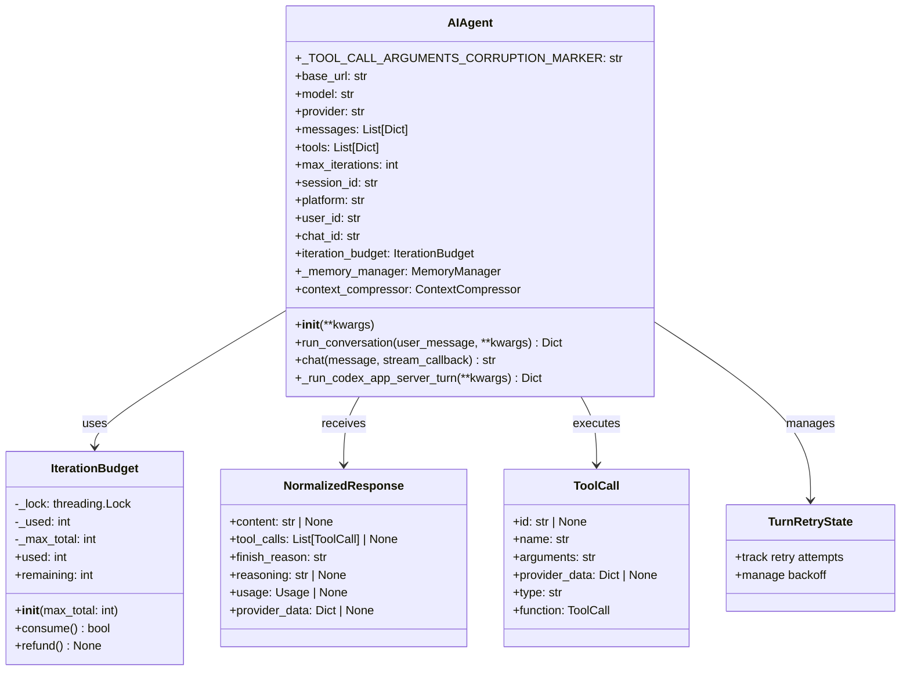
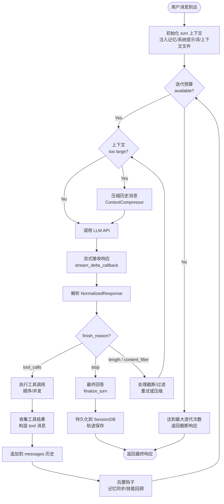

# Agent 核心思考-行动-观察循环

## 概述

`AIAgent` 是 hermes-agent 框架的核心类，定义于 run_agent.py，负责管理完整的对话流、工具调用执行、模型响应处理和迭代控制。它实现了经典 AI Agent 的 **Think（思考）→ Act（行动）→ Observe（观察）** 循环：模型思考后产生工具调用或最终回答，Agent 执行工具并将结果反馈给模型，模型基于观察结果继续思考，直到产生最终回答。

AIAgent 采用**委托式初始化**设计：`__init__` 方法本身仅做参数转发，实际初始化逻辑（约1400行）委托给 agent/agent_init.py 中的 `init_agent()` 函数。同样，核心对话循环委托给 agent/conversation_loop.py 中的 `run_conversation()` 函数（约3900行），`AIAgent.run_conversation()` 仅作为薄转发器，处理 relay 协调、计费上下文和异常安全。

### 解决的核心问题

1. **多轮工具调用循环**：模型可能连续调用多个工具，需要自动循环直到模型输出最终文本回答
2. **迭代预算控制**：通过 `IterationBudget` 防止无限循环（父 agent 默认 500 次，子 agent 默认 50 次）
3. **并发工具执行**：支持同一轮中多个工具调用的并行执行（最多 8 个 worker 线程）
4. **错误恢复与重试**：API 错误分类、自适应退避、fallback 模型切换
5. **上下文压缩**：对话过长时自动压缩历史消息以适应模型上下文窗口
6. **流式响应**：支持逐 token 流式输出，通过回调函数实时推送 delta

## 核心设计原理

### 1. 薄壳 + 委托模块

AIAgent 类本身是一个"薄壳"（thin shell），它持有所有状态属性（messages、tools、provider、client 等），但将复杂逻辑委托给 `agent/` 包中的独立模块：

- **初始化** → `agent.agent_init.init_agent()`
- **对话循环** → `agent.conversation_loop.run_conversation()`
- **工具执行** → `agent.tool_executor` 中的 `_execute_tool_calls_sequential()` / `_execute_tool_calls_concurrent()`
- **上下文压缩** → `agent.context_compressor.ContextCompressor`
- **迭代预算** → `agent.iteration_budget.IterationBudget`
- **提示词构建** → `agent.prompt_builder`
- **系统提示词** → `agent.system_prompt`
- **记忆管理** → `agent.memory_manager.MemoryManager`
- **MoA 协作** → `agent.moa_loop`

这种设计使 `run_agent.py` 保持可维护性，同时允许独立模块被单独测试和替换。

### 2. 迭代预算线程安全

IterationBudget 使用 `threading.Lock` 保护 `_used` 计数器，提供：
- `consume() -> bool`：消耗一次迭代，返回是否允许继续
- `refund() -> None`：归还一次迭代（用于 execute_code 回合，因为代码执行不算 agent 推理步骤）
- `used` / `remaining` 属性：查询已用/剩余次数

### 3. Relay 协调与计费上下文

`run_conversation()` 在进入实际循环前，通过 `relay_runtime.SESSION_COORDINATOR` 获取会话租约（lease），确保同一 session 的多轮对话串行执行。同时设置 ContextVar 上下文标签，使本轮内所有 LLM 调用（包括压缩、视觉、web_extract、MoA 等）都自动携带 `conversation=<root>` 标签和计费上下文。

## 数据结构/类图



## 工作流程/生命周期

### Think-Act-Observe 主循环



### 一次完整对话的生命周期

1. **入口阶段**：`AIAgent.run_conversation(user_message)` 被调用
   - 获取 relay 会话租约（防止同 session 并发）
   - 设置计费和对话 ContextVar 标签
   - 确保 SessionDB 行存在（首次调用延迟创建）
   - 委托给 `agent.conversation_loop.run_conversation()`

2. **Turn 准备阶段**：
   - 调用 `MemoryManager.prefetch_all()` 获取相关记忆
   - 构建完整 system prompt（身份、技能、环境提示、记忆上下文）
   - 将用户消息追加到 messages 列表
   - 执行 MoA 参考模型调用（如果启用 `/moa`）

3. **循环阶段**（Think → Act → Observe）：
   - **Think**：通过 `ProviderTransport.build_kwargs()` 构建 API 请求参数，调用 LLM
   - **判断**：根据 `finish_reason` 判断是工具调用还是最终回答
   - **Act**：调用 `agent.tool_executor` 执行工具（顺序或并发）
   - **Observe**：工具结果作为 `tool` 角色消息追加到 messages
   - 消耗一次 `IterationBudget`，检查是否需要压缩上下文

4. **收尾阶段**：
   - `finalize_turn()` 执行 turn 终结逻辑
   - `MemoryManager.sync_all()` 同步记忆
   - `MemoryManager.queue_prefetch_all()` 后台预取下一轮记忆
   - 持久化消息到 SessionDB
   - 释放 relay 租约，清除 ContextVar

### 核心循环代码片段

以下是对话循环的核心结构（来自 agent/conversation_loop.py）：

```python
def run_conversation(agent, user_message, system_message=None,
                     conversation_history=None, task_id=None,
                     stream_callback=None, **kwargs):
    """驱动单轮用户消息经过完整的 think-act-observe 循环。"""

    # ── Turn 准备 ──
    messages = agent._prepare_messages(system_message, conversation_history)
    agent._ensure_db_session()

    # 记忆预取
    if not is_trivial_prompt(user_message):
        memory_context = agent._memory_manager.prefetch_all(user_message)

    # ── 主循环 ──
    iteration = 0
    final_response = ""
    while True:
        # 迭代预算检查
        if not agent.iteration_budget.consume():
            final_response = agent._max_iterations_response()
            break

        iteration += 1

        # 上下文压缩
        if agent._should_compress(messages):
            messages = agent._compress_context(messages)

        # ── Think: 调用 LLM ──
        transport = agent._get_transport()
        api_kwargs = transport.build_kwargs(
            model=agent.model,
            messages=messages,
            tools=agent.tools,
            **agent._build_api_params()
        )
        response = agent._call_llm(api_kwargs, stream_callback)
        normalized = transport.normalize_response(response)

        # ── 判断 finish_reason ──
        if normalized.finish_reason == "stop":
            final_response = normalized.content or ""
            break

        if normalized.finish_reason == "tool_calls":
            # ── Act: 执行工具 ──
            tool_results = agent._execute_tool_calls(normalized.tool_calls)
            # ── Observe: 追加结果 ──
            messages.append(agent._build_assistant_message(normalized))
            messages.extend(tool_results)
            continue

        # length/content_filter → 压缩后重试
        messages = agent._handle_truncated(normalized, messages)
        continue

    # ── Turn 终结 ──
    result = finalize_turn(agent, messages, final_response, task_id)
    return result
```

## 关键 API/方法列表

### AIAgent 类

| 方法/属性 | 签名 | 说明 |
|-----------|------|------|
| `__init__` | `__init__(self, base_url=None, api_key=None, provider=None, api_mode=None, model="", max_iterations=90, enabled_toolsets=None, disabled_toolsets=None, save_trajectories=False, verbose_logging=False, quiet_mode=False, tool_progress_mode="all", max_tokens=None, reasoning_config=None, session_id=None, platform=None, user_id=None, chat_id=None, iteration_budget=None, fallback_model=None, credential_pool=None, checkpoints_enabled=False, ...)` | 初始化方法（转发器），接受 60+ 参数，委托给 `init_agent()` |
| `run_conversation` | `run_conversation(self, user_message: Any, system_message: str = None, conversation_history: List[Dict] = None, task_id: str = None, stream_callback: Optional[callable] = None, moa_config: Optional[dict] = None) -> Dict[str, Any]` | 执行完整对话轮次，返回包含 `final_response`、`messages`、`usage`、`interrupted` 等字段的结果 dict |
| `chat` | `chat(self, message: str, stream_callback: Optional[callable] = None) -> str` | 简化接口，仅返回最终回答字符串 |
| `base_url` (property) | `base_url -> str` / setter | 获取/设置 base URL，setter 同步更新 `_base_url_lower` 和 `_base_url_hostname` |
| `_ensure_db_session` | `_ensure_db_session(self) -> None` | 首次使用时延迟创建 SessionDB 行，包含来源、模型、cwd 等元数据 |
| `_get_session_db_for_recall` | `_get_session_db_for_recall(self)` | 懒加载 SessionDB，用于 session_search 工具的历史召回 |

### IterationBudget 类

| 方法 | 签名 | 说明 |
|------|------|------|
| `__init__` | `__init__(self, max_total: int)` | 构造函数，父 agent 默认 `max_total=500`，子 agent 默认 `max_total=50` |
| `consume` | `consume(self) -> bool` | 线程安全消耗一次迭代，返回 True 表示允许继续，False 表示预算耗尽 |
| `refund` | `refund(self) -> None` | 归还一次迭代配额（用于 execute_code 回合，代码执行不计入推理步骤） |
| `used` (property) | `used -> int` | 返回已消耗的迭代次数 |
| `remaining` (property) | `remaining -> int` | 返回剩余迭代次数 |

### NormalizedResponse 类型

| 字段 | 类型 | 说明 |
|------|------|------|
| `content` | `str \| None` | 文本响应内容 |
| `tool_calls` | `list[ToolCall] \| None` | 工具调用列表 |
| `finish_reason` | `str` | 结束原因：`"stop"` / `"tool_calls"` / `"length"` / `"content_filter"` |
| `reasoning` | `str \| None` | 推理内容（chain-of-thought） |
| `usage` | `Usage \| None` | Token 用量统计 |
| `provider_data` | `dict \| None` | 协议特定元数据（Anthropic thinking blocks、Codex items 等） |

### ToolCall 类型

| 字段 | 类型 | 说明 |
|------|------|------|
| `id` | `str \| None` | 工具调用唯一标识 |
| `name` | `str` | 工具名称 |
| `arguments` | `str` | JSON 字符串格式的参数 |
| `provider_data` | `dict \| None` | 协议特定数据（Codex call_id、Gemini thought_signature 等） |
| `type` (property) | `str` | 始终返回 `"function"`（向后兼容） |
| `function` (property) | `ToolCall` | 返回自身，使 `tc.function.name` / `tc.function.arguments` 可用 |

## 源码位置指引

| 文件 | 内容 |
|------|------|
| run_agent.py | `AIAgent` 类定义、`__init__` 转发器、`run_conversation`/`chat` 方法 |
| agent/agent_init.py | `init_agent()` 函数（~1400行），AIAgent 实际初始化逻辑 |
| agent/conversation_loop.py | `run_conversation()` 核心循环实现（~3900行） |
| agent/tool_executor.py | 工具调用执行引擎（顺序/并发调度、授权门控、结果持久化） |
| agent/iteration_budget.py | `IterationBudget` 线程安全迭代计数器 |
| agent/transports/types.py | `ToolCall`、`Usage`、`NormalizedResponse` dataclass 定义 |
| agent/turn_finalizer.py | `finalize_turn()` turn 终结逻辑 |
| agent/context_compressor.py | `ContextCompressor` 上下文压缩器 |
| agent/memory_manager.py | `MemoryManager` 记忆管理编排器 |
| agent/moa_loop.py | Mixture-of-Agents 多模型协作运行时 |
| agent/prompt_builder.py | 对话提示词构建器 |
| agent/system_prompt.py | 系统提示词生成与管理 |

## 相关概念交叉引用

- [Provider 抽象层](provider-abstraction.md) — `ProviderTransport` 和 `ProviderProfile` 如何适配不同模型 API
- [工具注册表](tool-registry.md) — `ToolRegistry` 工具注册/发现/调度机制
- [记忆子系统](memory-subsystem.md) — `MemoryManager` 短期/长期记忆集成
- [Gateway 多 Agent 编排](gateway-multi-agent.md) — Gateway 如何为每个平台会话创建 AIAgent 实例
- [平台插件系统](platform-plugin.md) — 消息平台适配器如何驱动 AIAgent
- [ACP 协议适配器](acp-adapter.md) — ACP 服务器如何桥接 AIAgent
- [CLI 入口与应用管理](cli-app-entry.md) — CLI 如何启动和配置 AIAgent
- [定时任务调度](cron-scheduler.md) — 定时任务如何创建非交互式 AIAgent
- [MCP 协议集成](mcp-protocol.md) — MCP 工具如何注册到 AIAgent 的工具面
