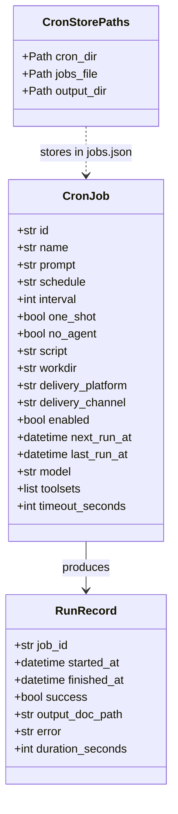
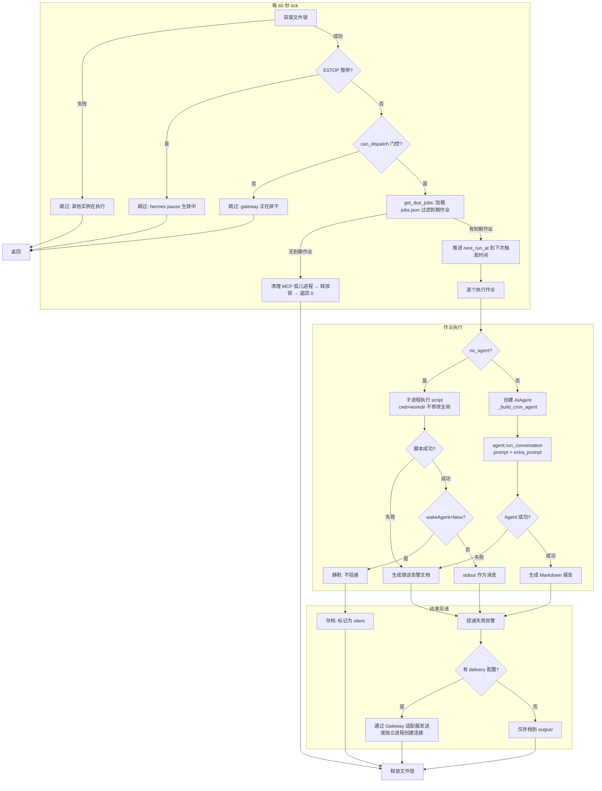
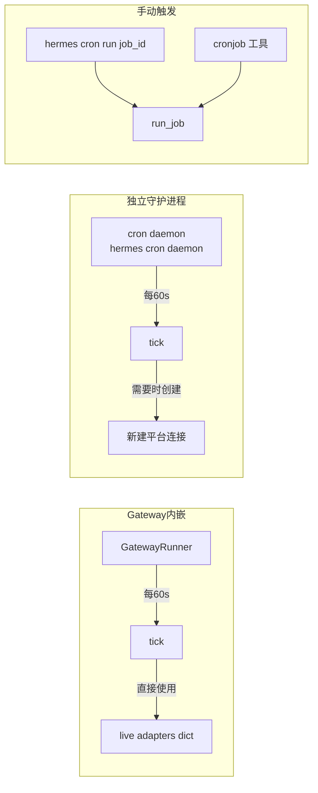

# 定时任务调度 (Cron Scheduler)

## 概述

hermes-agent 的 cron 子系统提供自动化定时任务能力，支持两类作业：
1. **Agent 模式**：定时触发 Agent 执行一个 prompt，结果可投递到指定平台（Telegram/Discord 等）
2. **no_agent 模式**：定时执行外部脚本（shell/Python），将 stdout 作为结果投递，不消耗 LLM token

调度器位于 cron/scheduler.py，核心设计点：
- 基于文件锁（fcntl/msvcrt）实现跨进程互斥，防止 gateway 内进程 ticker 与独立守护进程同时执行
- 使用标准 cron 表达式（5 段或 6 段带秒），支持固定间隔、一次性、cron 表达式三种调度
- 作业持久化在 `~/.hermes/cron/jobs.json`，支持 Profile 隔离
- 执行历史和输出保存到 `~/.hermes/cron/output/` 目录
- 紧急停止（estop）机制：`hermes pause` 后调度跳过所有作业
- 与 Gateway 深度集成：Gateway 内置每分钟 tick，也可独立 cron daemon 运行

### 解决的核心问题

1. **自动化 Agent 任务**：定时日报、定期检查、自动化报告生成
2. **监控告警模式**：`no_agent` + 脚本 + 平台投递 = 轻量 watchdog
3. **并发安全**：文件锁 + at-most-once 语义保证作业不重复执行
4. **结果投递**：执行结果自动发送到指定聊天平台
5. **可观测性**：执行日志、输出存档、失败重试记录

## 核心设计原理

### 1. 双模式作业

cron 作业支持两种执行模式：

```python
# cron/scheduler.py L3164-L3260 (run_job 函数开头)
def run_job(job, *, defer_agent_teardown=None, extra_prompt=None):
    """
    Returns: (success, full_output_doc, final_response, error_message)
    """
    # no_agent 短路：直接执行脚本，不加载 AIAgent
    if job.get("no_agent"):
        script_path = job.get("script")
        # 子进程执行脚本，cwd 使用 job.workdir（不修改进程全局 cwd）
        ok, output = _run_job_script_with_claim_heartbeat(
            job, script_path, workdir=_job_workdir,
        )
        if not ok:
            # 脚本失败 → 投递错误告警
            return False, doc, alert, output
        if not _parse_wake_gate(output):
            # wakeAgent=false（静默信号）→ 不投递
            return True, "", "", None
        # 脚本输出 → 作为最终消息投递
        return True, doc, output, None

    # Agent 模式：创建 AIAgent → run_conversation → 收集结果
    agent = _build_cron_agent(job)
    response = agent.run_conversation(prompt, ...)
    return success, doc, response, error
```

设计意图：
- **no_agent 模式**零 LLM 开销，适合监控脚本、日志检查等简单定时任务
- **Agent 模式**完整加载模型，可使用工具链执行复杂任务（代码分析、报告生成）
- `wakeAgent` 门控：脚本 stdout 中嵌入 `wakeAgent: false` 表示本次无需唤醒 Agent（静默跳过）

### 2. 文件锁互斥

`tick()` 函数使用跨平台文件锁保证同一时刻只有一个调度实例运行：

```python
# cron/scheduler.py L4826-L4865
def tick(verbose=True, adapters=None, loop=None, sync=True, *, can_dispatch=None):
    lock_dir, lock_file = _get_lock_paths()
    lock_fd = open(lock_file, "w", encoding="utf-8")
    try:
        if fcntl:
            fcntl.flock(lock_fd, fcntl.LOCK_EX | fcntl.LOCK_NB)  # Unix
        elif msvcrt:
            msvcrt.locking(lock_fd.fileno(), msvcrt.LK_NBLCK, 1)  # Windows
    except (OSError, IOError):
        logger.debug("Tick skipped — another instance holds the lock")
        return 0  # 其他实例正在执行，跳过
```

### 3. At-Most-Once 语义

在执行任何作业之前，先在锁内推进所有到期作业的 `next_run_at`：

```python
# cron/scheduler.py L4904-L4906
# Advance next_run_at for all recurring jobs FIRST, under the file lock,
# before any execution begins. This preserves at-most-once semantics.
```

即使作业执行崩溃，`next_run_at` 已经推进，不会在下次 tick 时重复执行。

### 4. 作业调度类型

| 类型 | 字段 | 说明 |
|------|------|------|
| Cron 表达式 | `schedule: "*/5 * * * *"` | 标准 5 段 cron（分 时 日 月 周），可选 6 段（带秒） |
| 固定间隔 | `interval: 300` (秒) | 每隔 N 秒执行一次 |
| 一次性 | `one_shot: true` | 到达 `next_run_at` 后执行一次并删除 |
| Cron + Interval 混合 | `schedule + interval` | cron 控制触发，interval 作为最小间隔兜底 |

## 数据结构

### 作业数据模型



### jobs.json 结构

作业存储在 `~/.hermes/cron/jobs.json`（Profile 隔离时为 `~/.hermes/profiles/<name>/cron/jobs.json`）：

```json
{
  "version": 1,
  "jobs": [
    {
      "id": "uuid-string",
      "name": "Daily Summary",
      "prompt": "Summarize today's git commits and send a report",
      "schedule": "0 9 * * *",
      "enabled": true,
      "delivery": {
        "platform": "telegram",
        "channel": "chat_id"
      },
      "model": "anthropic/claude-sonnet-4",
      "toolsets": ["shell", "git"],
      "timeout_seconds": 300,
      "next_run_at": "2025-01-01T09:00:00",
      "last_run_at": "2024-12-31T09:00:00",
      "created_at": "2024-12-01T00:00:00"
    },
    {
      "id": "uuid-2",
      "name": "Disk Monitor",
      "no_agent": true,
      "script": "/path/to/check_disk.sh",
      "schedule": "*/30 * * * *",
      "delivery": {
        "platform": "feishu"
      }
    }
  ]
}
```

### 调度流程



### 两种运行模式



Gateway 内嵌模式的优势：已持有所有平台的 live adapter 连接，结果投递零延迟；独立守护进程需要自行建立连接，但适合无 Gateway 的场景。

## 关键 API / 方法列表

| 函数/类 | 文件位置 | 说明 |
|---------|----------|------|
| `tick(verbose, adapters, loop, sync, *, can_dispatch)` | cron/scheduler.py#L4826 | 调度一次：检查到期作业、推进时间、执行 |
| `run_job(job, *, defer_agent_teardown, extra_prompt)` | cron/scheduler.py#L3164 | 执行单个作业，返回 `(success, doc, response, error)` |
| `get_due_jobs()` | cron/jobs.py | 加载并返回当前到期的作业列表 |
| `add_job(job_config)` | cron/jobs.py | 添加新作业到 jobs.json |
| `remove_job(job_id)` | cron/jobs.py | 删除作业 |
| `list_jobs()` | cron/jobs.py | 列出所有作业（含下次执行时间） |
| `enable_job(job_id)` / `disable_job(job_id)` | cron/jobs.py | 启用/禁用作业 |
| `_build_cron_agent(job)` | cron/scheduler.py | 为 Agent 模式作业创建 AIAgent 实例 |
| `_run_job_script_with_claim_heartbeat(job, script_path, workdir)` | cron/scheduler.py | 执行 no_agent 脚本（含 claim 心跳防锁超时） |
| `_parse_wake_gate(output)` | cron/scheduler.py | 解析脚本输出中的 `wakeAgent: true/false` 门控 |
| `_get_lock_paths()` | cron/scheduler.py | 获取文件锁路径 |
| `start_scheduler(interval=60)` | cron/scheduler.py | 启动独立守护进程循环 |

### run_job 返回值

```python
# Returns: tuple[bool, str, str, Optional[str]]
(success, full_output_doc, final_response, error_message)
```

- `success: bool` — 作业是否成功
- `full_output_doc: str` — 完整 Markdown 报告（含元数据、执行时间、输出）
- `final_response: str` — 最终响应文本（投递到平台的内容）
- `error_message: Optional[str]` — 错误信息（失败时）

### CLI 命令

```bash
hermes cron list                     # 列出所有作业
hermes cron add --name "..." --schedule "*/5 * * * *" --prompt "..."
hermes cron add --name "watchdog" --schedule "*/10 * * * *" --script ./check.sh --no-agent
hermes cron remove <job_id>          # 删除作业
hermes cron enable <job_id>          # 启用
hermes cron disable <job_id>         # 禁用
hermes cron run <job_id>             # 手动触发一次
hermes cron daemon                   # 启动独立守护进程
hermes pause                         # 紧急暂停（estop）
hermes resume                        # 恢复调度
```

## 源码位置指引

| 文件 | 内容 |
|------|------|
| cron/scheduler.py#L3164- | `run_job()` 作业执行核心 |
| cron/scheduler.py#L4826- | `tick()` 调度 tick 入口 |
| cron/jobs.py | 作业 CRUD、文件锁、Profile 隔离 |
| cron/parser.py | Cron 表达式解析（标准 5 段/6 段扩展） |
| cron/persistence.py | 执行历史/输出存档 |
| cron/delivery.py | 结果投递到各平台 |
| cron/__init__.py | 模块初始化 |

## 相关 Concepts

- [agent-core-loop.md](agent-core-loop.md) — Agent 模式作业内部运行 AIAgent.run_conversation
- [cli-app-entry.md](cli-app-entry.md) — `hermes cron` 子命令入口
- [gateway-multi-agent.md](gateway-multi-agent.md) — Gateway 内置 cron ticker，复用平台适配器
- [platform-plugin.md](platform-plugin.md) — 结果通过 Platform 适配器投递到各消息平台
- [tool-registry.md](tool-registry.md) — Agent 模式作业使用 ToolRegistry 中的工具
