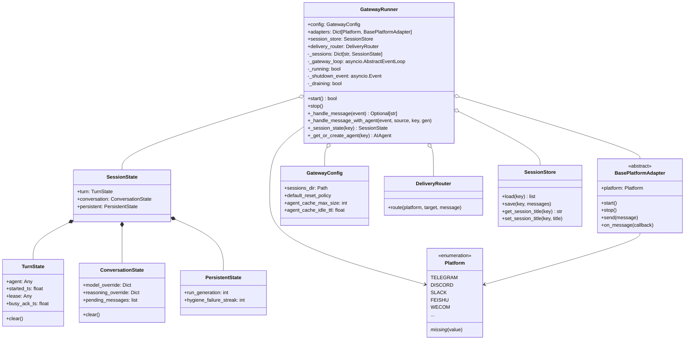
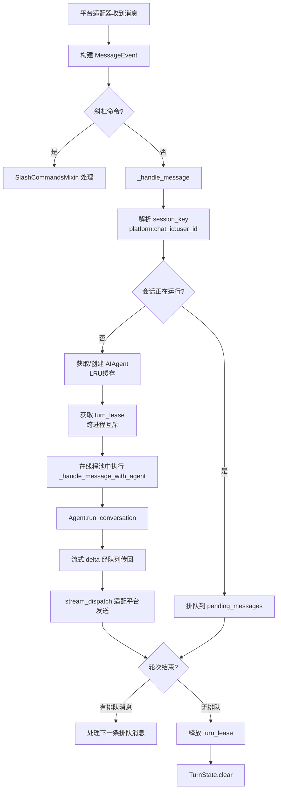
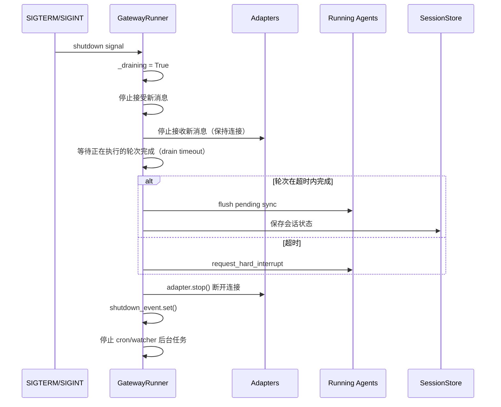

# Gateway 多Agent编排 (Gateway Multi-Agent Orchestration)

## 概述

Gateway 是 hermes-agent 的多平台消息网关运行时，负责同时连接多个即时通讯平台（Telegram、Discord、Slack、微信、飞书、企业微信、WhatsApp 等 22+ 平台），将来自不同平台/会话的消息路由到独立的 `AIAgent` 实例执行，并将响应流式分发回对应平台。

核心入口是 gateway/run.py 中的 **`GatewayRunner`** 类（L5848），它是整个网关的主控制器，继承自三个 Mixin：

- `GatewayAuthorizationMixin`：授权控制
- `GatewayKanbanWatchersMixin`：看板监控
- `GatewaySlashCommandsMixin`：斜杠命令处理

### 解决的核心问题

1. **多平台并发**：单个进程同时管理多个平台适配器的长连接/轮询
2. **会话隔离**：每个聊天/用户拥有独立的 `SessionState` 和 `AIAgent` 实例
3. **Agent 缓存**：LRU 缓存 + 空闲 TTL 驱逐，防止长期运行的网关内存无限增长
4. **异步调度**：asyncio 事件循环驱动，消息处理与 Agent 执行在不同线程协作
5. **流式分发**：将 LLM 流式输出适配到各平台的消息编辑/分块发送机制
6. **优雅关闭**：排空正在执行的轮次后再退出，支持重启轮询

## 核心设计原理

### 1. 三层状态作用域

session_state.py 将每个会话的状态分为三个作用域：

```python
@dataclass
class TurnState:
    """单轮次状态——每轮结束时清除"""
    agent: Any = None           # 运行中的 AIAgent 实例
    started_ts: float = 0.0     # 轮次开始时间戳
    lease: Any = None           # 跨进程活跃会话租约
    busy_ack_ts: float = 0.0    # 上次"忙碌中"确认时间戳
    lease_token: Any = None     # 租约令牌
    lease_generation: Optional[int] = None

@dataclass
class ConversationState:
    """单会话状态——跨轮次存续，会话边界时清除"""
    model_override: Optional[Dict] = None      # /model 覆盖
    one_turn_restore: Optional[Dict] = None    # /model --once 恢复快照
    reasoning_override: Optional[Dict] = None  # /reasoning 覆盖
    ...

@dataclass
class PersistentState:
    """持久状态——跨越会话边界存续"""
    run_generation: int = 0   # 单调递增，永不重置
    ...
```

设计理由：历史上 `GatewayRunner` 有 ~19 个独立的 `Dict[str, ...]` 属性，导致三类故障：
- **边界漂移**：新字典添加后忘记在会话边界清除
- **释放漂移**：不同代码路径释放不同子集的轮次状态
- **重置竞态**：懒初始化路径替换整个字典，丢弃并发会话的条目

统一为三层 dataclass 后，每个作用域有明确的 `clear()` 语义。

### 2. AIAgent LRU 缓存

```python
# gateway/run.py L70-L81
_AGENT_CACHE_MAX_SIZE = 128                    # 默认最大缓存 128 个 Agent
_AGENT_CACHE_IDLE_TTL_SECS = 3600.0            # 空闲 1 小时后驱逐
```

每个 `AIAgent` 实例持有 LLM 客户端、工具 schema、记忆提供者等重资源。长期运行的网关（数周不重启）需要限制缓存大小。缓存通过 LRU 顺序 + 空闲 TTL 驱逐，并由 `_sweep_agent_cache_under_pressure()` 提供内存压力阀值（agent_cache_pressure.py）。

### 3. 平台适配器注册

Platform 枚举 支持内置平台和动态插件平台：

```python
class Platform(Enum):
    TELEGRAM = "telegram"
    DISCORD = "discord"
    SLACK = "slack"
    FEISHU = "feishu"
    WECOM = "wecom"
    WHATSAPP = "whatsapp"
    # ... 22+ 内置平台

    @classmethod
    def _missing_(cls, value):
        """动态创建插件平台的伪枚举成员"""
        # 扫描 plugins/platforms/ 目录 + platform_registry
        if value in bundled_plugin_names or platform_registry.is_registered(value):
            pseudo = object.__new__(cls)
            pseudo._value_ = value
            cls._value2member_map_[value] = pseudo
            return pseudo
        return None
```

### 4. 单进程多会话架构

Gateway 在单个 asyncio 事件循环中运行所有平台适配器，每个消息事件触发一个会话键（`session_key`），路由到对应 `SessionState`：

```python
# gateway/run.py L5921-L5928
def _session_state(self, session_key: str) -> "SessionState":
    """Get-or-create the SessionState for session_key."""
    sessions = self._sessions_map()
    state = sessions.get(session_key)
    if state is None:
        state = SessionState()
        sessions[session_key] = state
    return state
```

### 5. 后台线程执行 Agent

Agent 的 `run_conversation()` 是同步阻塞方法，在专用线程池中执行，通过 asyncio 的 `run_coroutine_threadsafe` 桥接回到事件循环进行流式分发：

```python
# GatewayRunner 使用 ThreadPoolExecutor 运行 Agent
# agent 在后台线程执行 LLM 调用和工具执行
# 通过线程安全队列将流式 delta 传回 asyncio 循环
# stream_dispatch.py 负责将 delta 分发给对应平台的发送接口
```

## 数据结构与类图



### 网关模块文件结构

| 模块 | 职责 |
|------|------|
| gateway/run.py | GatewayRunner 主控制器（17000+ 行） |
| gateway/config.py | GatewayConfig、Platform 枚举、配置加载 |
| gateway/session_state.py | TurnState/ConversationState/PersistentState |
| gateway/session.py | SessionStore 持久化、会话生命周期 |
| gateway/platform_registry.py | 运行时平台注册中心 |
| gateway/stream_dispatch.py | 流式响应分发到平台适配器 |
| gateway/stream_consumer.py | 消费 Agent 的流式输出队列 |
| gateway/delivery.py | 消息投递与失败重试 |
| gateway/slash_commands.py | 斜杠命令路由（/new, /model, /reset 等） |
| gateway/session_stall.py | 会话停滞检测与通知 |
| gateway/turn_lease.py | 跨进程轮次租约（防止多进程并发） |
| gateway/shutdown_flush.py | 关闭时排空轮次 |
| gateway/restart.py | 代码更新后重启逻辑 |
| gateway/agent_cache_pressure.py | 内存压力下的 Agent 缓存清理 |
| gateway/scale_to_zero.py | 空闲缩容（NAS 部署） |
| gateway/drain_control.py | NAS 驱动的排空控制 |
| gateway/hooks.py | 网关生命周期钩子 |

## 工作流程/生命周期

### 网关启动流程

```mermaid
sequenceDiagram
    participant CLI as hermes_cli
    participant GR as GatewayRunner
    participant Config as GatewayConfig
    participant Adapters as Platform Adapters
    participant Loop as asyncio Loop

    CLI->>GR: GatewayRunner(config)
    GR->>Config: load_gateway_config_for_runner()
    GR->>GR: SessionStore(sessions_dir)
    GR->>GR: DeliveryRouter(config)
    GR->>GR: _start_loop_liveness_guards()
    CLI->>GR: start()
    GR->>GR: faulthandler.enable()
    GR->>GR: 连接所有配置的平台适配器
    loop 每个配置的平台
        GR->>Adapters: adapter.start()  (带超时)
        Adapters-->>GR: connected / failed
    end
    GR->>GR: 启动 cron ticker (60s)
    GR->>GR: 启动 session expiry watcher
    GR->>GR: 启动 memory monitor
    GR->>Loop: 运行事件循环直到 shutdown_event
```

### 消息处理流程



### 关闭/重启流程



## 关键 API / 方法列表

### GatewayRunner 核心方法

| 方法 | 签名 | 说明 |
|------|------|------|
| `__init__` | `(config: Optional[GatewayConfig] = None)` | 加载配置、初始化会话存储、投递路由器 |
| `start` | `async () -> bool` | 启动所有适配器、cron ticker、监视线程；返回至少一个适配器连接成功 |
| `stop` | `async (...)` | 优雅停止：排空轮次→断开适配器→退出事件循环 |
| `_handle_message` | `async (event: MessageEvent) -> Optional[str]` | 消息入口：路由、排队、或启动新轮次 |
| `_handle_message_with_agent` | `async (event, source, _quick_key, run_generation)` | 在线程池中执行 Agent 并流式分发结果 |
| `_session_state` | `(session_key: str) -> SessionState` | 获取或创建会话状态 |
| `_peek_session_state` | `(session_key: str) -> Optional[SessionState]` | 查看会话状态（不创建） |
| `_is_session_running` | `(session_key: str) -> bool` | 判断会话是否持有运行中的轮次槽位 |
| `_sessions_map` | `() -> Dict[str, SessionState]` | 懒初始化会话字典 |

### GatewayRunner 属性/配置

| 属性 | 类型 | 说明 |
|------|------|------|
| `config` | `GatewayConfig` | 网关配置（平台列表、超时、缓存参数等） |
| `adapters` | `Dict[Platform, BasePlatformAdapter]` | 默认 profile 的平台适配器映射 |
| `_profile_adapters` | `Dict[str, Dict[Platform, ...]]` | 多 profile 复用模式下的非默认适配器 |
| `session_store` | `SessionStore` | 会话持久化存储（消息历史） |
| `delivery_router` | `DeliveryRouter` | 消息投递路由（分块、重试、平台适配） |
| `_running` | `bool` | 网关是否在运行 |
| `_shutdown_event` | `asyncio.Event` | 关闭信号事件 |
| `_draining` | `bool` | 是否正在排空（拒绝新轮次） |
| `_restart_requested` | `bool` | 是否请求了重启 |

### SessionState 数据类

| 字段 | 类型 | 作用域 | 说明 |
|------|------|--------|------|
| `turn.agent` | `Any` (AIAgent) | Turn | 当前轮次运行的 Agent 实例 |
| `turn.started_ts` | `float` | Turn | 轮次开始时间戳 |
| `turn.lease` | `Any` | Turn | 跨进程活跃会话租约 |
| `conversation.model_override` | `Optional[Dict]` | Conversation | `/model` 会话级覆盖 |
| `conversation.pending_messages` | `list` | Conversation | 排队等待的消息 |
| `persistent.run_generation` | `int` | Persistent | 单调递增的运行代号（永不重置） |

### Platform 枚举内置成员

| 成员 | 值 | 说明 |
|------|------|------|
| `TELEGRAM` | `"telegram"` | Telegram Bot |
| `DISCORD` | `"discord"` | Discord Bot |
| `SLACK` | `"slack"` | Slack App/Bot |
| `WHATSAPP` / `WHATSAPP_CLOUD` | `"whatsapp"` / `"whatsapp_cloud"` | WhatsApp 个人/云API |
| `SIGNAL` | `"signal"` | Signal Messenger |
| `FEISHU` | `"feishu"` | 飞书 |
| `WECOM` / `WECOM_CALLBACK` | `"wecom"` / `"wecom_callback"` | 企业微信 |
| `WEIXIN` | `"weixin"` | 微信个人号 |
| `DINGTALK` | `"dingtalk"` | 钉钉 |
| `QQBOT` | `"qqbot"` | QQ 机器人 |
| `BLUEBUBBLES` | `"bluebubbles"` | BlueBubbles (iMessage) |
| `MATTERMOST` | `"mattermost"` | Mattermost |
| `MATRIX` | `"matrix"` | Matrix 协议 |
| `EMAIL` | `"email"` | 邮件 |
| `SMS` | `"sms"` | 短信 |
| `HOMEASSISTANT` | `"homeassistant"` | Home Assistant |
| `API_SERVER` | `"api_server"` | HTTP API 服务 |
| `WEBHOOK` / `MSGRAPH_WEBHOOK` | `"webhook"` / `"msgraph_webhook"` | Webhook |
| `YUANBAO` | `"yuanbao"` | 腾讯元宝 |
| `RELAY` | `"relay"` | 通用中继适配器（实验性） |
| `LOCAL` | `"local"` | 本地 CLI 模式 |

### 关键配置参数

```python
# gateway/run.py L80-L92
_AGENT_CACHE_MAX_SIZE = 128              # Agent 缓存上限
_AGENT_CACHE_IDLE_TTL_SECS = 3600.0      # 空闲 TTL（1小时）
_PLATFORM_CONNECT_TIMEOUT_SECS_DEFAULT = 30.0   # 平台连接超时
_TELEGRAM_CONNECT_TIMEOUT_SECS_DEFAULT = 180.0  # Telegram 特殊超时（冷启动轮询）
_ADAPTER_DISCONNECT_TIMEOUT_SECS_DEFAULT = 5.0  # 断开超时
_SYNC_DRAIN_TIMEOUT_S = 5.0              # 关闭排空超时
```

可通过 `config.yaml` 中的 `agent.agent_cache.max_size` 和 `agent.agent_cache.idle_ttl_secs` 覆盖默认值。

## 源码位置指引

| 文件 | 内容 |
|------|------|
| gateway/run.py#L5848- | GatewayRunner 类定义 |
| gateway/run.py#L10891- | `start()` 方法实现 |
| gateway/run.py#L14638- | `_handle_message()` 消息入口 |
| gateway/config.py#L272-L347 | Platform 枚举定义与动态扩展 |
| gateway/session_state.py | TurnState/ConversationState/PersistentState |
| gateway/session.py | SessionStore 会话持久化 |
| gateway/platforms/ | 平台适配器实现（含 QQBot、微信、WhatsApp、Signal 等） |
| gateway/relay/ | Relay 中继协议适配器 |
| gateway/stream_dispatch.py | 流式响应分发 |

### 启动示例（CLI 入口）

```bash
# 通过 CLI 启动网关
python -m gateway.run
# 或
python hermes_cli/main.py --gateway
```

GatewayRunner 初始化片段：

```python
# gateway/run.py L5962-L6027
def __init__(self, config: Optional[GatewayConfig] = None):
    self.config = config if config is not None else load_gateway_config_for_runner()
    self.adapters: Dict[Platform, BasePlatformAdapter] = {}
    self._profile_adapters: Dict[str, Dict[Platform, BasePlatformAdapter]] = {}
    self.session_store = SessionStore(
        self.config.sessions_dir, self.config,
        has_active_processes_fn=lambda key: process_registry.has_active_for_session(key),
    )
    self._async_session_store = AsyncSessionStore(self.session_store)
    self.delivery_router = DeliveryRouter(self.config)
    self._running = False
    self._gateway_loop: Optional[asyncio.AbstractEventLoop] = None
    self._shutdown_event = asyncio.Event()
```

## 相关 Concepts

- [agent-core-loop.md](agent-core-loop.md) — 每个会话中 AIAgent 的 Think-Act-Observe 循环
- [platform-plugin.md](platform-plugin.md) — 平台插件系统与消息渠道（plugins/platforms/）
- [memory-subsystem.md](memory-subsystem.md) — 网关场景下的多用户记忆作用域（user_id/chat_id 传递）
- [cron-scheduler.md](cron-scheduler.md) — Gateway 内置 cron ticker 每 60 秒调度定时任务
- [cli-app-entry.md](cli-app-entry.md) — CLI 通过 `--gateway` 参数启动 GatewayRunner
- [acp-adapter.md](acp-adapter.md) — ACP 协议服务器作为另一种接入方式
