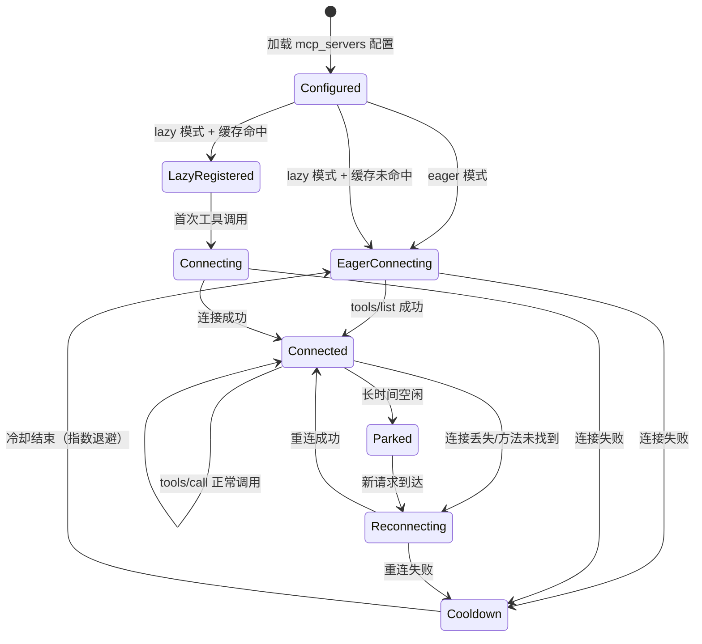
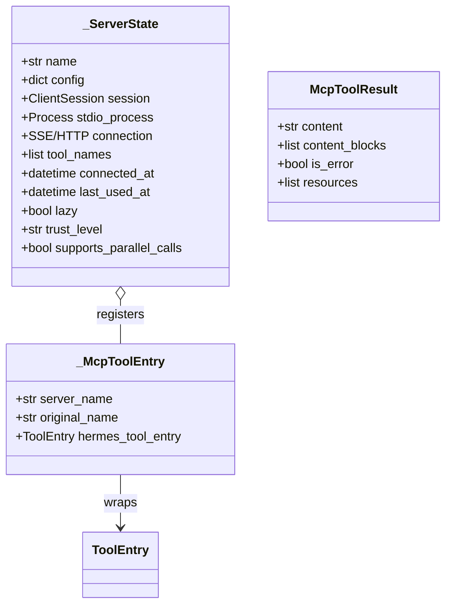
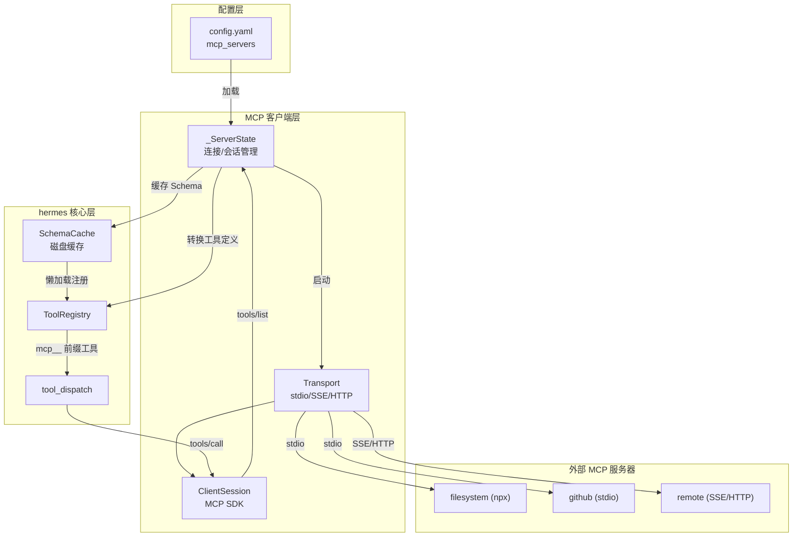
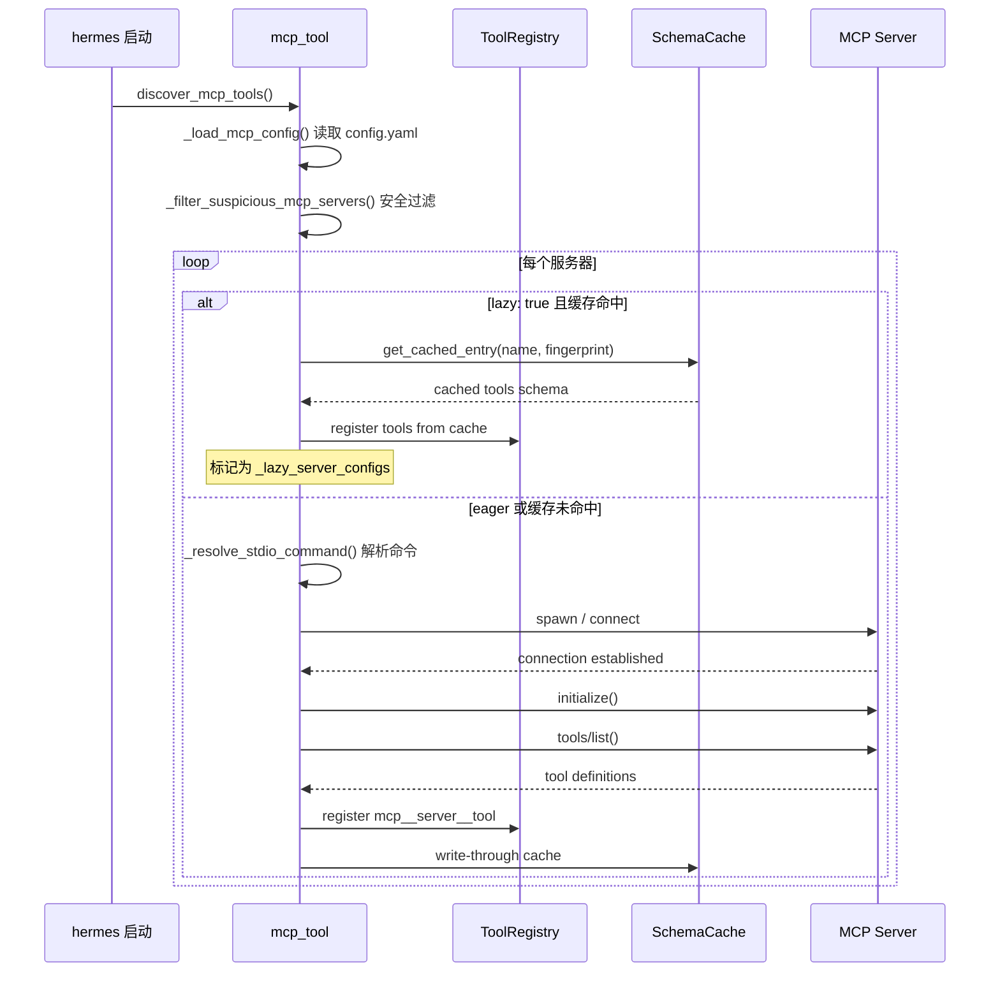
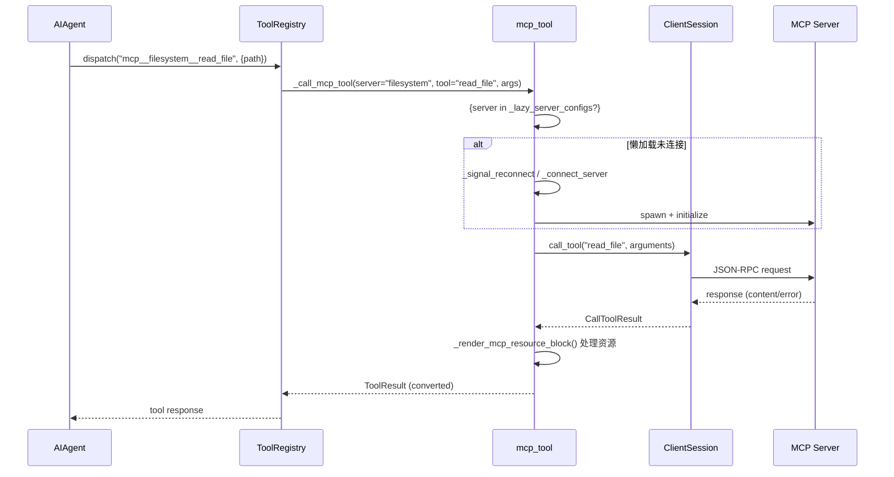

# MCP 协议集成 (Model Context Protocol Integration)

## 概述

MCP（Model Context Protocol）是 Anthropic 推出的开放协议，允许 AI 模型通过标准化接口与外部工具、数据源和服务交互。hermes-agent 在 tools/mcp_tool.py 中实现了完整的 MCP 客户端，将 MCP 服务器暴露的工具、资源、提示词动态桥接到 hermes 自身的 ToolRegistry 中，使 Agent 能像使用内置工具一样调用 MCP 工具。

核心能力：
- **三种传输方式**：stdio（本地子进程）、SSE（Server-Sent Events）、HTTP（Streamable HTTP）
- **配置驱动**：从 `~/.hermes/config.yaml` 的 `mcp_servers` 节读取服务器配置
- **懒加载连接**：`lazy: true` 的服务器仅在首次调用工具时才建立连接
- **Schema 缓存**：工具定义缓存到磁盘，下次启动直接注册（无需启动服务器）
- **安全沙箱**：服务器分为 trusted/untrusted 两级，untrusted 服务器的工具受限
- **连接冷却**：连接失败后进入指数退避冷却期，防止重启风暴
- **自动重连**：连接中断后自动重连，工具定义刷新
- **资源处理**：支持 MCP 资源（图片、音频、文本 blob）的本地缓存与渲染

### 解决的核心问题

1. **工具生态扩展**：无需编写 Python 适配器即可接入任意 MCP 兼容服务器
2. **进程隔离**：stdio 模式下 MCP 服务器运行在独立子进程，崩溃不影响 Agent
3. **性能优化**：懒连接 + Schema 缓存大幅降低启动开销
4. **安全治理**：trusted/untrusted 分级、命令白名单、环境变量隔离
5. **资源桥接**：MCP 资源（图片/音频）自动转换为 hermes 内部消息格式

## 核心设计原理

### 1. 配置格式

MCP 服务器在 config.yaml 中配置：

```yaml
# ~/.hermes/config.yaml
mcp_servers:
  # stdio 模式：启动本地子进程
  filesystem:
    command: "npx"
    args: ["-y", "@modelcontextprotocol/server-filesystem", "/path/to/dir"]
    env:
      NODE_ENV: "production"
    trust: "trusted"      # trusted | untrusted
    lazy: false            # 懒连接（首次调用才启动）
    tools:
      include: ["read_file", "list_directory"]  # 工具白名单
      exclude: ["write_file"]                    # 工具黑名单

  # SSE / HTTP 模式：连接远程服务器
  remote-search:
    url: "https://mcp.example.com/sse"
    headers:
      Authorization: "Bearer ${API_KEY}"   # 环境变量引用
    trust: "untrusted"

  # 带 TLS 客户端证书
  secure-srv:
    url: "https://intranet/mcp"
    client_cert: "~/.hermes/certs/client.pem"
    client_key: "~/.hermes/certs/client.key"
```

### 2. 传输层抽象

```python
# tools/mcp_tool.py L220
from mcp import ClientSession, StdioServerParameters
# 也支持 SSE / StreamableHTTP 传输（通过 mcp SDK 的多种 transport）

# stdio 服务器参数
server_params = StdioServerParameters(
    command=resolved_command,
    args=cfg.get("args", []),
    env=_build_safe_env(cfg.get("env")),  # 安全环境变量构建
    cwd=_workspace_folder(),
)
```

环境变量构建时进行安全处理：
- 仅显式配置的环境变量传递给子进程（不继承全部父进程环境）
- 支持 `${VAR}` 语法引用系统环境变量
- PATH 进行安全注入（包含命令所在目录）

### 3. 懒连接与 Schema 缓存

```python
# tools/mcp_tool.py L6701-L6730 (register_mcp_servers 懒加载逻辑)
# Lazy startup: servers gated with ``lazy: true`` whose config
# fingerprint matches a valid on-disk schema-cache entry register
# their tools from cache WITHOUT spawning/connecting.
for name, cfg in new_servers.items():
    if not _resolve_server_lazy(name, cfg):
        continue
    entry = get_cached_entry(name, config_fingerprint(cfg))
    if not entry:
        continue  # 缓存未命中 → 走正常 eager 连接
    names = _register_from_cache_sync(name, cfg, entry)
```

懒连接流程：
1. 启动时：`lazy: true` 服务器不启动子进程，从磁盘缓存读取工具 Schema 并注册到 ToolRegistry
2. 首次调用工具时：检测到无活跃 session → 启动子进程/建立连接 → 转发调用
3. 连接成功后：write-through 更新磁盘缓存

### 4. 安全分级

```python
# tools/mcp_tool.py 安全过滤逻辑
def _filter_suspicious_mcp_servers(servers):
    """过滤可疑的服务器配置（路径遍历、命令注入等）"""
    ...

# Trust 分级影响：
# - trusted: 工具可执行任意操作（包括 shell 类调用）
# - untrusted: 工具被沙箱化，禁止访问本地文件系统等敏感操作
trust_level = cfg.get("trust", "untrusted")  # 默认 untrusted
```

安全措施：
- 命令路径解析：`_resolve_stdio_command()` 将相对命令解析为绝对路径，防止 PATH 劫持
- Watchdog 包装：`_wrap_command_with_watchdog()` 为子进程添加看门狗，防止孤儿进程
- 错误信息消毒：`_sanitize_error()` 移除错误消息中的路径、token 等敏感信息
- 环境变量隔离：`_build_safe_env()` 构建最小化环境变量集

### 5. 连接状态机



## 数据结构

### 服务器状态



### MCP 与 ToolRegistry 的桥接



工具命名约定：MCP 工具以 `mcp__<server>__<tool>` 格式注册到 ToolRegistry，避免命名冲突。

## 工作流程

### 服务器注册流程



### 工具调用流程



### 资源处理

MCP 工具返回的资源（图片、音频、二进制 blob）自动处理：

```python
# tools/mcp_tool.py L923
def _render_mcp_resource_block(block, server_name=""):
    """将 MCP 内容块转换为 hermes 内部格式"""
    if block.type == "image":
        ext = _mcp_image_extension_for_mime_type(block.mimeType)
        local_path = _cache_mcp_image_block(block)  # 缓存到本地
        return f"[Image saved to {local_path}]"
    elif block.type == "audio":
        local_path = _cache_mcp_audio_block(block)
        return f"[Audio saved to {local_path}]"
    elif block.type == "resource":
        filename = _mcp_resource_filename(block.uri, block.mimeType)
        # 下载/保存资源，返回本地引用
    elif block.type == "text":
        return block.text
```

## 关键 API / 方法列表

| 函数 | 文件位置 | 说明 |
|------|----------|------|
| `register_mcp_servers(servers)` | tools/mcp_tool.py#L6631 | 连接 MCP 服务器并注册工具（幂等） |
| `_load_mcp_config()` | tools/mcp_tool.py#L4985 | 从 config.yaml 加载 mcp_servers 配置 |
| `discover_mcp_tools()` | tools/mcp_tool.py | Agent 启动时的工具发现入口 |
| `_resolve_stdio_command(command, env)` | tools/mcp_tool.py#L702 | 解析 stdio 命令为绝对路径 |
| `_build_safe_env(user_env)` | tools/mcp_tool.py#L493 | 构建安全的子进程环境变量 |
| `_wrap_command_with_watchdog(command, args)` | tools/mcp_tool.py#L749 | 为子进程添加看门狗防孤儿 |
| `_filter_suspicious_mcp_servers(servers)` | tools/mcp_tool.py#L4958 | 过滤可疑服务器配置 |
| `_validate_remote_mcp_url(name, url)` | tools/mcp_tool.py#L1106 | 验证远程 MCP URL 合法性 |
| `_resolve_client_cert(name, config)` | tools/mcp_tool.py#L1158 | 解析 TLS 客户端证书 |
| `_resolve_identity_header(name, config)` | tools/mcp_tool.py#L1231 | 解析身份认证头 |
| `_render_mcp_resource_block(block, server_name)` | tools/mcp_tool.py#L923 | 渲染 MCP 资源块为 hermes 格式 |
| `_cache_mcp_image_block(block)` | tools/mcp_tool.py#L791 | 缓存 MCP 图片到本地文件 |
| `_cache_mcp_audio_block(block)` | tools/mcp_tool.py#L883 | 缓存 MCP 音频到本地文件 |
| `_paginate_full_list(list_method, items_attr, server_name)` | tools/mcp_tool.py#L661 | 分页获取完整工具/资源列表 |
| `_kill_orphaned_mcp_children()` | tools/mcp_tool.py | 清理孤儿 MCP 子进程（cron tick 调用） |
| `_classify_mcp_failure(exc)` | tools/mcp_tool.py#L1072 | 分类 MCP 失败类型（用于重连/冷却决策） |

### MCP 工具定义示例

注册到 ToolRegistry 后的工具格式：

```python
{
    "name": "mcp__filesystem__read_file",
    "description": "[MCP filesystem] Read a file from the filesystem",
    "parameters": {
        "type": "object",
        "properties": {
            "path": {"type": "string", "description": "Path to the file"}
        },
        "required": ["path"]
    }
}
```

### CLI 管理命令

```bash
hermes mcp list                       # 列出已配置的 MCP 服务器和工具
hermes mcp add <name> --command ...   # 添加 MCP 服务器
hermes mcp remove <name>              # 移除 MCP 服务器
hermes mcp refresh                    # 刷新工具定义（重建连接）
hermes mcp logs <name>                # 查看服务器 stderr 日志
```

## 源码位置指引

| 文件 | 内容 |
|------|------|
| tools/mcp_tool.py | MCP 客户端核心实现（连接、注册、调用、安全、资源） |
| tools/mcp_schema_cache.py | Schema 磁盘缓存（懒加载支持） |
| hermes_cli/mcp_config.py | MCP CLI 配置管理子命令 |
| tools/registry.py | ToolRegistry（MCP 工具注册目标） |

## 相关 Concepts

- [tool-registry.md](tool-registry.md) — MCP 工具通过 ToolRegistry 注册和分派
- [agent-core-loop.md](agent-core-loop.md) — Agent 核心循环中 MCP 工具与内置工具统一调用
- [cli-app-entry.md](cli-app-entry.md) — `hermes mcp` 子命令管理 MCP 配置
- [cron-scheduler.md](cron-scheduler.md) — cron tick 后清理 MCP 孤儿子进程
