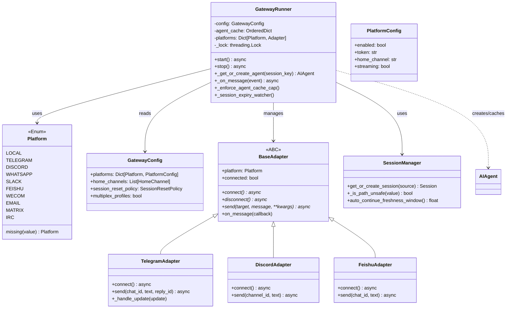

# 平台插件系统与消息渠道

## 概述

hermes-agent 的平台插件系统通过统一的适配器（Adapter）接口接入 22+ 个消息平台，使同一个 AI Agent 实例可以同时在 Telegram、Discord、Slack、飞书（Feishu）、企业微信（WeCom）、WhatsApp、Microsoft Teams、Email、IRC、Matrix、Google Chat、Home Assistant、Line、Mattermost、A2A 协议等渠道提供对话服务。

平台插件位于 plugins/platforms/ 目录下，每个平台包含：
- `plugin.yaml`：插件元数据声明
- `adapter.py`：适配器实现，继承或实现 gateway/platforms/base.py 中定义的接口

GatewayRunner 是网关的核心运行时类，负责加载配置、启动所有平台适配器、管理会话缓存和消息路由。

### 解决的核心问题

1. **多渠道统一接入**：22+ 平台的消息格式、认证方式、发送/接收 API 差异巨大，通过适配器模式统一
2. **会话管理**：每个平台用户/聊天映射到独立的 AIAgent 实例（LRU 缓存，最大 128 个，空闲 1 小时回收）
3. **PII 隐私保护**：平台用户 ID 和聊天 ID 在存储前进行 SHA-256 哈希，防止敏感信息泄露
4. **会话自动续期**：1 小时新鲜窗口内自动恢复中断的会话，超时则创建新会话
5. **消息流式投递**：支持逐 token 流式推送响应到平台
6. **平台特定路由**：线程消息（Slack threads、Telegram topics）、回复锚点、语音消息等平台特性适配

## 核心设计原理

### 1. Platform 枚举动态扩展

Platform 枚举内置了核心平台成员（TELEGRAM、DISCORD、SLACK、FEISHU、WECOM 等），同时通过 `_missing_()` 方法支持动态成员创建：当访问 `Platform("irc")` 时，如果 `irc` 是已发现的插件平台名称，则自动创建一个伪成员缓存到 `_value2member_map_`，确保身份稳定性（`Platform("irc") is Platform("irc")` 为 True）。

```python
class Platform(Enum):
    LOCAL = "local"
    TELEGRAM = "telegram"
    DISCORD = "discord"
    WHATSAPP = "whatsapp"
    SLACK = "slack"
    FEISHU = "feishu"
    WECOM = "wecom"
    # ... 更多内置平台

    @classmethod
    def _missing_(cls, value):
        """为插件平台创建动态枚举成员"""
        value = value.strip().lower()
        if value in cls._value2member_map_:
            return cls._value2member_map_[value]
        # 扫描 plugins/platforms/ 目录或运行时注册表
        if value in _bundled_plugin_names or platform_registry.is_registered(value):
            pseudo = object.__new__(cls)
            pseudo._value_ = value
            pseudo._name_ = value.upper().replace("-", "_")
            cls._value2member_map_[value] = pseudo
            return pseudo
        return None
```

### 2. BaseAdapter 接口

所有平台适配器实现统一的接口，核心方法包括：

- **连接生命周期**：`connect()` / `disconnect()` 启动和停止平台轮询/WebSocket
- **消息接收**：通过回调或 asyncio 队列接收平台消息，转换为统一的内部事件
- **消息发送**：`send()` 发送文本/图片/文件/语音消息，处理平台特定格式
- **流式支持**：通过 stream_delta_callback 逐 token 推送响应

### 3. PII 哈希保护

gateway/session.py 提供了三个哈希函数：

```python
def _hash_id(value: str) -> str:
    """SHA-256 前 12 位十六进制"""
    return hashlib.sha256(value.encode("utf-8")).hexdigest()[:12]

def _hash_sender_id(value: str) -> str:
    """user_<12hex> 格式"""
    return f"user_{_hash_id(value)}"

def _hash_chat_id(value: str) -> str:
    """保留平台前缀: telegram:<hash>, discord:<hash>"""
    colon = value.find(":")
    if colon > 0:
        return f"{value[:colon]}:{_hash_id(value[colon+1:])}"
    return _hash_id(value)
```

### 4. 会话管理与自动续期

Gateway 为每个活跃会话维护一个 AIAgent 实例，通过 LRU 缓存限制内存占用：
- 默认最大缓存 128 个 agent（`_AGENT_CACHE_MAX_SIZE`）
- 空闲 1 小时自动回收（`_AGENT_CACHE_IDLE_TTL_SECS = 3600`）
- 自动续期窗口默认 1 小时（`_AUTO_CONTINUE_FRESHNESS_SECS_DEFAULT = 3600`），可通过 `HERMES_AUTO_CONTINUE_FRESHNESS` 环境变量覆盖

## 数据结构/类图



## 工作流程/生命周期

### Gateway 启动与消息处理流程

```mermaid
flowchart TD
    START([Gateway 启动]) --> LOAD[加载 GatewayConfig\n解析 config.yaml]
    LOAD --> INIT[初始化 GatewayRunner\n创建 agent 缓存]
    INIT --> PLATFORMS{遍历已启用平台}

    PLATFORMS -->|每个平台| CONNECT[创建 Adapter 实例\n调用 connect()]
    CONNECT --> POLL[开始轮询/WebSocket 监听]
    POLL --> PLATFORMS
    PLATFORMS -->|所有平台就绪| SERVE([服务就绪])

    SERVE --> MSG[收到平台消息]
    MSG --> HASH[PII 哈希\n_hash_sender_id/_hash_chat_id]
    HASH --> SESSION[get_or_create_session\n判断续期/新建]
    SESSION --> AGENT{缓存中有\nAIAgent?}

    AGENT -->|Yes| GETAGENT[从缓存取]
    AGENT -->|No| CREATE[创建新 AIAgent\n配置平台特定工具集]
    CREATE --> CACHE[放入 LRU 缓存\n检查容量限制]
    CACHE --> GETAGENT

    GETAGENT --> RUN[agent.run_conversation\nstream_callback=适配器发送]
    RUN --> TOOL[工具执行顺序/并发\n平台特定工具可用]
    TOOL --> STREAM[流式响应\n逐 token 发送到平台]
    STREAM --> DONE[最终响应发送\n持久化会话]
    DONE --> MSG
```

### 平台适配器插件结构

每个平台插件遵循统一的文件结构：

```
plugins/platforms/<name>/
├── plugin.yaml      # 插件元数据
├── __init__.py      # 包初始化，注册适配器
├── adapter.py       # 适配器实现（核心）
└── (其他辅助模块)   # 如加密、媒体处理等
```

以 Telegram 平台为例，adapter.py 的核心结构：

```python
# plugins/platforms/telegram/adapter.py
class TelegramAdapter(BaseAdapter):
    platform = Platform.TELEGRAM

    async def connect(self):
        """启动 Telegram Bot 长轮询"""
        self._bot = telegram.Bot(token=self.config.token)
        self._offset = 0
        self._running = True
        asyncio.create_task(self._poll_loop())

    async def _poll_loop(self):
        """长轮询获取更新"""
        while self._running:
            updates = await self._bot.get_updates(offset=self._offset, timeout=30)
            for update in updates:
                self._offset = update.update_id + 1
                await self._handle_update(update)

    async def send(self, target, message, reply_to=None, **kwargs):
        """发送消息到指定 chat_id"""
        # 处理 Markdown/HTML 格式、长消息分段、附件发送
        await self._bot.send_message(
            chat_id=target,
            text=message,
            reply_to_message_id=reply_to,
            parse_mode="Markdown",
        )
```

### 已支持平台列表

| 平台 | 插件目录 | 说明 |
|------|---------|------|
| Telegram | `plugins/platforms/telegram/` | Bot API 长轮询，支持 topic、语音、文件 |
| Discord | `plugins/platforms/discord/` | Discord.py，支持线程、语音、Embed |
| Slack | `plugins/platforms/slack/` | Socket Mode + Web API，支持 Block Kit |
| 飞书（Feishu） | `plugins/platforms/feishu/` | 飞书开放平台 API，支持文档、评论、会议邀请 |
| 企业微信（WeCom） | `plugins/platforms/wecom/` | 企业微信回调模式，支持消息加解密 |
| WhatsApp | `plugins/platforms/whatsapp/` | WhatsApp Business API |
| Microsoft Teams | `plugins/platforms/teams/` | Teams Bot Framework |
| Email | `plugins/platforms/email/` | SMTP/IMAP 邮件收发 |
| Google Chat | `plugins/platforms/google_chat/` | Google Chat API + OAuth |
| IRC | `plugins/platforms/irc/` | IRC 协议 |
| Matrix | `plugins/platforms/matrix/` | Matrix 协议 |
| Mattermost | `plugins/platforms/mattermost/` | Mattermost API |
| Line | `plugins/platforms/line/` | Line Messaging API |
| Home Assistant | `plugins/platforms/homeassistant/` | HA 对话集成 |
| A2A 协议 | `plugins/platforms/a2a/` | Agent-to-Agent 协议 |
| 钉钉（DingTalk） | `plugins/platforms/dingtalk/` | 钉钉机器人 |
| ntfy | `plugins/platforms/ntfy/` | ntfy.sh 通知服务 |
| Buzz | `plugins/platforms/buzz/` | Nostr 协议 |
| SMS | `plugins/platforms/sms/` | 短信 |
| Raft | `plugins/platforms/raft/` | Raft 共识（内部） |
| Simplex | `plugins/platforms/simplex/` | SimpleX 协议 |
| Photon | `plugins/platforms/photon/` | Photon sidecar |

## 关键 API/方法列表

### GatewayRunner 类

| 方法 | 位置 | 说明 |
|------|------|------|
| `start_gateway()` | gateway/run.py:27135 | 启动网关的异步入口函数，加载配置并运行 GatewayRunner |
| `_get_or_create_agent()` | GatewayRunner 内部 | 根据 session_key 获取或创建 AIAgent 实例（LRU 缓存） |
| `_enforce_agent_cache_cap()` | GatewayRunner 内部 | 强制 agent 缓存容量限制，LRU 驱逐超出的 agent |
| `_session_expiry_watcher()` | GatewayRunner 内部 | 后台线程，定期回收空闲超时的 agent |
| `_on_platform_message()` | GatewayRunner 内部 | 平台消息回调入口，创建/获取 agent 并运行对话 |

### GatewayConfig 类

| 字段/方法 | 类型 | 说明 |
|-----------|------|------|
| `platforms` | `Dict[Platform, PlatformConfig]` | 各平台配置（token、enabled、home_channel 等） |
| `home_channels` | `List[HomeChannel]` | 家庭频道配置（启动通知频道） |
| `session_reset_policy` | `SessionResetPolicy` | 会话重置策略（空闲超时、手动重置等） |
| `multiplex_profiles` | `bool` | 是否启用多配置文件隔离 |

### Platform 枚举

| 成员 | 值 | 说明 |
|------|-----|------|
| `LOCAL` | `"local"` | CLI 本地模式 |
| `TELEGRAM` | `"telegram"` | Telegram Bot |
| `DISCORD` | `"discord"` | Discord |
| `WHATSAPP` | `"whatsapp"` | WhatsApp |
| `SLACK` | `"slack"` | Slack |
| `FEISHU` | `"feishu"` | 飞书 |
| `WECOM` | `"wecom"` | 企业微信 |
| `EMAIL` | `"email"` | 邮件 |
| `TEAMS` | `"teams"` | Microsoft Teams |
| `HOMEASSISTANT` | `"homeassistant"` | Home Assistant |
| `_missing_()` | 类方法 | 动态插件平台成员创建 |
| `_scan_bundled_plugin_platforms()` | 类方法 | 扫描 `plugins/platforms/` 目录发现插件 |

### Session 管理函数

| 函数 | 位置 | 说明 |
|------|------|------|
| `auto_continue_freshness_window()` | gateway/session.py:40-57 | 返回自动续期新鲜窗口（秒），读取环境变量 `HERMES_AUTO_CONTINUE_FRESHNESS` |
| `_hash_id(value)` | gateway/session.py:64-66 | SHA-256 前 12 位十六进制哈希 |
| `_hash_sender_id(value)` | gateway/session.py:69-71 | 发送者 ID 哈希（`user_<12hex>`） |
| `_hash_chat_id(value)` | gateway/session.py:74-84 | 聊天 ID 哈希（保留平台前缀） |
| `_is_path_unsafe(value)` | gateway/session.py:109-120 | 检查值是否可能导致路径遍历 |
| `_coerce_bool(value, default)` | gateway/config.py:26-37 | 布尔配置值类型强制 |

### 插件基础原语

| 原语 | 位置 | 说明 |
|------|------|------|
| `lazy_singleton(fn)` | plugins/plugin_utils.py:43-81 | 双重检查锁定单例装饰器，零参数工厂函数，附 `.reset()` |
| `SingletonSlot[T]` | plugins/plugin_utils.py:84-135 | 带参数的懒加载泛型槽，线程安全，提供 `get()`/`peek()`/`reset()` |

## 源码位置指引

| 文件/目录 | 内容 |
|----------|------|
| gateway/run.py | `GatewayRunner` 类、`start_gateway()` 入口、agent 缓存管理 |
| gateway/config.py | `Platform` 枚举、`GatewayConfig`、`PlatformConfig`、`HomeChannel` |
| gateway/session.py | 会话管理、PII 哈希、自动续期窗口、路径安全检查 |
| gateway/platforms/base.py | 平台适配器基类接口 |
| gateway/delivery.py | 消息投递逻辑 |
| gateway/slash_commands.py | 平台斜杠命令处理（/model、/reset 等） |
| plugins/plugin_utils.py | 线程安全单例原语（`lazy_singleton`、`SingletonSlot`） |
| plugins/platforms/ | 22 个平台适配器插件目录 |

## 相关概念交叉引用

- [Gateway 多 Agent 编排](gateway-multi-agent.md) — Gateway 如何管理多个 AIAgent 实例和会话路由
- [Agent 核心循环](agent-core-loop.md) — 每个平台会话如何驱动 AIAgent 的 think-act-observe 循环
- [CLI 入口与应用管理](cli-app-entry.md) — CLI 本地模式与 Gateway 模式的关系
- [定时任务调度](cron-scheduler.md) — Cron 如何作为非交互式平台驱动 Agent
- [ACP 协议适配器](acp-adapter.md) — ACP 协议作为特殊"平台"接入编辑器
