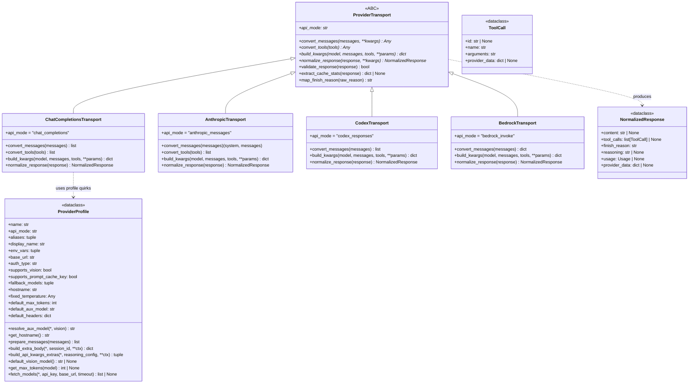
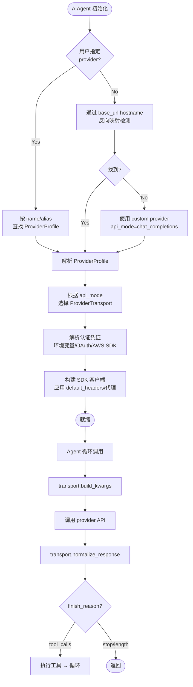

# Provider 抽象层与模型适配

## 概述

hermes-agent 支持 34+ 个模型提供商（Anthropic、OpenAI、DeepSeek、Gemini、Bedrock、xAI、Kimi、Ollama Cloud、OpenRouter 等），每个提供商的 API 协议、认证方式、消息格式、工具 schema、响应结构都存在差异。为了对上层 Agent 核心循环屏蔽这些差异，hermes-agent 设计了**双层抽象**：

1. **ProviderProfile**（providers/base.py）：**声明式配置层**，以 dataclass 形式描述一个推理 provider 的行为特征（认证方式、端点、视觉支持、模型目录、请求级 quirks），不持有客户端实例。
2. **ProviderTransport**（agent/transports/base.py）：**数据转换层**，负责将 hermes 内部统一格式（OpenAI 风格）的消息/工具/参数转换为 provider 原生 API 格式，并将原始响应归一化为 `NormalizedResponse`。

两层分离的核心设计原则：**Profile 描述"这个 provider 是什么样的"，Transport 负责"怎么和它对话"**。客户端构建、流式处理、凭证轮换、重试逻辑等保持在 AIAgent 中，Transport 只负责纯数据转换，保持无状态和可测试。

### 解决的核心问题

1. **协议异构**：Chat Completions、Anthropic Messages、Codex Responses、Bedrock InvokeModel 四种主要 API 协议的统一
2. **能力声明**：视觉支持、工具消息格式、prompt cache、温度处理等差异通过声明式字段暴露
3. **模型目录动态获取**：`fetch_models()` 运行时探测可用模型列表，静态 fallback 列表兜底
4. **请求级 quirks**：不同 provider 对 temperature、max_tokens、reasoning 字段的放置位置（top-level vs extra_body）差异
5. **自动 provider 检测**：通过 base_url 主机名反向映射到 provider profile，用户无需手动指定 provider

## 核心设计原理

### 1. 声明式 Profile vs 命令式 Transport

`ProviderProfile` 是一个纯数据类（`@dataclass`），所有字段在注册时确定，不包含任何 IO 或有状态逻辑。它声明：

- **身份**：`name`、`aliases`、`display_name`、`description`
- **认证与端点**：`env_vars`、`base_url`、`models_url`、`auth_type`（api_key|oauth_device_code|oauth_external|copilot|aws_sdk）
- **能力标志**：`supports_vision`、`supports_vision_tool_messages`、`supports_prompt_cache_key`、`supports_health_check`
- **模型目录**：`fallback_models`、`hostname`
- **请求 quirks**：`fixed_temperature`、`default_max_tokens`、`default_aux_model`、`default_headers`
- **可覆写钩子**：`prepare_messages()`、`build_extra_body()`、`build_api_kwargs_extras()`、`fetch_models()`、`get_max_tokens()`、`resolve_aux_model()`、`default_vision_model()`

`ProviderTransport` 是一个抽象基类（`ABC`），定义了四个抽象方法构成数据转换管线：

```
convert_messages → convert_tools → build_kwargs → normalize_response
```

Transport 不持有客户端、不发起网络请求，它只做数据格式转换。这使得 Transport 可以被独立单元测试，也便于新增协议支持。

### 2. 归一化响应类型

所有 provider 响应最终归一化为 NormalizedResponse，它包含所有 provider 共享的最小字段集：

- `content`：文本内容
- `tool_calls`：归一化的 `ToolCall` 列表
- `finish_reason`：标准集合 `"stop"` / `"tool_calls"` / `"length"` / `"content_filter"`
- `reasoning`：推理内容
- `usage`：Token 用量
- `provider_data`：协议特定数据的逃生舱（dict）

provider 特定的字段（如 Anthropic 的 `reasoning_details`、Codex 的 `codex_reasoning_items`）通过 `provider_data` dict 和向后兼容 property 暴露，避免污染共享类型。

### 3. Plugin 注册机制

每个模型 provider 作为插件注册在 plugins/model-providers/ 目录下，包含：

- `plugin.yaml`：声明插件元数据（name、kind、version、description）
- `__init__.py`：定义 `ProviderProfile` 子类或实例，调用 `register_provider()` 注册

例如 Anthropic provider 的注册：

```python
# plugins/model-providers/anthropic/__init__.py
from providers import register_provider
from providers.base import ProviderProfile

class AnthropicProfile(ProviderProfile):
    def fetch_models(self, *, api_key=None, base_url=None, timeout=8.0):
        # Anthropic 使用 x-api-key header 而非 Bearer
        req = urllib.request.Request("https://api.anthropic.com/v1/models")
        req.add_header("x-api-key", api_key)
        req.add_header("anthropic-version", "2023-06-01")
        # ...

anthropic = AnthropicProfile(
    name="anthropic",
    aliases=("claude", "claude-oauth", "claude-code"),
    api_mode="anthropic_messages",
    env_vars=("ANTHROPIC_API_KEY", "ANTHROPIC_TOKEN"),
    base_url="https://api.anthropic.com",
    auth_type="api_key",
    default_aux_model="claude-haiku-4-5-20251001",
)
register_provider(anthropic)
```

## 数据结构/类图



## 工作流程/生命周期

### Provider 解析流程



### 数据转换管线

以一次 LLM 调用为例，Transport 的工作流程：

1. **convert_messages**：将 OpenAI 格式消息列表转换为 provider 原生格式
   - Chat Completions：几乎恒等转换，仅处理 developer 角色和图片格式
   - Anthropic：拆分为 `(system_prompt, messages_list)`，工具结果转为 `tool_result` content blocks
   - Codex：转换为 Responses API 的 `input` 格式

2. **convert_tools**：将 OpenAI function schema 转换为 provider 原生工具格式
   - Anthropic：转换为 `input_schema` 格式
   - Codex：转换为 Responses API 的工具定义

3. **build_kwargs**：组装完整的 API 调用参数
   - 调用 `profile.build_api_kwargs_extras()` 获取 extra_body 和 top-level 参数
   - 应用 `profile.fixed_temperature`（如 Kimi 需要 OMIT_TEMPERATURE）
   - 应用 `profile.get_max_tokens(model)` 设置默认 max_tokens
   - 添加 `profile.build_extra_body()` 的 provider 特定字段
   - 对支持的 provider 添加 `prompt_cache_key`

4. **normalize_response**：将原始 API 响应归一化
   - 提取文本内容到 `content`
   - 提取工具调用到 `tool_calls`（每个 ToolCall 含 id/name/arguments/provider_data）
   - 映射 finish_reason 到标准集合
   - 提取 token usage
   - 将 provider 特定数据（thinking blocks、reasoning items）放入 `provider_data`

### Chat Completions Transport 代码片段

以下是 agent/transports/chat_completions.py 的核心结构：

```python
class ChatCompletionsTransport(ProviderTransport):
    """Handles ~16 OpenAI-compatible providers."""

    @property
    def api_mode(self) -> str:
        return "chat_completions"

    def convert_messages(self, messages, **kwargs):
        """Messages already in OpenAI format — near-identity transform."""
        # Handle developer role swap for models that support it
        # Apply provider-specific message preprocessing
        prepared = self.profile.prepare_messages(messages)
        return prepared

    def convert_tools(self, tools):
        """Tools already in OpenAI function format."""
        # Sanitize for specific model quirks (e.g., Moonshot schema limits)
        if is_moonshot_model(self.model):
            return sanitize_moonshot_tools(tools)
        return tools

    def build_kwargs(self, model, messages, tools=None, **params):
        """Build complete API kwargs dict."""
        kwargs = {
            "model": model,
            "messages": self.convert_messages(messages),
            "stream": params.get("stream", False),
        }
        if tools:
            kwargs["tools"] = self.convert_tools(tools)

        # Apply temperature (None = default, OMIT_TEMPERATURE = skip)
        temp = self.profile.fixed_temperature
        if temp is not OMIT_TEMPERATURE:
            kwargs["temperature"] = temp if temp is not None else params.get("temperature", 0.7)

        # Apply max_tokens from profile or caller
        max_tokens = params.get("max_tokens") or self.profile.get_max_tokens(model)
        if max_tokens:
            kwargs["max_tokens"] = max_tokens

        # Apply reasoning config (may go to extra_body or top-level)
        extra, top = self.profile.build_api_kwargs_extras(
            reasoning_config=params.get("reasoning_config")
        )
        kwargs.update(top)
        if extra:
            kwargs["extra_body"] = {**kwargs.get("extra_body", {}), **extra}

        # Add prompt cache key if supported
        _add_prompt_cache_key(kwargs, messages=messages, tools=tools,
                             supports_prompt_cache_key=self.profile.supports_prompt_cache_key)
        return kwargs

    def normalize_response(self, response, **kwargs):
        """Normalize OpenAI ChatCompletion response."""
        choice = response.choices[0]
        message = choice.message
        tool_calls = None
        if message.tool_calls:
            tool_calls = [
                build_tool_call(
                    id=tc.id, name=tc.function.name, arguments=tc.function.arguments
                )
                for tc in message.tool_calls
            ]
        return NormalizedResponse(
            content=message.content,
            tool_calls=tool_calls,
            finish_reason=map_finish_reason(choice.finish_reason, {
                "stop": "stop", "tool_calls": "tool_calls",
                "length": "length", "content_filter": "content_filter",
            }),
            usage=Usage(
                prompt_tokens=response.usage.prompt_tokens,
                completion_tokens=response.usage.completion_tokens,
                total_tokens=response.usage.total_tokens,
                cached_tokens=getattr(response.usage, "prompt_tokens_details", {}).get("cached_tokens", 0),
            ),
        )
```

## 关键 API/方法列表

### ProviderProfile 类

| 字段/方法 | 类型/签名 | 说明 |
|-----------|----------|------|
| `name` | `str` | Provider 唯一标识（如 "anthropic"、"openrouter"） |
| `api_mode` | `str` | 使用的 transport 模式，默认 `"chat_completions"` |
| `aliases` | `tuple` | 别名元组（如 `("claude", "claude-oauth")`） |
| `env_vars` | `tuple` | 所需环境变量名（按优先级排序） |
| `base_url` | `str` | API 端点基础 URL |
| `auth_type` | `str` | 认证类型：`api_key` / `oauth_device_code` / `oauth_external` / `copilot` / `aws_sdk` |
| `supports_vision` | `bool` | 是否原生支持图片内容 |
| `supports_prompt_cache_key` | `bool` | 是否支持 `prompt_cache_key` 请求字段 |
| `fixed_temperature` | `Any` | 固定温度值，`OMIT_TEMPERATURE` 表示不发送 temperature |
| `default_max_tokens` | `int \| None` | 默认 max_tokens |
| `default_aux_model` | `str` | 辅助任务（压缩、视觉）的廉价模型 |
| `resolve_aux_model()` | `(vision: bool) -> str` | 动态解析辅助模型 ID（可覆写，支持运行时目录查询） |
| `get_hostname()` | `() -> str` | 返回主机名，用于 URL→provider 反向映射 |
| `prepare_messages()` | `(messages) -> list` | Provider 特定消息预处理钩子 |
| `build_extra_body()` | `(*, session_id, **ctx) -> dict` | Provider 特定 extra_body 字段 |
| `build_api_kwargs_extras()` | `(*, reasoning_config, **ctx) -> tuple[dict, dict]` | 返回 `(extra_body_additions, top_level_kwargs)` 元组 |
| `fetch_models()` | `(*, api_key, base_url, timeout) -> list[str] \| None` | 运行时获取可用模型列表，失败返回 None |
| `get_max_tokens()` | `(model) -> int \| None` | 返回指定模型的默认 max_tokens |

### ProviderTransport 类

| 方法 | 签名 | 说明 |
|------|------|------|
| `api_mode` (property) | `-> str` | 抽象属性，返回此 transport 处理的 api_mode 字符串 |
| `convert_messages()` | `(messages: List[Dict], **kwargs) -> Any` | **抽象方法**，将 OpenAI 格式消息转为 provider 原生格式 |
| `convert_tools()` | `(tools: List[Dict]) -> Any` | **抽象方法**，将 OpenAI 工具 schema 转为 provider 原生格式 |
| `build_kwargs()` | `(model, messages, tools=None, **params) -> Dict` | **抽象方法**，构建完整 API 调用参数字典 |
| `normalize_response()` | `(response, **kwargs) -> NormalizedResponse` | **抽象方法**，将原始响应归一化为 NormalizedResponse |
| `validate_response()` | `(response) -> bool` | 可选：检查响应结构是否有效，默认返回 True |
| `extract_cache_stats()` | `(response) -> Dict \| None` | 可选：提取缓存命中/创建统计，默认返回 None |
| `map_finish_reason()` | `(raw_reason: str) -> str` | 可选：映射 provider 特定 stop reason，默认原样返回 |

### 共享类型

| 类型 | 定义位置 | 关键字段 |
|------|---------|---------|
| `ToolCall` | agent/transports/types.py:18-76 | `id`、`name`、`arguments`（JSON 字符串）、`provider_data` |
| `Usage` | agent/transports/types.py:79-86 | `prompt_tokens`、`completion_tokens`、`total_tokens`、`cached_tokens` |
| `NormalizedResponse` | agent/transports/types.py:89-144 | `content`、`tool_calls`、`finish_reason`、`reasoning`、`usage`、`provider_data` |
| `build_tool_call()` | agent/transports/types.py:152-164 | 工厂函数，dict 类型 arguments 自动 JSON 序列化 |
| `map_finish_reason()` | agent/transports/types.py:167-174 | 将 provider 特定 stop reason 映射到标准集合 |

### 已实现的 Transport

| Transport | 文件 | api_mode | 覆盖 Provider |
|-----------|------|----------|--------------|
| `ChatCompletionsTransport` | chat_completions.py | `"chat_completions"` | OpenRouter、DeepSeek、xAI、Kimi、Gemini、Ollama 等约 16 个 |
| `AnthropicTransport` | anthropic.py | `"anthropic_messages"` | Anthropic Claude（原生 Messages API） |
| `CodexTransport` | codex.py | `"codex_responses"` | OpenAI Codex（Responses API） |
| `BedrockTransport` | bedrock.py | `"bedrock_invoke"` | AWS Bedrock（InvokeModel API） |

## 源码位置指引

| 文件 | 内容 |
|------|------|
| providers/base.py | `ProviderProfile` 基类定义，所有声明式字段和可覆写钩子 |
| providers/__init__.py | `register_provider()` 注册函数和 provider 注册表 |
| agent/transports/base.py | `ProviderTransport` 抽象基类定义 |
| agent/transports/types.py | `ToolCall`、`Usage`、`NormalizedResponse` 共享类型 |
| agent/transports/chat_completions.py | OpenAI Chat Completions 协议 transport |
| agent/transports/anthropic.py | Anthropic Messages 协议 transport |
| agent/transports/codex.py | OpenAI Codex Responses 协议 transport |
| agent/transports/bedrock.py | AWS Bedrock 协议 transport |
| plugins/model-providers/ | 34 个 model-provider 插件目录，每个含 `plugin.yaml` + `__init__.py` |

## 相关概念交叉引用

- [Agent 核心循环](agent-core-loop.md) — AIAgent 如何使用 Transport 进行 LLM 调用
- [工具注册表](tool-registry.md) — 工具 schema 如何传入 Transport 的 convert_tools
- [Gateway 多 Agent 编排](gateway-multi-agent.md) — Gateway 如何为不同平台解析 provider
- [CLI 入口与应用管理](cli-app-entry.md) — CLI 如何配置和选择 provider/model
