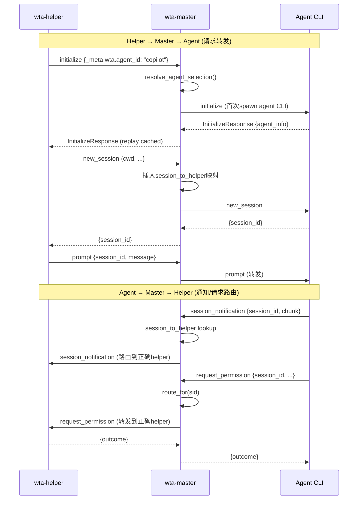
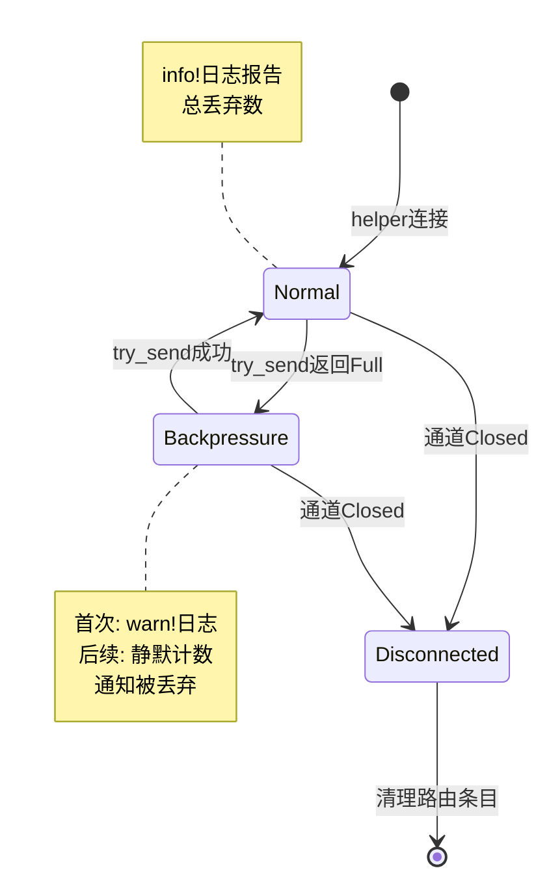

## 概述

ACP（Agent Control Protocol）是 Intelligent Terminal 中 AI Agent 通信的核心协议，版本 **v1.3.0**，基于 **JSON-RPC 2.0**。wta-master 作为 ACP 多路复用器，实现了两跳传输模型，使得多个 wta-helper 可以共享同一个（或多个）agent CLI 进程。

关键设计特性：

- **两跳传输**：helper ↔ master（命名管道）+ master ↔ agent CLI（stdio）
- **Session 路由**：`session_to_helper` 映射表精确将通知/请求路由到拥有该 session 的 helper
- **反压处理**：有界通知通道 + 丢弃策略 + rate-limited 日志，一个卡住的 helper 不会阻塞其他 helper
- **多 Agent CLI**：支持同一窗口中不同 tab 使用不同的 Agent（Copilot/Claude/Gemini 并存）
- **兼容层**：`conn.rs` 兼容 ACP 1.0 的旧连接模型，提供 `ClientLink`/`AgentLink` 抽象

## 协议栈

```
┌──────────────────────────────────────────────────────────┐
│                   wta-helper (TUI)                       │
│  ┌────────────────────────────────────────────────────┐  │
│  │           Ratatui TUI + App reducer                │  │
│  └──────────────────────┬─────────────────────────────┘  │
│                         │ ACP Client                     │
│  ┌──────────────────────▼─────────────────────────────┐  │
│  │     WtaClient (protocol/acp/client.rs)             │  │
│  └──────────────────────┬─────────────────────────────┘  │
└─────────────────────────┼────────────────────────────────┘
                          │ 命名管道 (\\.\pipe\wta-master-<GUID>)
                          │ JSON-RPC 2.0
┌─────────────────────────▼────────────────────────────────┐
│                   wta-master (多路复用器)                 │
│  ┌────────────────────────────────────────────────────┐  │
│  │  Master ACP 多路复用层                              │  │
│  │  ┌──────────┐  session_to_helper  ┌─────────────┐  │  │
│  │  │Helper Hdlr│◄──── HashMap ─────►│MasterClient │  │  │
│  │  │(per conn)│                     │(agent side) │  │  │
│  │  └────┬─────┘                     └──────┬──────┘  │  │
│  │       │ ClientLink                        │ClientLink│
│  └───────┼──────────────────────────────────┼─────────┘  │
│          │                                  │            │
│  命名管道端点                          stdio端点          │
└──────────┼──────────────────────────────────┼────────────┘
           │                                  │
           │ (多连接)                         │ (单连接/多连接)
┌──────────▼──────────┐              ┌────────▼─────────┐
│   wta-helper #N     │              │  Agent CLI       │
│   (Ratatui TUI)     │              │ (copilot/claude/ │
│                     │              │  codex/gemini)   │
└─────────────────────┘              └──────────────────┘
```

## 两跳传输模型

ACP 在 Intelligent Terminal 中经过两跳传输：

### 第一跳：master ↔ agent CLI（stdio）

- master 是 ACP **client** 角色（通过 `ClientLink`）
- agent CLI 是 ACP server
- 传输层：agent CLI 子进程的 stdin/stdout
- master 在此跳上发送所有 helper 转发来的 ACP 请求

### 第二跳：helper ↔ master（命名管道）

- master 对 helper 扮演 ACP **agent**（server）角色（通过 `AgentLink`/`HelperHandler`）
- helper 是 ACP client（通过 `WtaClient`/`ClientLink`）
- 传输层：Windows 命名管道 `\\.\pipe\wta-master-<GUID>`
- 在此跳上，helper 发送用户请求（prompt/new_session 等），master 将 agent 的通知/请求路由回对应 helper



## Session 路由映射

master 维护核心路由表 `session_to_helper: HashMap<SessionId, HelperRoute>`，将 ACP SessionId 映射到对应的 helper 连接：

```rust
// tools/wta/src/master/mod.rs:91-115
struct HelperRoute {
    helper_id: HelperId,
    notif_tx: mpsc::Sender<acp::schema::v1::SessionNotification>,
    forwarder: Option<conn::AgentLink>,
    consecutive_drops: Arc<std::sync::atomic::AtomicU64>,
}
```

每个 `HelperRoute` 包含：

| 字段 | 用途 |
|------|------|
| `helper_id` | helper 唯一标识（单调递增计数器），用于防竞态清理 |
| `notif_tx` | 有界 mpsc 通道（容量 1024），agent 通知通过此通道发送到 helper |
| `forwarder` | `AgentLink` 句柄，用于将 agent 的 server→client 请求转发到 helper |
| `consecutive_drops` | 反压丢弃计数器，用于 rate-limited 日志 |

路由表在 helper 的 `new_session`/`load_session` 处理器中**原子插入**（在响应 helper 之前完成），确保无竞态窗口。

### Master 状态结构

```rust
// tools/wta/src/master/mod.rs:120-327
struct MasterStateInner {
    session_to_helper: Mutex<HashMap<SessionId, HelperRoute>>,
    registry: Arc<dyn SessionRegistry>,
    helper_ext_subscribers: Mutex<HashMap<HelperId, mpsc::UnboundedSender<ExtNotification>>>,
    wt: Option<Arc<dyn WtChannel>>,
    agents: Mutex<HashMap<AgentCmdKey, Arc<OnceCell<Arc<AgentCli>>>>>,
    default_agent_cmd: String,
    default_agent_id: Option<String>,
    allowed_agent_ids: Option<HashSet<String>>,
    cached_init_resp: OnceLock<InitializeResponse>,
    agent_conn: OnceLock<ClientLink>,
    cli_source: Option<CliSource>,
    helper_meta: Mutex<HashMap<HelperId, HelperRecoveryMeta>>,
    hook_owned: Mutex<HashSet<SessionId>>,
    orphaned_sessions: Mutex<HashMap<AgentCmdKey, HashSet<SessionId>>>,
    born_bound: Mutex<HashSet<SessionId>>,
    host_list_cache: Mutex<Option<(Instant, Option<Arc<[SessionInfo]>>)>>,
    // ...
}
```

## 请求方法全集

### Helper → Master → Agent（ClientLink 方法）

Helper 通过 `ClientLink` 发送的 ACP 请求，由 master 转发给 agent CLI：

```rust
// tools/wta/src/protocol/acp/conn.rs:117-198
impl ClientLink {
    pub async fn initialize(&self, req: InitializeRequest) -> Result<InitializeResponse>;
    pub async fn authenticate(&self, req: AuthenticateRequest) -> Result<AuthenticateResponse>;
    pub async fn new_session(&self, req: NewSessionRequest) -> Result<NewSessionResponse>;
    pub async fn load_session(&self, req: LoadSessionRequest) -> Result<LoadSessionResponse>;
    pub async fn prompt(&self, req: PromptRequest) -> Result<PromptResponse>;
    pub async fn set_session_model(&self, req: SetSessionModelRequest) -> Result<SetSessionModelResponse>;
    pub async fn cancel(&self, notif: CancelNotification) -> Result<()>;
    pub async fn set_session_mode(&self, req: SetSessionModeRequest) -> Result<SetSessionModeResponse>;
    pub async fn set_session_config_option(&self, req: SetSessionConfigOptionRequest) -> Result<SetSessionConfigOptionResponse>;
    pub async fn list_sessions(&self, req: ListSessionsRequest) -> Result<ListSessionsResponse>;
    pub async fn ext_method(&self, req: ExtRequest) -> Result<ExtResponse>;
}
```

注意：`set_session_model` 是本地扩展方法，ACP 1.1 schema 已移除该方法，但为兼容 Copilot/Gemini 模型切换而保留。

```rust
// tools/wta/src/protocol/acp/conn.rs:48-67
#[derive(Debug, Clone, Serialize, Deserialize, acp::JsonRpcRequest)]
#[request(method = "session/set_model", response = SetSessionModelResponse)]
#[serde(rename_all = "camelCase")]
pub struct SetSessionModelRequest {
    pub session_id: SessionId,
    pub model_id: String,
}
```

### Agent → Master → Helper（AgentLink 转发方法）

Agent CLI 发送的 server→client 请求，通过 `session_to_helper` 路由到拥有该 session 的 helper：

```rust
// tools/wta/src/protocol/acp/conn.rs (AgentLink 方法)
// 由 MasterClient 实现并路由:
async fn request_permission(&self, args: RequestPermissionRequest) -> Result<RequestPermissionResponse>;
async fn create_terminal(&self, args: CreateTerminalRequest) -> Result<CreateTerminalResponse>;
async fn terminal_output(&self, args: TerminalOutputRequest) -> Result<TerminalOutputResponse>;
async fn wait_for_terminal_exit(&self, args: WaitForTerminalExitRequest) -> Result<WaitForTerminalExitResponse>;
async fn release_terminal(&self, args: ReleaseTerminalRequest) -> Result<ReleaseTerminalResponse>;
async fn kill_terminal(&self, args: KillTerminalRequest) -> Result<KillTerminalResponse>;
async fn read_text_file(&self, args: ReadTextFileRequest) -> Result<ReadTextFileResponse>;
async fn write_text_file(&self, args: WriteTextFileRequest) -> Result<WriteTextFileResponse>;
```

这些请求在 helper 端执行——TUI 权限 UI（`request_permission`）、ShellManager 终端操作（`create_terminal`/`terminal_output` 等）、文件系统操作（`read_text_file`/`write_text_file`）。

## 反压处理

通知通道（`notif_tx`）是容量为 **1024** 的有界 mpsc 通道。当 helper 的管道写入速度跟不上 agent 的通知产生速度时：

1. **不阻塞 agent CLI I/O 循环**：使用 `try_send` 而非 `send().await`
2. **丢弃通知而非无限缓冲**：通道满时丢弃当前通知
3. **Rate-limited 日志**：
   - 首次 Full 时发一条 `warn!` 报告队列积压
   - 后续 Full 静默递增计数器
   - 恢复时（首次成功 send）发一条 `info!` 报告总丢弃数
4. **隔离故障**：一个卡住的 helper 不会影响其他 helper 的通知投递

```rust
// tools/wta/src/master/mod.rs:513-665 (session_notification 核心逻辑)
async fn session_notification(&self, args: SessionNotification) -> acp::Result<()> {
    let sid = args.session_id.clone();
    let route = {
        let map = self.state.session_to_helper.lock().await;
        map.get(&sid).map(|r| (r.helper_id, r.notif_tx.clone(), Arc::clone(&r.consecutive_drops)))
    };
    match route {
        Some((snap_helper_id, tx, drops)) => {
            match tx.try_send(args) {
                Ok(()) => {
                    let dropped = drops.swap(0, Ordering::SeqCst);
                    if dropped > 0 {
                        tracing::info!(/* 恢复：报告总丢弃数 */);
                    }
                }
                Err(mpsc::error::TrySendError::Full(_)) => {
                    let prior = drops.fetch_add(1, Ordering::SeqCst);
                    if prior == 0 {
                        tracing::warn!(/* 首次积压：一次warn */);
                    }
                    // 后续丢弃静默
                }
                Err(mpsc::error::TrySendError::Closed(_)) => {
                    // Helper断开：安全清理（检查helper_id防竞态）
                    let mut map = self.state.session_to_helper.lock().await;
                    match map.get(&sid) {
                        Some(current) if current.helper_id == snap_helper_id => {
                            map.remove(&sid);  // 安全删除
                        }
                        _ => { /* SessionId已rebound到新helper，不删除 */ }
                    }
                }
            }
        }
        None => {
            tracing::warn!(/* 未知SessionId */);
        }
    }
    Ok(())
}
```

通知通道容量常量：

```rust
// tools/wta/src/master/mod.rs:50
const NOTIF_CHANNEL_CAPACITY: usize = 1024;
```

### 反压状态机



## 多 Agent CLI 支持

master 支持同时 spawn 多个不同的 agent CLI 进程，实现同一窗口中不同 tab 使用不同 Agent：

- **池化键**：`AgentCmdKey = format!("{source}\0{command}")`（完整命令行+来源）
- **懒加载**：helper 在 `initialize` 握手的 `_meta.wta.agent_id` 中声明 agent id
- **命令重建**：master 通过 `agent_registry::build_acp_command` 从 id 重建命令行（**从不执行管道传来的命令字符串**）
- **复用**：相同命令行的 helper 共享同一 agent CLI 进程
- **并行spawn**：不同 agent 的 spawn 并行进行，使用 `Arc<OnceCell<…>>` 确保同 agent 竞争时只 spawn 一次

```rust
// tools/wta/src/master/mod.rs:185-212
pub(crate) agents:
    Mutex<HashMap<AgentCmdKey, Arc<tokio::sync::OnceCell<Arc<AgentCli>>>>>,
```

```rust
// tools/wta/src/master/mod.rs:336-338
type AgentCmdKey = String;
fn agent_cmd_key(command: &str, source: &AgentSource) -> AgentCmdKey {
    format!("{source}\0{command}")
}
```

Agent CLI 池**不做空闲超时回收**——Agent 保持 warm 状态以避免冷启动延迟。崩溃的 agent 通过 `reap_agent` 清理，下次请求时懒加载重建。

### GPO 过滤（Allowed Agent IDs）

C++ 端通过 `--allowed-agent-ids` 传递逗号分隔的 GPO 允许列表。master 执行 fail-closed 策略：

- 列表中存在的 id：允许使用对应 agent
- 列表外的 id（包括空列表）：回退到默认 `--agent` 命令
- 未传此参数（手动运行/旧版本 host）：接受任何已知 agent id

```rust
// tools/wta/src/master/mod.rs:221-228
pub(crate) allowed_agent_ids: Option<std::collections::HashSet<String>>,
```

## ClientLink/AgentLink 兼容层

`protocol/acp/conn.rs` 提供兼容层，将 ACP 1.0 的 `ClientSideConnection`/`AgentSideConnection` 对象模型适配到 ACP 1.3.0 的 builder+dispatch 模型。多路复用器需要"存储连接、在旁驱动 I/O、之后调用类型化方法"的旧形态。

```rust
// tools/wta/src/protocol/acp/conn.rs:104-110
#[derive(Clone, Debug)]
pub struct ClientLink {
    cell: std::sync::Arc<Ready<acp::ConnectionTo<acp::Agent>>>,
}
```

`Ready<T>` 结构使用 `OnceLock` + `Notify` + `AtomicBool` 实现异步就绪通知，连接在 handshake 完成前所有方法调用会等待就绪。

### prompt_forwarding：非阻塞转发

`ClientLink::prompt_forwarding` 是特殊的非阻塞方法，用于在 ACP dispatch handler 内部转发 prompt 请求（避免 dispatch 循环死锁）：

```rust
// tools/wta/src/protocol/acp/conn.rs:148-160
pub async fn prompt_forwarding<Fut>(
    &self,
    req: PromptRequest,
    on_response: impl FnOnce(acp::Result<PromptResponse>) -> Fut + 'static + Send,
) -> acp::Result<()>
where
    Fut: Future<Output = acp::Result<()>> + 'static + Send,
{
    self.cx().await?.send_request(req).on_receiving_result(on_response)
}
```

常规方法使用 `block_task().await` 阻塞等待响应，但在 dispatch handler 中阻塞会导致死锁（agent 在 prompt 处理中发出的 `request_permission` 无法被读取）。`prompt_forwarding` 注册回调后立即返回，保持 dispatch 循环自由。

## Orphan Session 处理

当 helper 断开（tab/pane 关闭）时，其 session 可能仍在 agent CLI 中加载运行（如长时间的工具调用）。master 将这些 session 标记为"孤儿"：

```rust
// tools/wta/src/master/mod.rs:284-300
orphaned_sessions: Mutex<HashMap<AgentCmdKey, HashSet<SessionId>>>,
```

当新 helper 通过 `--initial-load-session-id` 恢复孤儿 session 时，`load_session` 直接重新绑定路由（不重新发送 `session/load`，因为 agent CLI 已经加载了该 session），避免 "already loaded" 错误。

## 源码链接

| 文件 | 关键内容 |
|------|---------|
| master/mod.rs | Master 核心：路由表、反压、多Agent池、session_notification |
| protocol/acp/conn.rs | ClientLink/AgentLink 兼容层、set_session_model 扩展 |
| protocol/acp/client.rs | WtaClient、管道连接重试 |
| agent_registry.rs | Agent 注册表、命令构建 |
