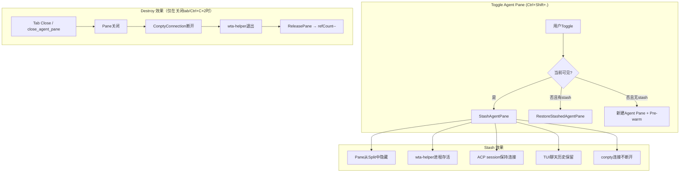
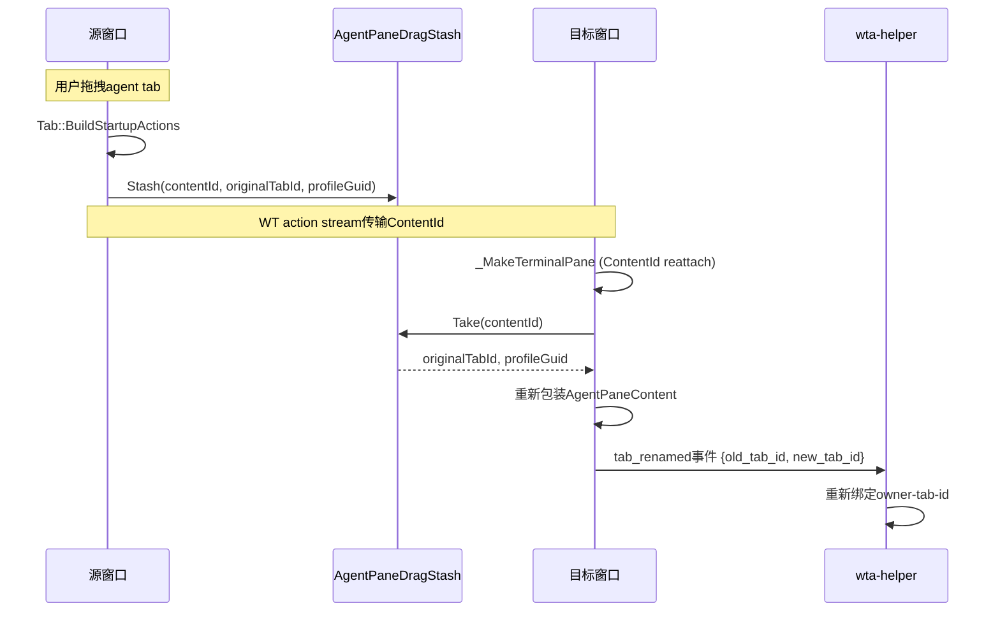
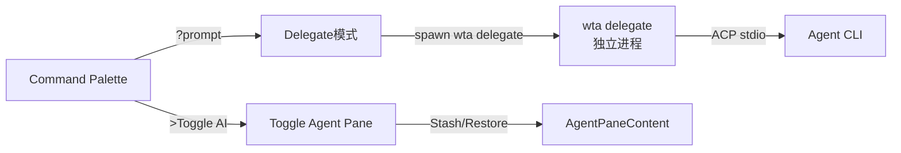

## 概述

Agent 面板（Agent Pane）是 Intelligent Terminal 在 Windows Terminal UI 层的核心集成点。它以 XAML UserControl 的形式嵌入到 Terminal 的 pane 树中，包装标准 `TerminalPaneContent`（内含 `TermControl`），添加 36px 高的顶部栏显示 Agent 标识信息。Agent Pane 的 Toggle 采用 Stash/Restore 模式而非销毁重建，确保 ACP 会话和 TUI 聊天历史在隐藏/显示之间保持存活。

## AgentPaneContent 控件

`AgentPaneContent` 是 XAML UserControl，继承自 `Windows.UI.Xaml.Controls.UserControl`，实现 `IPaneContent` 和 `ISnappable` 接口。

```idl
// src/cascadia/TerminalApp/AgentPaneContent.idl
namespace TerminalApp
{
    [default_interface] runtimeclass AgentPaneContent : Windows.UI.Xaml.Controls.UserControl,
                                                        IPaneContent,
                                                        ISnappable
    {
        AgentPaneContent(TerminalPaneContent inner);

        TerminalPaneContent GetTerminalContent();
        Microsoft.Terminal.Control.TermControl GetTermControl();

        void UpdateAgentStatus(String name, String version, String model, String state, String backend);
        void SetSessionsView(Boolean active);
        Boolean IsSessionsView { get; };
        void SetAgentPanePosition(String position);

        event Windows.Foundation.TypedEventHandler<AgentPaneContent, Object> StateChanged;
    }
}
```

### 控件结构

```
┌─────────────────────────────────────────────────────────┐
│ AgentPaneContent (UserControl)                          │
│ ┌─────────────────────────────────────────────────────┐ │
│ │ Agent Bar (36px)                                    │ │
│ │  ┌────┐  Agent Name v1.2.3 · model-name  ● connected │ │
│ │  │Logo│  (or "Agent sessions" in sessions view)     │ │
│ │  └────┘                                             │ │
│ ├─────────────────────────────────────────────────────┤ │
│ │ TerminalPaneContent (inner)                         │ │
│ │ ┌─────────────────────────────────────────────────┐ │ │
│ │ │ TermControl (conpty → wta-helper Ratatui TUI)   │ │ │
│ │ │                                                 │ │ │
│ │ │  wta-helper TUI renders here via conpty         │ │ │
│ │ │                                                 │ │ │
│ │ └─────────────────────────────────────────────────┘ │ │
│ └─────────────────────────────────────────────────────┘ │
└─────────────────────────────────────────────────────────┘
```

### 构造函数与初始化

```cpp
// src/cascadia/TerminalApp/AgentPaneContent.cpp:50-67
AgentPaneContent::AgentPaneContent(const winrt::TerminalApp::TerminalPaneContent& inner) :
    _inner{ inner }
{
    InitializeComponent();
    if (_inner)
    {
        InnerContent().Content(_inner.GetRoot());  // 将TermControl钉入row 1
    }
    _wireInnerEvents();
    _refreshLabel();   // 默认标签
    _refreshLogo();    // 默认Logo
}
```

内部 `TerminalPaneContent` 持有实际的 `TermControl`，后者承载 wta-helper 子进程的 conpty 连接。

### Agent 状态

`UpdateAgentStatus` 方法接收 wta 通过 `agent_status` 事件推送的状态信息：

```cpp
// src/cascadia/TerminalApp/AgentPaneContent.h:22-26
void UpdateAgentStatus(const winrt::hstring& name,
                       const winrt::hstring& version,
                       const winrt::hstring& model,
                       const winrt::hstring& state,
                       const winrt::hstring& backend);
```

支持的连接状态：

| 状态 | 含义 | 底部栏表现 |
|------|------|-----------|
| `connecting` | 正在连接 master/agent | 显示连接中 |
| `connected` | ACP 会话已建立 | 正常显示，启用 autofix |
| `failed` | 连接失败 | 显示错误，禁用 autofix |
| `disconnected` | 连接断开（crash/degraded） | 显示"连接丢失" |

### Agent Logo 匹配

Agent Logo 通过大小写不敏感子串匹配从 agent name 推断，未匹配时默认使用 Copilot Logo：

```cpp
// src/cascadia/TerminalApp/AgentPaneContent.cpp:23-46
enum class AgentLogoKind { Copilot, Claude, Gemini, Codex, OpenCode };

AgentLogoKind _logoForAgent(const winrt::hstring& name)
{
    std::wstring lower{ name };
    std::transform(lower.begin(), lower.end(), lower.begin(),
                   [](wchar_t c) { return static_cast<wchar_t>(std::towlower(c)); });
    if (lower.find(L"claude") != std::wstring::npos) return AgentLogoKind::Claude;
    if (lower.find(L"codex") != std::wstring::npos) return AgentLogoKind::Codex;
    if (lower.find(L"openai") != std::wstring::npos) return AgentLogoKind::Codex;
    if (lower.find(L"gpt") != std::wstring::npos) return AgentLogoKind::Codex;
    if (lower.find(L"gemini") != std::wstring::npos) return AgentLogoKind::Gemini;
    if (lower.find(L"opencode") != std::wstring::npos) return AgentLogoKind::OpenCode;
    return AgentLogoKind::Copilot;
}
```

Logo 资源为 SVG 文件，位于 `src/cascadia/CascadiaPackage/AgentIcons/`：

| Agent | SVG 文件 |
|-------|---------|
| Copilot | `copilot.svg` |
| Claude | `claude.svg` |
| Codex/GPT/OpenAI | `codex.svg` |
| Gemini | `gemini.svg` |
| OpenCode | `opencode.svg` |
| Sessions 视图 | `session.svg` |

### Sessions 视图切换

`SetSessionsView(bool active)` 切换顶部栏显示模式：
- **Chat 模式**（active=false）：显示 Agent Logo + "<名称> <版本>"
- **Sessions 模式**（active=true）：隐藏 Logo，显示 "Agent sessions"

```cpp
// src/cascadia/TerminalApp/AgentPaneContent.cpp:118-128
void AgentPaneContent::SetSessionsView(bool active)
{
    if (_isSessionsView == active) return;  // 幂等
    _isSessionsView = active;
    _refreshLabel();
    _refreshLogo();
    StateChanged.raise(*this, nullptr);
}
```

窗口底部栏通过 `IsSessionsView()` 查询当前模式，决定 toggle 按钮语义（sessions 视图中 toggle = 关闭 pane，否则 = 切换到 sessions 视图）。

## Stash/Restore 生命周期

Agent Pane 的 Toggle（`Ctrl+Shift+.` / `Ctrl+Shift+/` / 底部栏按钮）采用 **Stash/Restore** 模式，而非销毁重建。

### Tab 级 Agent Pane 管理

```cpp
// src/cascadia/TerminalApp/Tab.h:105-123
// 在 pane 树中查找 AgentPaneContent（存在即表示 tab 有 agent pane）
winrt::TerminalApp::AgentPaneContent FindAgentPaneContent() const;
std::shared_ptr<Pane> FindAgentPane() const;

// 隐藏 agent pane（基于 Pane::HidePane），不销毁 helper/conpty/ACP session/chat history
void StashAgentPane();

// 恢复之前 stashed 的 pane（基于 Pane::RestorePane）
bool RestoreStashedAgentPane(winrt::Microsoft::Terminal::Settings::Model::SplitDirection direction);
bool HasStashedAgentPane() const;
```

### Stash vs Destroy 对比



Pane 仅在以下情况销毁：
1. **Tab 关闭**：整个 tab 被关闭时 pane 自然销毁
2. **Ctrl+C×2**：TUI 中连续按两次 Ctrl+C，发送 `close_agent_pane` 事件
3. **`/restart`**：全栈重启，所有 pane 被销毁重建

## AgentPaneDragStash：跨窗口拖拽

当用户将带 agent 的 tab 从一个窗口拖拽到另一个窗口时，WT 的 ContentId 重Attach 机制会丢失 AgentPaneContent 包装和源 tab 的 StableId。`AgentPaneDragStash` 作为进程内静态桥接解决此问题。

```cpp
// src/cascadia/TerminalApp/AgentPaneDragStash.h
struct AgentPaneDragStash
{
    struct Entry
    {
        std::wstring originalTabId;
        std::optional<winrt::guid> sourceProfileGuid;
    };

    static void Stash(uint64_t contentId,
                      const winrt::hstring& originalTabId,
                      const std::optional<winrt::guid>& sourceProfileGuid) noexcept;
    static bool Take(uint64_t contentId,
                     winrt::hstring& outOriginalTabId,
                     std::optional<winrt::guid>& outSourceProfileGuid) noexcept;
};
```

### 拖拽时序



关键设计：
- **mutex 保护**：源窗口和目标窗口在独立 UI 线程，使用 `std::mutex` 保护 map
- **Take 即删**：条目被消费后立即从 map 移除，无 TTL
- **静态存储**：放在 TerminalApp.dll（而非 WindowEmperor），因为 producer 和 consumer 都链接 TerminalApp，DLL 在进程内只加载一次
- **零容错泄漏**：如果 Take 未执行，泄漏一个 std::pair 到进程退出（drag-drop 边缘场景可接受）

## AutofixState 枚举

`AgentPaneContent` 还维护 per-pane 的 autofix 诊断状态：

```cpp
// src/cascadia/TerminalApp/AgentPaneContent.h:41-52
enum class AutofixState
{
    Idle,       // 无错误/修复已处理
    Detected,   // OSC 133标记检测到命令失败
    Pending,    // Agent正在分析/修复
    Review,     // 分析完成，结果在pane chat中等待查看
};
```

```cpp
void ApplyAutofixState(AutofixState state,
                       const winrt::hstring& paneId,
                       const winrt::hstring& summary,
                       const winrt::hstring& fixPreview,
                       const winrt::hstring& hotkeyHint,
                       const winrt::hstring& suggestionTitle);
```

`IsAgentConnected()` 访问器（`_agentState == L"connected"`）控制底部栏诊断组的可见性——连接前（冷启动）或失败/断开后不显示 autofix 按钮。

## StateChanged 事件

AgentPaneContent 在任何影响底部栏的状态变更时触发 `StateChanged` 事件：

```cpp
// src/cascadia/TerminalApp/AgentPaneContent.h:116
til::typed_event<winrt::TerminalApp::AgentPaneContent, IInspectable> StateChanged;
```

触发时机：
- `UpdateAgentStatus` 被调用时
- `SetSessionsView` 切换模式时
- `ApplyAutofixState` 更新诊断状态时
- `SetAgentPanePosition` 更新位置时

TerminalPage 订阅此事件，当触发 pane 属于活动 tab 时刷新窗口底部栏。

## 命令面板集成

命令面板（Command Palette）提供三种 Agent 交互方式：

| 输入 | 动作 | 说明 |
|------|------|------|
| `>Toggle AI assistant` | `openAgentPane` action | 切换 Agent Pane 可见性 |
| `?<prompt>` | delegate 模式 | 将 prompt 委托给隐藏后台 WTA 进程处理（不打开 pane） |
| `?`（空） | 无操作 | 单独 `?` 不执行任何动作 |
| `&` | 后台任务模式 | 预留，C9 功能 |

`CommandPalette.cpp` 中的 `_dispatchAgentPrompt` 方法处理自由文本输入（`?<prompt>`），将 prompt 发送到 delegate 模式的 wta 进程。



## Agent Pane 位置配置

Agent Pane 的停靠位置可配置，默认 `bottom`：

| 位置值 | 说明 |
|--------|------|
| `bottom` | 底部（默认） |
| `right` | 右侧 |
| `top` | 顶部 |
| `left` | 左侧 |

JSON 设置 key：`agentPanePosition`。`SetAgentPanePosition` 方法更新缓存位置并触发 StateChanged，底部栏刷新 toggle 按钮方向图标。

## 主题颜色

`ApplyThemeColors` 方法允许外部（TerminalPage）将背景和前景 Brush 应用到 Agent 顶部栏，实现主题适配：

```cpp
void ApplyThemeColors(const winrt::Windows::UI::Xaml::Media::Brush& background,
                      const winrt::Windows::UI::Xaml::Media::Brush& foreground);
```

1px 底部分隔线使用前景色的 ~15% alpha（`0x26`），产生柔和的分隔效果。

## 源码链接

| 文件 | 关键内容 |
|------|---------|
| AgentPaneContent.idl | XAML 控件接口定义 |
| AgentPaneContent.h | AutofixState枚举、状态字段、事件声明 |
| AgentPaneContent.cpp | Logo匹配、UpdateAgentStatus、ApplyAutofixState |
| AgentPaneDragStash.h | 跨窗口拖拽桥接 |
| Tab.h | StashAgentPane/RestoreStashedAgentPane |
| CommandPalette.cpp | `?prompt` 委托分发 |
| AgentIcons/ | SVG Logo 资源 |
