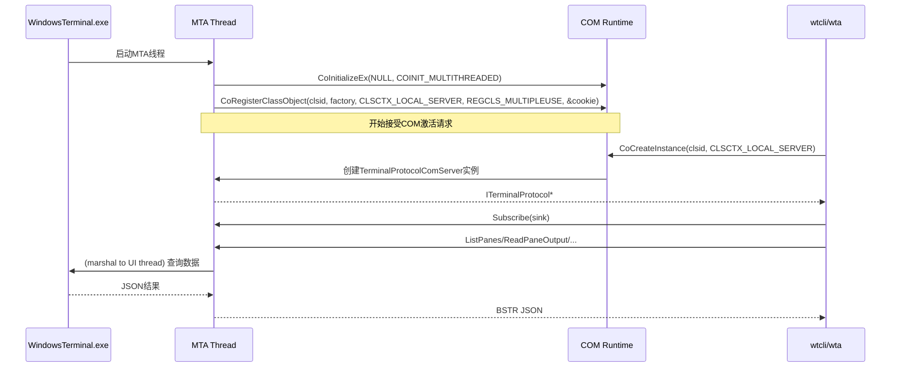
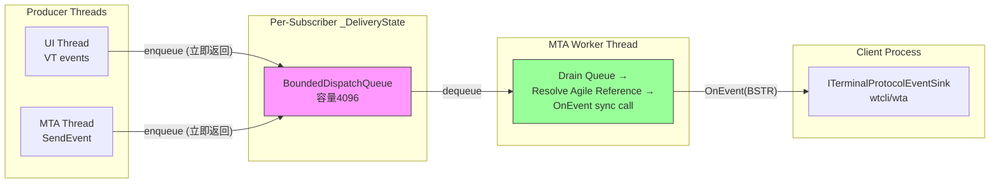

## 概述

COM 协议服务器是 wta-helper/wtcli 与 Windows Terminal C++ 宿主端之间**结构化通信**的桥梁。它实现了经典 COM 接口 `ITerminalProtocol`（非 WinRT/MBM），通过 `OpenConsoleProxy.dll` 的 proxy/stub 进行跨进程编组，避免了 WinRT Metadata-Based Marshaling 在某些 combase 版本上的崩溃问题（0xc0000005 / 0x80010105）。

核心设计原则：

- **经典 COM 而非 WinRT**：规避 MBM 编组崩溃，使用自定义 proxy/stub DLL
- **JSON 负载**：复杂结果以 JSON 字符串（BSTR）跨进程传输，避免 SAFEARRAY/struct 编组
- **MTA 线程模型**：入站 COM 调用分发到 MTA 工作线程，不阻塞 UI 线程
- **异步事件投递**：每个订阅者有独立的有界 FIFO 队列 + 专用 worker 线程
- **CLSID 分品牌**：Release/Preview/Canary/Dev 各有独立 CLSID，避免品牌间干扰

## 接口定义

### ITerminalProtocol（主接口）

```idl
// src/host/proxy/ITerminalProtocol.idl
[
    object,
    uuid(9C7E2A14-3B5D-4F8A-A2C9-1E4F6B8D0A3C),
    pointer_default(unique)
] interface ITerminalProtocol : IUnknown
{
    // ── Meta ──
    HRESULT Authenticate([in] BSTR token, [out, retval] BSTR* resultJson);
    HRESULT GetCapabilities([out, retval] BSTR* json);

    // ── Queries (complex results as JSON) ──
    HRESULT GetActivePane([out, retval] BSTR* json);
    HRESULT ListWindows([out, retval] BSTR* json);
    HRESULT ListTabs([in] unsigned hyper windowIdFilter, [out, retval] BSTR* json);
    HRESULT ListPanes([in] unsigned hyper windowIdFilter, [in] unsigned long tabIdFilter, [out, retval] BSTR* json);
    HRESULT ReadPaneOutput([in] GUID sessionId, [in] BSTR source, [in] long maxLines, [out, retval] BSTR* json);
    HRESULT GetProcessStatus([in] GUID sessionId, [out, retval] BSTR* json);
    HRESULT GetSessionVariable([in] GUID sessionId, [in] BSTR name, [out, retval] BSTR* json);
    HRESULT GetSettings([out, retval] BSTR* json);

    // ── Mutations ──
    HRESULT CreateTab([in] unsigned hyper windowId, [in] BSTR profile,
                      [in] BSTR commandline, [in] BSTR title,
                      [in] BSTR startingDirectory, [in] boolean suppressAppTitle,
                      [in] boolean background, [out, retval] BSTR* json);
    HRESULT SplitPane([in] GUID sessionId, [in] BSTR direction, [in] float size,
                      [in] BSTR profile, [in] BSTR commandline,
                      [in] boolean background, [out, retval] BSTR* json);
    HRESULT ClosePane([in] GUID sessionId);
    HRESULT SendInput([in] GUID sessionId, [in] BSTR text);
    HRESULT FocusPane([in] GUID sessionId);
    HRESULT SetSessionVariable([in] GUID sessionId, [in] BSTR name, [in] BSTR value);

    // ── Events ──
    HRESULT Subscribe([in] ITerminalProtocolEventSink* sink);
    HRESULT Unsubscribe();
    HRESULT SendEvent([in] BSTR eventJson);
};
```

### ITerminalProtocolEventSink（事件回调）

```idl
// src/host/proxy/ITerminalProtocol.idl
[
    object,
    uuid(3D8F4B26-5C7E-4A9B-B1D0-2F5A7C9E1B4D),
    pointer_default(unique)
] interface ITerminalProtocolEventSink : IUnknown
{
    HRESULT OnEvent([in] BSTR eventJson);
};
```

IID 与 CLSID 是 **LOAD BEARING** 的——`OpenConsoleProxy.dll` 是共享 proxy/stub DLL，UUID 绝不能更改或重用。

## CLSID 分品牌

COM 服务器的 CLSID 按 WT 品牌（branding）区分，与已有的 `CTerminalHandoff` 模式一致：

```cpp
// src/cascadia/WindowsTerminal/TerminalProtocolComServer.h:17-27
#if defined(WT_BRANDING_RELEASE)
#define __CLSID_TerminalProtocolServer "A2E4F6B8-1C3D-4E5F-A6B7-C8D9E0F1A2B3"
#elif defined(WT_BRANDING_PREVIEW)
#define __CLSID_TerminalProtocolServer "B3F5A7C9-2D4E-4F6A-B7C8-D9E0F1A2B3C4"
#elif defined(WT_BRANDING_CANARY)
#define __CLSID_TerminalProtocolServer "C4A6B8D0-3E5F-4A7B-C8D9-E0F1A2B3C4D5"
#else
#define __CLSID_TerminalProtocolServer "D5B7C9E1-4F6A-4B8C-D9E0-F1A2B3C4D5E6"
#endif
```

| 品牌 | CLSID |
|------|-------|
| Release | `A2E4F6B8-1C3D-4E5F-A6B7-C8D9E0F1A2B3` |
| Preview | `B3F5A7C9-2D4E-4F6A-B7C8-D9E0F1A2B3C4` |
| Canary | `C4A6B8D0-3E5F-4A7B-C8D9-E0F1A2B3C4D5` |
| Dev（默认） | `D5B7C9E1-4F6A-4B8C-D9E0-F1A2B3C4D5E6` |

### COM 发现机制

客户端（wtcli/wta）通过环境变量 `WT_COM_CLSID` 发现 COM 服务器 CLSID。Windows Terminal 将该环境变量注入到每个 pane 的 shell 进程中。客户端使用 `CoCreateInstance(CLSCTX_LOCAL_SERVER)` 激活：

```
CoCreateInstance(clsid, nullptr, CLSCTX_LOCAL_SERVER, IID_PPV_ARGS(&protocol))
```

> **注意**：`wta.exe` 必须部署在 MSIX 包内（与 `WindowsTerminal.exe` 并列），才能获得包身份调用 COM。直接从 `target/debug/` 运行 wta.exe 会得到 `0x80073D54`（`APPMODEL_ERROR_NO_PACKAGE`）错误。

## COM 服务器注册

COM 服务器在专用 MTA 线程上通过 `CoRegisterClassObject` 注册类厂：

```cpp
// src/cascadia/WindowsTerminal/TerminalProtocolComServer.cpp:44-93
// MTA 线程模型确保入站 COM 调用分发到 MTA 工作线程，
// 而非 STA/UI 线程，长时间调用不阻塞 UI。
```

注册使用 `CLSCTX_LOCAL_SERVER | REGCLS_MULTIPLEUSE`，表示本地服务器且多个客户端共享同一服务器实例。



## WinRT IDL 数据结构

虽然 COM 接口使用经典 COM，但数据结构在 WinRT IDL 中定义，服务器将这些结构序列化为 JSON：

```idl
// src/cascadia/TerminalProtocol/TerminalProtocol.idl
namespace Microsoft.Terminal.Protocol
{
    struct WindowInfo { UInt64 WindowId; String Title; Boolean IsFocused; UInt32 TabCount; };
    struct TabInfo { UInt32 TabId; UInt64 WindowId; String Title; Boolean IsActive; UInt32 PaneCount; };
    struct PaneInfo {
        Guid SessionId; UInt32 TabId; UInt64 WindowId; String Title; String Profile;
        Boolean IsActive; Boolean IsAgentPane; UInt32 Pid; Int32 Rows; Int32 Columns;
        String Cwd; String Shell; String ShellVersion;
    };
    struct PaneOutput { Guid SessionId; String Content; Int32 LineCount; Boolean Truncated; Boolean HasMarks; };
    struct ProcessStatus { Guid SessionId; String State; UInt32 Pid; Int32 ExitCode; Boolean HasExitCode; };
    struct AuthResult { Boolean Authenticated; String ProtocolVersion; };
    struct TabCreationResult { UInt32 TabId; Guid SessionId; UInt64 WindowId; UInt32 Pid; };
}
```

注意 `PaneInfo` 中的 Shell Integration 字段：`Cwd`（OSC 9;9 工作目录）、`Shell`（OSC 9001;ShellType 报告的 shell 标识）、`ShellVersion`。`PaneOutput.HasMarks` 表示内容是否从 OSC 133 prompt mark 切片。

## 事件投递异步化

COM 事件通知采用**每个订阅者独立队列**的异步投递模型，解决慢客户端阻塞 UI 线程的问题。

### 设计架构

```cpp
// src/cascadia/WindowsTerminal/TerminalProtocolComServer.h:78-118
static constexpr size_t s_maxQueuedEvents = 4096;

struct _DeliveryState
{
    explicit _DeliveryState(size_t cap) : queue{ cap } {}
    Microsoft::Terminal::BoundedDispatchQueue<std::string> queue;
    std::mutex mutex;
    Microsoft::WRL::ComPtr<IAgileReference> sinkRef;
    bool workerStarted{ false };
};

std::shared_ptr<_DeliveryState> _delivery{
    std::make_shared<_DeliveryState>(s_maxQueuedEvents)
};
```

每个 COM 客户端实例（Subscriber）拥有：
1. **有界 FIFO 队列**：容量 4096，由 `BoundedDispatchQueue` 实现
2. **IAgileReference**：对 sink 的敏捷引用，可在任意线程解析
3. **专用 MTA worker 线程**：消费队列，在自己的线程上执行同步跨进程 `OnEvent` 调用

### 投递流程



关键特性：
- **生产者永不阻塞**：UI/MTA 线程仅 enqueue 后立即返回
- **客户端隔离**：一个慢/阻塞客户端只会备份自己的队列，不会影响其他客户端
- **无 join 析构**：Unsubscribe/析构时仅 signal stop 并丢弃引用，不 join worker 线程，避免死锁（客户端可能在 OnEvent 内重入调用 Unsubscribe）
- **Detached worker**：worker 持有自己的 `_DeliveryState` 引用，COM 对象可立即释放

## SendEvent 路由分类

`SendEvent` 方法接收 agent 发来的事件 JSON，通过 `ProtocolParsing::ClassifySendEvent` 分类后路由到不同的处理路径。

### 路由枚举

```cpp
// src/cascadia/TerminalProtocol/ProtocolParsing.h:32-45
enum class SendEventRoute
{
    AutofixState,         // 直送 TerminalPage: autofix 状态变更
    AgentStatus,          // 直送 TerminalPage: agent 连接状态
    AgentSwitch,          // 直送 TerminalPage: /agent 切换
    CloseAgentPane,       // 直送 TerminalPage: Ctrl+C×2关闭pane
    AgentState,           // 直送 TerminalPage: 统一pane UI快照
    ResumeInNewAgentTab,  // 直送 TerminalPage: 新tab恢复session
    AgentChipTarget,      // 直送 TerminalPage: Agent chip目标
    RestartAgentStack,    // 直送 TerminalPage: /restart 全栈重启
    RestartAgentPane,     // 直送 TerminalPage: helper死亡后重新pre-warm
    Broadcast,            // 封装为agent_event广播给所有subscribers
    Invalid               // JSON解析失败/缺字段
};
```

### 分类函数

```cpp
// src/cascadia/TerminalProtocol/ProtocolParsing.h:55-122
inline SendEventRoute ClassifySendEvent(const std::string& eventJson, Json::Value& outEvt)
{
    if (!ParseJson(eventJson, outEvt)) return SendEventRoute::Invalid;
    if (!outEvt.isObject()) return SendEventRoute::Invalid;

    if (outEvt.isMember("method") && outEvt["method"].isString())
    {
        const auto method = outEvt["method"].asString();
        if (method == "autofix_state") return SendEventRoute::AutofixState;
        if (method == "agent_status") return SendEventRoute::AgentStatus;
        if (method == "switch_agent") return SendEventRoute::AgentSwitch;
        if (method == "close_agent_pane") return SendEventRoute::CloseAgentPane;
        if (method == "agent_state_changed") return SendEventRoute::AgentState;
        if (method == "resume_in_new_agent_tab") return SendEventRoute::ResumeInNewAgentTab;
        if (method == "set_agent_chip_target") return SendEventRoute::AgentChipTarget;
        if (method == "restart_agent_stack") return SendEventRoute::RestartAgentStack;
        if (method == "restart_agent_pane") return SendEventRoute::RestartAgentPane;
    }

    // Broadcast path: params.event required
    if (!outEvt.isMember("params") || !outEvt["params"].isObject() ||
        !outEvt["params"].isMember("event"))
        return SendEventRoute::Invalid;

    // Normalize envelope
    outEvt["type"] = "event";
    outEvt["method"] = "agent_event";
    return SendEventRoute::Broadcast;
}
```

### 路由处理

直送路由（9种）通过静态 dispatch helper 方法将事件封送到对应窗口的 TerminalPage UI 线程：

| 路由 | Dispatch 方法 | 用途 |
|------|--------------|------|
| AutofixState | `_dispatchAutofixStateToPage` | Autofix 状态（Idle/Detected/Pending/Review） |
| AgentStatus | `_dispatchAgentStatusToPage` | Agent 连接状态（connecting/connected/failed/disconnected） |
| AgentSwitch | `_dispatchAgentSwitchToPage` | `/agent` 切换 agent |
| CloseAgentPane | `_dispatchCloseAgentPaneToPage` | TUI 中 Ctrl+C×2 关闭 pane |
| AgentState | `_dispatchAgentStateChangedToPage` | 统一 pane UI 快照（view、pane_open 等） |
| ResumeInNewAgentTab | `_dispatchResumeInNewAgentTabToPage` | 在新 tab 恢复 session |
| AgentChipTarget | `_dispatchAgentChipTargetToPage` | 在指定 pane 上绘制 Agent chip |
| RestartAgentStack | `_dispatchRestartAgentStackToPage` | `/restart` 全栈重启（fan-out dedup） |
| RestartAgentPane | `_dispatchRestartAgentPaneToPage` | helper 死亡后 re-warm |

Broadcast 路由将事件封装为标准 envelope 后，通过 `s_NotifyEventToComClients` 广播给所有已订阅的 COM 客户端：

```json
{
  "type": "event",
  "method": "agent_event",
  "params": {
    "event": "<originalEventType>",
    "pane_id": "<sessionId>",
    ...
  }
}
```

## ProtocolVtSequenceReceived 事件

`TerminalPage` 上的 typed_event `ProtocolVtSequenceReceived` 在 VT 序列（包括 OSC 133 错误标记）被检测到时触发。COM 服务器的 `_ensurePageEventsRegistered` 将每个窗口的此事件连接到 COM 事件广播：

```cpp
// TerminalPage.h:266
// COM 服务器通过此事件接收 OSC 133 标记等 VT 序列通知
```

这是 autofix 管线的事件源——Shell 发送 `OSC 133;D;<exit_code>` → TerminalPage 触发事件 → COM 服务器转发给 wta-helper 监听客户端。

## 包身份要求

wta/wtcli 调用 COM 需要 MSIX 包身份：
- **打包部署**：wta.exe 与 WindowsTerminal.exe 并列于 MSIX 包内，自动获得包身份
- **开发运行**：从 `tools/wta/target/debug/` 直接运行 wta.exe 会失败，错误码 `0x80073D54`（`APPMODEL_ERROR_NO_PACKAGE`）

这是因为 `CoCreateInstance(CLSCTX_LOCAL_SERVER)` 激活的 COM 类在 MSIX 包中注册，未打包的进程无法访问包身份 COM 服务器。

## 源码链接

| 文件 | 关键内容 |
|------|---------|
| ITerminalProtocol.idl | 经典 COM 接口定义（IID、方法签名） |
| TerminalProtocol.idl | WinRT IDL 数据结构（WindowInfo/PaneInfo 等） |
| TerminalProtocolComServer.h | COM 服务器声明、CLSID宏、事件队列 |
| TerminalProtocolComServer.cpp | COM 注册、事件投递、SendEvent路由 |
| ProtocolParsing.h | 纯解析函数（ClassifySendEvent等） |
| BoundedDispatchQueue.h | 有界FIFO队列实现 |
