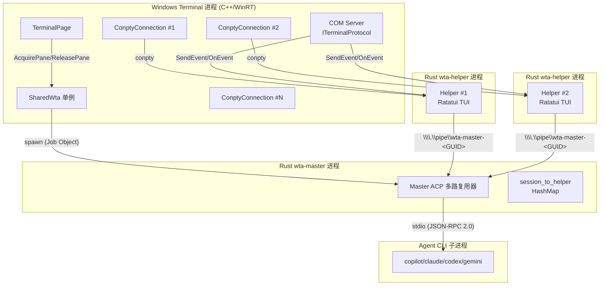
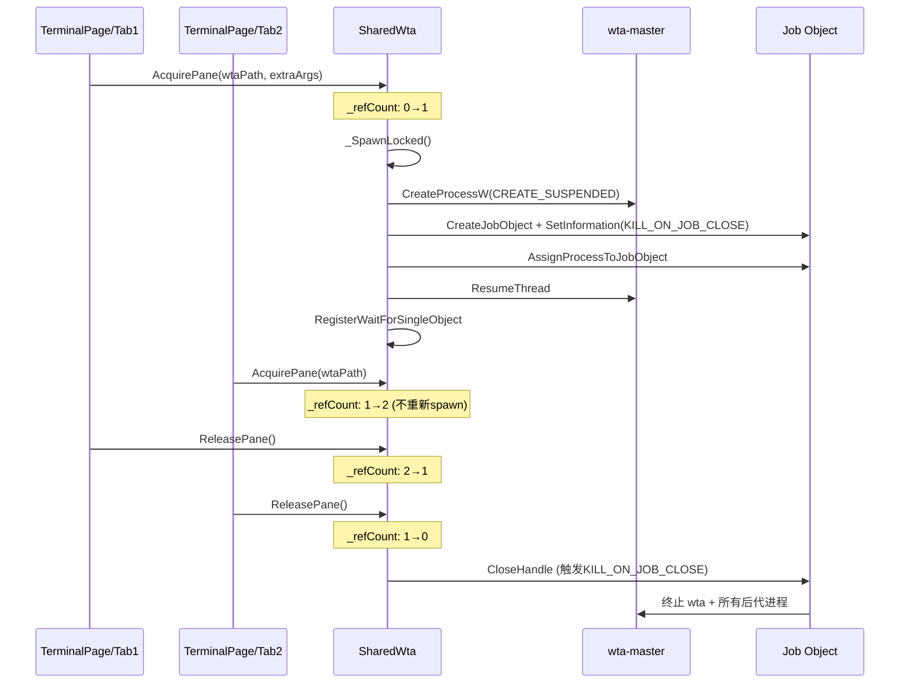
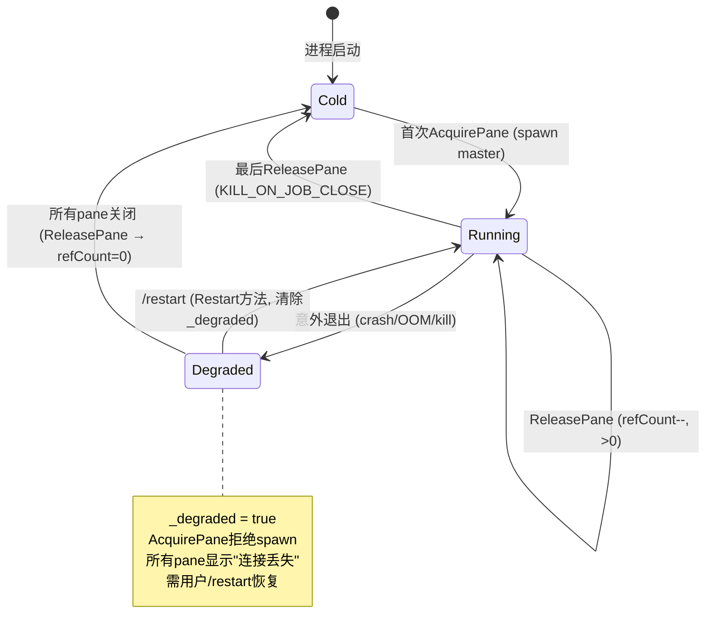

## 概述

Intelligent Terminal 采用**双进程三角色**架构来实现 Windows Terminal 与 AI Agent 的集成。核心思想是将 Agent 通信与终端 UI 解耦，通过一个 Rust 编写的 WTA（Windows Terminal Agent）编排器二进制承担三种运行角色，C++ 宿主端仅管理进程生命周期，不直接参与 ACP 通信。

三种运行角色：

| 角色 | 实例数量 | 职责 | 运行方式 |
|------|---------|------|---------|
| `wta-master` | 每个 Terminal 进程 1 个（单例） | ACP 多路复用器，拥有 agent CLI 子进程，路由 helper 请求/通知 | SharedWta 懒加载生成，命名管道服务端 |
| `wta-helper` | 每个 Agent Pane 1 个 | TUI 渲染（Ratatui），ACP client，ShellManager | 作为 conpty 子进程，命名管道客户端 |
| CLI helpers | 一次性命令 | `wtcli` 调用、delegate 模式、hooks 操作等 | 短期子进程，执行完即退出 |

进程拓扑：**N 个 agent pane ⇒ N 个 helper 进程 + 1 个 master 进程 + 1+ 个 agent CLI 子进程**。典型 ≤5 pane 时 ≤7 个进程，≤75 MB 内存。

## 架构图



## SharedWta 单例与引用计数

C++ 端通过 `SharedWta` 单例管理 wta-master 的生命周期，采用**引用计数模式**：

- 每个 agent pane 创建时调用 `AcquirePane()`，关闭时调用 `ReleasePane()`
- 首次 `AcquirePane` 时 spawn master 进程
- 最后一次 `ReleasePane` 时通过关闭 Job Object 句柄终止 master

```cpp
// src/cascadia/TerminalApp/SharedWta.h
class SharedWta
{
public:
    static SharedWta& Instance();  // 进程单例，magic-statics 线程安全

    bool AcquirePane(const std::wstring_view wtaPath,
                     std::span<const std::wstring> extraArgs = {});
    void ReleasePane();

    bool Restart();  // /restart 命令路径，绕过引用计数
    bool IsRunning() const noexcept;
    bool IsDegraded() const noexcept;  // 崩溃锁存位
    std::wstring_view MasterPipeName() const noexcept;

private:
    mutable std::mutex _mtx;
    wil::unique_handle _process;
    wil::unique_handle _job;
    HANDLE _waitHandle{ nullptr };
    size_t _refCount{ 0 };
    std::wstring _masterPipeName;
    bool _degraded{ false };
};
```

`AcquirePane` 的 `extraArgs` 参数仅在首次 spawn 时生效，用于传递 per-process 设置（`--agent`、`--agent-id`、`--acp-model`、`--no-autofix`、`--language`、`--allowed-agent-ids` 等）。后续 Acquire 直接返回，运行时配置变更通过事件通道（如 `autofix_enabled_changed`）传递。

### 引用计数生命周期时序



## Job Object 容器

wta-master 被放入设置了 `JOB_OBJECT_LIMIT_KILL_ON_JOB_CLOSE` 的 Job Object 中。当 Terminal 退出或最后一个 pane Release 时，关闭 job handle 即可原子性地终止 master 及其所有后代进程（包括 agent CLI 子进程、npx adapter 进程等），防止孤儿进程泄漏。

```cpp
// src/cascadia/TerminalApp/SharedWta.cpp:366-386
wil::unique_handle job{ CreateJobObjectW(nullptr, nullptr) };
if (!job)
{
    TerminateProcess(process.get(), 1);
    return false;
}
JOBOBJECT_EXTENDED_LIMIT_INFORMATION limits{};
limits.BasicLimitInformation.LimitFlags = JOB_OBJECT_LIMIT_KILL_ON_JOB_CLOSE;
if (!SetInformationJobObject(job.get(),
                             JobObjectExtendedLimitInformation,
                             &limits,
                             sizeof(limits)))
{
    TerminateProcess(process.get(), 1);
    return false;
}
if (!AssignProcessToJobObject(job.get(), process.get()))
{
    TerminateProcess(process.get(), 1);
    return false;
}
```

任何 Job Object 设置失败时，代码立即 `TerminateProcess` 终止已创建的（仍处于挂起状态的）子进程，保证不泄漏。

## CREATE_SUSPENDED + ResumeThread 竞态防护

创建 master 子进程时使用 `CREATE_SUSPENDED` 标志，在 `AssignProcessToJobObject` 成功之后才调用 `ResumeThread`。这防止了一个微秒级 race condition：如果 Terminal 在 `CreateProcessW` 和 `AssignProcessToJobObject` 之间崩溃，已经创建的 wta 进程会因为不在 Job Object 中而成为孤儿进程（无法被 KILL_ON_JOB_CLOSE 机制回收）。

```cpp
// src/cascadia/TerminalApp/SharedWta.cpp:319-324,416
DWORD creationFlags = CREATE_NO_WINDOW | CREATE_UNICODE_ENVIRONMENT | CREATE_SUSPENDED;
// ... CreateProcessW + AssignProcessToJobObject ...
ResumeThread(thread.get());  // 只有Job Object绑定成功后才启动子进程
```

## 崩溃检测与 Degraded 锁存

通过 `RegisterWaitForSingleObject` 在线程池上注册等待回调，监控 master 进程句柄。当 master 意外退出（crash/OOM/kill）时：

1. 回调设置 `_degraded = true` 锁存位
2. 清理 `_process`、`_job`、`_waitHandle`
3. **阻止**后续 `AcquirePane` 静默重启 master（防止裂脑：新 master 的管道名相同但已有的 helper 连的是旧 master 的会话状态）
4. 用户必须通过 `/restart` 命令显式恢复，或所有 pane 关闭后下次冷启动

```cpp
// src/cascadia/TerminalApp/SharedWta.h:122-133
/// Whether the master died *unexpectedly* (crash/OOM/external
/// kill) while agent panes were still live, and has not yet
/// been recovered via `/restart`. While this latch is set,
/// `AcquirePane` refuses to silently respawn the master — so a
/// new tab / pane toggle does NOT bring up a lone fresh master
/// that the orphaned helpers can't see (split-brain).
bool IsDegraded() const noexcept;
```

回调通过 PID 而非 `this` 指针识别 master 实例，防止旧 master 的延迟回调在 master 被 respawn 后错误地清理新 master 的状态：

```cpp
// src/cascadia/TerminalApp/SharedWta.cpp:455-485
void CALLBACK SharedWta::_OnProcessExitedThunk(PVOID context, BOOLEAN /*timedOut*/)
{
    const auto observedPid = static_cast<DWORD>(reinterpret_cast<uintptr_t>(context));
    SharedWta::Instance()._OnProcessExited(observedPid);
}

void SharedWta::_OnProcessExited(DWORD observedPid)
{
    std::lock_guard lock{ _mtx };
    if (_pid != observedPid)  // 过期回调：新master已spawn，PID不匹配
    {
        return;
    }
    if (!_process.is_valid()) return;  // 已被Release清理

    _agentPaneLog("wta-master exited unexpectedly pid=" + ...);
    _degraded = true;  // 设置锁存
    _job.reset(); _process.reset();
    // ...
}
```

### 崩溃状态机



## Pre-warm（预暖）机制

每个新 tab 创建时自动生成一个**隐藏的 stashed agent pane**：

- 调用 `_AutoCreateHiddenAgentPaneShared`，设置 `autoStash=true`
- helper 命令行添加 `--start-stashed` 参数
- helper 在后台运行并完成 ACP 握手（initialize → authenticate → session ready），即使用户从未打开 pane
- pane 被 stash（隐藏），不销毁 helper/conpty/ACP session/chat history

Pre-warm 是 **autofix 在未打开 pane 时工作的前提**——因为后台 helper 的 ACP session 已经处于 Connected 状态，当 Shell Integration 标记（OSC 133;D）检测到命令失败时，可以立即通过已就绪的 ACP 通道触发自动修复。

Helper 的 `--start-stashed` 标志确保其在启动时将 `tab.pane_open` 设为 `false`，避免 C++ 端误判为"用户打开了 pane"而自动 unstash。

### Pre-warm 时序

```mermaid
sequenceDiagram
    participant User as 用户
    participant TP as TerminalPage
    participant SW as SharedWta
    participant Master as wta-master
    participant Helper as wta-helper (stashed)
    participant Agent as Agent CLI

    User->>TP: 新建Tab (Ctrl+Shift+T)
    TP->>SW: AcquirePane() (若首次则spawn master)
    SW->>Master: spawn (CREATE_SUSPENDED→Job→Resume)
    Master->>Agent: spawn + initialize (stdio)
    TP->>Helper: spawn conpty (--connect-master <pipe> --start-stashed)
    Helper->>Master: connect pipe + initialize + authenticate + new_session
    Master->>Agent: new_session
    Agent-->>Master: session_id
    Master-->>Helper: session ready
    Note over Helper: pane_open=false (后台就绪)
    Note over TP: Agent Pane已stash，用户看不到

    Note over TP,Agent: ...时间推移，用户正常工作...

    TP->>TP: OSC 133;D;<exit_code> 检测到失败
    TP->>Master: (通过COM事件) autofix_state: Detected
    Master->>Helper: 通知autofix (helper已就绪!)
    Helper->>Agent: prompt (autofix修复)
```

## C++ 端与 ACP 的职责边界

关键设计决策：**C++ 端不直接参与 ACP 通信**。

- Agent pane 本质上是普通的 `ConptyConnection`，承载 `wta-helper` 子进程
- C++ 端仅管理 helper 进程生命周期（spawn/conpty 连接）和 COM 协议服务
- 所有 ACP JSON-RPC 通信在 Rust 端（master ↔ helper ↔ agent CLI）完成
- C++ 与 Rust 的交互通过两条路径：
  1. **conpty 管道**：helper 作为终端子进程的 stdout/stdin（TUI 渲染、用户输入）
  2. **COM 协议服务器**：结构化查询/控制（ListPanes、SendInput、事件通知等）

## 源码链接

| 文件 | 关键内容 |
|------|---------|
| SharedWta.h | SharedWta 单例声明、引用计数API、_degraded锁存 |
| SharedWta.cpp | _SpawnLocked实现、CREATE_SUSPENDED、Job Object、崩溃回调 |
| master/mod.rs | wta-master ACP多路复用器实现 |
| helper/mod.rs | wta-helper TUI运行时 |
| Multi-window-agent-pane.md | 双进程架构设计文档 |
