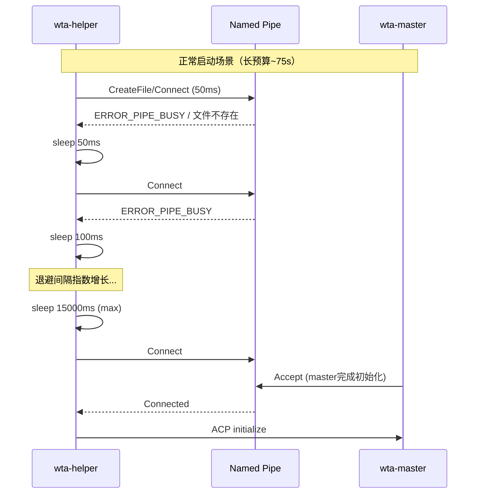
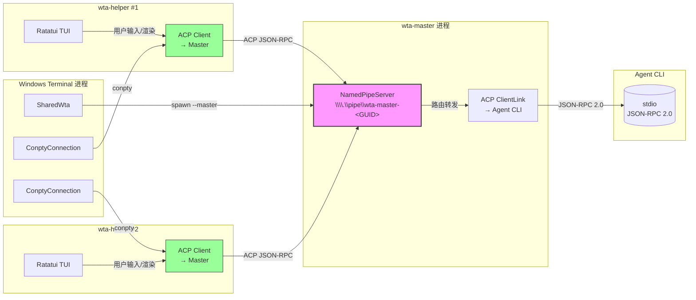

## 概述

命名管道是 wta-helper 与 wta-master 之间 ACP JSON-RPC 通信的唯一传输层。每个 Terminal 进程在首次 `AcquirePane` 时生成一个唯一 GUID，构造管道名 `\\.\pipe\wta-master-<GUID>`，wta-master 在该管道上监听，每个 wta-helper 通过该管道连接到 master 并以 ACP 协议通信。

管道名在 master 重启期间保持**稳定**（同一 GUID），使得之前 spawn 的 helper 在 `/restart` 后能重连到新的 master 实例，避免因管道名变化导致 helper 全部失效。

## 管道命名与生成

### 管道名格式

```
\\.\pipe\wta-master-<GUID>
```

其中 GUID 通过 `CoCreateGuid` 生成，去掉花括号后附加到固定前缀。管道名在首次 `AcquirePane` 时生成，在整个 Terminal 进程生命周期内（包括 master crash + `/restart` 恢复）保持不变。

```cpp
// src/cascadia/TerminalApp/SharedWta.cpp:252-274
if (_masterPipeName.empty())
{
    GUID guid{};
    if (FAILED(CoCreateGuid(&guid)))
    {
        return false;
    }
    wchar_t buf[64]{};
    const auto written = StringFromGUID2(guid, buf, ARRAYSIZE(buf));
    if (written <= 0)
    {
        return false;
    }
    // StringFromGUID2 returns `{xxxxxxxx-...-xxxxxxxxxxxx}` — strip braces
    std::wstring_view raw{ buf, static_cast<size_t>(written - 1) };
    if (raw.size() >= 2 && raw.front() == L'{' && raw.back() == L'}')
    {
        raw = raw.substr(1, raw.size() - 2);
    }
    _masterPipeName = L"\\\\.\\pipe\\wta-master-";
    _masterPipeName.append(raw);
}
```

C++ 端通过 `SharedWta::MasterPipeName()` 暴露管道名给 spawn helper 的代码路径。

### Master 侧管道监听

wta-master 使用 Tokio 的 `NamedPipeServer` 在传入的管道名上监听 helper 连接：

```rust
// tools/wta/src/master/mod.rs:52,56
const MASTER_PIPE_DISCOVERY_FILE: &str = "master-pipe.txt";
use tokio::net::windows::named_pipe::{NamedPipeServer, ServerOptions};
```

Master 启动时将管道名写入 STATE root 下的 `master-pipe.txt` 文件，供外部工具发现：

```
%LOCALAPPDATA%\Packages\<PFN>\LocalState\IntelligentTerminal\master-pipe.txt
```

## 命令行参数传递

### Master 命令行

C++ 端 spawn wta-master 时构造的命令行格式：

```
"wta.exe" --master "\\.\pipe\wta-master-<GUID>" [extraArgs...]
```

`extraArgs` 包含以下 per-process 设置参数：

| 参数 | 用途 | 来源 |
|------|------|------|
| `--agent <cmd>` | 默认 Agent CLI 命令 | settings.json `acpAgent` / 自定义命令 |
| `--agent-id <id>` | 默认 Agent ID | 与 `--agent` 对应的规范ID |
| `--acp-model <model>` | 模型覆盖 | settings.json `acpModel` |
| `--no-autofix` | 禁用自动修复 | settings.json `autoFixEnabled=false` |
| `--language <lang>` | UI 语言覆盖 | settings.json `language` |
| `--allowed-agent-ids <ids>` | GPO 允许的 Agent ID 列表（逗号分隔） | 组策略过滤结果 |
| `--delegate-agent <cmd>` | Delegate 模式默认 Agent | settings.json `delegateAgent` |
| `--delegate-model <model>` | Delegate 模式模型 | settings.json `delegateModel` |

```cpp
// src/cascadia/TerminalApp/SharedWta.cpp:276-310
// 命令行构建逻辑
std::wstring commandline;
commandline.reserve(wtaPath.size() + 64 + _masterPipeName.size() + argsBudget);
commandline.push_back(L'"');
commandline.append(wtaPath);
commandline.append(L"\" --master \"");
commandline.append(_masterPipeName);
commandline.append(L"\"");
for (const auto& arg : extraArgs)
{
    if (arg.empty()) continue;
    commandline.push_back(L' ');
    QuoteAndEscapeCommandlineArg(arg, commandline);
}
```

每个 extraArg 通过 `QuoteAndEscapeCommandlineArg` 自动转义，调用方可以传入包含空格/引号的原始值。

### Helper 命令行

每个 wta-helper 作为 conpty 子进程被 spawn 时，命令行格式：

```
wta.exe --connect-master "\\.\pipe\wta-master-<GUID>"
        --owner-tab-id <stable-guid>
        --owner-window-id <id>
        [--start-stashed]
        [--assume-master-down]
        [--initial-view chat|sessions]
        [--initial-load-session-id <sid>]
        [--acp-model <model>]
        [--language <lang>]
```

```rust
// tools/wta/src/cli/args.rs (clap derive)
/// Connect to a wta-master singleton over the named pipe
#[arg(long, hide = true, value_name = "PIPE_NAME")]
pub(crate) connect_master: Option<String>,

/// Stable GUID of the WT tab that owns this wta process
#[arg(long, hide = true)]
pub(crate) owner_tab_id: Option<String>,

/// Window ID of the WT window that owns this helper
#[arg(long, hide = true)]
pub(crate) owner_window_id: Option<String>,

/// Pre-warm mode: helper spawned for already-stashed pane
#[arg(long, hide = true)]
pub(crate) start_stashed: bool,

/// Degraded-open mode: master known to be down
#[arg(long, hide = true)]
pub(crate) assume_master_down: bool,

/// Initial TUI view: chat or sessions
#[arg(long, value_enum, default_value_t = InitialView::Chat)]
pub(crate) initial_view: InitialView,
```

关键隐藏参数说明：

- `--start-stashed`：Pre-warm 模式，helper 初始化时设置 `pane_open=false`，避免 C++ 端误判为 pane 打开
- `--assume-master-down`：Degraded 模式，helper 启动时直接显示断开状态，不做长预算重试
- `--initial-load-session-id`：从会话管理恢复时直接 load 该 session，避免竞态
- `--owner-tab-id`：绑定到 WT tab 的 StableId，用于事件路由

## 连接重试与指数退避

Helper 连接 master 管道时面临两类场景，使用不同的重试预算：

### 场景一：正常启动（冷启动竞态）

Helper spawn 时 master 可能仍在初始化中（spawn agent CLI → npx adapter 下载 → initialize 握手，最坏 60 秒）。使用**长预算指数退避** `MASTER_PIPE_BACKOFF_MS`：

```rust
// tools/wta/src/protocol/acp/client.rs:25-28
const MASTER_PIPE_BACKOFF_MS: &[u64] = &[
    50, 100, 100, 200, 200, 500, 500, 1000, 1000, 2000, 2000, 2000,
    5000, 5000, 5000, 5000, 10000, 10000, 10000, 15000,
];
// 总预算约75秒
```

退避序列从 50ms 起步，逐步增加到 15000ms，总计约 75 秒预算，足以覆盖 master 冷启动（包括 npx adapter 首次下载）。

### 场景二：登录后重连

用户完成认证后 helper 需要重连到 master。如果旧管道已不可用（master 重启中），不应显示长时间 spinner，使用**短预算** `POST_LOGIN_MASTER_PIPE_BACKOFF_MS`：

```rust
// tools/wta/src/protocol/acp/client.rs:33-35
const POST_LOGIN_MASTER_PIPE_BACKOFF_MS: &[u64] = &[
    50, 100, 100, 200, 200, 500, 500, 1000, 1000, 2000, 2000, 2000,
];
// 总预算约7秒
```

短预算约 7 秒，仅容忍短暂的 `ERROR_PIPE_BUSY` 窗口或 master respawn 间隙。超时后用户可手动 `/restart`。

### 退避时序图



## 传输层数据流图



## Master 管道发现文件

wta-master 启动后将管道名写入 STATE root 下的 `master-pipe.txt`：

```
%LOCALAPPDATA%\Packages\<PFN>\LocalState\IntelligentTerminal\master-pipe.txt
```

该文件的用途：

1. **外部工具发现**：wtcli、诊断脚本等外部工具可以通过读取此文件找到 master 管道名
2. **诊断辅助**：调试时可以快速确认当前 master 的管道名
3. **wta CLI 子命令**：`wta test-pipe` 等调试命令可以读取此文件验证管道连通性

## 管道与两跳传输

命名管道是 helper ↔ master 之间的传输层，而 master ↔ agent CLI 之间使用 stdio（标准输入/输出）传输。这构成了 ACP 协议的**两跳传输**模型：

1. **第一跳（stdio）**：master 是 ACP **client**，agent CLI 是 server。master 通过 agent CLI 子进程的 stdin/stdout 发送 JSON-RPC 请求/响应。
2. **第二跳（命名管道）**：master 对 helper 扮演 ACP **agent**（server）角色，helper 是 client。master 将 helper 请求转发给 agent CLI，将 agent 的 `session_notification` 路由回拥有该 session 的 helper。

两跳之间由 master 的 `session_to_helper: HashMap<SessionId, HelperRoute>` 映射表桥接，详见 [acp-json-rpc-protocol](acp-json-rpc-protocol.md)。

## PATH 刷新

Spawn master 前，C++ 端调用 `WtaProcess::RefreshProcessPath()` 从 Windows 注册表刷新系统+用户 PATH，合并到当前进程 PATH。这确保新安装的 CLI 工具（如 WinGet Links 下的 `copilot`）可以被 master 子进程发现。

```cpp
// src/cascadia/TerminalApp/SharedWta.cpp:326-339
try
{
    ::Microsoft::Terminal::WtaProcess::RefreshProcessPath();
}
catch (...)
{
    LOG_CAUGHT_EXCEPTION();
}
```

## 源码链接

| 文件 | 关键内容 |
|------|---------|
| SharedWta.h | MasterPipeName() 声明 |
| SharedWta.cpp | GUID生成、命令行构建、PATH刷新 |
| cli/args.rs | Helper CLI 参数定义（clap） |
| protocol/acp/client.rs | 指数退避常量定义 |
| master/mod.rs | master-pipe.txt 发现文件常量 |
