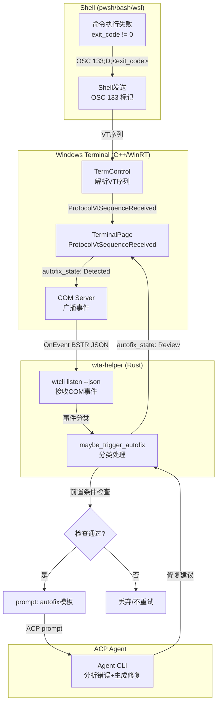

## 概述

OSC 133 自动修复（Autofix）是 Intelligent Terminal 的核心智能功能之一。它通过 Shell Integration 标记（OSC 133 序列）实时检测终端中的命令失败，自动将失败信息和上下文发送给 AI Agent 分析并提供修复建议。用户无需手动复制错误信息或打开 Agent Pane——在 Pane 不可见（Pre-warmed）时也能工作。

Autofix 是**opt-in** 功能，通过设置 `autoFixEnabled: true` 启用（默认 `false`）。自动错误检测（`autoErrorDetectionEnabled`）默认为 `true`，仅检测不修复时也能通过底部栏显示错误提示。

## 管线架构

Autofix 的完整事件流从 Shell 的 OSC 133 标记开始，经过 C++ 宿主端事件传播、COM 事件广播、wta 监听和分类，最终到达 ACP Agent：



## Shell Integration 标记

Autofix 依赖 Shell Integration（SI）提供的 OSC 133 提示符标记。这些标记由 PowerShell/bash 等 shell 的 integration 脚本输出，标记命令的开始、结束和退出码。

### OSC 133 标记类型

| 序列 | 含义 |
|------|------|
| `OSC 133;A` | Prompt start（提示符开始） |
| `OSC 133;B` | Prompt end（提示符结束，命令开始执行） |
| `OSC 133;C` | Command start（命令开始，含命令行） |
| `OSC 133;D;<exit_code>` | Command end（命令结束，含退出码）—— **Autofix 的触发器** |
| `OSC 133;E` | CWD 变更（非133，但相关：OSC 9;9） |
| `OSC 9001;ShellType` | Shell 类型标识 |

当 Shell 发送 `OSC 133;D;<exit_code>` 且 exit_code 非零时，Terminal 知道最近一条命令执行失败。

### PaneInfo 中的 Shell Integration 字段

COM 接口返回的 `PaneInfo` 结构包含 Shell Integration 填充的字段：

```idl
// src/cascadia/TerminalProtocol/TerminalProtocol.idl:25-46
struct PaneInfo
{
    Guid SessionId;
    UInt32 TabId;
    UInt64 WindowId;
    String Title;
    String Profile;
    Boolean IsActive;
    Boolean IsAgentPane;
    UInt32 Pid;
    Int32 Rows;
    Int32 Columns;
    String Cwd;          // OSC 9;9 工作目录追踪
    String Shell;        // OSC 9001;ShellType: "pwsh"/"powershell"/"bash"/"wsl:Ubuntu"
    String ShellVersion;
};
```

## ProtocolVtSequenceReceived 事件

TerminalPage 上的 typed event `ProtocolVtSequenceReceived` 是 OSC 序列从 TermControl 到 COM 广播的桥梁：

```cpp
// src/cascadia/TerminalApp/TerminalPage.h:266
// 当 VT 序列（包括 OSC 133 错误标记）被检测到时触发
// COM 服务器的 _ensurePageEventsRegistered 将此事件连接到 COM 事件广播
```

COM 服务器通过 `_ensurePageEventsRegistered` 将每个窗口的 `ProtocolVtSequenceReceived` 事件连接到事件分发逻辑。当 OSC 133;D（非零退出码）到达时，C++ 端构造 `autofix_state` 事件（Detected 状态），通过 COM 事件通道广播。

## PaneOutput.HasMarks

`ReadPaneOutput` COM 方法返回的 `PaneOutput` 结构包含 `HasMarks` 字段，这是 autofix 正确获取错误上下文的关键：

```idl
// src/cascadia/TerminalProtocol/TerminalProtocol.idl:48-59
struct PaneOutput
{
    Guid SessionId;
    String Content;
    Int32 LineCount;
    Boolean Truncated;
    // True when content was sliced from an OSC 133 prompt mark
    // (shell integration produced a parseable command boundary).
    // False when no marks were available — client should fall back
    // to a line-count read.
    Boolean HasMarks;
};
```

### ReadPaneOutput source 参数

`ReadPaneOutput(sessionId, source, maxLines)` 的 `source` 参数支持三种读取模式，由 `ClassifyPaneOutputSource` 解析：

```cpp
// src/cascadia/TerminalProtocol/ProtocolParsing.h:183-202
enum class PaneOutputSource
{
    Scrollback,  // 从scrollback历史读取
    Screen,      // 当前可见屏幕
    LastPrompt,  // 最近一次完成的命令+输出（需要OSC 133 marks）
};

inline PaneOutputSource ClassifyPaneOutputSource(const std::string& source)
{
    if (source == "last_prompt") return PaneOutputSource::LastPrompt;
    if (source == "screen") return PaneOutputSource::Screen;
    return PaneOutputSource::Scrollback;
}
```

Autofix 使用 `source="last_prompt"` 精确获取失败命令及其输出（从最近的 OSC 133 prompt mark 切片），而不是模糊地读取 N 行。`HasMarks=true` 确认切片成功；`HasMarks=false` 时客户端应回退到行数读取模式。

## Autofix 状态机

AgentPaneContent 上的 `AutofixState` 枚举表示 per-pane 的 autofix 生命周期：

```cpp
// src/cascadia/TerminalApp/AgentPaneContent.h:41-52
enum class AutofixState
{
    Idle,      // 无错误/修复已处理/已重置
    Detected,  // OSC 133检测到命令失败
    Pending,   // Agent正在分析/生成修复
    Review,    // 分析完成，修复建议在Agent Pane chat中等待查看
};
```



```mermaid
stateDiagram-v2
    [*] --> Idle
    Idle --> Detected: OSC 133;D (exit≠0)
    Detected --> Pending: 发送prompt到Agent
    Pending --> Review: Agent返回修复建议
    Review --> Idle: 用户查看/关闭pane
    Detected --> Idle: 前置条件不满足/超时
    Pending --> Idle: Agent错误/超时
    Review --> Pending: 用户请求重新修复
```

状态转换由 C++ 端（接收 COM 事件）和 Rust 端（wta-helper 的 ACP 响应）协同驱动：

1. **Detected**：OSC 133;D 触发，底部栏显示检测到错误的摘要
2. **Pending**：wta 通过 ACP prompt 发送错误上下文给 Agent，底部栏显示"正在分析"
3. **Review**：Agent 返回修复建议（fix/explanation），helper 在 chat 中展示结果。注意：autofix 不再自动执行，用户需要在 pane 中审阅。
4. **Idle**：用户打开 pane 查看建议后，或显式关闭/重启后回到 Idle

### ApplyAutofixState

```cpp
// src/cascadia/TerminalApp/AgentPaneContent.cpp:130-174
void AgentPaneContent::ApplyAutofixState(AutofixState state,
                                         const winrt::hstring& paneId,
                                         const winrt::hstring& summary,
                                         const winrt::hstring& fixPreview,
                                         const winrt::hstring& hotkeyHint,
                                         const winrt::hstring& suggestionTitle)
{
    _autofixState = state;
    if (state == AutofixState::Idle)
    {
        // Idle时清除所有缓存字段
        _lastErrorPaneId = {};
        _fixPreview = {};
        _suggestionTitle = {};
        _detectedSummary = {};
        _hotkeyHint = {};
    }
    else
    {
        if (!paneId.empty()) _lastErrorPaneId = paneId;
        if (!summary.empty()) _detectedSummary = summary;
        if (!fixPreview.empty()) _fixPreview = fixPreview;
        if (!hotkeyHint.empty()) _hotkeyHint = hotkeyHint;
        if (!suggestionTitle.empty()) _suggestionTitle = suggestionTitle;
    }
    StateChanged.raise(*this, nullptr);
}
```

## 前置条件检查

Autofix 触发前必须满足全部前置条件，否则事件被丢弃（不重试）：

| 前置条件 | 说明 | 检查方式 |
|---------|------|---------|
| Shell Integration | PowerShell shell integration 已启用（OSC 133 marks 可用） | PaneInfo.Shell 非空，ReadPaneOutput HasMarks=true |
| ACP Session Connected | helper 的 ACP session 已达 Connected 状态 | `_agentState == L"connected"` (IsAgentConnected) |
| wtcli on PATH | wtcli 可被 wta 调用 | CliChannel 路径解析成功 |
| autoFixEnabled | 设置中启用了自动修复 | `autoFixEnabled: true` |
| Pane 不需要可见 | Pre-warmed helper 支持后台触发 | helper 已通过 --start-stashed 在后台就绪 |

关键特性：**Pane 不需要可见**。Pre-warm 机制（参见 [dual-process-architecture](dual-process-architecture.md)）确保即使用户从未打开 Agent Pane，后台 helper 的 ACP session 也已处于 Connected 状态，可以响应 autofix 请求。

### 失败处理

如果前置条件不满足（如冷启动时 session 未连接、session new 进行中、agent Failed），失败事件被丢弃且**不重试**。这是因为：
- 命令失败是瞬时事件，延迟重试可能拿到不相关的上下文
- 冷启动期间 spawn agent CLI 可能需要 60 秒，用户已错过修复时机
- 避免在 agent 不可用时反复重试造成日志洪水

## Autofix 事件流

wta-helper 通过 `wtcli listen --json` 监听 COM 事件流，在事件分类器 `maybe_trigger_autofix()` 中处理 OSC 序列事件。

### 事件分类与触发

```mermaid
sequenceDiagram
    participant SH as Shell
    participant TC as TermControl
    participant TP as TerminalPage
    participant CS as COM Server
    participant W as wtcli listen
    participant H as wta-helper
    participant M as wta-master
    participant A as Agent CLI

    SH->>TC: 执行命令失败 (exit≠0)
    SH->>TC: OSC 133;D;1
    TC->>TP: ProtocolVtSequenceReceived
    TP->>CS: autofix_state: Detected
    CS->>W: OnEvent(JSON)
    W->>H: stdout (JSON event)
    H->>H: maybe_trigger_autofix()
    H->>H: 前置条件检查
    Note over H: Shell OK? Session Connected? wtcli OK?
    H->>H: ReadPaneOutput(source=last_prompt)
    H->>CS: wtcli capture-pane --source last_prompt
    CS->>TC: ReadPaneOutput → Content + HasMarks=true
    TC-->>H: 失败命令+输出内容
    H->>H: 构建autofix prompt模板
    H->>M: ACP prompt (is_autofix=true)
    M->>A: prompt
    A-->>M: 修复建议(chunks)
    M-->>H: session_notification chunks
    H->>CS: SendEvent autofix_state: Review
    CS->>TP: 路由到TerminalPage
    TP->>TP: 底部栏显示建议
```

### autofix prompt 特殊标记

发送给 Agent 的 autofix prompt 带有 `is_autofix: true` 标记（在 `PromptSubmission` 结构中）：

```rust
// tools/wta/src/protocol/acp/client.rs:76-80
pub struct PromptSubmission {
    pub id: u64,
    pub text: String,
    pub pane_context: Option<PaneContext>,
    pub submitted_at_unix_s: f64,
    pub is_autofix: bool,  // autofix合成的prompt
    pub images: Vec<PastedImage>,
}
```

该标记用于：
1. Host 端跳过广播为 User 消息（用户已在终端看到错误行）
2. Planner 使用 autofix 专用 prompt 模板（而非常规对话模板）

## 设置热重载

当 `autoFixEnabled`、`acpModel`、`delegateAgent` 等运行时配置变化时，C++ 端通过 ProtocolVtSequenceReceived 事件通道向 wta 发送 `autofix_enabled_changed` 等配置变更事件，**无需重启 Terminal 或 wta-master**。

```cpp
// src/cascadia/TerminalApp/TerminalPage.cpp:1497-1570
// 设置变更时向 COM 事件通道广播配置变更
```

## 与 AutoErrorDetection 的关系

自动错误检测（`autoErrorDetectionEnabled`，默认 `true`）和自动修复（`autoFixEnabled`，默认 `false`）是两个独立开关：

- **仅检测（默认）**：`autoErrorDetectionEnabled=true, autoFixEnabled=false`。OSC 133 错误被检测到，底部栏显示错误提示，但不自动向 Agent 发送 prompt。用户可手动打开 Agent Pane 查看。
- **检测+自动修复**：`autoErrorDetectionEnabled=true, autoFixEnabled=true`。检测到错误后自动向 Agent 发送 prompt，获取修复建议。

## 源码链接

| 文件 | 关键内容 |
|------|---------|
| AgentPaneContent.h | AutofixState枚举、ApplyAutofixState、IsAgentConnected |
| AgentPaneContent.cpp | ApplyAutofixState实现、状态字段管理 |
| TerminalPage.h | ProtocolVtSequenceReceived事件声明 |
| TerminalPage.cpp | 配置热重载事件发送 |
| TerminalProtocol.idl | PaneOutput.HasMarks、PaneInfo Shell字段 |
| ProtocolParsing.h | PaneOutputSource枚举、ClassifyPaneOutputSource |
| TerminalProtocolComServer.cpp | _ensurePageEventsRegistered、VT事件连接 |
| client.rs | PromptSubmission.is_autofix标记 |
