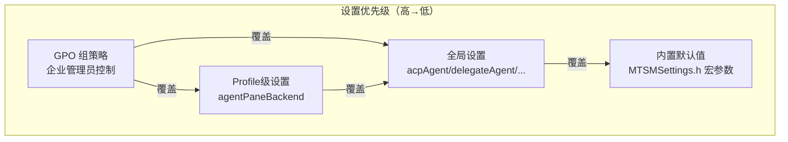
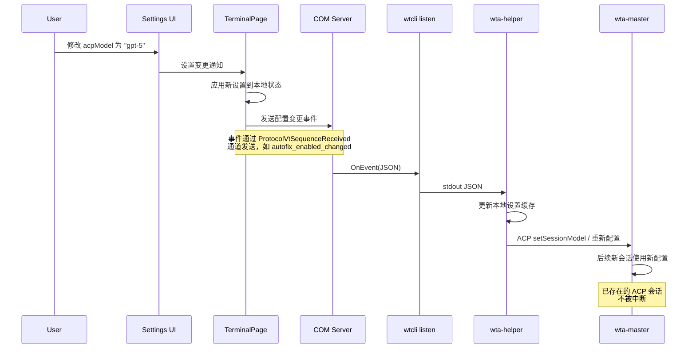
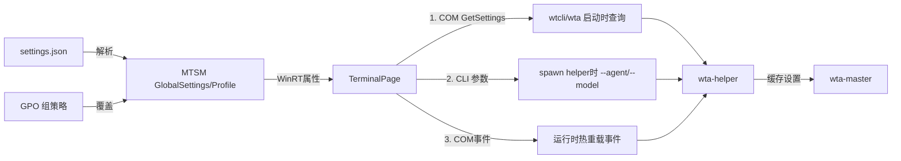

## 概述

Intelligent Terminal 的 Agent 设置通过 Microsoft Terminal Settings Model (MTSM) 的 X 宏系统定义，分为全局设置和 Profile 级设置两层。设置以 JSON 存储在 `settings.json` 中，通过设置 UI（AIAgents 页面）可视化编辑，支持运行时热重载——配置变更无需重启 Terminal 或 wta-master。

设置定义的单一事实来源是 MTSMSettings.h 中的宏列表。

## MTSM X 宏系统

MTSM 使用宏 `X(type, name, jsonKey, defaultArgs)` 声明设置项。宏展开时自动生成：
1. `CoreWindow::GlobalSettings`/`Profile` 的 WinRT 属性
2. JSON 序列化/反序列化逻辑
3. 默认值赋值
4. 设置变更通知

```cpp
// 宏格式：(type, name, jsonKey, defaultArgs)
#define MTSM_GLOBAL_SETTINGS(X)
    // ... 其他 WT 全局设置 ...
    X(hstring, AcpAgent, "acpAgent", L"copilot")
    X(hstring, AcpModel, "acpModel", L"")
    // ...
```

## 全局 Agent 设置

全局设置位于 settings.json 根级别，作用于所有窗口和标签页：

| 属性 | 类型 | JSON Key | 默认值 | 说明 |
|------|------|----------|--------|------|
| AcpAgent | string | `acpAgent` | `"copilot"` | ACP 模式（Pane 内聊天）使用的 Agent ID |
| AcpModel | string | `acpModel` | `""` | ACP 模式使用的模型名称，空字符串使用 Agent 默认模型 |
| DelegateAgent | string | `delegateAgent` | `"copilot"` | Delegate 模式（命令面板`?prompt`、autofix 后台）使用的 Agent ID |
| DelegateModel | string | `delegateModel` | `""` | Delegate 模式使用的模型名称 |
| AutoErrorDetectionEnabled | bool | `autoErrorDetectionEnabled` | `true` | 自动检测 OSC 133 命令失败并显示底部栏提示 |
| AutoFixEnabled | bool | `autoFixEnabled` | `false` | 自动将失败信息发送给 Agent 分析修复（opt-in） |
| AcpCustomCommand | string | `acpCustomCommand` | `""` | 自定义 ACP 启动命令（覆盖 acpAgent 的内置命令） |
| DelegateCustomCommand | string | `delegateCustomCommand` | `""` | 自定义 Delegate 启动命令（覆盖 delegateAgent 的内置命令） |
| AgentPanePosition | string | `agentPanePosition` | `"bottom"` | Agent Pane 停靠位置：`bottom`/`right`/`top`/`left` |
| AiCoordinatorEnabled | bool | `aiIntegration.coordinator.enabled` | `false` | AI 协调器（Coordinator）功能总开关 |
| AiCoordinatorCommandline | string | `aiIntegration.coordinator.commandline` | `"wta"` | 协调器可执行文件路径 |
| AiCoordinatorProfile | string | `aiIntegration.coordinator.profile` | `"{fd19208a...}"` | 协调器专用 Profile GUID |
| AiConfirmationReadOps | string | `aiIntegration.confirmation.readOperations` | `"auto"` | 读操作确认策略 |
| AiConfirmationCreateOps | string | `aiIntegration.confirmation.createOperations` | `"auto"` | 创建/写操作确认策略 |
| AiConfirmationInputOps | string | `aiIntegration.confirmation.inputOperations` | `"auto"` | 输入操作确认策略 |

### 完整宏定义

```cpp
// src/cascadia/TerminalSettingsModel/MTSMSettings.h:76-90
X(hstring, AcpAgent, "acpAgent", L"copilot")
X(hstring, AcpModel, "acpModel", L"")
X(hstring, DelegateAgent, "delegateAgent", L"copilot")
X(hstring, DelegateModel, "delegateModel", L"")
X(bool, AutoErrorDetectionEnabled, "autoErrorDetectionEnabled", true)
X(bool, AutoFixEnabled, "autoFixEnabled", false)
X(hstring, AcpCustomCommand, "acpCustomCommand", L"")
X(hstring, DelegateCustomCommand, "delegateCustomCommand", L"")
X(hstring, AgentPanePosition, "agentPanePosition", L"bottom")
X(bool, AiCoordinatorEnabled, "aiIntegration.coordinator.enabled", false)
X(hstring, AiCoordinatorCommandline, "aiIntegration.coordinator.commandline", L"wta")
X(hstring, AiCoordinatorProfile, "aiIntegration.coordinator.profile", L"{fd19208a-412b-4857-8a2d-9ca592b4b16e}")
X(hstring, AiConfirmationReadOps, "aiIntegration.confirmation.readOperations", L"auto")
X(hstring, AiConfirmationCreateOps, "aiIntegration.confirmation.createOperations", L"auto")
X(hstring, AiConfirmationInputOps, "aiIntegration.confirmation.inputOperations", L"auto")
```

## Profile 级设置

Profile 级设置位于各个 Profile 对象内，作用于使用该 Profile 的终端会话：

| 属性 | 类型 | JSON Key | 默认值 | 说明 |
|------|------|----------|--------|------|
| AgentPaneBackend | string | `agentPaneBackend` | `""` | 该 Profile 使用的 Agent 后端，空字符串使用全局 acpAgent |

```cpp
// src/cascadia/TerminalSettingsModel/MTSMSettings.h:107
X(hstring, AgentPaneBackend, "agentPaneBackend", L"")
```

Profile 级 `agentPaneBackend` 的优先级高于全局 `acpAgent`，允许特定 Profile（如 WSL、远程 SSH）使用不同的 Agent。

## 设置层级与优先级



GPO（Group Policy）具有最高优先级，企业管理员可以通过 ADMX 策略强制设置特定 Agent、禁用功能或限制可用 Agent 列表。

## GetSettings() COM 接口

COM `ITerminalProtocol` 接口提供 `GetSettings()` 方法，wtcli 和 wta 通过此方法查询当前生效的设置：

```idl
// src/cascadia/TerminalProtocol/TerminalProtocol.idl
HRESULT GetSettings([out, retval] BSTR* json);
```

返回的 JSON 包含当前生效的所有 Agent 相关设置（合并 GPO、Profile 和全局设置后的值）。wta-helper 启动后通过此接口获取设置，无需硬编码默认值。

wta-master 在 spawn helper 时也通过 CLI 参数传递关键设置（如 `--agent`、`--model`），但运行时变更依赖 COM 事件通道。

## 设置热重载

当用户修改 settings.json 或通过设置 UI 更改配置时，C++ 端通过 ProtocolVtSequenceReceived 事件通道向 wta 发送配置变更事件，**无需重启 Terminal 或 wta-master**：



### 热重载支持的设置

| 设置 | 热重载行为 |
|------|-----------|
| `autoFixEnabled` | 立即生效，后续命令失败检测使用新值 |
| `acpModel` | 新 ACP 会话使用新模型；现有会话保持原模型 |
| `delegateAgent` | 新 delegate 任务使用新 Agent；正在执行的 delegate 不被中断 |
| `agentPanePosition` | 下一次 Stash/Restore 时切换位置；当前可见的 pane 不变 |
| `acpAgent` | 需要新建 Agent Pane 生效；现有 pane 的 Agent 不被替换 |
| `autoErrorDetectionEnabled` | 立即生效 |

### 热重载事件类型

配置变更通过 COM 事件广播，事件类型包括：
- `autofix_enabled_changed`
- `model_changed`
- `agent_changed`
- `settings_refreshed`（通用设置刷新）

这些事件与普通 Shell/Agent 事件共享同一通道，通过 `method`/`event` 字段区分。

## 设置 UI（AIAgents 页面）

设置 UI 位于 `src/cascadia/TerminalSettingsEditor/AIAgents.cpp`/`.h` 和 `AIAgentsViewModel.cpp`，提供可视化的 Agent 配置界面：

```
Settings → AI Agents
├── Agent Pane
│   ├── Agent 选择（下拉框：copilot/claude/codex/gemini/opencode/custom）
│   ├── Model 输入框
│   ├── Pane 位置（下拉框：Bottom/Right/Top/Left）
│   └── Custom Command 输入框（自定义 ACP 命令）
├── Delegate Mode
│   ├── Agent 选择
│   ├── Model 输入框
│   └── Custom Command 输入框
├── Error Detection & Fix
│   ├── Auto-detect errors（开关，默认开）
│   └── Auto-fix with AI（开关，默认关，opt-in）
└── AI Coordinator（高级）
    ├── Enable Coordinator（开关）
    └── Confirmation policies
```

### Agent 图标资源

设置 UI 中每个 Agent 对应一个 SVG 图标，位于 CascadiaPackage/AgentIcons/：

| 文件 | Agent |
|------|-------|
| `copilot.svg` | GitHub Copilot |
| `claude.svg` | Claude |
| `codex.svg` | Codex/GPT/OpenAI |
| `gemini.svg` | Gemini |
| `opencode.svg` | OpenCode |
| `session.svg` | Sessions 视图图标 |

## Custom Command 机制

`acpCustomCommand` 和 `delegateCustomCommand` 允许高级用户指定自定义 Agent 启动命令，绕过内置 KNOWN_AGENTS 注册表：

- 当 `acpCustomCommand` 非空时，wta 使用该命令而非 `build_acp_command(acpAgent, acpModel)` 构建的命令
- 适用于使用自定义 ACP adapter、本地开发版本、或非标准安装路径的场景
- 自定义命令必须是有效的 ACP stdio 服务（输入 ACP JSON-RPC，输出 ACP JSON-RPC）
- `delegateCustomCommand` 同理用于 delegate 模式

示例 settings.json 片段：

```json
{
  "acpAgent": "copilot",
  "acpModel": "gpt-5",
  "acpCustomCommand": "",
  "delegateAgent": "claude",
  "delegateModel": "",
  "autoErrorDetectionEnabled": true,
  "autoFixEnabled": true,
  "agentPanePosition": "right",
  "profiles": {
    "defaults": {
      "agentPaneBackend": ""
    },
    "list": [
      {
        "name": "Ubuntu (WSL)",
        "agentPaneBackend": "codex"
      }
    ]
  }
}
```

## 设置传递路径

设置从 JSON 文件到 wta-helper 的完整传递路径：



三种设置传递方式互补：
1. **GetSettings() 查询**：helper 启动后主动获取完整设置快照
2. **CLI 参数**：spawn helper 时通过命令行传递关键设置（确保启动即有正确配置）
3. **COM 事件**：运行时配置变更推送（热重载）

## 源码链接

| 文件 | 关键内容 |
|------|---------|
| MTSMSettings.h | 全局 Agent 设置宏定义 |
| MTSMSettings.h | Profile 级 AgentPaneBackend 设置 |
| TerminalPage.cpp | 设置热重载事件发送 |
| AIAgents.cpp | AI Agents 设置 UI 页面 |
| AIAgentsViewModel.cpp | 设置 UI ViewModel |
| TerminalProtocol.idl | GetSettings() COM 接口 |
| AgentIcons/ | Agent SVG 图标 |
