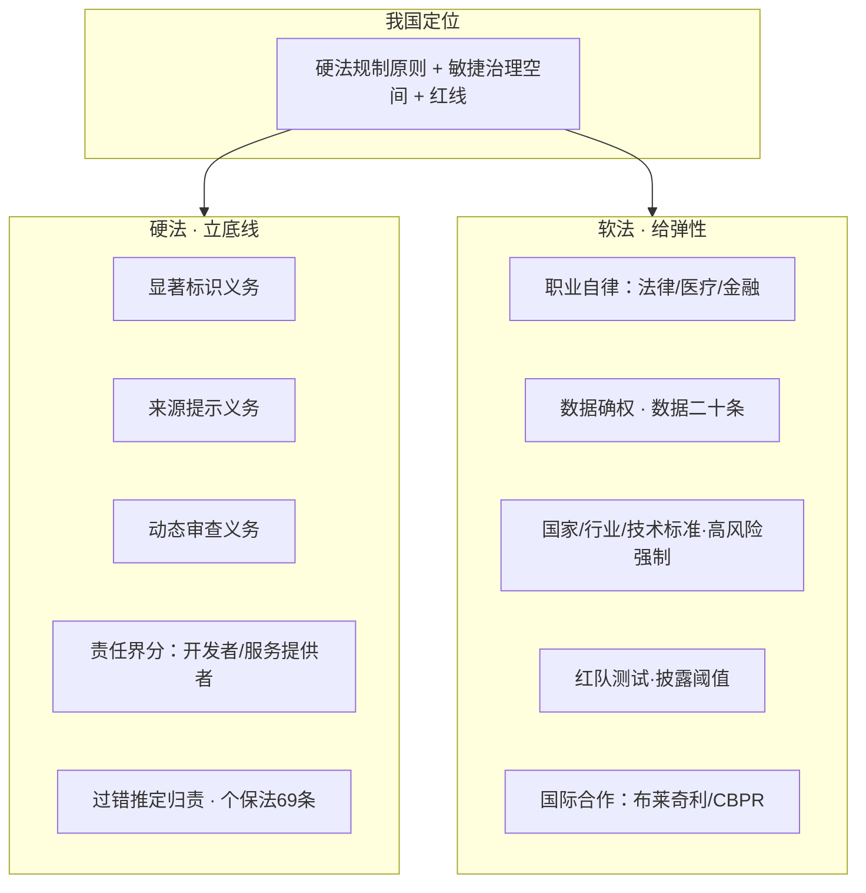

# 03 软硬法协同治理方案

> 对应事实：F-025~F-040
> 说明：本节主体为**作者制度建议**（📝），属规范论证而非可证伪事实；所引国内外参照（日本、加州、个保法、布莱奇利宣言、CBPR）已 P0 核验，加州法案编号已按勘误⑤纠正

## 为什么单一路线都失灵：两个国际参照

论文用两个国家的教训说明"只靠硬法"或"只靠软法"都不成立：

- **日本·纯软法反例**：日本 2021 年发布《治理创新2.0》（METI 2021-07《敏捷治理设计和实施指南》），偏重软性治理框架，却因**缺乏硬法约束反而造成决策低效**（F-025；文件确证，"决策低效"为作者评价）。
- **加州·纯硬法博弈**：美国加州 AI 立法博弈表明**完全抛弃规则导向并不可取**（F-026）。⚠️ 勘误⑤：论文所称"SB 1000"系笔误，实际主线为 **SB 1047**（2024 年 9 月被 Governor Newsom 否决）→ 后继 **SB 53 / TFAIA**（2025-09-29 签署），立法过程反复说明"一边倒地硬规则"在产业与安全之间同样难以落地。

> 结论：知识幻觉治理应采用**"硬法立底线 + 软法给弹性"的协同框架**，并为新问题新场景预留敏捷治理空间、划定红线（📝 F-027，作者对我国定位的建议）。

## 硬法层：确立三项法定义务（F-028~F-030）

| 义务 | 内容 | 场景示例 |
|------|------|----------|
| **显著标识义务** | 数字签名 / 水印 / 醒目颜色，明示内容由 AI 生成 | 所有生成式输出（F-028） |
| **来源提示义务** | 标注信息来源；模型自行推断时标注"本结论未经验证" | 医疗等高风险场景（F-029） |
| **动态审查义务** | 覆盖数据训练、实时监测、生成后追踪的**全生命周期**审查 | 面向应用的持续合规（F-030） |

## 硬法层：责任界分与归责原则（F-031~F-033）

- **责任界分**（📝 F-031）：**基础模型开发者**对架构、算法、可预见的系统风险负责；**服务提供者**对微调、部署环节的过错负责——避免"一刀切"让任一环节免责或全责。
- **过错推定**（📝 F-032）：原告证明"输出与事实不符 + 直接损害 + 非合理推测"，即可**推定为服务提供者有过错**，缓解受害者举证难（F-024 困境）。
- **法理契合**（✅ F-033）：过错推定思路与《个人信息保护法》**第六十九条**确立的敏感个人信息过错推定立法精神相契合，可作为立法衔接依据。

## 软法层：自律、标准与人才（F-034~F-038）

- **职业自律**：以行业自律规范引导**法律、医疗、金融**等职业群体会对生成内容进行验证核实（📝 F-034）。
- **数据治理**：完善数据权益归属，落实"**数据二十条**"精神（2022年《关于构建数据基础制度更好发挥数据要素作用的意见》，✅ F-035），推动数据确权、登记指南与行业标准。
- **人才激励**：强化激励机制，支持**职务科技成果赋权改革**（📝 F-036）。
- **技术标准**：知识幻觉应制定**国家标准、行业标准与技术标准**，高风险领域（司法/医疗/金融）适用**强制性标准限定幻觉率阈值**（📝 F-037）。
- **红队测试**：建立**红队测试技术规程**，部署前**公开披露事实准确率与幻觉触发阈值**（📝 F-038）。

## 软法层：国际合作（F-039~F-040）

- 借鉴 **《布莱奇利宣言》**（Bletchley Declaration，2023 年英国布莱奇利峰会 AI 安全国际治理共识文件，✅ F-039）经验。
- 借鉴 **OECD 跨境隐私规则（CBPR）**（✅ F-040）经验，推动跨境 AI 治理协调。

## 方案全景

> 三张硬法义务 + 责任界分 + 过错推定 + 软法标准，构成论文"**软硬法协同**"的完整制度框架；其中多数为作者制度建议（📝），作为治理路径参考而非即成法律。