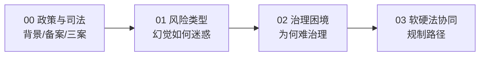

# 概念学习路径

本知识包包含 4 篇概念文档，按"背景与司法动态→风险类型→治理困境→软硬法方案"递进。

## 学习路径

| 顺序 | 文档 | 核心内容 | 对应事实 |
|------|------|----------|----------|
| 1 | [00 政策与司法立法动态](00-policy-judicial-dynamics.md) | 政策推力、备案规模、Mata/noyb/杭州三案、罗伯茨表态 | F-001~006、F-010~013 |
| 2 | [01 知识幻觉的风险类型](01-knowledge-hallucination-risks.md) | 谄媚/思维链机制、高密度编造、路径依赖、应急与投毒风险 | F-007~009、F-014~015 |
| 3 | [02 治理的多维困境](02-governance-dilemmas.md) | 数据枯竭、技术机理局限、制度供给不足 | F-016~024 |
| 4 | [03 软硬法协同治理方案](03-soft-hard-law-solution.md) | 硬法三义务+责任界分+过错推定、软法标准、国际合作 | F-025~040 |

## 路径图



```{toctree}
:hidden:

00-policy-judicial-dynamics
01-knowledge-hallucination-risks
02-governance-dilemmas
03-soft-hard-law-solution
```