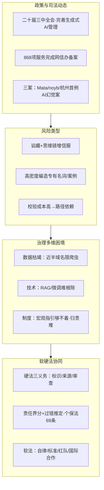

# 论大模型知识幻觉的软硬法协同治理

> **来源**：江南大学学报（人文社会科学版）公众号，2026-08-26 15:04 发布
> **原文**：[《论大模型知识幻觉的软硬法协同治理》](https://mp.weixin.qq.com/s/zR_uDh6_-jQqT3LgYDla4A)，杨帆、吕士哲，原载《江南大学学报（人文社会科学版）》2026年第3期
> **P0核验**：8大项 5✅ 3⚠️ 0❌（详见 [verification.md](references/verification.md)）

> **📝 信源性质提示**：本文为**法学学术论文（精简版）**——规范分析论文，无代码、无配置、无操作步骤，信源距离=学术论文。**核心价值在规制路径论证（硬法三义务+责任界分+过错推定+软法标准），大多属作者制度建议（📝观点），非可证伪事实。**论文引用的案例与法规已逐项 P0 交叉核验。

> **⚠️ 勘误（核验发现 5 处，均已在正文呈现正确值）**：①杭州首例AI幻觉案论文称"2026年审理"，实为2025-12审结、2026-01判决生效；②挪威用户案论文称"2024年案"，noyb 投诉实为2025-03-20；③论文"顶级域名48%限制爬虫"无单一权威，各研究口径约25%~48%不一；④论文"GPT-4约1拍字节"应改述"约13万亿tokens、量级约1PB"（成本与Altman"超$100M"一致但SemiAnalysis引6300万）；⑤论文"加州SB 1000"系笔误，实为SB 1047（2024否决）→SB 53/TFAIA（2025-09-29签署）。

## 一句话概括

大模型知识幻觉不只是"答错题"，而是一个会**以高可信面貌输出编造信息**的系统性风险；它源于"优质语料枯竭+生成式架构内在倾向+既有制度够不着"的三重困境。纯硬法（加州反复立法）与纯软法（日本治理创新2.0）都被证明失灵，因此论文主张**"硬法立底线 + 软法给弹性"的协同治理**——用显著标识/来源提示/动态审查三义务和责任界分+过错推定把责任落到位，再以职业自律、技术标准、红队披露和国际合作补足弹性。

## 核心版图



## 知识结构

```
llm-hallucination-governance/
├── index.md
├── concepts/
│   ├── index.md
│   ├── 00-policy-judicial-dynamics.md  ← 背景：政策推力/备案/三案/罗伯茨表态
│   ├── 01-knowledge-hallucination-risks.md ← 风险：幻觉如何迷惑使用者
│   ├── 02-governance-dilemmas.md       ← 困境：数据/技术/制度三重矛盾
│   └── 03-soft-hard-law-solution.md    ← 方案：硬法三义务+责任界分+软法标准
├── references/
│   ├── index.md
│   ├── article-source.md               ← F-001~F-040 事实登记
│   └── verification.md                 ← P0核验报告（5✅3⚠️0❌）
└── log.md
```

## 分层导航

### 概念层（4篇）

1. [政策与司法立法动态](concepts/00-policy-judicial-dynamics.md) — 政策推力、868项备案、Mata/noyb/杭州三案、罗伯茨表态
2. [知识幻觉的风险类型](concepts/01-knowledge-hallucination-risks.md) — 谄媚/思维链机制、高密度编造、路径依赖、应急与投毒风险
3. [治理的多维困境](concepts/02-governance-dilemmas.md) — 数据枯竭、生成式技术机理局限、制度供给不足
4. [软硬法协同治理方案](concepts/03-soft-hard-law-solution.md) — 硬法三义务+责任界分+过错推定、软法标准、国际合作

### 信源层（2篇）

- [事实登记](references/article-source.md) — F-001~F-040（40条，含17条作者观点/制度建议）
- [核验报告](references/verification.md) — 5✅3⚠️0❌ + 勘误四张清单 + 8个权威信源

## 信任与生命周期

- **事实基数**：40条（F-001~F-040，编号连续；客观/法规可证约21条，📝作者观点/制度建议17条）
- **P0核验**：8项 5✅ 3⚠️ 0❌
- **status**: verified
- **stale_after**: 2026-12-31（涉及监管政策与新兴立法，年末复核备案数、加州TFAIA后续及国际AI治理动态）

## 已知边界

1. 本文为**法学学术论文（精简版）**，无代码、无配置、无操作步骤，操作可复现性两问皆"否"→ **无 examples/**，description 标注"非操作教程"
2. **核心制度方案（硬法三义务、责任界分、过错推定、软法标准）均为作者制度建议（📝观点）**，是学术倡导而非已生效法律，读者宜作治理路径参考
3. 勘误 5 处（①~⑤）均为论文转述性错误（年份/日期/法案编号/数据口径），不影响论文核心论点，正文已呈现正确值
4. 规模数字口径需注意：GPT-4 成本"超$100M"为 Altman 口径（SemiAnalysis 引约6300万）；"顶级域名限爬虫近半"各研究口径约25%~48%不一
5. 本文聚焦**规制路径论证**，技术实现细节（RAG/微调/红队）仅作背景提及，不展开

```{toctree}
:hidden:
:maxdepth: 2

concepts/index
references/index
log
```