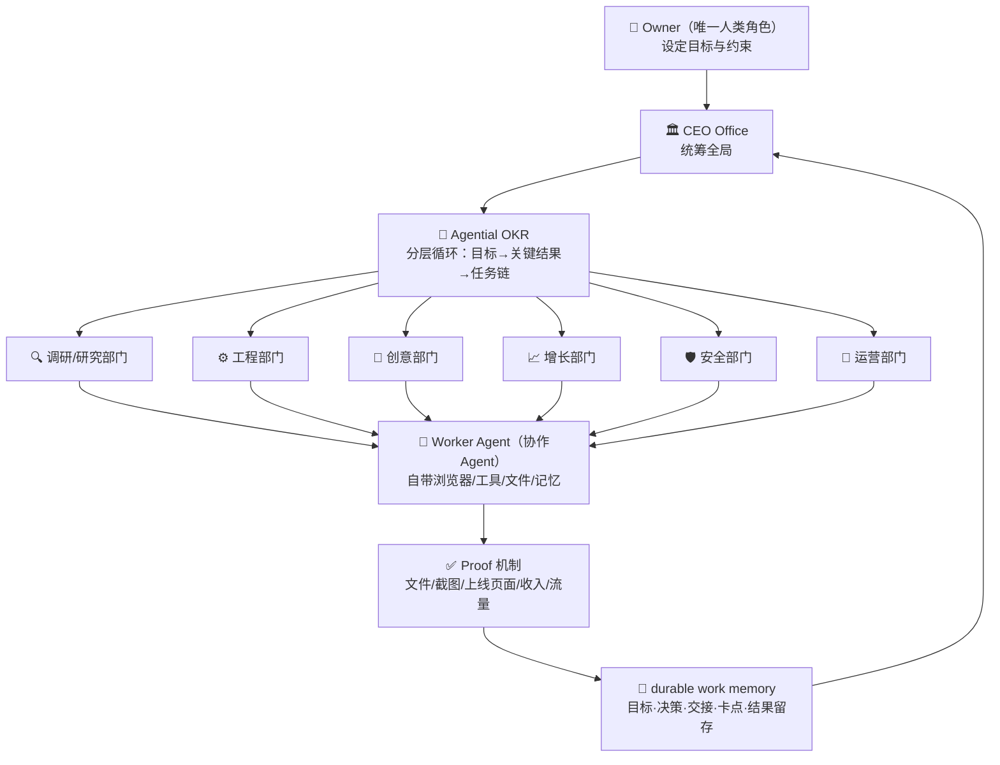

# Agent 公司架构：CEO Office、部门化与 Proof 机制

> 本章描述的架构机制经第三方工具站转录与博文交叉一致（F-040），是本 bundle 可信度最高的部分。

## 一、公司运营四要素的工程化

博文的核心洞察是：一家公司的运转说到底就是**分工、记忆、协作、反馈**四件事，Matrix 把它们全部工程化了（F-017/F-029，其中"四件事"框架为作者总结）：

## 二、分工：部门化与领队路由

- **CEO Office 统筹**：存在 CEO Office 级别的 Agent 统筹全局（F-010）
- **动态部门**：下设调研、工程、创意、增长、安全、运营等部门（博文口径，F-010）；第三方转录的部门列举为 Research/Product/Growth/Engineering（F-040）——两者不矛盾，官方描述为 Lead Agent **按需动态创建**部门，组织架构随目标自动扩展
- **领队路由**：每个部门有自己的领队 Agent，由领队判断是自己干还是派给协作 Agent 干（F-011）；第三方转录进一步区分 **Lead Agent（持久，带 durable memory）** 与 **Worker Agent（一次性，按任务分发）** 两层（F-040）

## 三、记忆：durable work memory

每个目标、决策、交接、卡点和结果都留存在公司里（F-014）。第三方转录补充了记忆的作用机制（F-040）：部门是 AI 上下文的天然边界，将各领域记忆隔开保护，防止多部门并跑时上下文互相污染；记忆系统让公司能在数周闲置后恢复工作而无需重新解释背景。

## 四、协作：统一文件系统与跨 Agent 通信

协作靠统一的文件系统和跨 Agent 通信实现（F-015）。底层是共享文件系统，实现跨部门的资产流转与交接（F-040）。

## 五、反馈：proof 机制（本架构的信任锚点）

每个 Agent 必须交付**可验证的结果**才算完成工作——文件、截图、上线的页面、收入或者流量（F-016）。第三方转录明确了该机制的反幻觉定位（F-040）：系统将"工作"视为未完成，直到 Agent 返回可验证的产物（verifiable artifacts：文件/测试/截图/转录），以此防止自主 Agent 常见的"幻觉式完成"（hallucinated completion）问题。

## 六、每个 Agent 的原生能力

每个 Agent 都有自己的浏览器、工具、文件和记忆（F-012），会自己拆任务、自己推进、自己处理卡点（F-013）。第三方转录补充：Agent 具备原生浏览器与桌面应用访问、web 工具，并按任务被授予特定 Skills（Search/Files/Browser/Code/Docs 或自定义工作流）。

## 七、商业基建与 VPTD 经济指标

**Agent Revenue 模块**：Stripe 收款、付费套餐、客户 intake 链路接通，从技术上可完成"收到钱"这个动作（F-024）。第三方转录补充完整商业基建清单（F-042）：

| 基建项 | 明细 |
|--------|------|
| 支付 | Stripe 收款、付费套餐 |
| 域名 | matrix deploy 部署、matrix.site 子域名 |
| 资金 | Agent 钱包 |
| 通信 | 邮件收发（Gmail 等）、Slack/Telegram |
| 开发 | GitHub、Vercel、Docker |
| 营销 | 广告账户 |
| 合规捷径 | 完全绕过实体注册与银行开户 |

**VPTD（Value per Token-Dollar）**：博文未提及的官方经济指标（F-042 核验补充）——衡量每 token 计算成本产出的业务价值，运行时按该复利分数优化 Agent 行为，而非仅看任务完成率。

## 与既有 Coding Agent 源码解读的对照

本组既有多个 Coding Agent 源码解读 bundle（openai-codex、nanobot、pi-cli 等）。Matrix 与它们的层级差异：Coding Agent 解决"单个 Agent 干活"，Matrix 解决"多 Agent 组成组织干活"——其 CEO Office/部门/OKR 编排与本组 hermes-agent 的 Gateway 多平台网关、veadk-python 的 Supervisor 组合模式属于不同抽象层（前者组织级，后者任务级）。

## 相关文档

- 产品定位：[00-product-overview](00-product-overview.md)
- 案例与证据边界：[02-case-evidence-boundary](02-case-evidence-boundary.md)
- 事实清单：[references/article-source](../references/article-source.md)
