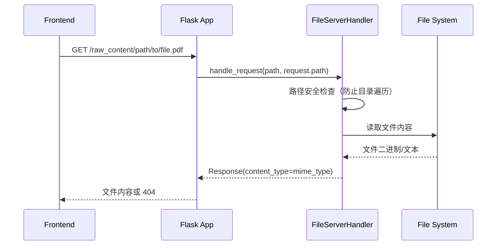
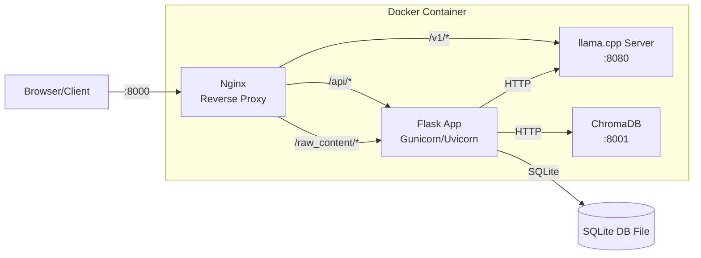

# Flask API 服务架构

## 概述

Second-Me 采用 Flask 框架构建后端 API 服务，采用**模块化 Blueprint 架构**，将 50+ API 路由按领域拆分为 13 个独立 Blueprint，实现了关注点分离和高内聚低耦合的设计目标。服务采用应用工厂模式创建，集成了 SQLite/ChromaDB 双数据库、CORS 跨域支持、静态文件服务、SSE 流式响应、后台训练线程等核心能力，为 Next.js 前端提供完整的 RESTful API 接口。

```mermaid
graph TB
    subgraph Client Layer
        FE[Next.js Frontend<br/>lpm_frontend/]
        EXT[External Clients<br/>MCP/API/Third-party]
    end

    subgraph Flask Application
        APP[Flask App Instance<br/>create_app()]
        CORS[CORS Middleware<br/>after_request]
        FS[File Server Handler<br/>/raw_content/*]
    end

    subgraph Blueprint Registry
        INIT[init_routes()<br/>api/__init__.py]
        HB[health_bp<br/>/health]
        DB[document_bp<br/>/api/documents/*]
        KB[kernel_bp<br/>/api/kernel/*]
        KB2[kernel2_bp<br/>/api/kernel2/*]
        LB[loads_bp<br/>/api/loads/*]
        MB[memories_bp<br/>/api/memories/*]
        RB[role_bp<br/>/api/roles/*]
        TB[trainprocess_bp<br/>/api/trainprocess/*]
        UB[upload_bp<br/>/api/upload/*]
        SB[space_bp<br/>/api/space/*]
        TKB[talk_bp<br/>/api/talk/*]
        ULCB[user_llm_config_bp<br/>/api/llm-config/*]
    end

    subgraph Service Layer
        DS[DocumentService<br/>L0 Processing]
        TPS[TrainProcessService<br/>Training Pipeline]
        CS[ChatService<br/>LLM Inference]
        SS[SpaceService<br/>Multi-Agent Discussion]
        US[UploadService<br/>Registry Client]
        LLM[LocalLLMService<br/>llama.cpp Server]
    end

    subgraph Persistence Layer
        SQLITE[(SQLite Database<br/>models/)]
        CHROMA[(ChromaDB<br/>Vector Store)]
        FSYS[File System<br/>resources/raw_content/]
    end

    FE -->|HTTP/JSON| APP
    EXT -->|HTTP/JSON| APP
    APP --> CORS
    APP --> FS
    APP --> INIT
    INIT --> HB & DB & KB & KB2 & LB & MB & RB & TB & UB & SB & TKB & ULCB
    DB --> DS
    TB --> TPS
    TKB --> CS
    SB --> SS
    UB --> US
    CS & TPS --> LLM
    DS & TPS & CS & SS --> SQLITE
    DS --> CHROMA
    FS --> FSYS
```

## 设计原理

### 应用工厂模式

API 服务采用 Flask 应用工厂模式（Application Factory Pattern），通过 `create_app()` 函数封装应用初始化逻辑，支持多实例创建和灵活的测试配置：

```python
# lpm_kernel/app.py
from flask import Flask, request
from .common.repository.database_session import DatabaseSession
from .api import init_routes
from .api.file_server.handler import FileServerHandler

def create_app():
    """Flask 应用工厂函数"""
    app = Flask(__name__)

    # 1. 初始化数据库连接
    DatabaseSession.initialize()

    # 2. 配置 CORS 跨域支持
    @app.after_request
    def after_request(response):
        response.headers.add("Access-Control-Allow-Origin", "*")
        response.headers.add("Access-Control-Allow-Headers", "Content-Type,Authorization")
        response.headers.add("Access-Control-Allow-Methods", "GET,PUT,POST,DELETE,OPTIONS")
        return response

    # 3. 配置静态文件服务
    file_handler = FileServerHandler(
        os.path.join(os.getenv("APP_ROOT", "/app"), "resources", "raw_content")
    )

    @app.route("/raw_content/", defaults={"path": ""})
    @app.route("/raw_content/<path:path>")
    def serve_content(path=""):
        return file_handler.handle_request(path, request.path)

    # 4. 注册所有 Blueprint 路由
    init_routes(app)

    return app

app = create_app()

if __name__ == "__main__":
    app.run(host="0.0.0.0", port=8000)
```

**关键设计决策**：
- **延迟初始化**：数据库连接在应用创建时初始化，避免模块导入时的副作用
- **CORS 全局配置**：通过 `after_request` 钩子统一处理跨域，开发环境允许所有来源
- **静态文件路由**：`/raw_content/` 路径直接映射到文件系统，绕过 Flask 静态文件机制以支持大文件
- **优雅关闭**：通过 `atexit` 注册清理函数，确保数据库连接正确关闭

### Blueprint 模块化注册

所有 API 路由通过 `init_routes()` 函数集中注册，每个业务领域对应一个独立 Blueprint：

```python
# lpm_kernel/api/__init__.py
from flask import Flask

def init_routes(app: Flask):
    """注册所有 API Blueprint 到 Flask 应用"""
    from .domains.health.routes import health_bp
    from .domains.documents.routes import document_bp
    from .domains.kernel.routes import kernel_bp
    from .domains.kernel2.routes_l2 import kernel2_bp
    from .domains.loads.routes import loads_bp
    from .domains.memories.routes import memories_bp
    from .domains.kernel2.routes.role_routes import role_bp
    from .domains.trainprocess.routes import trainprocess_bp
    from .domains.upload.routes import upload_bp
    from .domains.space.space_routes import space_bp
    from .domains.kernel2.routes_talk import talk_bp
    from .domains.user_llm_config.routes import user_llm_config_bp

    # 健康检查（无 url_prefix）
    app.register_blueprint(health_bp)

    # 文档管理
    app.register_blueprint(document_bp)

    # L1/L2 内核接口
    app.register_blueprint(kernel_bp)
    app.register_blueprint(kernel2_bp)

    # Load 实例管理
    app.register_blueprint(loads_bp)

    # 记忆检索
    app.register_blueprint(memories_bp)

    # 角色管理
    app.register_blueprint(role_bp)

    # 训练流水线
    app.register_blueprint(trainprocess_bp)

    # 上传/注册服务
    app.register_blueprint(upload_bp)

    # Space 多智能体讨论
    app.register_blueprint(space_bp)

    # 对话接口
    app.register_blueprint(talk_bp)

    # LLM 配置
    app.register_blueprint(user_llm_config_bp)
```

### Blueprint 路由矩阵

| Blueprint | URL 前缀 | 核心路由数 | 主要职责 |
|-----------|----------|------------|----------|
| `health_bp` | `/` | 2 | 服务健康检查、favicon |
| `document_bp` | `/api` | 10 | 文档扫描、分块、向量化、L0 数据查询 |
| `kernel_bp` | `/api/kernel` | 8 | L1 数据生成、Bio/Shade/Cluster 管理 |
| `kernel2_bp` | `/api/kernel2` | 6 | L2 模型管理、高级推理接口 |
| `loads_bp` | `/api` | 5 | Load 实例创建/查询/状态管理 |
| `memories_bp` | `/api/memories` | 4 | 记忆检索、相关记忆查询 |
| `role_bp` | `/api` | 7 | 角色 CRUD、角色提示词管理 |
| `trainprocess_bp` | `/api/trainprocess` | 7 | 训练启动/停止/进度/日志/重训 |
| `upload_bp` | `/` | 7 | 实例注册/连接/状态/WebSocket |
| `space_bp` | `/api/space` | 7 | Space 创建/讨论/分享/状态 |
| `talk_bp` | `/api/talk` | 5 | 对话聊天/流式响应/多轮对话 |
| `user_llm_config_bp` | `/api` | 4 | 用户 LLM 配置管理 |

## 统一响应格式

所有 API 端点采用统一的 JSON 响应格式，通过 `APIResponse` 工具类封装：

```python
# lpm_kernel/api/common/responses.py
from typing import Any
from dataclasses import dataclass

@dataclass
class APIResponse:
    """统一 API 响应封装"""

    @staticmethod
    def success(data: Any = None, message: str = "success") -> dict:
        """成功响应

        Args:
            data: 响应数据，任意可序列化类型
            message: 成功消息，默认 "success"

        Returns:
            {"code": 0, "message": "...", "data": ...}
        """
        return {"code": 0, "message": message, "data": data}

    @staticmethod
    def error(message: str, code: int = 1, data: Any = None) -> dict:
        """错误响应

        Args:
            message: 错误描述
            code: 错误码，0 表示成功，非 0 表示失败
            data: 附加错误数据

        Returns:
            {"code": N, "message": "...", "data": ...}
        """
        return {"code": code, "message": message, "data": data}
```

**响应规范**：
- 成功响应：`code=0`，`message="success"`，`data` 包含实际业务数据
- 客户端错误：`code=4xx`（如 400 参数错误、404 资源不存在、409 冲突）
- 服务端错误：`code=5xx`（如 500 内部错误、503 服务不可用）
- 业务错误：`code=1`（通用业务错误）

### 典型路由实现模式

每个路由遵循统一的错误处理模式：参数解析→业务调用→响应封装→异常捕获：

```python
# lpm_kernel/api/domains/documents/routes.py
from flask import Blueprint, jsonify, request
from flask_pydantic import validate
from lpm_kernel.api.common.responses import APIResponse

document_bp = Blueprint("documents", __name__, url_prefix="/api")

@document_bp.route("/documents/list", methods=["GET"])
def list_documents():
    """获取文档列表"""
    try:
        include_l0 = request.args.get("include_l0", "").lower() == "true"
        if include_l0:
            documents = document_service.list_documents_with_l0()
            return jsonify(APIResponse.success(data=documents))
        else:
            documents = document_service.list_documents()
            return jsonify(APIResponse.success(
                data=[doc.to_dict() for doc in documents]
            ))
    except Exception as e:
        logger.error(f"Error listing documents: {str(e)}", exc_info=True)
        return jsonify(APIResponse.error(message=f"Error listing documents: {str(e)}"))
```

## 核心 API 领域

### 文档管理 API（document_bp）

文档管理 API 负责 L0 原始记忆层的完整处理流水线，包括文件扫描、解析、分块、向量化：

| 路由 | 方法 | 功能 |
|------|------|------|
| `/api/documents/list` | GET | 获取文档列表（支持 include_l0 参数） |
| `/api/documents/scan` | POST | 扫描 `USER_RAW_CONTENT_DIR` 目录，导入新文档 |
| `/api/documents/analyze` | POST | 分析所有未处理文档（生成摘要/洞察） |
| `/api/documents/<id>/l0` | GET | 获取文档 L0 数据（chunks + embeddings） |
| `/api/documents/<id>/chunks` | GET | 获取文档分块列表 |
| `/api/documents/chunks/process` | POST | 批量处理所有文档的分块 |
| `/api/documents/<id>/chunk/embedding` | POST | 处理文档分块的向量嵌入 |
| `/api/documents/<id>/embedding` | POST | 处理文档级向量嵌入 |
| `/api/documents/verify-embeddings` | GET | 验证所有文档向量完整性 |
| `/api/documents/repair` | POST | 修复缺失分析和向量的文档 |

```python
@document_bp.route("/documents/scan", methods=["POST"])
@validate()
def scan_documents():
    """扫描文档目录并入库"""
    config = Config.from_env()
    relative_path = config.get("USER_RAW_CONTENT_DIR").lstrip("/")
    project_root = Path(__file__).parent.parent.parent.parent.parent
    full_path = project_root / relative_path

    processed_doc_dtos = document_service.scan_directory(
        directory_path=str(full_path), recursive=True
    )
    return jsonify(APIResponse.success(
        data=[doc_dto.dict() for doc_dto in processed_doc_dtos]
    ))
```

### 训练流水线 API（trainprocess_bp）

训练 API 管理完整的 L0→L1→L2 训练流水线，支持后台异步执行、实时日志流、进度查询：

| 路由 | 方法 | 功能 |
|------|------|------|
| `/api/trainprocess/start` | POST | 启动训练流程（后台线程） |
| `/api/trainprocess/logs` | GET | SSE 实时训练日志流 |
| `/api/trainprocess/progress/<model>` | GET | 获取训练进度（非实时） |
| `/api/trainprocess/progress/reset` | POST | 重置训练进度 |
| `/api/trainprocess/stop` | POST | 停止训练流程 |
| `/api/trainprocess/step_output_content` | GET | 获取指定步骤输出内容 |
| `/api/trainprocess/training_params` | GET | 获取最新训练参数 |
| `/api/trainprocess/retrain` | POST | 重置并重训 |

**后台训练与 SSE 日志流**：

```python
@trainprocess_bp.route("/start", methods=["POST"])
def start_process():
    """启动训练流程（后台线程执行）"""
    data = request.get_json()
    model_name = data["model_name"]

    train_service = TrainProcessService(current_model_name=model_name)

    # 后台线程执行训练，避免阻塞 HTTP 请求
    thread = Thread(target=train_service.start_process)
    thread.daemon = True
    thread.start()

    return jsonify(APIResponse.success(data={"model_name": model_name}))

@trainprocess_bp.route("/logs", methods=["GET"])
def stream_logs():
    """SSE 实时日志流（Server-Sent Events）"""
    def generate_logs():
        last_position = 0
        while True:
            with open("logs/train/train.log", "r", encoding="utf-8") as f:
                f.seek(last_position)
                for line in f.readlines():
                    if line.strip():
                        yield f"data: {line.strip()}\n\n"
                last_position = f.tell()
                if not new_lines:
                    yield f":heartbeat\n\n"  # SSE 心跳
            time.sleep(1)

    return Response(
        generate_logs(),
        mimetype="text/event-stream",
        headers={
            "Cache-Control": "no-cache, no-transform",
            "X-Accel-Buffering": "no",
            "Connection": "keep-alive",
        }
    )
```

### 对话 API（talk_bp）

对话 API 提供与个人 AI 的聊天接口，支持流式响应、多轮对话、知识增强：

| 路由 | 方法 | 功能 |
|------|------|------|
| `/api/talk/chat` | POST | 流式聊天（SSE） |
| `/api/talk/chat_json` | POST | JSON 模式聊天（非流式） |
| `/api/talk/advanced_chat` | POST | 高级聊天（多阶段处理） |

```python
@talk_bp.route("/chat", methods=["POST"])
@validate()
def chat(body: ChatRequest):
    """流式聊天接口

    ChatRequest 参数:
    - message: str, 用户消息
    - system_prompt: str, 系统提示词
    - role_id: str, 角色 UUID（可选）
    - history: List[ChatMessage], 对话历史
    - enable_l0_retrieval: bool, L0 知识检索（默认 true）
    - enable_l1_retrieval: bool, L1 知识检索（默认 true）
    - temperature: float, 温度参数（默认 0.01）
    - max_tokens: int, 最大生成 token（默认 2000）
    """
    status = local_llm_service.get_server_status()
    if not status.is_running:
        error_response = APIResponse.error("LLama server is not running")
        return local_llm_service.handle_stream_response(iter([{"error": error_response}]))

    response = chat_service.chat(request=body, stream=True, json_response=False)
    return local_llm_service.handle_stream_response(response)
```

### Space 多智能体 API（space_bp）

Space API 支持多智能体讨论空间的创建、管理和分享：

| 路由 | 方法 | 功能 |
|------|------|------|
| `/api/space/create` | POST | 创建 Space（主持人+参与者） |
| `/api/space/<id>` | GET | 获取 Space 信息 |
| `/api/space/all` | GET | 获取所有 Space 列表 |
| `/api/space/<id>` | DELETE | 删除 Space |
| `/api/space/<id>/start` | POST | 启动讨论 |
| `/api/space/<id>/status` | GET | 获取讨论状态 |
| `/api/space/<id>/share` | POST | 分享 Space 到远程注册中心 |

### 上传/注册 API（upload_bp）

上传 API 管理与 Second-Me 网络注册中心的交互，支持实例注册、WebSocket 连接、状态查询：

| 路由 | 方法 | 功能 |
|------|------|------|
| `/api/upload/register` | POST | 注册实例到网络 |
| `/api/upload/connect` | POST | 建立 WebSocket 连接 |
| `/api/upload/status` | GET | 获取实例连接状态 |
| `/api/upload` | GET | 列出已注册实例 |
| `/api/upload/count` | GET | 获取实例数量 |
| `/api/upload` | PUT | 更新实例信息 |
| `/api/upload` | DELETE | 注销实例 |

## 后台服务集成

### Local LLM 服务管理

API 服务集成了 llama.cpp 本地推理服务的生命周期管理：

```python
# lpm_kernel/api/services/local_llm_service.py
class LocalLLMService:
    """本地 LLM 服务管理器（单例模式）"""

    _instance = None

    def __new__(cls):
        if cls._instance is None:
            cls._instance = super().__new__(cls)
        return cls._instance

    def start_server(self, model_path: str, **kwargs) -> ServerStatus:
        """启动 llama.cpp HTTP 服务器"""
        ...

    def stop_server(self) -> bool:
        """停止 LLM 服务器"""
        ...

    def get_server_status(self) -> ServerStatus:
        """查询服务器状态（运行中/已停止/启动中）"""
        ...

    def handle_stream_response(self, response_iter: Iterator) -> Response:
        """将推理迭代器转换为 SSE 响应"""
        ...
```

### 文件服务处理器

`FileServerHandler` 提供静态文件访问能力，用于预览用户上传的原始文档：



## 请求验证与 DTO

API 使用 Pydantic 进行请求参数验证，通过 `flask_pydantic.validate()` 装饰器自动校验：

```python
# lpm_kernel/api/domains/space/space_dto.py
from pydantic import BaseModel, Field
from typing import List

class CreateSpaceDTO(BaseModel):
    """创建 Space 请求 DTO"""
    title: str = Field(..., min_length=1, max_length=200, description="Space 主题")
    objective: str = Field(..., min_length=1, description="讨论目标")
    host: str = Field(..., description="主持人端点")
    participants: List[str] = Field(default_factory=list, description="参与者端点列表")

# 使用示例
@space_bp.route('/create', methods=['POST'])
def create_space():
    try:
        body = CreateSpaceDTO(**request.get_json())
        space_dto = space_service.create_space(
            title=body.title,
            objective=body.objective,
            host=body.host,
            participants=body.participants
        )
        return APIResponse.success(space_dto.model_dump())
    except ValidationError as e:
        error_messages = [
            f"{'.'.join(str(loc) for loc in err['loc'])}: {err['msg']}"
            for err in e.errors()
        ]
        return APIResponse.error(message='; '.join(error_messages), code=400)
```

## 数据库会话管理

数据库会话采用单例模式和线程安全的上下文管理：

```python
# lpm_kernel/common/repository/database_session.py
from sqlalchemy import create_engine
from sqlalchemy.orm import sessionmaker, scoped_session

class DatabaseSession:
    """数据库会话管理器（单例）"""
    _instance = None
    _engine = None
    _session_factory = None

    @classmethod
    def initialize(cls, database_url: str = None):
        """初始化数据库连接引擎"""
        if cls._engine is None:
            cls._engine = create_engine(database_url or cls._get_default_url())
            cls._session_factory = scoped_session(
                sessionmaker(bind=cls._engine)
            )
            Base.metadata.create_all(cls._engine)

    @classmethod
    def session(cls):
        """获取当前线程的数据库会话"""
        return cls._session_factory()

    @classmethod
    def close(cls):
        """关闭所有会话和引擎"""
        if cls._session_factory:
            cls._session_factory.remove()
        if cls._engine:
            cls._engine.dispose()
```

## 错误处理策略

API 采用分层错误处理策略：

1. **路由层 try/except**：每个路由使用 try/except 捕获异常，返回标准化错误响应
2. **业务层异常**：Service 层抛出 `ValueError`/`Exception`，由路由层转换为 HTTP 错误
3. **参数验证错误**：Pydantic `ValidationError` 自动转换为 400 响应
4. **全局错误兜底**：Flask 错误处理器处理未捕获异常（未来可扩展）

```python
# 错误响应示例
{
    "code": 400,
    "message": "Missing required parameter: model_name",
    "data": null
}

{
    "code": 404,
    "message": "Space not found",
    "data": null
}

{
    "code": 500,
    "message": "Training process error: CUDA out of memory",
    "data": null
}
```

## 部署架构

API 服务在 Docker 容器中运行，通过 Gunicorn 或 Flask 开发服务器提供服务：



**关键端口**：
- `:8000`：Flask API 服务（对外暴露）
- `:8080`：llama.cpp 推理服务（内部）
- `:8001`：ChromaDB 向量数据库（内部）

## API 签名速查

```python
# 应用工厂
def create_app() -> Flask
def init_routes(app: Flask) -> None

# 响应封装
class APIResponse:
    @staticmethod
    def success(data: Any = None, message: str = "success") -> dict
    @staticmethod
    def error(message: str, code: int = 1, data: Any = None) -> dict

# 核心服务（单例模式）
class LocalLLMService:
    def start_server(self, model_path: str, **kwargs) -> ServerStatus
    def stop_server(self) -> bool
    def get_server_status(self) -> ServerStatus
    def chat_completion(self, **kwargs) -> Iterator[dict]

class TrainProcessService:
    def __new__(cls) -> TrainProcessService  # 单例
    def start_process(self) -> None
    def stop_process(self) -> None
    def get_progress(self) -> Progress
```

## 源码索引

| 文件 | 职责 |
|------|------|
| lpm_kernel/app.py | Flask 应用工厂、CORS、文件服务配置 |
| lpm_kernel/api/__init__.py | Blueprint 注册入口 |
| lpm_kernel/api/common/responses.py | 统一 API 响应格式 |
| lpm_kernel/api/domains/documents/routes.py | 文档管理路由 |
| lpm_kernel/api/domains/trainprocess/routes.py | 训练流水线路由 |
| lpm_kernel/api/domains/kernel2/routes_talk.py | 对话聊天路由 |
| lpm_kernel/api/domains/space/space_routes.py | Space 多智能体路由 |
| lpm_kernel/api/domains/upload/routes.py | 上传/注册路由 |
| lpm_kernel/api/services/local_llm_service.py | 本地 LLM 服务管理 |
| lpm_kernel/common/repository/database_session.py | 数据库会话管理 |
