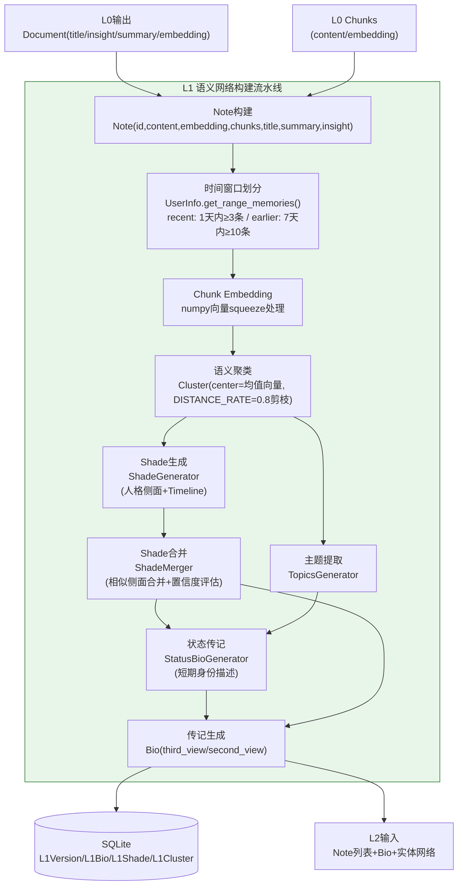

# L1语义网络层

L1 层是 Second-Me 三层记忆架构的**认知中枢**，负责将 L0 层产出的原始文档洞察转化为结构化的语义网络和身份认知。它对应认知科学中的"长期记忆/语义记忆"阶段——信息经过编码、组织、聚类和关联，形成关于"我是谁"的概念网络。

## L1层的核心职责

L1 层完成四项核心任务：

1. **笔记构建（Note Construction）**：将 L0 的 Document 转化为携带 embedding 的 Note 对象
2. **语义聚类（Clustering）**：基于 embedding 向量将相关记忆聚合为 Cluster，通过距离剪枝去除离群点
3. **人格侧面提取（Shade Generation）**：从聚类结果中提炼人格侧面（Shade），每个 Shade 代表用户的一个身份维度
4. **双视角传记生成（Biography Generation）**：生成第三人称（third_view）和第二人称（second_view）双视角的用户传记

## L1数据处理流水线



## 核心数据结构

L1 层定义了一套丰富的数据模型，形成了从原始记忆到人格认知的完整抽象链条：

```
Chunk → Note → Memory → Cluster → ShadeInfo(+ShadeTimeline) → Bio
```

### Chunk：文档分块

Chunk 是最小的语义单元，对应 L0 层产出的文档块，携带 embedding 向量：

```python
# lpm_kernel/L1/bio.py
class Chunk:
    def __init__(self, id: int, document_id: int, content: str,
                 embedding: Optional[Union[List[float], np.ndarray]] = None,
                 tags: Optional[List[str]] = None, topic: Optional[str] = None):
        self.id = id
        self.document_id = document_id
        self.content = content
        # embedding经过squeeze处理，确保是一维向量
        self.embedding = embedding.squeeze() if embedding is not None else None
        self.tags = tags
        self.topic = topic
```

### Note：记忆笔记

Note 是 L1 层的核心数据单元，将 L0 的 Document 及其 Chunks 聚合为一个带 embedding 的记忆对象：

```python
class Note:
    def __init__(self, noteId: int = None, content: str = "",
                 createTime: str = "", memoryType: str = "",
                 embedding: Optional[Union[List[float], np.ndarray]] = None,
                 chunks: List[Chunk] = None, title: str = "",
                 summary: str = "", insight: str = "",
                 tags: List[str] = None, topic: str = None):
        self.id = noteId
        self.content = content
        self.create_time = createTime
        self.memory_type = memoryType  # TEXT/MARKDOWN/PDF/LINK
        self.embedding = embedding.squeeze() if embedding is not None else None
        self.chunks = chunks or []
        self.title = title
        self.summary = summary
        self.insight = insight
        self.tags = tags
        self.topic = topic
```

Note 提供了多种序列化方法，支持不同分析场景的格式输出：

| 方法 | 用途 | 输出格式 |
|------|------|---------|
| `__str__()` | 通用字符串表示 | ID/Title/Date/Type + Summary/Insight/Content |
| `to_str(analysis_type)` | 按分析类型分发 | SUBJECT→`to_subject_str()`, OBJECT→`to_object_str()` |
| `to_subject_str()` | 主观记忆格式（TEXT/MARKDOWN/PDF） | 含Doc Summary和Doc Insight段落 |
| `to_object_str()` | 客观记忆格式（LINK） | 含Read Time、Meta Type，侧重Summary |
| `to_json()` | JSON序列化 | 含processed字段（L2数据合成用） |

主观记忆与客观记忆的区分：

```python
# 主观记忆类型：表达用户观点/偏好/经历的内容
SUBJECT_NOTE_TYPE = [MemoryType.TEXT, MemoryType.MARKDOWN, MemoryType.PDF]
# 客观记忆类型：用户消费/收藏的外部链接
OBJECT_NOTE_TYPE = [MemoryType.LINK]
```

### Memory：记忆向量

Memory 是聚类的最小单位，仅包含 ID 和 embedding：

```python
class Memory:
    def __init__(self, memoryId: int, embedding: List[float] = None):
        self.memory_id = memoryId
        self.embedding = np.array(embedding).squeeze() if embedding is not None else None

    def to_json(self):
        return {"memoryId": self.memory_id}
```

### Cluster：记忆簇

Cluster 将语义相近的 Memory 聚合为簇，维护簇中心向量并支持离群点剪枝：

```python
class Cluster:
    def __init__(self, clusterId: int, memoryList: List[Memory] = [],
                 centerEmbedding: List[float] = None, is_new=False):
        self.cluster_id = clusterId
        self.memory_list = [Memory(**m) if isinstance(m, dict) else m for m in memoryList]
        self.is_new = is_new
        self.size = len(self.memory_list)
        # 簇中心为所有memory embedding的均值
        self.cluster_center = np.array(centerEmbedding) if centerEmbedding else np.zeros(DEFAULT_EMBEDDING_DIM)
        self.merge_list = []

    def get_cluster_center(self):
        """计算簇中心：所有memory embedding的均值向量"""
        if not self.memory_list:
            self.cluster_center = np.zeros(DEFAULT_EMBEDDING_DIM)
        else:
            self.cluster_center = np.mean(
                [memory.embedding for memory in self.memory_list], axis=0
            )

    def prune_outliers_from_cluster(self):
        """离群点剪枝：保留距离中心最近的 DISTANCE_RATE 比例的记忆"""
        # 按到中心的距离排序
        memory_list = sorted(
            self.memory_list,
            key=lambda x: np.linalg.norm(x.embedding - self.cluster_center),
        )
        # DISTANCE_RATE = 0.8，保留最接近中心的80%
        memory_list = memory_list[:max(int(self.size * DISTANCE_RATE), 1)]
        self.memory_list = memory_list
        self.size = len(memory_list)
        self.get_cluster_center()  # 重新计算中心

    def add_memory(self, memory: Memory):
        """添加记忆并更新簇中心"""
        self.memory_list.append(memory)
        self.size += 1
        self.get_cluster_center()
```

**关键常量**：
- `DEFAULT_EMBEDDING_DIM = 1536`：默认embedding维度（对应OpenAI ada-002）
- `DISTANCE_RATE = 0.8`：离群剪枝保留率，保留最接近中心的80%记忆

### ShadeInfo：人格侧面

Shade（人格侧面）是 L1 层最重要的抽象概念，代表用户身份的一个维度（如"技术爱好者"、"美食探索者"）。每个 Shade 包含双视角描述和时间线：

```python
class ConfidenceLevel(str, Enum):
    VERY_LOW = "VERY LOW"
    LOW = "LOW"
    MEDIUM = "MEDIUM"
    HIGH = "HIGH"
    VERY_HIGH = "VERY HIGH"

class ShadeTimeline:
    """Shade的时间线条目，关联到具体的记忆引用"""
    def __init__(self, refMemoryId: int = None, createTime: str = "",
                 descSecondView: str = "", descThirdView: str = "", is_new: bool = False):
        self.ref_memory_id = refMemoryId
        self.create_time = createTime
        self.desc_second_view = descSecondView  # 第二视角描述
        self.desc_third_view = descThirdView    # 第三视角描述

class ShadeInfo:
    def __init__(self, id: int = None, name: str = "", aspect: str = "", icon: str = "",
                 descThirdView: str = "", contentThirdView: str = "",
                 descSecondView: str = "", contentSecondView: str = "",
                 timelines: List[Dict] = [], confidenceLevel: str = None):
        self.id = id
        self.name = name            # 侧面名称，如"技术爱好者"
        self.aspect = aspect        # 所属维度
        self.icon = icon            # 图标标识
        self.desc_third_view = descThirdView    # 第三人称描述
        self.content_third_view = contentThirdView
        self.desc_second_view = descSecondView  # 第二人称描述
        self.content_second_view = contentSecondView
        self.confidence_level = ConfidenceLevel(confidenceLevel) if confidenceLevel else None
        self.timelines = [ShadeTimeline(**t) for t in timelines]

    def imporve_shade_info(self, improveDesc, improveContent, improveTimelines):
        """更新third_view描述和时间线"""
        self.desc_third_view = improveDesc
        self.content_third_view = improveContent
        self.timelines.extend([ShadeTimeline.from_raw_format(t) for t in improveTimelines])

    def add_second_view(self, domainDesc, domainContent, domainTimeline):
        """补充second_view描述（第二人称视角）"""
        self.desc_second_view = domainDesc
        self.content_second_view = domainContent
        # 为已有的timeline条目补充second_view描述
        for timeline in domainTimeline:
            ref_id = timeline.get("refMemoryId")
            # 更新对应timeline的second_view
```

**双视角设计**是 Second-Me 的一个创新：
- **Third View（第三人称视角）**：以旁观者角度描述用户（"他是一个热爱技术的人"）
- **Second View（第二人称视角）**：以"你"的角度描述（"你对新技术充满热情"），用于AI对话中的身份注入

### AttributeInfo：属性标签

```python
class AttributeInfo:
    def __init__(self, id: int = None, name: str = "", description: str = "",
                 confidenceLevel: Optional[Union[str, ConfidenceLevel]] = None):
        self.id = id
        self.name = name              # 属性名
        self.description = description # 属性描述
        self.confidence_level = ConfidenceLevel(confidenceLevel) if isinstance(confidenceLevel, str) else confidenceLevel
```

### Bio：用户传记

Bio 是 L1 层的最终输出，聚合了用户的属性列表、人格侧面和双视角传记内容：

```python
class Bio:
    def __init__(self, contentThirdView: str = "", content: str = "",
                 summaryThirdView: str = "", summary: str = "",
                 attributeList: List[Dict] = [], shadesList: List[Dict] = []):
        self.content_third_view = contentThirdView
        self.content_second_view = content
        self.summary_third_view = summaryThirdView
        self.summary_second_view = summary
        # 属性列表按置信度降序排列
        self.attribute_list = sorted(
            [AttributeInfo(**a) for a in attributeList],
            key=lambda x: CONFIDENCE_LEVELS_INT[x.confidence_level], reverse=True
        )
        # 人格侧面按时间线条目数降序排列（证据越多越靠前）
        self.shades_list = sorted(
            [ShadeInfo(**s) for s in shadesList],
            key=lambda x: len(x.timelines), reverse=True
        )

    def complete_content(self, second_view: bool = False) -> str:
        """生成综合报告：兴趣偏好 + 结论"""
        interests = "\n### User's Interests and Preferences ###\n" + \
                    "\n".join([shade._preview_(second_view) for shade in self.shades_list])
        conclusion = "\n### Conclusion ###\n" + \
                    (self.summary_second_view if second_view else self.summary_third_view)
        return f"## Comprehensive Analysis Report ##\n{interests}\n{conclusion}"

    def is_raw_bio(self) -> bool:
        """判断是否为初始空传记"""
        return not self.content_third_view and not self.summary_third_view
```

### UserInfo：用户信息聚合

UserInfo 负责聚合用户的所有记忆数据，并按时间窗口划分近期和早期记忆：

```python
class TimeType(str, Enum):
    RECENT = "recent"
    EARLIER = "earlier"

# 时间窗口配置
MIN_MEMORIES_N = {TimeType.RECENT: 3, TimeType.EARLIER: 10}  # 最少记忆条数
TIME_RANGE = {TimeType.RECENT: 60*60*24*1, TimeType.EARLIER: 60*60*24*7}  # 1天/7天
TAG_TYPE = {TimeType.RECENT: {"time": "Today", "default": "Recent"},
            TimeType.EARLIER: {"time": "Earlier", "default": "Earlier"}}

class UserInfo:
    def __init__(self, notes: List[Note], todos: List[Todo], chats: List[Chat]):
        # 所有记忆按创建时间降序排列
        self.memories = sorted(
            notes + todos + chats, key=lambda x: x.create_time, reverse=True
        )
        self.recent_memories: List[Note] = []
        self.earlier_memories: List[Note] = []

    def get_range_memories(self, time_type: TimeType) -> List[Note]:
        """按时间窗口划分记忆：recent(1天内≥3条) / earlier(7天内≥10条)"""
        now = datetime.now()
        time_range = TIME_RANGE[time_type]
        min_memories = MIN_MEMORIES_N[time_type]
        result = []
        for memory in self.memories:
            memory_time = datetime.strptime(memory.create_time, TIME_FORMAT)
            if (now - memory_time).total_seconds() <= time_range:
                result.append(memory)
            if len(result) >= min_memories:
                break
        return result
```

## L1Generator：主生成器

L1Generator 是 L1 层的主编排器，组合四个子生成器完成身份洞察：

```python
# lpm_kernel/L1/l1_generator.py
class L1Generator:
    def __init__(self, preferred_language: str = "English"):
        self.preferred_language = preferred_language
        # 四个子生成器
        self.shade_generator = ShadeGenerator(preferred_language)
        self.shade_merger = ShadeMerger(preferred_language)
        self.status_bio_generator = StatusBioGenerator(preferred_language)
        self.topics_generator = TopicsGenerator(preferred_language)

    # 核心方法：从Note列表生成Bio/Shades/Clusters
    def generate(self, notes: List[Note], bio_info: BioInfo) -> tuple[Bio, List[ShadeInfo], List[Cluster]]:
        """
        1. 构建UserInfo，划分时间窗口
        2. 使用ShadeGenerator生成Shade候选
        3. 使用ShadeMerger合并相似Shade
        4. 使用TopicsGenerator提取主题
        5. 使用StatusBioGenerator生成状态传记
        6. 组装Bio对象
        """
        ...
```

| 子生成器 | 职责 |
|---------|------|
| `ShadeGenerator` | 从Cluster中提取人格侧面，生成ShadeInfo候选列表 |
| `ShadeMerger` | 合并相似的Shade，评估置信度，去重 |
| `StatusBioGenerator` | 生成短期身份描述（status_bio），反映近期状态 |
| `TopicsGenerator` | 从记忆中提取主题标签(tags/topic)，用于聚类标注 |

## L1 ORM持久化模型

L1 层的输出通过版本化的 ORM 模型存储到 SQLite，支持多版本管理：

```python
# lpm_kernel/models/l1.py
class L1Version(Base):
    """L1版本表，每次重新生成L1创建新版本"""
    __tablename__ = "l1_versions"
    version = Column(Integer, primary_key=True, autoincrement=True)
    create_time = Column(DateTime, default=datetime.now)
    status = Column(String(50))
    description = Column(Text)

class L1Bio(Base):
    """L1传记表"""
    __tablename__ = "l1_bios"
    id = Column(Integer, primary_key=True)
    version = Column(Integer, ForeignKey("l1_versions.version"))
    content = Column(Text)              # second_view content
    content_third_view = Column(Text)   # third_view content
    summary = Column(Text)
    summary_third_view = Column(Text)

class L1Shade(Base):
    """L1人格侧面表"""
    __tablename__ = "l1_shades"
    id = Column(Integer, primary_key=True)
    version = Column(Integer, ForeignKey("l1_versions.version"))
    name = Column(String(255))
    aspect = Column(String(255))
    icon = Column(String(100))
    desc_second_view = Column(Text)
    desc_third_view = Column(Text)
    content_second_view = Column(Text)
    content_third_view = Column(Text)

class L1Cluster(Base):
    """L1聚类结果表"""
    __tablename__ = "l1_clusters"
    id = Column(Integer, primary_key=True)
    version = Column(Integer, ForeignKey("l1_versions.version"))
    cluster_id = Column(Integer)
    memory_ids = Column(JSON)        # 记忆ID列表
    cluster_center = Column(JSON)    # 簇中心向量(JSON数组)

class L1ChunkTopic(Base):
    """L1块主题表"""
    __tablename__ = "l1_chunk_topics"
    id = Column(Integer, primary_key=True)
    version = Column(Integer, ForeignKey("l1_versions.version"))
    chunk_id = Column(BigInteger)
    topic = Column(String(255))
    tags = Column(JSON)
```

## L1在推理时的作用：Shade检索

推理阶段，L1 的 Shade 信息通过 `default_l1_retriever` 进行检索，作为 KnowledgeEnhancedStrategy 的知识源之一注入到 system prompt 中：

```python
# 当enable_l1_retrieval=True时
if enable_l1_retrieval:
    l1_knowledge = default_l1_retriever.retrieve(user_message)
    if l1_knowledge:
        knowledge_sections.append(f"Reference shades:\n{l1_knowledge}")
```

L1 检索返回与用户查询最相关的人格侧面描述，让 AI 在对话时能够表现出与用户身份一致的特征。

## L1在训练流水线中的位置

在14步训练流水线中，L1 对应第7步：

| 步骤 | ProcessStep | 操作 |
|------|------------|------|
| 7 | `GENERATE_BIOGRAPHY` | `generate_biography()` → `generate_l1_from_l0()` → L1Generator 生成 Bio/Shades/Clusters |

L1 生成完成后，Bio 和 Note 列表作为 L2 数据合成的输入，GraphRAG 在 L1 的 Note 基础上构建实体网络。

## 关键文件索引

| 文件 | 职责 |
|------|------|
| lpm_kernel/L1/bio.py | 核心数据结构：Chunk/Note/Cluster/ShadeInfo/Bio/UserInfo，786行 |
| lpm_kernel/L1/l1_generator.py | L1主生成器，组合四子生成器 |
| lpm_kernel/L1/shade_generator.py | 人格侧面生成器 |
| lpm_kernel/L1/shade_merger.py | 人格侧面合并器 |
| lpm_kernel/L1/status_bio_generator.py | 状态传记生成器 |
| lpm_kernel/L1/topics_generator.py | 主题提取生成器 |
| lpm_kernel/L1/prompt.py | L1层prompt模板集合 |
| lpm_kernel/models/l1.py | L1 ORM模型：Version/Bio/Shade/Cluster/ChunkTopic |
| lpm_kernel/kernel/l1/l1_manager.py | L1版本管理与持久化 |

## 相关概念

- [三层记忆HMM架构](three-layer-memory-hmm.md) — L1在三层架构中的中枢定位
- [L0原始记忆层](l0-raw-memory.md) — L0输出作为L1输入的数据流
- [L2推理模型层](l2-inference-model.md) — L1输出作为L2数据合成的基础
- [训练流水线](training-pipeline.md) — GENERATE_BIOGRAPHY步骤
