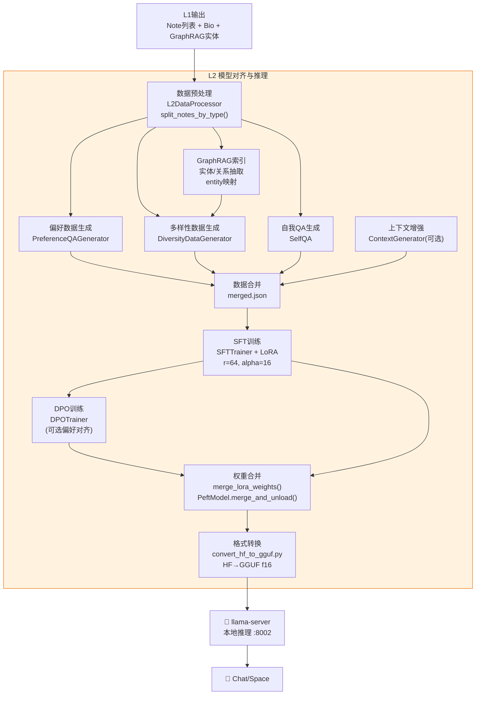

# L2推理模型层

L2 层是 Second-Me 三层记忆架构的**行为内化层**，负责将 L0/L1 层提炼的语义认知通过模型微调内化为神经网络权重，使 AI 的推理行为本身带有个人特征。它对应认知科学中的"程序记忆/内隐记忆"——知识不再以外挂检索的形式存在，而是融入了模型的"思维方式"。

## L2层的核心职责

L2 层完成五项核心任务：

1. **数据合成**：从 L1 的 Note 和 Bio 生成四类训练数据（偏好QA、多样性、自我QA、上下文增强）
2. **SFT 监督微调**：使用 LoRA（Low-Rank Adaptation）技术对基础模型进行监督微调
3. **DPO 偏好对齐**：Direct Preference Optimization 进一步对齐模型输出偏好
4. **权重合并**：将 LoRA 适配器合并到基础模型，生成独立的 merged_model
5. **格式转换与部署**：HF 模型转换为 GGUF 格式（f16量化），供 llama.cpp 推理服务加载

## L2模型训练与部署流水线



## L2Generator：数据编排器

`L2Generator` 是 L2 层的数据编排入口，负责协调数据预处理和主观数据生成：

```python
# lpm_kernel/L2/l2_generator.py
class L2Generator:
    def __init__(self, data_path: str = "../raw_data",
                 preferred_lang: str = "English", is_cot: bool = True):
        self.data_path = data_path
        self.data_processor = L2DataProcessor(data_path, preferred_lang)
        self.preferred_lang = preferred_lang
        self.is_cot = bool(is_cot) if isinstance(is_cot, str) else is_cot

    def data_preprocess(self, note_list: List[Note], basic_info: Dict):
        """数据预处理：分类笔记 + GraphRAG索引"""
        self.data_processor(note_list, basic_info)

    def gen_subjective_data(self, note_list, basic_info, data_output_base_dir,
                            topics_path, entities_path, graph_path, config_path):
        """生成四类主观训练数据并合并"""
        # 偏好数据
        self.data_processor._gen_preference_data(topics_path, "preference.json", basic_info["globalBio"])
        # 多样性数据
        self.data_processor._gen_diversity_data(entities_path, note_list, graph_path, ...)
        # 自我QA数据
        self.data_processor._gen_selfqa_data("selfqa.json", user_name, user_intro, global_bio)
        # 合并为merged.json
        self.merge_json_files(data_output_base_dir)
```

## L2DataProcessor：数据处理器

`L2DataProcessor` 是数据处理的核心实现，负责笔记分类、数据精炼和GraphRAG索引：

### 笔记分类

```python
# lpm_kernel/L2/data.py
class L2DataProcessor:
    def __call__(self, note_list: List[Note], basic_info: Dict):
        # 1. 按类型分为主观记忆和客观记忆
        user_info, subjective_notes, objective_notes = self.split_notes_by_type(note_list, basic_info)

        # 2. 精炼两类笔记数据
        subjective_remade = self.refine_notes_data_subjective(subjective_notes, user_info, ...)
        objective_remade = self.refine_notes_data_objective(objective_notes, user_info, ...)

        # 3. 转为txt文件供GraphRAG索引
        self.json_to_txt_each(subjective_remade, ...)
        self.json_to_txt_each(objective_remade, ...)

        # 4. GraphRAG实体关系抽取
        self.graphrag_indexing(subjective_remade, ...)
        self.graphrag_indexing(objective_remade, ...)

    def split_notes_by_type(self, note_list, basic_info):
        """将笔记分为主观(TEXT/MARKDOWN/PDF)和客观(LINK)两类"""
        user_info = {"username": basic_info["username"], "aboutMe": ..., "globalBio": ...}
        subjective_notes = [n for n in note_list if n.memory_type in SUBJECT_NOTE_TYPE]
        objective_notes = [n for n in note_list if n.memory_type in OBJECT_NOTE_TYPE]
        return user_info, subjective_notes, objective_notes
```

### 四类训练数据生成器

| 生成器 | 输出文件 | 作用 | 数据格式 |
|--------|---------|------|---------|
| `PreferenceQAGenerator` | `preference.json` | 基于主题聚类生成偏好问答对，学习用户偏好 | `{conversations: [{role, content}]}` |
| `DiversityDataGenerator` | `diversity.json` | 基于实体图谱生成多样性对话数据 | 对话格式 |
| `SelfQA` | `selfqa.json` | 自我提问自我回答，强化身份一致性 | QA对 |
| `ContextGenerator` | `context_merged.json` | 上下文增强对话（可选） | 多轮对话+反馈 |

四类数据最终合并为 `merged.json` 作为 SFT 训练的输入。

## SFT训练：LoRA微调

SFT（Supervised Fine-Tuning）使用 HuggingFace TRL 库的 `SFTTrainer`，通过 PEFT 的 LoRA 技术进行参数高效微调。

### LoRA默认参数

```python
# lpm_kernel/L2/train.py
@dataclass
class ModelArguments:
    model_name_or_path: str           # 基础模型路径
    lora_alpha: Optional[int] = field(default=16)    # LoRA alpha参数
    lora_dropout: Optional[float] = field(default=0.1) # LoRA dropout
    lora_r: Optional[int] = field(default=64)         # LoRA秩(r)
    lora_target_modules: Optional[str] = field(
        default="q_proj,k_proj,v_proj,o_proj,down_proj,up_proj,gate_proj",
    )  # 目标模块：注意力的Q/K/V/O投影 + MLP的gate/up/down投影
    use_flash_attn: Optional[bool] = field(default=False)
    use_4bit_quantization: Optional[bool] = field(default=False)
    use_8bit_quantization: Optional[bool] = field(default=False)
    use_cuda: Optional[bool] = field(default=False)
```

**LoRA参数选择原理**：
- **r=64**：LoRA秩，64是一个较大的值，允许更充分的个性化适配（常规微调r=8~64）
- **alpha=16**：缩放因子，实际缩放为 alpha/r = 16/64 = 0.25，防止LoRA更新过大破坏基础能力
- **target_modules**：覆盖注意力层（q/k/v/o_proj）和FFN层（gate/up/down_proj）共7个线性层，实现全模型适配
- **dropout=0.1**：防止过拟合

### 训练主流程

```python
# lpm_kernel/L2/train.py
def main(model_args, data_args, training_args):
    # 1. 内存优化与环境准备
    memory_manager = get_memory_manager()
    memory_manager.cleanup_memory(force=True)
    set_seed(training_args.seed)

    # 2. 低显存自动优化（<16GB VRAM时启用optimizer offload到CPU）
    vram_total = memory_manager.get_memory_info().get("vram_total_gb", 0)
    if vram_total < 16:
        training_args.accelerate_config = {"offload_optimizer_device": "cpu", ...}

    # 3. 加载模型（支持4bit/8bit量化）
    model, peft_config, tokenizer = create_and_prepare_model(model_args, data_args, training_args, model_kwargs)

    # 4. 梯度检查点（节省显存）
    if training_args.gradient_checkpointing:
        model.gradient_checkpointing_enable()

    # 5. 构建训练数据集
    train_dataset = create_chat_data(data_args, tokenizer)

    # 6. 数据整理器（仅对assistant回复计算loss）
    response_template = "\n<|im_start|>assistant\n"
    collator = DataCollatorForCompletionOnlyLM(response_template, tokenizer=tokenizer)

    # 7. 创建SFT Trainer
    trainer = SFTTrainer(
        model=model,
        tokenizer=tokenizer,
        args=training_args,
        train_dataset=train_dataset,
        peft_config=peft_config,         # LoRA配置
        formatting_func=formatting_prompts_func,
        data_collator=collator,
    )

    # 8. 添加回调
    trainer.add_callback(DebugCallback())       # 每10步记录训练时间
    trainer.add_callback(MemoryMonitorCallback()) # 每5步检查VRAM

    # 9. 训练
    trainer.train(resume_from_checkpoint=checkpoint)

    # 10. 保存LoRA适配器
    trainer.save_model()
```

### 训练优化策略

训练脚本实现了多层内存优化策略：

| 优化策略 | 触发条件 | 效果 |
|---------|---------|------|
| 4bit/8bit量化 | `use_4bit/8bit_quantization=True` | 大幅减少模型加载显存 |
| Flash Attention 2 | `use_flash_attn=True` + CUDA | 减少注意力计算显存 |
| Gradient Checkpointing | 默认启用 | 以计算换显存，减少激活存储 |
| Optimizer CPU Offload | VRAM < 16GB | 优化器状态卸载到CPU |
| DeepSpeed ZeRO-3 | 元张量检测 | 参数/优化器分片到CPU |
| 内存监控回调 | 每5步检查 | VRAM > 90%时自动清理缓存 |

### 自定义Callback

```python
class DebugCallback(transformers.TrainerCallback):
    """训练进度监控回调"""
    def on_step_end(self, args, state, control, **kwargs):
        if state.global_step % 10 == 0:
            step_time = time.time() - self.last_time
            self.total_time += step_time
            logger.info(f"Step {state.global_step}: {step_time:.2f}s - Total: {self.total_time:.2f}s")

    def on_epoch_end(self, args, state, control, **kwargs):
        logger.info(f"Epoch {state.epoch} completed")

class LogTqdm(tqdm):
    """自定义tqdm输出适配日志系统"""
    def __init__(self, *args, **kwargs):
        kwargs.setdefault("mininterval", 1.0)
        kwargs.setdefault("ascii", True)
        super().__init__(*args, **kwargs)
```

## DPO训练：偏好对齐

DPO（Direct Preference Optimization）是SFT之后的可选偏好对齐步骤，使用TRL库的`DPOTrainer`：

```python
# lpm_kernel/L2/dpo/dpo_train.py
def training_data_processor(args, SYS="You are a helpful assistant.\n\n"):
    """处理DPO训练数据格式"""
    with open(args.training_data_path, "r", encoding="utf-8") as f:
        data = json.load(f)
    training_data = {
        "prompt": [
            [
                {"role": "system", "content": d['prompt']['system']},
                {"role": "user", "content": d['prompt']['user']}
            ] for d in data
        ],
        "chosen": [d["chosen"] for d in data],     # 偏好回答
        "rejected": [d["rejected"] for d in data],  # 不偏好回答
    }
    tokenizer = AutoTokenizer.from_pretrained(args.base_model_path, padding_side="left")
    training_data["prompt"] = tokenizer.apply_chat_template(training_data["prompt"], tokenize=False)
    return training_data

def train(args):
    tokenizer = AutoTokenizer.from_pretrained(args.base_model_path, padding_side="left")
    model = AutoModelForCausalLM.from_pretrained(args.base_model_path, ...)

    dataset = Dataset.from_dict(training_data_processor(args))

    # LoRA配置（lora_r=0时禁用LoRA，全参数DPO）
    lora_config = None if args.lora_r == 0 else LoraConfig(
        r=args.lora_r, lora_alpha=args.lora_alpha,
        lora_dropout=args.lora_dropout, bias="none",
        target_modules="all-linear", task_type="CAUSAL_LM",
    )

    training_args = DPOConfig(
        num_train_epochs=args.num_train_epochs,
        learning_rate=args.learning_rate,
        lr_scheduler_type="cosine",       # 余弦学习率调度
        loss_type="sigmoid",               # Sigmoid DPO loss
        beta=args.beta,                    # DPO温度参数(默认0.1)
        max_prompt_length=1024,
        max_length=args.max_length,
        gradient_checkpointing=True,
        ...
    )

    dpo_trainer = DPOTrainer(model, tokenizer=tokenizer, args=training_args,
                              train_dataset=dataset, peft_config=lora_config)
    dpo_trainer.train()
    dpo_trainer.save_model()
```

**DPO数据格式**：
```json
[
  {
    "prompt": {"system": "...", "user": "..."},
    "chosen": "偏好的回答",
    "rejected": "不偏好的回答"
  }
]
```

## 权重合并：LoRA→完整模型

训练产出的 LoRA 适配器需要合并到基础模型才能用于推理。`merge_lora_weights()` 函数处理这一过程：

```python
# lpm_kernel/L2/merge_lora_weights.py
def merge_lora_weights(base_model_path, lora_adapter_path, output_model_path):
    """将LoRA适配器合并到基础模型"""
    memory_manager = get_memory_manager()
    use_cuda = memory_manager.cuda_available
    device = "cuda" if use_cuda else "cpu"

    # 根据硬件选择精度和设备映射
    device_map = "auto" if use_cuda else None
    dtype = torch.float16 if use_cuda else torch.float32

    # 1. 加载基础模型
    base_model = AutoModelForCausalLM.from_pretrained(
        base_model_path, torch_dtype=dtype, device_map=device_map
    )
    tokenizer = AutoTokenizer.from_pretrained(base_model_path)

    # 2. 加载LoRA适配器
    lora_model = PeftModel.from_pretrained(base_model, lora_adapter_path)

    # 3. 合并权重（核心操作）
    merged_model = lora_model.merge_and_unload()

    # 4. 分片保存（每片最大2GB，避免OOM）
    merged_model.save_pretrained(
        output_model_path,
        safe_serialization=True,
        max_shard_size="2GB"
    )
    tokenizer.save_pretrained(output_model_path)
```

合并过程的关键是 `merge_and_unload()`：它将LoRA的低秩增量矩阵 W = W₀ + BA 合并到基础权重中，产出一个可以独立运行的完整模型。

## GGUF转换与llama.cpp部署

合并后的HF模型需要转换为GGUF格式才能由llama.cpp推理引擎加载：

```python
# lpm_kernel/L2/convert_hf_to_gguf.py
# 将HuggingFace模型转换为GGUF f16格式
# 通过shell脚本执行：
# bash convert_model_to_gguf.sh {merged_model_path} {gguf_output_path}
```

GGUF（GPT-Generated Unified Format）是llama.cpp团队定义的模型格式，具有以下优势：
- **单文件分发**：模型权重和元数据打包在一个`.gguf`文件中
- **量化支持**：支持f16/Q8_0/Q5_K_M/Q4_K_M等多种量化级别
- **mmap加载**：支持内存映射快速加载
- **跨平台**：CPU/GPU/Apple Silicon统一格式

### 推理服务：LocalLLMService

训练完成的GGUF模型通过 `LocalLLMService` 管理 llama-server 进程：

```python
# lpm_kernel/api/services/local_llm_service.py
class LocalLLMService:
    """管理本地llama-server进程的生命周期"""
    def start(self, model_name, use_gpu=False):
        """启动llama-server进程"""
        # 构建llama-server命令，加载GGUF模型
        # 默认监听localhost:8080，提供OpenAI兼容API
    def stop(self):
        """停止llama-server进程"""
    def get_status(self):
        """检查服务健康状态"""
    def health_check(self):
        """返回pid/CPU/内存/运行时间"""
```

llama-server 提供OpenAI兼容的 `/v1/chat/completions` 接口，`ChatService` 通过HTTP请求与之通信。

## MLX训练支持（Apple Silicon）

对于Apple Silicon用户，L2层提供MLX训练路径：

| 文件 | 用途 |
|------|------|
| mlx_training/train_by_mlx.sh | MLX训练脚本 |
| mlx_training/lora_config.yaml | MLX LoRA配置 |
| mlx_training/data_transform.py | 数据格式转换 |
| mlx_training/convert_and_serve.sh | 转换并启动服务 |

## 模型生命周期

```
基础模型(HF)
    │
    ├──→ SFT训练（LoRA适配器 personal_model/）
    │       │
    │       ├──→ DPO训练（可选，进一步对齐）
    │       │
    │       ▼
    ├──→ 权重合并（merge_lora_weights → merged_model/）
    │       │
    │       ▼
    └──→ GGUF转换（f16 → model.gguf）
            │
            ▼
        llama-server加载 → 推理服务
```

### 模型文件目录结构

```
resources/
├── L2/
│   └── base_models/          # 下载的基础模型（HF格式）
└── model/
    └── output/
        ├── personal_model/   # LoRA适配器（训练产出）
        ├── merged_model/     # 合并后的完整模型（HF格式）
        └── gguf/            # GGUF格式模型（llama.cpp加载）
```

## 关键文件索引

| 文件 | 职责 |
|------|------|
| lpm_kernel/L2/l2_generator.py | L2数据编排器 |
| lpm_kernel/L2/data.py | L2DataProcessor：笔记分类+数据生成+GraphRAG |
| lpm_kernel/L2/train.py | SFT训练入口：SFTTrainer+LoRA配置+内存优化 |
| lpm_kernel/L2/merge_lora_weights.py | LoRA权重合并：PeftModel.merge_and_unload() |
| lpm_kernel/L2/dpo/dpo_train.py | DPO训练：DPOTrainer+DPOConfig |
| lpm_kernel/L2/convert_hf_to_gguf.py | HF→GGUF模型转换 |
| lpm_kernel/L2/memory_manager.py | GPU内存管理工具 |
| lpm_kernel/L2/utils.py | 模型创建、数据格式化工具 |
| lpm_kernel/api/services/local_llm_service.py | llama-server进程管理 |
| lpm_kernel/L2/gguf-py/ | GGUF读写库（内置） |
| lpm_kernel/L2/mlx_training/ | Apple Silicon MLX训练 |

## 相关概念

- [三层记忆HMM架构](three-layer-memory-hmm.md) — L2在三层架构中的行为内化定位
- [L1语义网络层](l1-semantic-network.md) — L1输出作为L2训练数据的来源
- [训练流水线](training-pipeline.md) — L2训练相关步骤(8-14步)的编排
- [Flask API服务](flask-api-server.md) — LLM服务管理和聊天API
