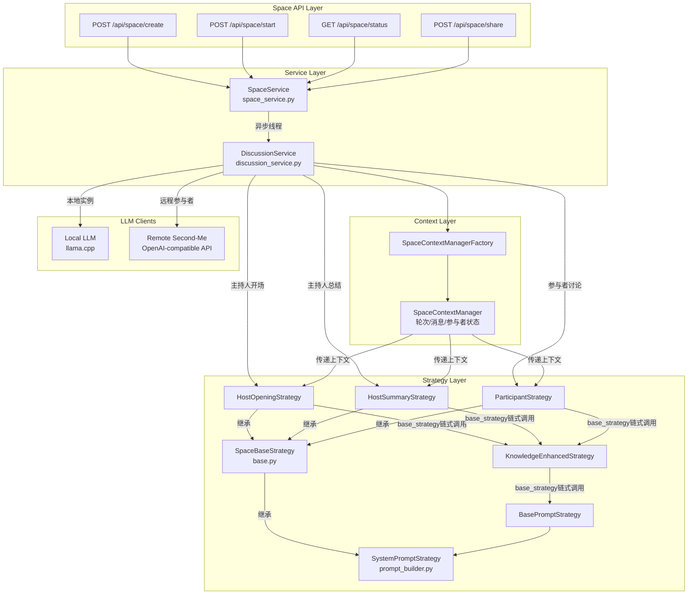
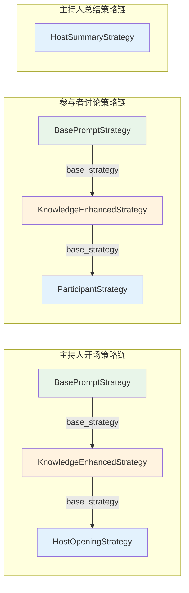
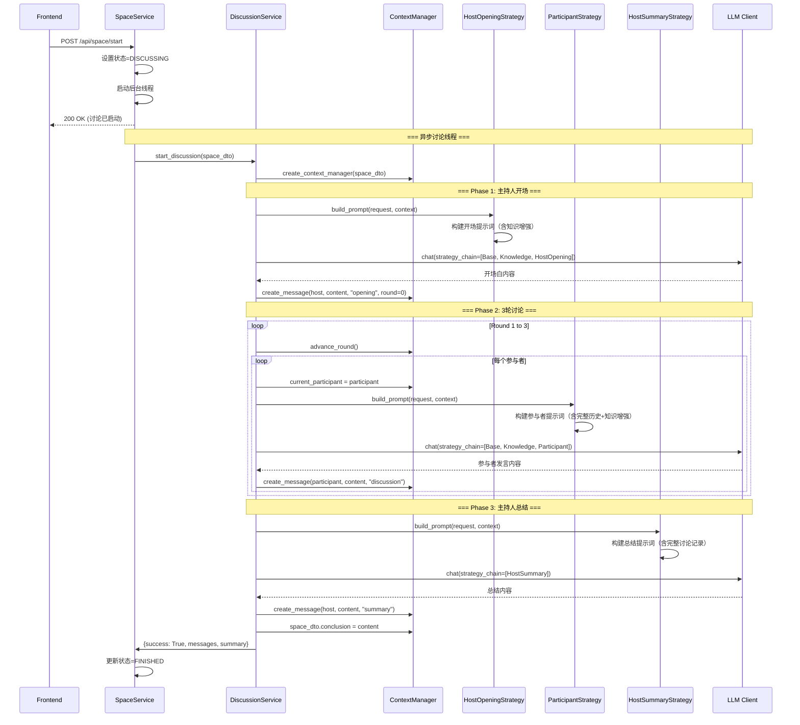

# Space 策略模式与多智能体讨论

## 概述

Space 是 Second-Me 实现**多智能体协作讨论**的核心机制，允许多个 Second-Me 实例（代表不同用户）围绕特定主题开展结构化讨论。Space 采用**策略模式（Strategy Pattern）**结合**责任链模式（Chain of Responsibility）**，为讨论中的不同角色（主持人/参与者）和不同阶段（开场/讨论/总结）动态生成定制化的系统提示词，实现了角色行为差异化与提示词构建逻辑的解耦。

每个 Space 讨论遵循固定的三阶段流程：主持人开场 → 3 轮参与者轮流发言 → 主持人总结。策略系统通过 `SystemPromptStrategy` 接口抽象提示词构建逻辑，通过策略链（Strategy Chain）组合基础提示、知识增强、角色定制等多层增强，最终生成适配当前讨论上下文的系统提示词。



## 设计原理

### 策略模式核心抽象

Space 策略体系建立在 `SystemPromptStrategy` 抽象基类之上，所有策略必须实现 `build_prompt()` 方法：

```python
# lpm_kernel/api/domains/kernel2/services/prompt_builder.py
class SystemPromptStrategy:
    """系统提示词构建策略基类"""

    def build_prompt(self, request: ChatRequest, context: Optional[Any] = None) -> str:
        """构建系统提示词

        Args:
            request: 聊天请求对象
            context: 可选上下文（Space 讨论时为 SpaceContextManager）

        Returns:
            构建完成的系统提示词字符串
        """
        raise NotImplementedError()
```

### Space 策略基类与模板方法

`SpaceBaseStrategy` 是所有 Space 讨论策略的抽象基类，实现了**模板方法模式**：`build_prompt()` 定义算法骨架（空上下文回退→上下文格式化→调用子类实现），子类只需实现 `_build_space_prompt()` 抽象方法：

```python
# lpm_kernel/api/domains/space/strategies/base.py
from abc import ABC, abstractmethod
from typing import List, Optional
from ..space_dto import SpaceDTO, SpaceMessageDTO
from ..context.context_manager import SpaceContextManager

class SpaceBaseStrategy(SystemPromptStrategy, ABC):
    """Space 讨论策略基类（模板方法模式）"""

    def __init__(self, base_strategy: Optional[SystemPromptStrategy] = None):
        """初始化策略，支持策略链组合

        Args:
            base_strategy: 基础策略，形成链式调用
        """
        self.base_strategy = base_strategy

    def build_prompt(self, request: ChatRequest,
                     context: Optional[SpaceContextManager] = None) -> str:
        """模板方法：构建提示词（算法骨架）"""
        # 1. 空上下文回退策略
        if not context:
            if self.base_strategy:
                return self.base_strategy.build_prompt(request, context)
            return "You are an AI assistant, please help with the user's questions."

        # 2. 委托给子类实现具体构建逻辑
        return self._build_space_prompt(request, context.space_dto, context)

    def _format_message_for_context(self, message_dto: SpaceMessageDTO) -> str:
        """格式化单条消息为上下文文本"""
        role = "Host" if message_dto.role == "host" else "Participant"
        endpoint_name = message_dto.sender_endpoint.split('/')[-2]
        return f"{role} {endpoint_name}: {message_dto.content}"

    def _build_context_from_messages(self, messages_dto: List[SpaceMessageDTO]) -> str:
        """按轮次组织讨论历史上下文

        将消息按 round 分组，Round 0 标记为 Opening，其余标记为 Round N
        """
        messages_by_round = {}
        for message_dto in messages_dto:
            round_num = message_dto.round
            if round_num not in messages_by_round:
                messages_by_round[round_num] = []
            messages_by_round[round_num].append(message_dto)

        context_parts = []
        for round_num in sorted(messages_by_round.keys()):
            if round_num == 0:
                context_parts.append("--- Opening ---")
            else:
                context_parts.append(f"\n--- Round {round_num} ---")
            for message_dto in messages_by_round[round_num]:
                context_parts.append(self._format_message_for_context(message_dto))

        return "\n".join(context_parts)

    def _get_space_info(self, space_dto: SpaceDTO) -> str:
        """获取 Space 基本信息文本"""
        return f"""Discussion Topic: {space_dto.title}
Discussion Objective: {space_dto.objective}"""

    @abstractmethod
    def _build_space_prompt(self, request: ChatRequest, space_dto: SpaceDTO,
                            context_manager: SpaceContextManager) -> str:
        """子类必须实现的具体提示词构建逻辑"""
        pass
```

**模板方法的关键设计**：
- **空上下文保护**：当 `context` 为 None 时，委托给 `base_strategy` 或返回默认提示词，避免空指针错误
- **上下文格式化复用**：`_build_context_from_messages()` 和 `_format_message_for_context()` 提供通用的消息历史格式化能力，子类可直接复用
- **强制子类实现**：`_build_space_prompt()` 是抽象方法，确保每个具体策略都实现自己的提示词逻辑

## 具体策略实现

### 主持人开场策略（HostOpeningStrategy）

主持人开场策略负责生成讨论开场的系统提示词，引导主持人（本地 Second-Me）致欢迎辞、介绍主题、说明规则并发表首个观点：

```python
# lpm_kernel/api/domains/space/strategies/host_strategies.py
class HostOpeningStrategy(SpaceBaseStrategy):
    """主持人开场策略：生成开场白提示词"""

    def _build_space_prompt(self, request: ChatRequest, space_dto: SpaceDTO,
                            context_manager: SpaceContextManager) -> str:
        participants = space_dto.participants

        # 链式调用：先获取基础策略（含知识增强）的提示词
        base_prompt = self.base_strategy.build_prompt(request, context_manager)

        # 检查是否已配置用户 Load 信息
        load_dto, error, status_code = LoadService.get_current_load()

        if status_code != 200:
            # 无用户配置时使用通用主持人提示词
            return f"""You are the host of this discussion. Please organize an opening statement and present your first perspective based on the following information:

    {self._get_space_info(space_dto)}

    Participant List:
    {chr(10).join([f"- {p}" for p in participants])}

    Please structure your response as follows:

    1. Opening Statement:
    - Welcome participants
    - Introduce discussion topic and objectives
    - Explain discussion rules (each person speaks in turn, 3 rounds of discussion)

    2. Your First Perspective:
    - Analyze based on the topic
    - Present your initial thoughts
    - Guide the discussion direction appropriately

    Please ensure your response is:
    - Clear and concise
    - Guiding and directive
    - Able to stimulate participants' thinking and desire to discuss""" + "\n\n" + base_prompt
        else:
            # 有用户配置时使用个性化提示词（以用户身份发言）
            user_name = load_dto.name
            return f"""You are {user_name}'s 'Second Me,' a personalized AI created by {user_name}. You act as {user_name}’s representative, engaging with others on {user_name}’s behalf.

Currently, you are joining a discussion and interacting with external AI.

{self._get_space_info(space_dto)}

Participant List:
    {chr(10).join([f"- {p.split('/')[-2]}" for p in participants])}

Please follow this speaking order:

1. Begin with an opening statement welcoming all participants to the discussion.
2. Explain the discussion rules: each participant speaks in turn, and the discussion will end after 3 rounds.
3. From {user_name}'s perspective, present your views on the discussion topic and tasks that align with {user_name}'s viewpoints.

Remember that you are representing {user_name} in this conversation. All your statements should be based on {user_name}'s relevant experiences and background. Your response should be clean and clearly articulated.
""" + "\n\n" + base_prompt
```

**关键设计**：
- **双模式支持**：根据是否存在用户 Load 配置，自动切换通用/个性化提示词模式
- **策略链组合**：通过 `base_strategy.build_prompt()` 将知识增强结果追加到 Space 提示词后，实现"角色指令+个人知识"的融合
- **结构化输出要求**：明确要求 LLM 按指定格式输出（Opening Statement + First Perspective）

### 主持人总结策略（HostSummaryStrategy）

主持人总结策略在3轮讨论结束后触发，引导主持人对整个讨论进行结构化总结：

```python
class HostSummaryStrategy(SpaceBaseStrategy):
    """主持人总结策略：生成讨论总结提示词"""

    def _build_space_prompt(self, request: ChatRequest, space_dto: SpaceDTO,
                            context_manager: SpaceContextManager) -> str:
        # 获取全部讨论历史
        messages = context_manager.get_all_messages()
        discussion_context = self._build_context_from_messages(messages)

        return f"""You are the host of this discussion. Please summarize the discussion based on the following information:

{self._get_space_info(space_dto)}

Discussion Record:
{discussion_context}

Please structure your summary as follows:

1. Key Discussion Points:
   - List main perspectives
   - Highlight important insights

2. Consensus and Differences:
   - Summarize agreements reached
   - Point out existing differences

3. Conclusion and Recommendations:
   - Provide recommendations based on discussion
   - Suggest possible next steps

Please ensure your summary is:
- Objective and fair
- Focused on key points
- Constructive"""
```

### 参与者讨论策略（ParticipantStrategy）

参与者策略为非主持人的 Second-Me 实例生成讨论提示词，使其基于讨论历史和自身记忆发表观点：

```python
# lpm_kernel/api/domains/space/strategies/participant_strategy.py
class ParticipantStrategy(SpaceBaseStrategy):
    """参与者讨论策略：为参与者生成发言提示词"""

    def __init__(self, base_strategy=None):
        super().__init__(base_strategy)
        self.context_manager = None
        self.participant = None

    def _get_role_description(self) -> str:
        """获取角色描述（根据是否有用户配置）"""
        load_dto, error, status_code = LoadService.get_current_load()
        current_round = self.context_manager.get_current_round()
        total_rounds = 3

        if status_code != 200:
            if not self.context_manager:
                return "You are a discussion participant"
            return f"""You are one of the participants in this discussion.
    Current round: {current_round} of {total_rounds} rounds.
    Your endpoint is: {self.participant}"""
        else:
            user_name = load_dto.name
            if not self.context_manager:
                return f"""You are {user_name}'s 'Second Me,' a personalized AI created by {user_name}. You act as {user_name}’s representative, engaging with others on {user_name}’s behalf.

Currently, you are joining a discussion and interacting with external AI."""

    def _get_discussion_progress(self) -> str:
        """获取讨论进展（完整历史，而非增量）"""
        if not self.context_manager or not self.participant:
            return "No discussion progress yet"

        # 获取全部历史消息（确保 LLM 有完整上下文）
        all_messages = self.context_manager.get_all_messages()
        discussion_context = self._build_context_from_messages(all_messages)

        return f"""Here is the current discussion progress:

{discussion_context}"""

    def _build_space_prompt(self, request: ChatRequest, space_dto: SpaceDTO,
                            context_manager: SpaceContextManager) -> str:
        self.context_manager = context_manager
        self.participant = context_manager.current_participant

        # 链式调用基础策略（含知识增强，注入个人记忆）
        base_prompt = self.base_strategy.build_prompt(request, context_manager)

        space_info = self._get_space_info(space_dto)
        role_desc = self._get_role_description()
        discussion_progress = self._get_discussion_progress()

        return f"""{role_desc}

Discussion Information:
{space_info}

{discussion_progress}
""" + "\n" + base_prompt
```

**参与者策略的关键特征**：
- **动态参与者绑定**：通过 `context_manager.current_participant` 确定当前发言的参与者端点
- **完整历史上下文**：使用全部历史消息而非未读增量，确保 LLM 理解完整讨论脉络
- **个人知识注入**：`base_strategy` 链包含 `KnowledgeEnhancedStrategy`，会从当前参与者的 L0/L1 记忆中检索相关知识

## 策略链组合机制

Space 策略不是孤立使用的，而是通过**策略链（Strategy Chain）**以装饰器模式组合多层增强。讨论服务在调用时指定完整策略链：



### 策略链在 DiscussionService 中的使用

```python
# lpm_kernel/api/domains/space/services/discussion_service.py
class DiscussionService:
    """讨论服务：编排多智能体讨论流程"""

    def __init__(self):
        self._context_manager_factory = SpaceContextManagerFactory()
        self.max_rounds = 3  # 固定3轮讨论

    def _run_discussion(self, space_dto: SpaceDTO,
                        context_manager: SpaceContextManager) -> bool:
        """运行完整讨论流程"""
        try:
            # 阶段1：主持人开场
            opening_message = self._process_host_opening(context_manager)
            if not opening_message:
                return False

            # 阶段2：3轮参与者轮流发言
            for round_num in range(self.max_rounds):
                context_manager.advance_round()
                for participant in space_dto.participants:
                    message = self._process_participant_discussion(
                        context_manager, participant
                    )

            # 阶段3：主持人总结
            summary_message = self._process_host_summary(context_manager)
            if not summary_message:
                return False

            return True
        except Exception as e:
            logger.error(f"Discussion failed: {str(e)}")
            return False

    def _process_host_opening(self, context_manager: SpaceContextManager):
        """处理主持人开场"""
        request = ChatRequest(
            messages=[{"role": "user", "content": "Please start hosting the discussion"}],
            metadata={"enable_l0_retrieval": True}
        )

        host_endpoint = context_manager.space_dto.host
        client = self._get_client_for_endpoint(host_endpoint)

        # 使用策略链：Base → KnowledgeEnhanced → HostOpening
        stream_response = chat_service.chat(
            request,
            strategy_chain=[BasePromptStrategy, KnowledgeEnhancedStrategy, HostOpeningStrategy],
            context=context_manager,
            stream=True,
            client=client
        )

        response = chat_service.collect_stream_response(stream_response)
        content = response["choices"][0]["delta"]["content"]

        return context_manager.create_message(
            sender_endpoint=host_endpoint,
            content=content,
            message_type="opening",
            round=0
        )

    def _process_participant_discussion(self, context_manager, participant: str):
        """处理单个参与者发言"""
        context_manager.current_participant = participant

        request = ChatRequest(
            messages=[{"role": "user", "content": "Please share your thoughts"}],
            metadata={"enable_l0_retrieval": True}
        )

        client = self._get_client_for_endpoint(participant)

        # 使用策略链：Base → KnowledgeEnhanced → Participant
        response = chat_service.collect_stream_response(
            chat_service.chat(
                request,
                strategy_chain=[BasePromptStrategy, KnowledgeEnhancedStrategy, ParticipantStrategy],
                context=context_manager,
                client=client,
                stream=True
            )
        )

        content = response["choices"][0]["delta"]["content"]

        return context_manager.create_message(
            sender_endpoint=participant,
            content=content,
            message_type="discussion",
            round=context_manager.get_current_round()
        )

    def _process_host_summary(self, context_manager):
        """处理主持人总结"""
        request = ChatRequest(
            messages=[{"role": "user", "content": "Please summarize this discussion"}]
        )

        host_endpoint = context_manager.space_dto.host
        client = self._get_client_for_endpoint(host_endpoint)

        # 总结阶段只使用 HostSummaryStrategy（不需要知识增强）
        response = chat_service.collect_stream_response(
            chat_service.chat(
                request,
                strategy_chain=[HostSummaryStrategy],
                context=context_manager,
                client=client,
                stream=True
            )
        )

        content = response["choices"][0]["delta"]["content"]
        context_manager.space_dto.conclusion = content

        return context_manager.create_message(
            sender_endpoint=host_endpoint,
            content=content,
            message_type="summary",
            round=0
        )
```

### MultiTurnMessageBuilder 中的策略链构建

策略链的实际实例化和链接发生在 `MultiTurnMessageBuilder` 中，它按照列表顺序嵌套创建策略实例：

```python
# lpm_kernel/api/domains/kernel2/services/message_builder.py
class MultiTurnMessageBuilder:
    """多轮消息构建器：负责实例化策略链并构建消息"""

    def __init__(self, request: ChatRequest, strategy_chain: List[Type[SystemPromptStrategy]]):
        self.request = request
        self.strategy_chain = strategy_chain

    def build_messages(self, context=None) -> List[Dict[str, str]]:
        """构建发送给 LLM 的完整消息列表"""
        # 1. 按顺序实例化策略链（从后往前嵌套）
        strategy = None
        for strategy_class in reversed(self.strategy_chain):
            if strategy is None:
                # 第一个（列表最后一个）策略无 base_strategy
                strategy = strategy_class()
            else:
                # 后续策略包装前一个策略
                try:
                    strategy = strategy_class(base_strategy=strategy)
                except TypeError:
                    # 不接受 base_strategy 的策略（如 HostSummaryStrategy）
                    strategy = strategy_class()

        # 2. 使用最终策略构建系统提示词
        system_prompt = strategy.build_prompt(self.request, context)

        # 3. 组装消息列表
        messages = [{"role": "system", "content": system_prompt}]
        # ... 添加历史消息和当前用户消息
        return messages
```

**策略链构建示例**：对于 `[BasePromptStrategy, KnowledgeEnhancedStrategy, HostOpeningStrategy]`：
1. 先创建 `HostOpeningStrategy(base_strategy=None)` → 但会失败，因为需要 base_strategy
2. 实际顺序：`BasePromptStrategy()` → `KnowledgeEnhancedStrategy(base_strategy=base)` → `HostOpeningStrategy(base_strategy=knowledge)`
3. 调用 `host_opening_strategy.build_prompt()` 时，内部会调用 `self.base_strategy.build_prompt()`（即 KnowledgeEnhancedStrategy），后者又调用 BasePromptStrategy

## 上下文管理器（SpaceContextManager）

`SpaceContextManager` 是策略模式的核心数据载体，管理讨论的完整状态：

```python
# lpm_kernel/api/domains/space/context/context_manager.py
class SpaceContextManager:
    """Space 讨论上下文管理器"""

    def __init__(self, space: SpaceDTO):
        self.space_dto = space
        # 每个参与者的已读消息位置
        self.participant_positions: Dict[str, int] = {
            p: 0 for p in space.get_all_participants()
        }
        self.current_round: int = 0          # 当前轮次
        self.current_participant: Optional[str] = None  # 当前发言参与者

    def create_message(self, sender_endpoint: str, content: str,
                       message_type: str, round: Optional[int] = None) -> SpaceMessageDTO:
        """创建并保存新消息"""
        if round is None:
            round = self.current_round

        # 空内容/错误内容保护
        if not content or (isinstance(content, str) and (
            content.strip() == "" or content.lower().strip().startswith("error")
        )):
            content = "I am currently not accessible."

        role = "host" if sender_endpoint == self.space_dto.host else "participant"

        message_dto = SpaceMessageDTO(
            id=str(uuid.uuid4()),
            space_id=self.space_dto.id,
            sender_endpoint=sender_endpoint,
            content=content,
            message_type=message_type,
            round=round,
            create_time=datetime.now(),
            role=role
        )

        self.save_message(message_dto)
        return message_dto

    def advance_round(self) -> None:
        """进入下一轮"""
        self.current_round += 1

    def get_current_round(self) -> int:
        return self.current_round

    def get_all_messages(self) -> List[SpaceMessageDTO]:
        return self.space_dto.messages

    def get_messages_in_round(self, round: int) -> List[SpaceMessageDTO]:
        return self.space_dto.get_messages_by_round(round)
```

### 上下文管理器工厂

```python
# lpm_kernel/api/domains/space/context/factory.py
class SpaceContextManagerFactory:
    """Space 上下文管理器工厂（简单工厂模式）"""

    def create_context_manager(self, space_dto: SpaceDTO) -> SpaceContextManager:
        return SpaceContextManager(space_dto)
```

## 讨论流程编排



## 跨实例通信

DiscussionService 支持跨 Second-Me 实例的多智能体讨论，通过 `_get_client_for_endpoint()` 方法为不同端点创建对应的 OpenAI 客户端：

```python
def _get_client_for_endpoint(self, endpoint: str) -> Optional[Any]:
    """根据端点获取对应的 LLM 客户端

    - 本地端点：返回 None（使用默认本地 llama.cpp 客户端）
    - 远程端点：创建 OpenAI 兼容客户端连接到远程 Second-Me
    """
    config = Config.from_env()
    local_url = config.get("LOCAL_LLM_SERVICE_URL", "")

    # 本地端点使用默认客户端
    if local_url and endpoint.startswith(local_url):
        return None

    # 解析远程端点 URL，构建 API 路径
    parsed_url = urlparse(endpoint)
    path_parts = parsed_url.path.strip('/').split('/')

    # 从路径提取 instance_id（格式 /{name}/{instance_id}）
    instance_id = path_parts[1] if len(path_parts) == 2 else None
    api_prefix = config.get("LLM_API_PREFIX", "/api")
    new_path = f"{api_prefix}/{instance_id}" if instance_id else endpoint

    api_endpoint = urlunparse((
        parsed_url.scheme, parsed_url.netloc, new_path,
        parsed_url.params, parsed_url.query, parsed_url.fragment
    ))

    # 创建 OpenAI 客户端连接远程实例
    return OpenAI(base_url=api_endpoint, api_key="sk-no-key-required")
```

## Space DTO 数据结构

```python
# lpm_kernel/api/domains/space/space_dto.py
class SpaceDTO(BaseModel):
    """Space 数据传输对象"""
    id: str                           # Space UUID
    title: str                        # 讨论主题
    objective: str                    # 讨论目标
    host: str                         # 主持人端点 URL
    participants: List[str]           # 所有参与者端点列表
    create_time: str                  # 创建时间
    status: int                       # 状态码
    messages: List[SpaceMessageDTO]   # 消息列表
    conclusion: Optional[str]         # 讨论结论
    space_share_id: Optional[str]     # 分享 ID

    # 状态常量
    STATUS_INIT = 1           # 初始状态
    STATUS_DISCUSSING = 2     # 讨论中
    STATUS_FINISHED = 3       # 已完成
    STATUS_INTERRUPTED = 4    # 已中断

    def get_all_participants(self) -> List[str]:
        """获取所有参与者（包含主持人）"""
        return list(set([self.host] + self.participants))

    def add_message(self, message: SpaceMessageDTO):
        """添加消息"""
        self.messages.append(message)

    def get_messages_by_round(self, round: int) -> List[SpaceMessageDTO]:
        """获取指定轮次的消息"""
        return [m for m in self.messages if m.round == round]

class SpaceMessageDTO(BaseModel):
    """Space 消息 DTO"""
    id: str                           # 消息 UUID
    space_id: str                     # 所属 Space ID
    sender_endpoint: str              # 发送者端点
    content: str                      # 消息内容
    message_type: str                 # 消息类型：opening/discussion/summary
    round: int                        # 所属轮次
    create_time: datetime             # 创建时间
    role: str                         # 角色：host/participant
```

## 策略扩展点

Space 策略模式设计具备良好的可扩展性，未来可添加的策略包括：

| 策略类型 | 建议类名 | 用途 |
|----------|----------|------|
| 主持人追问策略 | HostFollowUpStrategy | 主持人在讨论中引导方向、追问细节 |
| 反对观点策略 | DevilAdvocateStrategy | 注入反对观点以激发深度讨论 |
| 专家角色策略 | ExpertRoleStrategy | 参与者扮演特定领域专家角色 |
| 时间控制策略 | TimeControlStrategy | 根据讨论时间动态调整发言长度 |
| 情感分析策略 | SentimentAwareStrategy | 根据讨论氛围调整提示词语气 |

**新增策略步骤**：
1. 继承 `SpaceBaseStrategy`
2. 实现 `_build_space_prompt()` 方法
3. 在 `strategies/__init__.py` 中导出
4. 在 `DiscussionService` 中按需组合到策略链

## API 签名速查

```python
# 策略基类
class SystemPromptStrategy:
    def build_prompt(self, request: ChatRequest, context: Any = None) -> str

class SpaceBaseStrategy(SystemPromptStrategy, ABC):
    def __init__(self, base_strategy: Optional[SystemPromptStrategy] = None)
    def build_prompt(self, request: ChatRequest, context: SpaceContextManager = None) -> str
    @abstractmethod
    def _build_space_prompt(self, request, space_dto, context_manager) -> str

# 具体策略
class HostOpeningStrategy(SpaceBaseStrategy): ...
class HostSummaryStrategy(SpaceBaseStrategy): ...
class ParticipantStrategy(SpaceBaseStrategy): ...

# 上下文管理
class SpaceContextManager:
    def __init__(self, space: SpaceDTO)
    def create_message(self, sender_endpoint, content, message_type, round=None) -> SpaceMessageDTO
    def advance_round(self) -> None
    def get_current_round(self) -> int
    def get_all_messages(self) -> List[SpaceMessageDTO]
    def current_participant: str  # 属性，设置当前发言参与者

# 服务
class DiscussionService:
    def start_discussion(self, space_dto: SpaceDTO) -> dict
    def _get_client_for_endpoint(self, endpoint: str) -> Optional[OpenAI]

class ChatService:
    def chat(self, request, strategy_chain=None, stream=True, client=None, context=None)
    def collect_stream_response(self, response_iterator) -> dict
```

## 源码索引

| 文件 | 职责 |
|------|------|
| strategies/base.py | Space 策略基类、模板方法、消息格式化 |
| strategies/host_strategies.py | 主持人开场/总结策略 |
| strategies/participant_strategy.py | 参与者讨论策略 |
| context/context_manager.py | 讨论上下文管理器（轮次/消息/状态） |
| context/factory.py | 上下文管理器工厂 |
| services/discussion_service.py | 讨论流程编排、策略链使用、跨实例客户端 |
| space_service.py | Space CRUD、异步讨论线程、分享功能 |
| space_routes.py | Space REST API 路由 |
| kernel2/services/prompt_builder.py | 策略基类、基础/角色/知识增强策略 |
| kernel2/services/chat_service.py | 聊天服务、策略链构建、流式响应处理 |
| kernel2/services/message_builder.py | 多轮消息构建、策略链实例化 |
