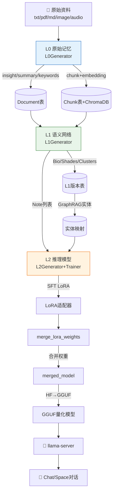
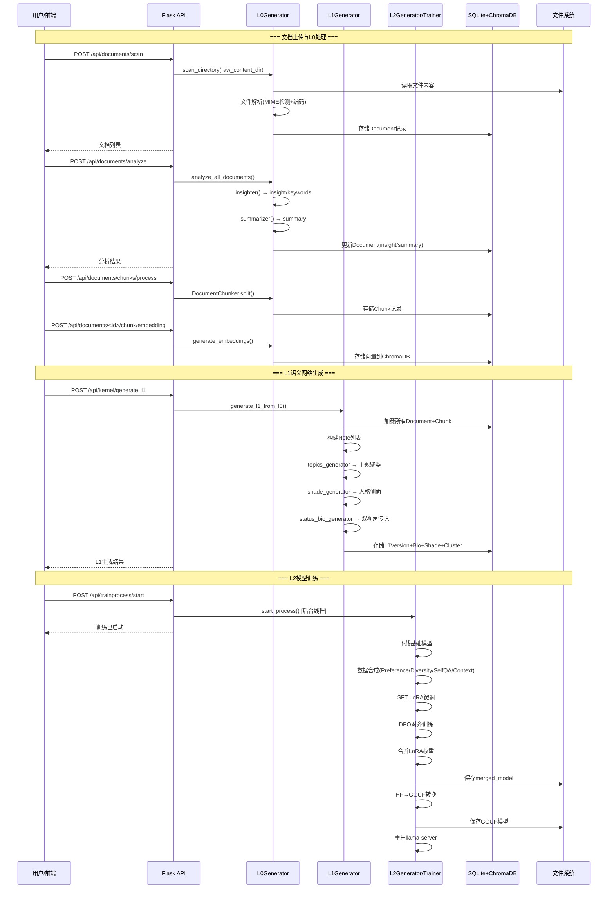

# 三层记忆HMM架构

Second-Me 的核心创新是**分层记忆建模（Hierarchical Memory Modeling, HMM）**。它模仿人类记忆的形成过程——从感官接收原始信息（L0），到抽象出语义关联和人格特征（L1），最终内化为可推理的思维模型（L2），构建了一条从数据到智能的递进式流水线。

## 设计哲学：从记忆到自我

传统 RAG（Retrieval-Augmented Generation）系统将文档向量化后存储，查询时做相似度检索，本质上是"外挂知识库"模式。Second-Me 的 HMM 架构走得更远：

1. **L0 层**解决"记住什么"——将原始文件解析、分块、向量化，形成可检索的原始记忆
2. **L1 层**解决"理解什么"——从记忆中提取人格侧面（Shade）、主题聚类（Cluster）、双视角传记（Bio），构建语义化的身份认知
3. **L2 层**解决"成为什么"——通过 LoRA 微调将身份认知内化到模型权重中，让 AI 的推理行为本身带有个人特征

这种三层抽象并非简单的管线串联，而是**层次化表征学习**：每一层都在上一层的基础上进行更高阶的抽象，信息密度逐层提升，数据量逐层压缩。

## 三层架构总览

```
┌─────────────────────────────────────────────────────────────────────┐
│                        用户原始资料 (Raw Content)                     │
│              txt / pdf / md / 图片 / 音频 / 链接 / 聊天记录           │
└────────────────────────────┬────────────────────────────────────────┘
                             │  文件上传 + 扫描
                             ▼
┌─────────────────────────────────────────────────────────────────────┐
│  L0 — 原始记忆层 (Raw Memory Processing)                             │
│  核心职责: 文件解析 → 分块 → LLM洞察 → 摘要 → Embedding向量化         │
│  ┌──────────┐  ┌──────────┐  ┌──────────┐  ┌───────────────────┐   │
│  │ 文件摄入  │→│ 文档解析  │→│ Chunking │→│ ChromaDB向量存储   │   │
│  └──────────┘  └──────────┘  └──────────┘  └───────────────────┘   │
│  输出: Document(title/insight/summary/keywords) + Chunk(embedding)  │
│  关键类: L0Generator, DocumentModel, ChunkModel, TokenTextSplitter  │
└────────────────────────────┬────────────────────────────────────────┘
                             │  L0Generator.insighter() + summarizer()
                             ▼
┌─────────────────────────────────────────────────────────────────────┐
│  L1 — 语义网络层 (Identity Insight & Semantic Network)               │
│  核心职责: 笔记构建 → Embedding → 聚类 → 人格侧面提取 → 传记生成      │
│  ┌──────────┐  ┌──────────┐  ┌──────────┐  ┌───────────────────┐   │
│  │ Note构建  │→│ Chunk聚类 │→│Shade生成  │→│ Bio双视角传记      │   │
│  └──────────┘  └──────────┘  └──────────┘  └───────────────────┘   │
│  输出: Bio(third_view/second_view) + Shade[] + Cluster[] + Topics  │
│  关键类: Note, Chunk, Cluster, ShadeInfo, Bio, L1Generator          │
└────────────────────────────┬────────────────────────────────────────┘
                             │  L1Generator + GraphRAG实体抽取
                             ▼
┌─────────────────────────────────────────────────────────────────────┐
│  L2 — 推理模型层 (Model Alignment & Inference)                       │
│  核心职责: 数据合成 → SFT训练 → DPO对齐 → 权重合并 → GGUF量化        │
│  ┌──────────┐  ┌──────────┐  ┌──────────┐  ┌───────────────────┐   │
│  │数据合成   │→│ LoRA微调  │→│ DPO训练   │→│ GGUF部署推理       │   │
│  └──────────┘  └──────────┘  └──────────┘  └───────────────────┘   │
│  输出: personal_model → merged_model → GGUF model (llama.cpp)       │
│  关键类: L2Generator, L2DataProcessor, SFTTrainer, DPOTrainer       │
└─────────────────────────────────────────────────────────────────────┘
                             │
                             ▼
                  ┌─────────────────────┐
                  │  llama-server 推理   │
                  │  个人AI对话/Space协作 │
                  └─────────────────────┘
```

## 层次间的数据流



### L0→L1 的数据传递

L0 处理完成后，每个文档生成 `insight`（深度洞察）、`summary`（摘要）、`keywords`（关键词）三元组，并通过 `DocumentService.analyze_all_documents()` 触发 L1 分析。L1 的 `generate_l1_from_l0()` 方法从数据库中读取所有已处理文档，构建 `Note` 对象列表，每个 Note 携带其 chunks 和 embedding 向量。

```python
# L0→L1 数据流关键代码（简化）
def generate_l1_from_l0(self):
    """从L0结果生成L1身份洞察"""
    # 1. 从数据库加载所有L0处理后的文档
    documents = document_service.get_all_analyzed_documents()
    notes = []
    for doc in documents:
        note = Note(
            noteId=doc.id,
            content=doc.raw_content,
            title=doc.title,
            summary=doc.summary,
            insight=doc.insight,
            memoryType=doc.mime_type,
            embedding=doc.embedding,  # numpy数组
            chunks=doc.chunks         # List[Chunk]
        )
        notes.append(note)
    # 2. 调用L1Generator生成Bio/Shades/Clusters
    l1_generator = L1Generator(preferred_language)
    bio, shades, clusters = l1_generator.generate(notes, bio_info)
    # 3. 持久化到L1版本表
    l1_manager.save_l1_version(bio, shades, clusters)
```

### L1→L2 的数据传递

L1 生成的 Bio（传记）和 Notes（笔记列表）作为 L2 数据合成的输入。`L2DataProcessor.__call__()` 首先将笔记分为主观记忆（TEXT/MARKDOWN/PDF）和客观记忆（LINK），然后通过四类数据生成器合成训练数据：

| 数据类型 | 生成器 | 作用 |
|---------|--------|------|
| Preference QA | `PreferenceQAGenerator` | 基于主题聚类生成偏好问答对 |
| Diversity | `DiversityDataGenerator` | 基于实体图谱生成多样性对话 |
| Self-QA | `SelfQA` | 自我提问自我回答，强化身份认知 |
| Context | `ContextGenerator` | 上下文增强对话（可选） |

## 三层的抽象层次对比

| 维度 | L0 原始记忆 | L1 语义网络 | L2 推理模型 |
|------|-----------|-----------|-----------|
| **信息形态** | 原始文本/向量 | 结构化语义对象 | 神经网络权重 |
| **存储介质** | SQLite + ChromaDB | SQLite（L1版本表） | 文件系统（HF/GGUF） |
| **抽象级别** | 词法/句法级 | 语义/认知级 | 行为/推理级 |
| **数据粒度** | Document + Chunk | Bio + Shade + Cluster | LoRA adapter (r=64) |
| **核心算法** | TokenTextSplitter + Embedding | KMeans聚类 + 距离剪枝 | SFT + DPO + LoRA |
| **是否可解释** | 完全可解释（原文） | 部分可解释（Shade/Bio） | 黑盒（权重矩阵） |
| **更新方式** | 增量（新文件追加） | 全量重生成 | 全量重训练 |
| **推理时使用** | RAG检索（KnowledgeEnhancedStrategy） | RAG检索（L1 Shade检索） | 模型权重直接推理 |

## HMM 与认知科学的对应

Second-Me 的三层架构并非凭空设计，而是映射了认知科学中的记忆模型：

```
L0  ↔  感觉记忆(Sensory Memory) / 短期记忆(Working Memory)
        原始信息摄入，保持高保真但未深加工

L1  ↔  长期记忆(Long-term Memory) / 语义记忆(Semantic Memory)
        信息经过编码、组织、关联，形成概念网络和自我认知

L2  ↔  程序记忆(Procedural Memory) / 内隐记忆(Implicit Memory)
        知识内化为"知道如何做"，表现为模型权重中的行为模式
```

这种映射使得 Second-Me 的"自我"不是一个简单的 prompt 注入，而是从记忆到身份到行为的完整认知链路。

## 检索增强：推理时三层协同

推理阶段（用户对话）并非仅依赖 L2 模型权重，而是通过 `KnowledgeEnhancedStrategy` 实现三层协同检索：

```python
# prompt_builder.py 中的知识增强策略
class KnowledgeEnhancedStrategy(SystemPromptStrategy):
    def build_prompt(self, request, context=None):
        base_prompt = self.base_strategy.build_prompt(request, context)
        knowledge_sections = []
        user_message = self.get_user_message(request)

        # L0检索：基于向量相似度检索原始文档块
        if enable_l0_retrieval:
            l0_knowledge = default_retriever.retrieve(user_message)
            knowledge_sections.append(f"Reference knowledge:\n{l0_knowledge}")

        # L1检索：检索相关的人格侧面(Shade)
        if enable_l1_retrieval:
            l1_knowledge = default_l1_retriever.retrieve(user_message)
            knowledge_sections.append(f"Reference shades:\n{l1_knowledge}")

        return base_prompt + "\n\n" + "\n\n".join(knowledge_sections)
```

策略链的组装顺序为：`BasePromptStrategy → KnowledgeEnhancedStrategy → HostOpeningStrategy/ParticipantStrategy`，形成装饰器链逐层增强 system prompt。

## 版本管理与持久化

三层记忆均支持版本化管理，L1 和 L2 层特别强调可回溯的版本链：

```python
# L1 版本数据模型
class L1Version(Base):
    """L1 数据版本记录"""
    __tablename__ = "l1_versions"
    id = Column(Integer, primary_key=True)
    version = Column(Integer, nullable=False)          # 版本号（自增）
    create_time = Column(DateTime, default=datetime.now)
    status = Column(String(20), default="active")      # active/archived
    description = Column(Text)                         # 版本描述

class L1Bio(Base):
    """L1 传记数据（关联版本）"""
    __tablename__ = "l1_bios"
    id = Column(Integer, primary_key=True)
    version = Column(Integer, ForeignKey("l1_versions.version"))
    content_second_view = Column(Text)    # 第二视角传记（你是...）
    content_third_view = Column(Text)     # 第三视角传记（用户是...）
    summary_second_view = Column(Text)
    summary_third_view = Column(Text)

class L1Shade(Base):
    """L1 人格侧面数据（关联版本）"""
    __tablename__ = "l1_shades"
    id = Column(Integer, primary_key=True)
    version = Column(Integer, ForeignKey("l1_versions.version"))
    name = Column(String(100))           # 侧面名称
    aspect = Column(String(50))          # 所属维度
    icon = Column(String(50))            # 图标标识符
    desc_third_view = Column(Text)
    content_third_view = Column(Text)
    desc_second_view = Column(Text)
    content_second_view = Column(Text)
```

### 训练进度持久化

训练流水线的进度通过 `ProgressHolder` 单例持久化到 JSON 文件，支持断点续训：

```python
# trainprocess/progress_holder.py
class ProgressHolder:
    """训练进度持久化管理器（单例）"""
    _instance = None

    def __init__(self, model_name: str):
        self.progress_file = f"resources/l2_storage/{model_name}/progress.json"
        self.progress = TrainProgress()
        self._load()

    def _load(self):
        """从文件加载进度"""
        if os.path.exists(self.progress_file):
            with open(self.progress_file, 'r') as f:
                data = json.load(f)
                self.progress = TrainProgress.from_dict(data)

    def save(self):
        """保存进度到文件"""
        os.makedirs(os.path.dirname(self.progress_file), exist_ok=True)
        with open(self.progress_file, 'w') as f:
            json.dump(self.progress.to_dict(), f, indent=2)

    def update_step(self, step: ProcessStep, status: str, **kwargs):
        """更新步骤状态并持久化"""
        self.progress.update_step(step, status, **kwargs)
        self.save()
```

## 跨层数据流时序



## API 签名速查

```python
# L0 层核心接口
class L0Generator:
    def insighter(self, doc: DocumentModel) -> Dict[str, str]  # 生成insight/keywords
    def summarizer(self, doc: DocumentModel) -> Dict[str, str]  # 生成summary

class DocumentChunker:
    def __init__(self, chunk_size: int, overlap: int)
    def split(self, text: str) -> List[Chunk]

class DocumentService:
    def scan_directory(self, directory_path: str, recursive: bool) -> List[DocumentDTO]
    def analyze_all_documents(self) -> List[DocumentDTO]
    def generate_document_chunk_embeddings(self, document_id: int) -> List[Chunk]

# L1 层核心接口
class L1Generator:
    def generate(self, notes: List[Note], bio_info: Dict) -> Tuple[Bio, List[ShadeInfo], List[Cluster]]

class L1Manager:
    def generate_l1_from_l0(self) -> Tuple[Bio, List[ShadeInfo], List[Cluster]]
    def save_l1_version(self, bio: Bio, shades: List, clusters: List) -> int

# L2 层核心接口
class L2Generator:
    def __call__(self, notes: List[Note], bio: Bio) -> str  # 数据合成+训练，返回模型路径

class TrainProcessService:
    def start_process(self) -> None
    def stop_process(self) -> None
    def reset_progress(self) -> None
```

## 关键文件索引

| 文件 | 职责 |
|------|------|
| lpm_kernel/L0/l0_generator.py | L0 主生成器：insighter() + summarizer() |
| lpm_kernel/L0/models.py | L0 数据模型：FileInfo, InsighterInput, SummarizerInput |
| lpm_kernel/L1/bio.py | L1 核心数据结构：Chunk, Note, Cluster, ShadeInfo, Bio, UserInfo |
| lpm_kernel/L1/l1_generator.py | L1 主生成器：组合四子生成器 |
| lpm_kernel/L2/l2_generator.py | L2 数据编排器 |
| lpm_kernel/L2/data.py | L2 数据处理器：四类数据生成+GraphRAG |
| lpm_kernel/L2/train.py | SFT 训练入口：SFTTrainer + LoRA |
| lpm_kernel/file_data/document_service.py | 文档服务：L0分析编排 |
| lpm_kernel/api/domains/trainprocess/progress_holder.py | 训练进度持久化 |
| lpm_kernel/api/domains/trainprocess/process_step.py | 训练步骤枚举 |

## 相关概念

- [L0原始记忆层](l0-raw-memory.md) — 文件摄入、解析、分块、向量化、ChromaDB存储的完整流程
- [L1语义网络层](l1-semantic-network.md) — 实体提取、聚类、人格侧面、双视角传记的生成机制
- [L2推理模型层](l2-inference-model.md) — LoRA微调、DPO训练、GGUF量化的模型对齐过程
- [训练流水线](training-pipeline.md) — 14步训练流程的编排、断点续训和进度管理
- [Flask API服务](flask-api-server.md) — 13个Blueprint、50+路由的REST API层
- [Space策略模式](space-strategy.md) — 多AI协作讨论中的策略模式实现
