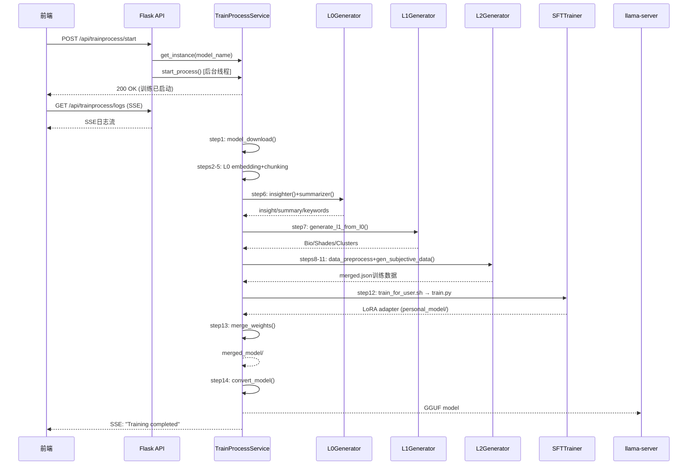

# 训练流水线

训练流水线是 Second-Me 的核心编排引擎，负责将用户上传的原始文档经过 L0→L1→L2 三层处理，最终训练出一个个性化的 AI 模型。它由 `TrainProcessService` 单例服务驱动，通过 `ProcessStep` 枚举定义14个有序步骤，支持断点续训、进度持久化、SSE实时日志推送和优雅停止。

## ProcessStep：训练步骤枚举

14个训练步骤定义在 `ProcessStep` 枚举中，每个枚举值对应 `TrainProcessService` 上的一个同名方法：

```python
# lpm_kernel/api/domains/trainprocess/process_step.py
from enum import Enum
from typing import List

class ProcessStep(Enum):
    """训练流程步骤枚举"""
    LIST_DOCUMENTS = "list_documents"
    GENERATE_DOCUMENT_EMBEDDINGS = "generate_document_embeddings"
    CHUNK_DOCUMENT = "process_chunks"
    CHUNK_EMBEDDING = "chunk_embedding"
    EXTRACT_DIMENSIONAL_TOPICS = "extract_dimensional_topics"
    GENERATE_BIOGRAPHY = "generate_biography"
    MODEL_DOWNLOAD = "model_download"
    MAP_ENTITY_NETWORK = "map_your_entity_network"
    DECODE_PREFERENCE_PATTERNS = "decode_preference_patterns"
    REINFORCE_IDENTITY = "reinforce_identity"
    AUGMENT_CONTENT_RETENTION = "augment_content_retention"
    TRAIN = "train"
    MERGE_WEIGHTS = "merge_weights"
    CONVERT_MODEL = "convert_model"

    @classmethod
    def get_ordered_steps(cls) -> List["ProcessStep"]:
        """获取有序步骤列表（注意MODEL_DOWNLOAD在L0步骤之前）"""
        return [
            cls.MODEL_DOWNLOAD,            # 1. 下载基础模型
            cls.LIST_DOCUMENTS,            # 2. 列出文档
            cls.GENERATE_DOCUMENT_EMBEDDINGS,  # 3. 文档级Embedding
            cls.CHUNK_DOCUMENT,            # 4. 文档分块
            cls.CHUNK_EMBEDDING,           # 5. 块级Embedding
            cls.EXTRACT_DIMENSIONAL_TOPICS, # 6. L0洞察提取
            cls.GENERATE_BIOGRAPHY,        # 7. L1传记生成
            cls.MAP_ENTITY_NETWORK,        # 8. L2实体网络构建
            cls.DECODE_PREFERENCE_PATTERNS, # 9. 偏好数据生成
            cls.REINFORCE_IDENTITY,        # 10. 自我QA生成
            cls.AUGMENT_CONTENT_RETENTION, # 11. 多样性数据生成
            cls.TRAIN,                     # 12. SFT训练
            cls.MERGE_WEIGHTS,             # 13. 权重合并
            cls.CONVERT_MODEL,             # 14. GGUF转换
        ]

    def get_method_name(self) -> str:
        """获取对应的服务方法名（与枚举value一致）"""
        return self.value
```

## 14步训练流程详解

```mermaid
flowchart TD
    START((启动训练)) --> S1
    S1["1. MODEL_DOWNLOAD<br/>下载基础模型<br/>save_hf_model()"] --> S2
    S2["2. LIST_DOCUMENTS<br/>列出所有文档<br/>document_service.list_documents()"] --> S3
    S3["3. GENERATE_DOCUMENT_EMBEDDINGS<br/>文档级Embedding<br/>process_document_embedding()"] --> S4
    S4["4. CHUNK_DOCUMENT<br/>文档分块<br/>DocumentChunker.split()"] --> S5
    S5["5. CHUNK_EMBEDDING<br/>块级Embedding<br/>generate_document_chunk_embeddings()"] --> S6

    S6 -->|"L0完成"| S7["6. EXTRACT_DIMENSIONAL_TOPICS<br/>L0洞察+摘要<br/>L0Generator.insighter()+summarizer()"]
    S7 -->|"L0→L1"| S8["7. GENERATE_BIOGRAPHY<br/>L1传记生成<br/>generate_l1_from_l0()"]

    S8 -->|"L1完成"| S9["8. MAP_ENTITY_NETWORK<br/>GraphRAG实体网络<br/>L2DataProcessor.data_preprocess()"]
    S9 --> S10["9. DECODE_PREFERENCE_PATTERNS<br/>偏好QA数据<br/>PreferenceQAGenerator"]
    S10 --> S11["10. REINFORCE_IDENTITY<br/>自我QA数据<br/>SelfQA.generate_qa()"]
    S11 --> S12["11. AUGMENT_CONTENT_RETENTION<br/>多样性数据<br/>DiversityDataGenerator"]

    S12 -->|"L2数据准备完成"| S13["12. TRAIN<br/>SFT+LoRA训练<br/>train_for_user.sh → train.py"]
    S13 --> S14["13. MERGE_WEIGHTS<br/>权重合并<br/>merge_weights_for_user.sh<br/>→ merge_lora_weights()"]
    S14 --> S15["14. CONVERT_MODEL<br/>GGUF转换<br/>convert_model_to_gguf.sh<br/>→ convert_hf_to_gguf.py"]
    S15 --> DONE((训练完成<br/>llama-server就绪))

    style S1 fill:#e3f2fd
    style S2 fill:#e3f2fd
    style S3 fill:#e3f2fd
    style S4 fill:#e3f2fd
    style S5 fill:#e3f2fd
    style S7 fill:#e3f2fd
    style S8 fill:#e8f5e9
    style S9 fill:#fff3e0
    style S10 fill:#fff3e0
    style S11 fill:#fff3e0
    style S12 fill:#fff3e0
    style S13 fill:#fce4ec
    style S14 fill:#fce4ec
    style S15 fill:#fce4ec
```



### 前端训练阶段映射

前端将14个步骤映射为5个用户可见的阶段（StageName）：

| 前端阶段名 | 覆盖步骤 | 描述 |
|-----------|---------|------|
| `downloading_the_base_model` | 步骤1 (MODEL_DOWNLOAD) | 下载基础模型 |
| `activating_the_memory_matrix` | 步骤2-5 (L0 embedding+chunking) | 激活记忆矩阵 |
| `synthesize_your_life_narrative` | 步骤6-7 (L0洞察→L1传记) | 合成人生叙事 |
| `prepare_training_data_for_deep_comprehension` | 步骤8-11 (L2数据合成) | 准备训练数据 |
| `training_to_create_second_me` | 步骤12-14 (训练→合并→转换) | 训练Second Me |

## TrainProcessService：单例编排器

`TrainProcessService` 采用单例模式，通过 `__new__` 确保全局唯一实例：

```python
# lpm_kernel/api/domains/trainprocess/trainprocess_service.py
class TrainProcessService:
    """训练流程服务（单例模式）"""
    _instance = None
    _initialized = False

    def __new__(cls, *args, **kwargs):
        if cls._instance is None:
            cls._instance = super().__new__(cls)
        return cls._instance

    def __init__(self, current_model_name: str):
        if not self._initialized:
            self.progress = TrainProgressHolder(current_model_name)
            self.model_name = current_model_name
            self._initialized = True
            self.is_stopped = False
            self.current_step = None
            self.l2_data = {"notes": None, "basic_info": None, ...}
            self.l2_data_prepared = False

    @classmethod
    def get_instance(cls, current_model_name: str = None):
        """获取单例实例"""
        if cls._instance is None:
            return cls(current_model_name)
        if current_model_name is not None:
            cls._instance.model_name = current_model_name
            cls._instance.progress = TrainProgressHolder(current_model_name)
        return cls._instance
```

### start_process：流水线主循环

`start_process()` 是流水线的入口方法，实现了顺序执行、断点续训和优雅停止：

```python
def start_process(self) -> bool:
    """启动训练流程"""
    self.is_stopped = False
    self.current_pid = os.getpid()

    # 1. 获取有序步骤列表
    ordered_steps = ProcessStep.get_ordered_steps()

    # 2. 断点续训：找到上次成功步骤的下一个
    last_successful_step = self.progress.get_last_successful_step()
    start_index = 0
    if last_successful_step:
        start_index = ordered_steps.index(last_successful_step) + 1

    # 3. 顺序执行每个步骤
    for step in ordered_steps[start_index:]:
        self.current_step = step

        # 优雅停止检查
        if self.is_stopped:
            self.progress.mark_step_status(step, Status.SUSPENDED)
            break

        logger.info(f"Starting step: {step.value}")

        # 4. 通过方法名反射调用对应步骤方法
        method_name = step.get_method_name()
        method = getattr(self, method_name)
        success = method()

        if not success:
            self.progress.mark_step_status(step, Status.FAILED)
            return False

        logger.info(f"Step {step.value} completed successfully")

    return True
```

### 关键步骤实现

#### 步骤1：模型下载

```python
def model_download(self) -> bool:
    """下载基础模型（HuggingFace）"""
    self.progress.mark_step_status(ProcessStep.MODEL_DOWNLOAD, Status.IN_PROGRESS)
    try:
        params = TrainingParamsManager.get_params()
        model_name = params.get("model_name")
        # 使用独立线程监控下载进度
        save_hf_model(model_name, ...)
        self.progress.mark_step_status(ProcessStep.MODEL_DOWNLOAD, Status.COMPLETED)
        return True
    except Exception as e:
        self.progress.mark_step_status(ProcessStep.MODEL_DOWNLOAD, Status.FAILED)
        return False
```

#### 步骤6：维度主题提取（L0分析）

```python
def extract_dimensional_topics(self) -> bool:
    """提取文档维度主题，即L0 Generator的insighter+summarizer"""
    self.progress.mark_step_status(ProcessStep.EXTRACT_DIMENSIONAL_TOPICS, Status.IN_PROGRESS)
    try:
        # 调用document_service.analyze_all_documents()
        # 内部使用L0Generator.insighter()和summarizer()处理所有未分析文档
        document_service.analyze_all_documents()
        self.progress.mark_step_status(ProcessStep.EXTRACT_DIMENSIONAL_TOPICS, Status.COMPLETED)
        return True
    except Exception as e:
        self.progress.mark_step_status(ProcessStep.EXTRACT_DIMENSIONAL_TOPICS, Status.FAILED)
        return False
```

#### 步骤7：传记生成（L1）

```python
def generate_biography(self) -> bool:
    """从L0结果生成L1传记"""
    self.progress.mark_step_status(ProcessStep.GENERATE_BIOGRAPHY, Status.IN_PROGRESS)
    try:
        # generate_l1_from_l0() 内部:
        # 1. 从DB加载所有L0处理后的文档
        # 2. 构建Note列表
        # 3. 调用L1Generator生成Bio/Shades/Clusters
        # 4. 持久化到L1版本表
        generate_l1_from_l0()
        self._prepare_l2_data()  # 为L2步骤准备数据
        self.progress.mark_step_status(ProcessStep.GENERATE_BIOGRAPHY, Status.COMPLETED)
        return True
    except Exception as e:
        self.progress.mark_step_status(ProcessStep.GENERATE_BIOGRAPHY, Status.FAILED)
        return False
```

#### 步骤8-11：L2数据合成

```python
def map_your_entity_network(self) -> bool:
    """构建实体网络（GraphRAG索引）"""
    l2_generator = L2Generator(...)
    l2_generator.data_preprocess(self.l2_data["notes"], self.l2_data["basic_info"])

def decode_preference_patterns(self) -> bool:
    """生成偏好QA数据"""
    l2_generator = L2Generator(...)
    l2_generator.gen_preference_data(...)

def reinforce_identity(self) -> bool:
    """生成自我QA数据"""
    l2_generator = L2Generator(...)
    l2_generator.gen_selfqa_data(...)

def augment_content_retention(self) -> bool:
    """生成多样性数据并合并JSON"""
    l2_generator = L2Generator(...)
    l2_generator.gen_diversity_data(...)
    # 最终合并为merged.json作为训练输入
```

#### 步骤12：模型训练（ScriptExecutor）

训练通过 `ScriptExecutor` 执行外部shell脚本，实时解析tqdm日志更新进度：

```python
def train(self) -> bool:
    """执行SFT LoRA训练"""
    self.progress.mark_step_status(ProcessStep.TRAIN, Status.IN_PROGRESS)
    try:
        params = TrainingParamsManager.get_params()
        script_path = os.path.join(config.get("SCRIPT_DIR"), "train_for_user.sh")

        # 通过ScriptExecutor执行训练脚本
        executor = ScriptExecutor(script_path)
        # 实时解析训练日志（tqdm进度、loss值）
        for line in executor.execute(
            model_name=params["model_name"],
            learning_rate=params["learning_rate"],
            num_epochs=params["number_of_epochs"],
            use_cuda=params["use_cuda"],
            is_cot=params["is_cot"],
        ):
            # 解析tqdm输出，更新进度百分比
            self._parse_training_log(line)

        self.progress.mark_step_status(ProcessStep.TRAIN, Status.COMPLETED)
        return True
    except Exception as e:
        self.progress.mark_step_status(ProcessStep.TRAIN, Status.FAILED)
        return False
```

训练脚本 `train_for_user.sh` 最终调用 `lpm_kernel/L2/train.py`，传入LoRA参数（r=64, alpha=16, dropout=0.1）。

#### 步骤13-14：权重合并与格式转换

```python
def merge_weights(self) -> bool:
    """合并LoRA权重到基础模型"""
    executor = ScriptExecutor("merge_weights_for_user.sh")
    # 脚本调用 merge_lora_weights.py
    # PeftModel.from_pretrained + merge_and_unload()

def convert_model(self) -> bool:
    """转换为GGUF格式"""
    executor = ScriptExecutor("convert_model_to_gguf.sh")
    # 脚本调用 convert_hf_to_gguf.py
    # HF merged_model → GGUF f16 model
```

## 训练参数管理

`TrainingParamsManager` 负责持久化训练参数，参数通过API传入：

| 参数 | 类型 | 说明 |
|------|------|------|
| `model_name` | str | 基础模型名称（如Qwen2.5-7B） |
| `learning_rate` | float | 学习率 |
| `number_of_epochs` | int | 训练轮次 |
| `concurrency_threads` | int | 数据合成并发线程数 |
| `data_synthesis_mode` | str | 数据合成模式 |
| `use_cuda` | bool | 是否使用CUDA GPU加速 |
| `is_cot` | bool | 是否启用Chain-of-Thought |

### LoRA默认参数

训练默认使用以下LoRA配置（在 train.py 中定义）：

```python
@dataclass
class ModelArguments:
    lora_r: int = 64                     # LoRA秩
    lora_alpha: int = 16                 # LoRA缩放因子
    lora_dropout: float = 0.1            # LoRA dropout率
    lora_target_modules: str = (         # 目标模块列表
        "q_proj,k_proj,v_proj,o_proj,"
        "down_proj,up_proj,gate_proj"
    )
```

## 进度管理与断点续训

`TrainProgressHolder` 负责持久化每个步骤的完成状态到文件系统，支持断点续训：

```python
class TrainProgressHolder:
    """训练进度持有器，持久化到JSON文件"""
    def __init__(self, model_name: str):
        self.progress_file = f"progress_{model_name}.json"
        self.data = self._load_progress()

    def mark_step_status(self, step: ProcessStep, status: Status):
        """标记步骤状态：IN_PROGRESS/COMPLETED/FAILED/SUSPENDED"""
        self.data["stages"][step.value] = status.value
        self._save_progress()

    def get_last_successful_step(self) -> Optional[ProcessStep]:
        """获取最后一个成功完成的步骤"""
        for step in reversed(ProcessStep.get_ordered_steps()):
            if self.data["stages"].get(step.value) == Status.COMPLETED.value:
                return step
        return None

    def reset_progress(self):
        """重置所有进度"""
        self.data = {"stages": {}, "current_stage": None}
        self._save_progress()
```

步骤状态枚举：

```python
class Status(Enum):
    NOT_STARTED = "not_started"
    IN_PROGRESS = "in_progress"
    COMPLETED = "completed"
    FAILED = "failed"
    SUSPENDED = "suspended"  # 用户主动停止
```

## API端点

训练流水线通过 `trainprocess_bp` Blueprint 暴露REST API：

```python
# lpm_kernel/api/domains/trainprocess/routes.py
trainprocess_bp = Blueprint("trainprocess", __name__, url_prefix="/api/trainprocess")

@trainprocess_bp.route("/start", methods=["POST"])
def start_process():
    """启动14步训练流水线（后台线程）"""
    # 1. 解析参数：model_name, learning_rate, number_of_epochs, concurrency_threads,
    #              data_synthesis_mode, use_cuda, is_cot
    # 2. 持久化训练参数
    # 3. 在后台线程中启动 TrainProcessService.start_process()
    thread = threading.Thread(target=run_training, args=(model_name,))
    thread.daemon = True
    thread.start()
    return APIResponse.success({"message": "Training started"})

@trainprocess_bp.route("/logs", methods=["GET"])
def get_logs():
    """SSE实时日志流"""
    # 使用Server-Sent Events推送训练日志

@trainprocess_bp.route("/progress/<model_name>", methods=["GET"])
def get_progress(model_name):
    """获取训练进度"""

@trainprocess_bp.route("/stop", methods=["POST"])
def stop_process():
    """停止训练（轮询等待suspended状态）"""

@trainprocess_bp.route("/retrain", methods=["POST"])
def retrain():
    """重置进度并重新训练"""

@trainprocess_bp.route("/training_params", methods=["GET"])
def get_training_params():
    """获取训练参数"""
```

## ScriptExecutor：脚本执行器

训练的关键步骤（SFT训练、权重合并、GGUF转换）通过执行外部shell脚本完成，`ScriptExecutor` 统一管理脚本执行：

```python
# lpm_kernel/api/common/script_executor.py
class ScriptExecutor:
    """统一的shell脚本执行器"""
    def __init__(self, script_path: str):
        self.script_path = script_path

    def execute(self, **kwargs) -> Iterator[str]:
        """执行脚本并逐行yield输出"""
        # 构建命令行参数
        cmd = ["bash", self.script_path] + [f"--{k}={v}" for k, v in kwargs.items()]
        process = subprocess.Popen(
            cmd, stdout=subprocess.PIPE, stderr=subprocess.STDOUT,
            text=True, bufsize=1
        )
        for line in process.stdout:
            yield line.strip()
        process.wait()
```

### 三个核心脚本

| 脚本 | 对应步骤 | 调用的Python模块 |
|------|---------|-----------------|
| `train_for_user.sh` | TRAIN (步骤12) | `lpm_kernel/L2/train.py` (SFTTrainer+LoRA) |
| `merge_weights_for_user.sh` | MERGE_WEIGHTS (步骤13) | `lpm_kernel/L2/merge_lora_weights.py` |
| `convert_model_to_gguf.sh` | CONVERT_MODEL (步骤14) | `lpm_kernel/L2/convert_hf_to_gguf.py` |

## 训练启动流程（完整链路）



## 关键文件索引

| 文件 | 职责 |
|------|------|
| lpm_kernel/api/domains/trainprocess/process_step.py | ProcessStep枚举：14个训练步骤定义 |
| lpm_kernel/api/domains/trainprocess/trainprocess_service.py | TrainProcessService单例：流水线编排，1109行 |
| lpm_kernel/api/domains/trainprocess/progress_holder.py | TrainProgressHolder：进度持久化 |
| lpm_kernel/api/domains/trainprocess/progress_enum.py | Status枚举：步骤状态 |
| lpm_kernel/api/domains/trainprocess/training_params_manager.py | 训练参数持久化管理 |
| lpm_kernel/api/domains/trainprocess/routes.py | 训练API路由：start/logs/progress/stop/retrain |
| lpm_kernel/api/common/script_executor.py | ScriptExecutor：shell脚本统一执行器 |
| lpm_kernel/L2/train.py | SFT训练主脚本 |
| lpm_kernel/L2/train_for_user.sh | 用户训练shell脚本 |
| lpm_kernel/L2/merge_lora_weights.py | LoRA权重合并 |
| lpm_kernel/L2/convert_hf_to_gguf.py | HF→GGUF模型转换 |

## 相关概念

- [三层记忆HMM架构](three-layer-memory-hmm.md) — L0→L1→L2三层数据流在流水线中的映射
- [L0原始记忆层](l0-raw-memory.md) — 流水线步骤2-6的L0处理细节
- [L1语义网络层](l1-semantic-network.md) — 流水线步骤7的L1传记生成
- [L2推理模型层](l2-inference-model.md) — 流水线步骤8-14的L2训练/合并/转换
- [Flask API服务](flask-api-server.md) — trainprocess Blueprint注册与API设计
