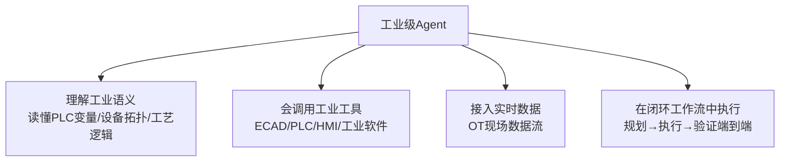

# 00 工业Agent的门槛：为什么"套壳"在工厂行不通

> 对应事实：F-002~F-007
> 核验状态：行业数据✅（报告赞助身份⚠️）

## 反差：办公Agent热火朝天，工厂车间寸步难行

2026年，AI办公智能体已大规模渗透日常工作：写文档、做报表、整理客户资料、财务核账、销售话术支持。据易观分析《2026年二季度中国办公智能体平台市场洞察》，2026年6月**17款**中国主流桌面端AI原生办公智能体平台合计访问量突破 **6000万次**（6062万，PC网页口径，WorkBuddy 以2097万居首）。

> ⚠️ 博文称"第三方机构统计"未具名，且省略了"中国市场、17款合计、PC网页访问量（非DAU）"口径。

但报道直言：**把这些聪明的Agent直接塞进工厂车间，大概率什么也干不成。**

## 行业现状：《2025工业智能体报告》

西门子与至顶科技（至顶智库）联合发布的《2025工业智能体应用现状与趋势展望报告》（2025年9月工博会发布，调研200余家制造企业）：

| 指标 | 数据 | 含义 |
|------|------|------|
| 尚未部署 | **43%** | 近半数企业还没起步 |
| 广泛（多场景）应用 | 仅 **8%** | 规模化落地极少 |
| 被部署成本卡住 | **63%** | 首要障碍是钱 |
| 缺复合型人才 | **46%** | 找不到既懂技术又懂产线的人 |
| 愿与外部厂商数据共享/技术融合 | **68%** | 开放意愿是主流 |

> ⚠️ **报告性质勘误**：该报告为**西门子与至顶科技联合发布**的厂商赞助调研，非独立第三方报告；博文引用时仅称"报告"，未披露西门子联合发布方身份。数据本身与报告原文一致。

## 四道拦路虎

工厂不同于办公室，Agent 面临的是硬约束：

1. **设备跨代际**：产线上新老设备并存，从数十年前的PLC到最新传感器
2. **协议五花八门**：工业总线、专有协议、封闭控制器，没有统一API
3. **IT与OT数据断层**：信息技术（ERP/MES等业务系统）与运营技术（产线设备）之间横亘长期数据鸿沟
4. **数据安全自主可控**：工业数据涉及生产安全与商业机密，不能出域、不可失控

## 本质：工业现场是系统工程，不是单点问题

报道的核心论点：

> 工业现场从来不是单点问题，而是一道横跨研发、工程、制造、质量、运维的系统工程。单点优化解决不了全局。

工业级Agent的四项能力门槛：

这与办公Agent的"对话框+通用工具"范式根本不同——**所有能力均要围绕企业实际运转，不是给大模型套个壳就能糊弄的**。这也解释了为什么工业Agent门槛远高于办公场景，以及为什么报道主推的路径是"借助已有工业积淀的平台"而非企业闭门造车（后者既不现实，成本也高得吓人）。

## 与办公AI的范式对比

| 维度 | 办公AI | 工业AI |
|------|--------|--------|
| 普及方式 | 每个人打开对话框 | 一座工厂验证过的能力变成更多工厂可安全调用的生产力 |
| 数据环境 | 标准化文档/表格 | 跨代际设备、异构协议、IT/OT断层 |
| 容错性 | 出错可人工修正 | 涉及生产安全，权限/审计/回滚机制必需 |
| 价值验证 | 个人效率 | 产线上可量化的ROI |
| 交付形态 | 通用SaaS | 行业Know-how + 可复用Skill + 生态分发 |
