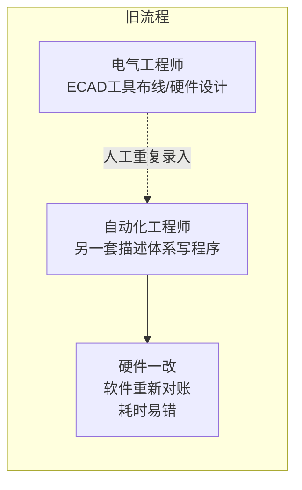

# 01 Eigen 工程智能体：从辅助建议到自主执行

> 对应事实：F-008~F-017
> 核验状态：✅ 产品与功能全部核实；成效数据为厂商试点口径⚠️

## 产品定位

Eigen Engineering Agent（Eigen工程智能体）是西门子推出的**首款面向工业自动化工程的AI智能体**（西门子WAIC新闻稿自称"全球首款"；4月汉诺威英文首发稿口径更谨慎——"首批正式商用的AI系统之一"）。

- 2026-04 汉诺威工博会首发
- 2026-07-18 WAIC 期间宣布**中国全面发售**，并荣获 **2026 WAIC「SAIL之星」奖**
- 已在全球 **19个国家和地区、逾百家企业**部署（4月稿措辞为"试点应用"），中国多家企业试点

## 最大差异：不只是"给建议"，而是端到端执行

常见AI辅助工具停留在"提建议、生成片段"，Eigen 的定位是**在真实工程系统中独立完成端到端的任务规划、执行和验证**——能进入 PLC、HMI 和自动化工程流程。

### 解决的痛点：电气与自动化两套语言

以往工程流程存在长期的人工对账问题：

设备清单（BOM）、变量标签、控制逻辑长期依赖人工在两套体系间重复录入。

### ECAD集成与项目自动生成

Eigen 新增 ECAD 集成与项目自动生成功能（西门子2026-06-17 VivaTech新闻稿确认）：

- 读取 **XML、AML** 等主流格式电气设计文件
- 识别数据冲突、配置连接
- 依据实际硬件拓扑**生成PLC变量标签**
- 工程师用**自然语言**描述工位、配套设备和运行逻辑，几分钟内生成符合行业规范、可继续开发的项目

## 官方成效数据（⚠️ 厂商试点口径）

| 指标 | 官方数据 | 核验说明 |
|------|----------|----------|
| 执行效率 | 较手动工作流提升 **2-5倍** | 西门子官方新闻稿原文 |
| 工程效率 | 提升 **50%** | 同上 |
| 整体解决方案质量 | 提升 **80%** | 同上 |
| 部署范围 | 19国、100+企业 | 官方"More than 100 companies in 19 countries" |

> ⚠️ 以上效率数据均为**西门子基于试点测试发布的厂商数据，非第三方独立测评**，引用时应标注来源性质。

## 中国案例：中科摩通（⚠️ 数字归属变迁）

博文称：中科摩通将 Eigen 用于**新能源汽车EMB（电子机械制动）智能装配设备**，程序开发时间和现场调试周期均缩短 **30%**，人工与物料损耗降低 **10%**。

核验发现：

- ✅ 合作真实：中科摩通是西门子官方点名的 Eigen 试点客户（4月汉诺威稿即引用其负责人 Kevin Firouzian）
- ⚠️ **数字归属变迁**：30%/30%/10% 这组数字最早出自西门子 **2025-09-24 工博会新闻稿，当时归属的是 Industrial Copilot**（"Industrial Copilot中国首试点"）；2026年WAIC报道中被转用于 Eigen
- ⚠️ 10% 的精确值仅见于至顶网及自媒体转述，东方网等报道仅表述为"减少了人工和物料损耗"
- 数据性质：西门子+客户自述案例数据，无第三方验证

## 人机关系：替代还是解放？

博文明确 Eigen 的研发目的**不是替代人类工程师**：

- Agent 承担：重复编码、图纸解析、设备配置等机械繁琐工作
- 工程师转向：更高价值的系统决策与方案创新

## 在体系中的角色

Eigen 是西门子自研工业智能体矩阵的"打样"产品——先在真实工程系统中证明工业Agent不仅能理解任务、生成方案，还能进入PLC/HMI流程完成端到端执行，并在产线上交出可量化ROI。它同时作为 Xcelerator 三层架构中**第一层"产品组合"**的旗舰，通过平台"开箱即用"分发（详见 [概念03](03-xcelerator-flywheel.md)）。
