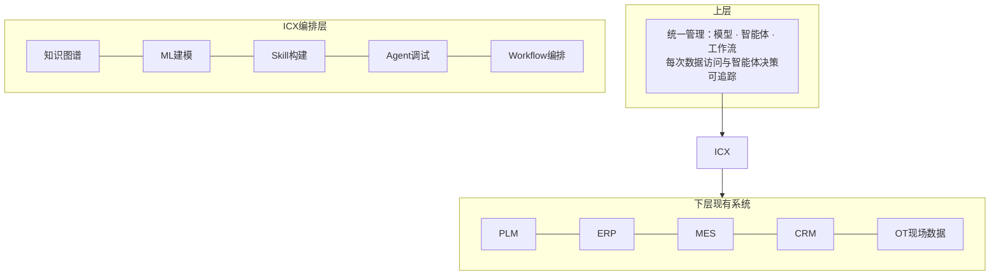

# 02 ICX编排层与"工业经验装接口"

> 对应事实：F-018~F-025
> 核验状态：✅ ICX产品核实；组件英文名⚠️

## Intelligence Center X（ICX）

2026-06-01 西门子 Realize Live（底特律）官方发布 **Intelligence Center X**——全新工业AI编排软件，融合三大技术底座：

| 组件 | 来源 | 职责 |
|------|------|------|
| Graph Studio | RapidMiner 产品组合 | 工业知识图谱/统一本体 |
| AI Studio | RapidMiner 产品组合 | 数据分析与机器学习建模 |
| Mendix | 低代码平台 | 智能体应用开发 |

## 定位：工厂的"AI调度总台"

ICX **不是一个大模型**，而是位于企业现有系统之上的 **AI编排层**：

- **向下**：连接 PLM、ERP、MES、CRM 和 OT 现场数据（Graph Studio 官网明确"创建涵盖PLM、ERP、CRM、MES和数据平台系统的统一本体"）
- **向上**：统一管理模型、智能体与工作流，并对每一次数据访问和智能体决策进行**追踪**（治理审计）
- **价值主张**：不替代工厂现有系统，而是坐在上面把数据、知识、模型和智能体组织起来，让AI从"会聊天"走向"能干活"，且**可管理、可追溯**

模块对应官方四大能力：知识图谱与工业本体、ML建模（AI Studio）、智能体应用开发（Mendix）、统一治理审计。博文所述"技能构建（Skill）、智能体构建调试（Agent）、多步骤任务编排（Workflow），支持云端开发调试测试"与官方能力集一致。

## 核心动作：给工业经验"装接口"

西门子工业智能体开发套件（Xcelerator 开发生态的载体）提供 Skill、Agent、Workflow 构建能力与基于 RAG 的知识检索问答服务。博文指出其中**最关键的一步**：

> 把 PLC、工业边缘、数据采集、异常分析等 OT 层面的工程 Know-how，封装成 Agent 能够听懂、看得懂且能直接调用的 Skill。

这个动作本质上是**给工业经验"装接口"**，也是西门子的独特优势——TIA博途、PLC、工业边缘中沉淀的工程知识，决定了Agent能否读懂工业语义、接入真实设备，并在权限、审计和回滚机制下稳定运行。

> 📝 论点提炼：**入口可以更换，底层知识与流程却能成为企业长期资产。** 通用大模型/Agent入口会迭代替换，但封装为Skill的工业Know-how是沉淀在平台上的资产。
>
> ⚠️ 核验提示：开发平台与"工业知识库、可复用技能、多智能体协同、跨系统闭环"能力获西门子官方WAIC稿证实；但"**Skill Creator、Agent Framework**"两个确切英文组件名仅见于博文，官方公开页未检索到同款命名，引用时宜用"Skill/Agent/Workflow构建能力"的表述。

## 自研案例：ECX Agent 能碳管理智能体

ECX Agent 用开发套件自研（链博会官方稿确认产品存在）：

- **交互**：基于自然语言的人机协同
- **自主任务**（用户管理下）：能源精益管控、设备智能运维、碳数据 MRV（监测、报告、核查）
- **技术链路**：Xcelerator 智能体应用开发框架 + 底层专业大模型引擎 → 能碳管理智能工作流
- **数据接入**：通过工具接口调用西门子能碳业务软件 **Smart-ECX 平台 API**，读取能耗、碳排放实时数据
- **产出**：碳盘查、能碳审计、能碳问答、减排方案

（Smart-ECX 平台真实存在于 Xcelerator Marketplace，功能含能源/碳排放数据采集、碳盘查、减排规划；API调用细节为博文描述。）

## 伙伴开发案例

| 伙伴 | 用法 | 产出 |
|------|------|------|
| **支点互动**（北京） | 以API方式复用开发套件：AI知识库做文档解析、向量检索；自研平台完成Agent编排、业务流程、人机审批闭环、全链路治理 | 把检索出的工业Know-how封装成**可复用Skill数字劳动力资产** |
| **全晓信息技术**（上海） | 直接复用知识库、Skill生成、Agent编排原生能力；聚焦制造业细分场景叠加行业业务规则二次开发 | 行业化工业智能体方案：**汽车OBD测试Agent、设备运维Agent** |

两家均在 WAIC 2026 期间与西门子签署"工业AI智能体开发平台合作协议"。

## 小结

ICX + 开发套件构成 Xcelerator 三层架构中的**第二层"开发生态"**：不想拿现成产品的企业，可以在西门子工业底座上自造Agent（详见 [概念03](03-xcelerator-flywheel.md)）。
